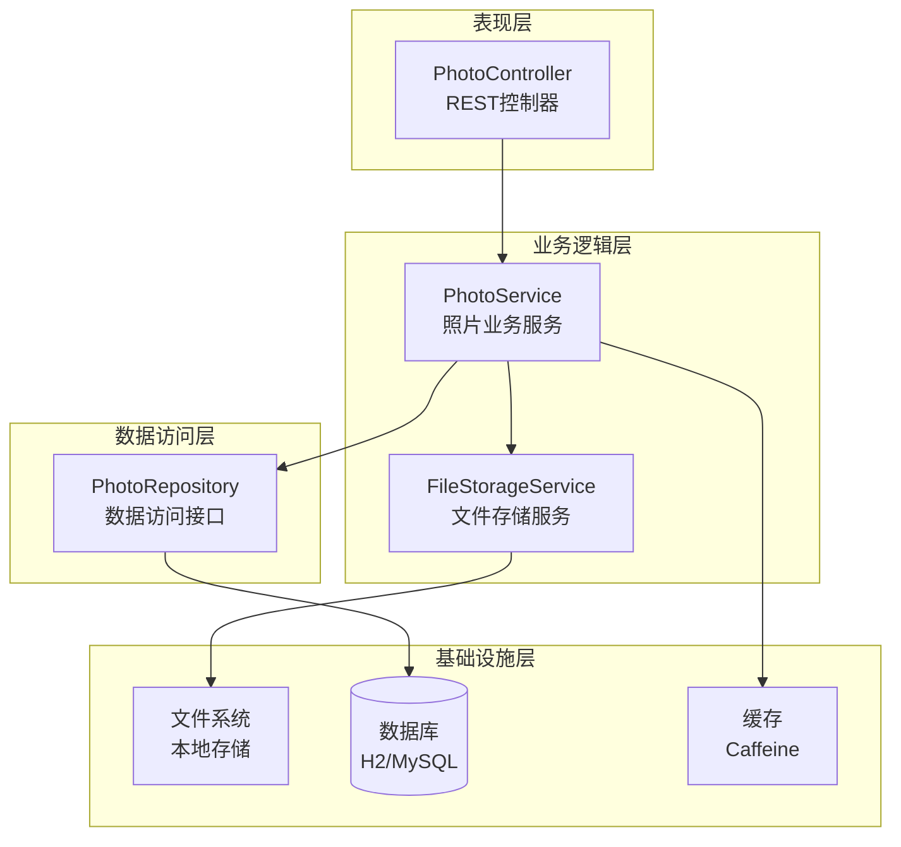
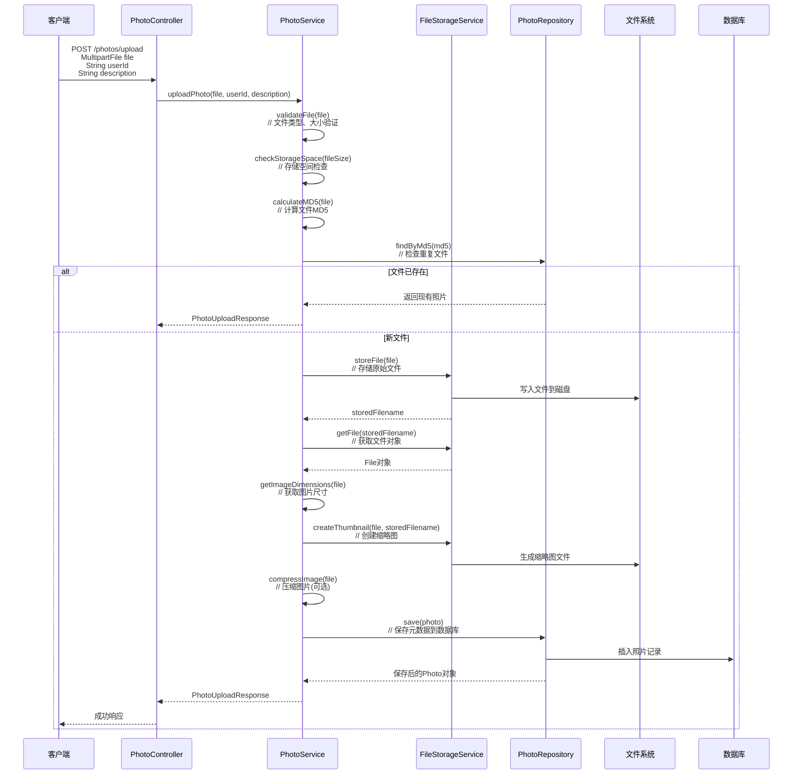
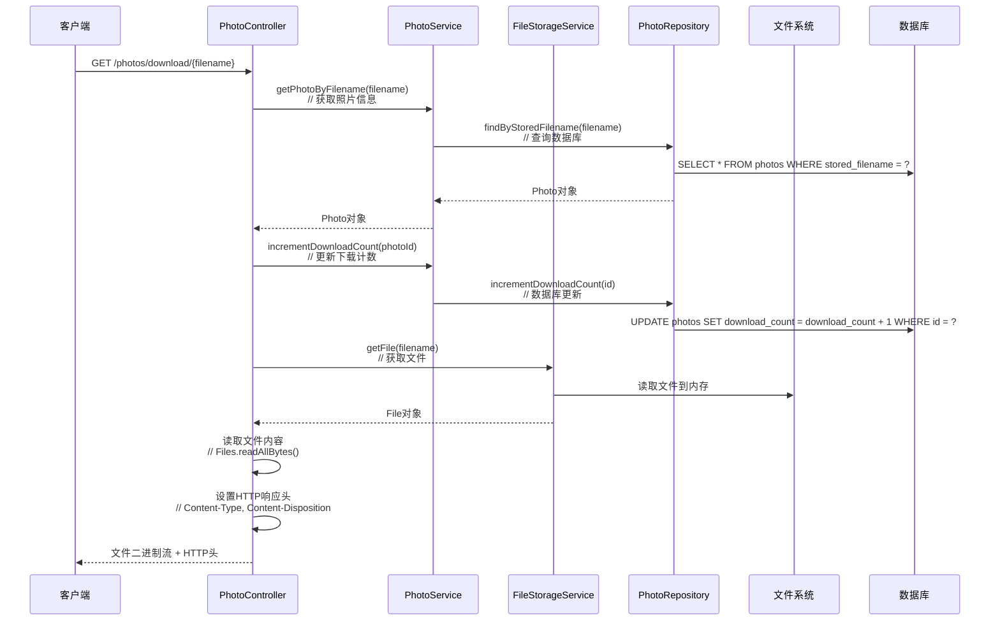
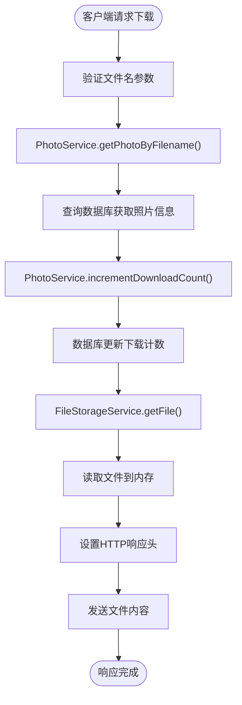
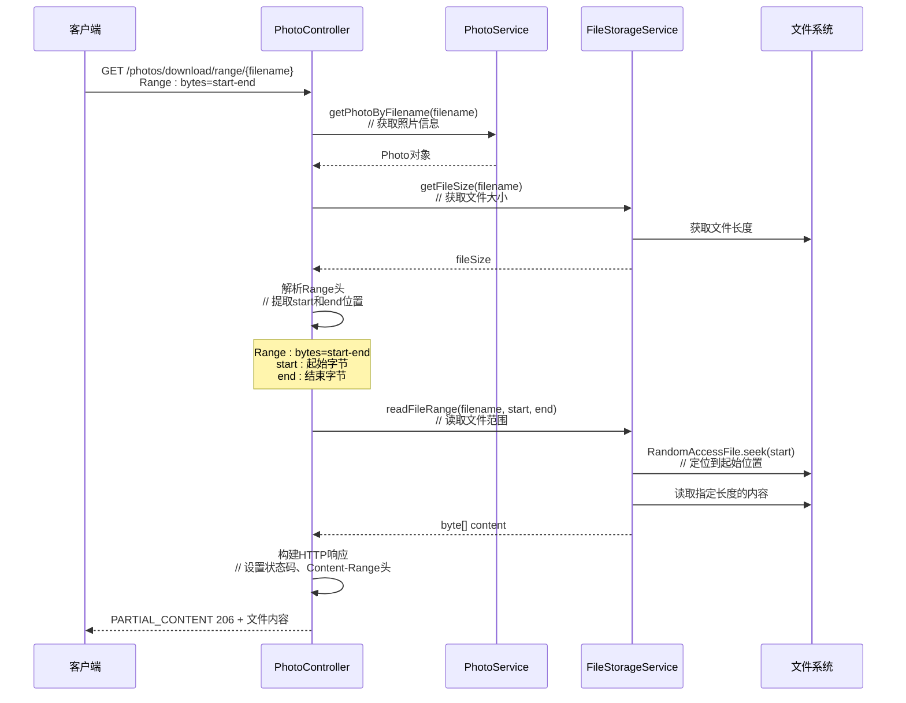
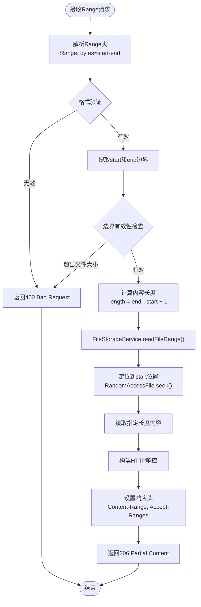
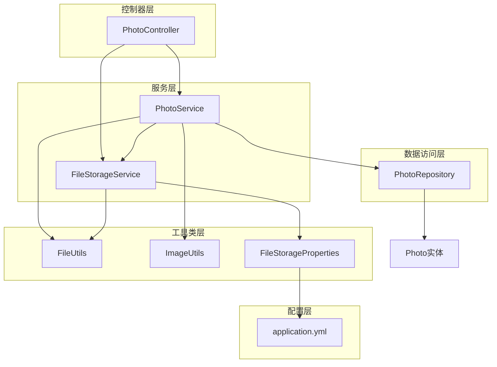
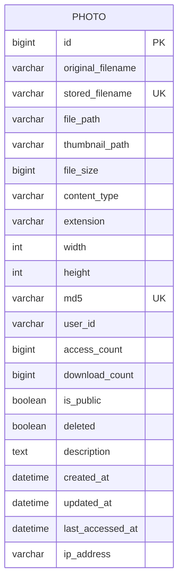
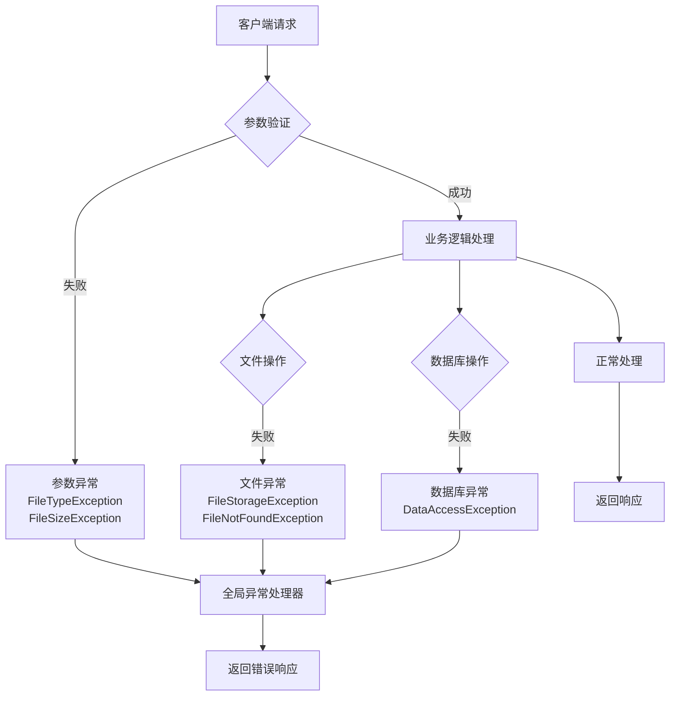

# 数据流

<cite>
**本文档中引用的文件**
- [PhotoController.java](file://src/main/java/com/photo/controller/PhotoController.java)
- [PhotoService.java](file://src/main/java/com/photo/service/PhotoService.java)
- [FileStorageService.java](file://src/main/java/com/photo/service/FileStorageService.java)
- [PhotoRepository.java](file://src/main/java/com/photo/repository/PhotoRepository.java)
- [Photo.java](file://src/main/java/com/photo/entity/Photo.java)
- [FileStorageProperties.java](file://src/main/java/com/photo/config/FileStorageProperties.java)
- [FileUtils.java](file://src/main/java/com/photo/util/FileUtils.java)
- [ImageUtils.java](file://src/main/java/com/photo/util/ImageUtils.java)
- [application.yml](file://src/main/resources/application.yml)
</cite>

## 目录
1. [概述](#概述)
2. [系统架构概览](#系统架构概览)
3. [上传流程数据流](#上传流程数据流)
4. [下载流程数据流](#下载流程数据流)
5. [断点续传流程数据流](#断点续传流程数据流)
6. [组件间交互关系](#组件间交互关系)
7. [数据存储结构](#数据存储结构)
8. [性能优化考虑](#性能优化考虑)
9. [错误处理机制](#错误处理机制)
10. [总结](#总结)

## 概述

本文档详细描述了照片管理系统中的关键业务流程数据流动路径。系统采用Spring Boot架构，主要包含三个核心业务流程：照片上传、照片下载和断点续传下载。每个流程都涉及多个组件之间的协调工作，包括控制器层、服务层、数据访问层和文件存储层。

## 系统架构概览

系统采用分层架构设计，主要分为以下层次：

**图表来源**
- [PhotoController.java](file://src/main/java/com/photo/controller/PhotoController.java#L30-L316)
- [PhotoService.java](file://src/main/java/com/photo/service/PhotoService.java#L35-L385)
- [FileStorageService.java](file://src/main/java/com/photo/service/FileStorageService.java#L22-L300)
- [PhotoRepository.java](file://src/main/java/com/photo/repository/PhotoRepository.java#L19-L112)

## 上传流程数据流

### 流程概述

上传流程从客户端发起POST /photos/upload请求开始，经过文件验证、存储空间检查、文件存储、缩略图生成和数据库持久化等步骤。

**图表来源**
- [PhotoController.java](file://src/main/java/com/photo/controller/PhotoController.java#L48-L60)
- [PhotoService.java](file://src/main/java/com/photo/service/PhotoService.java#L50-L110)
- [FileStorageService.java](file://src/main/java/com/photo/service/FileStorageService.java#L58-L94)

### 关键数据流转节点

| 步骤 | 数据流向 | 处理组件 | 数据转换 |
|------|----------|----------|----------|
| 1 | MultipartFile → 验证 | PhotoService.validateFile() | 类型检查、大小验证 |
| 2 | 文件大小 → 存储检查 | PhotoService.checkStorageSpace() | 总存储空间计算 |
| 3 | MultipartFile → MD5 | FileUtils.calculateMD5() | 文件内容哈希计算 |
| 4 | MD5 → 重复检查 | PhotoRepository.findByMd5() | 数据库查询 |
| 5 | MultipartFile → 存储文件 | FileStorageService.storeFile() | 文件写入磁盘 |
| 6 | File → 尺寸获取 | ImageUtils.getImageDimensions() | 图片宽高提取 |
| 7 | File → 缩略图 | ImageUtils.createThumbnail() | 图片压缩处理 |
| 8 | Photo实体 → 数据库 | PhotoRepository.save() | 元数据持久化 |

**章节来源**
- [PhotoService.java](file://src/main/java/com/photo/service/PhotoService.java#L50-L110)
- [FileStorageService.java](file://src/main/java/com/photo/service/FileStorageService.java#L58-L94)
- [FileUtils.java](file://src/main/java/com/photo/util/FileUtils.java#L106-L118)
- [ImageUtils.java](file://src/main/java/com/photo/util/ImageUtils.java#L21-L47)

## 下载流程数据流

### 流程概述

下载流程从客户端请求GET /photos/download/{filename}开始，系统先获取照片信息并更新下载计数，然后读取文件内容并返回给客户端。

**图表来源**
- [PhotoController.java](file://src/main/java/com/photo/controller/PhotoController.java#L149-L178)
- [PhotoService.java](file://src/main/java/com/photo/service/PhotoService.java#L155-L160)
- [FileStorageService.java](file://src/main/java/com/photo/service/FileStorageService.java#L98-L114)

### 下载流程数据转换

**图表来源**
- [PhotoController.java](file://src/main/java/com/photo/controller/PhotoController.java#L154-L178)
- [PhotoService.java](file://src/main/java/com/photo/service/PhotoService.java#L246-L250)
- [FileStorageService.java](file://src/main/java/com/photo/service/FileStorageService.java#L98-L114)

**章节来源**
- [PhotoController.java](file://src/main/java/com/photo/controller/PhotoController.java#L149-L178)
- [PhotoService.java](file://src/main/java/com/photo/service/PhotoService.java#L155-L160)
- [FileStorageService.java](file://src/main/java/com/photo/service/FileStorageService.java#L98-L114)

## 断点续传流程数据流

### 流程概述

断点续传流程支持HTTP Range请求，允许客户端分段下载大文件。系统需要解析Range头，确定下载范围，然后读取指定范围的文件内容。

**图表来源**
- [PhotoController.java](file://src/main/java/com/photo/controller/PhotoController.java#L183-L224)
- [FileStorageService.java](file://src/main/java/com/photo/service/FileStorageService.java#L227-L256)

### Range头解析和处理流程

**图表来源**
- [PhotoController.java](file://src/main/java/com/photo/controller/PhotoController.java#L196-L211)
- [FileStorageService.java](file://src/main/java/com/photo/service/FileStorageService.java#L227-L256)

### 断点续传数据处理

| 请求阶段 | 处理内容 | 数据格式 | 输出格式 |
|----------|----------|----------|----------|
| Range头解析 | bytes=start-end | 字符串 | long start, long end |
| 边界验证 | 超出文件大小检查 | 文件大小 | 异常或调整边界 |
| 内容读取 | 指定范围字节 | 文件偏移量 | byte[] content |
| 响应构建 | HTTP状态码和头 | 206 Partial Content | 二进制内容 + HTTP头 |

**章节来源**
- [PhotoController.java](file://src/main/java/com/photo/controller/PhotoController.java#L183-L224)
- [FileStorageService.java](file://src/main/java/com/photo/service/FileStorageService.java#L227-L256)

## 组件间交互关系

### 依赖关系图

**图表来源**
- [PhotoController.java](file://src/main/java/com/photo/controller/PhotoController.java#L36-L44)
- [PhotoService.java](file://src/main/java/com/photo/service/PhotoService.java#L38-L46)
- [FileStorageService.java](file://src/main/java/com/photo/service/FileStorageService.java#L26-L28)

### 数据流映射表

| 组件 | 输入参数 | 输出结果 | 主要功能 |
|------|----------|----------|----------|
| PhotoController.uploadPhoto() | MultipartFile, String userId, String description | ResponseEntity<PhotoUploadResponse> | 接收上传请求，调用业务服务 |
| PhotoService.uploadPhoto() | MultipartFile, String userId, String description | PhotoUploadResponse | 文件验证、存储、数据库操作 |
| FileStorageService.storeFile() | MultipartFile | String storedFilename | 文件存储到本地磁盘 |
| PhotoRepository.save() | Photo entity | Photo entity | 数据持久化到数据库 |
| PhotoController.downloadPhoto() | String filename | ResponseEntity<byte[]> | 文件下载，设置HTTP响应 |
| FileStorageService.readFileRange() | String filename, long start, long end | byte[] content | 支持断点续传的文件读取 |

**章节来源**
- [PhotoController.java](file://src/main/java/com/photo/controller/PhotoController.java#L48-L60)
- [PhotoService.java](file://src/main/java/com/photo/service/PhotoService.java#L50-L110)
- [FileStorageService.java](file://src/main/java/com/photo/service/FileStorageService.java#L58-L94)

## 数据存储结构

### 照片实体模型

**图表来源**
- [Photo.java](file://src/main/java/com/photo/entity/Photo.java#L17-L174)

### 存储配置结构

| 配置项 | 默认值 | 说明 |
|--------|--------|------|
| basePath | ./uploads | 文件存储根目录 |
| tempPath | ./uploads/temp | 临时文件目录 |
| thumbnailPath | ./uploads/thumbnails | 缩略图存储目录 |
| maxFileSize | 10MB | 单文件最大大小 |
| maxStorageSize | 10GB | 总存储空间限制 |
| maxFilesPerUpload | 10 | 单次最多上传文件数 |
| thumbnail.width | 200px | 缩略图宽度 |
| thumbnail.height | 200px | 缩略图高度 |
| compression.enabled | true | 是否启用图片压缩 |

**章节来源**
- [FileStorageProperties.java](file://src/main/java/com/photo/config/FileStorageProperties.java#L20-L65)
- [application.yml](file://src/main/resources/application.yml#L54-L98)

## 性能优化考虑

### 缓存策略

系统实现了多层缓存机制来提升性能：

1. **照片信息缓存**：使用`@Cacheable`注解缓存照片元数据
2. **存储信息缓存**：缓存存储空间使用情况
3. **缩略图缓存**：避免重复生成缩略图

### 并发处理

- **事务管理**：使用`@Transactional`确保数据一致性
- **文件并发安全**：文件存储采用原子操作
- **数据库连接池**：合理配置连接池参数

### 内存管理

- **大文件处理**：断点续传支持大文件分段下载
- **临时文件清理**：定期清理临时文件
- **垃圾回收优化**：合理控制内存使用

## 错误处理机制

### 异常分类和处理

**图表来源**
- [PhotoService.java](file://src/main/java/com/photo/service/PhotoService.java#L302-L336)
- [FileStorageService.java](file://src/main/java/com/photo/service/FileStorageService.java#L58-L94)

### 错误响应格式

| 异常类型 | HTTP状态码 | 错误消息示例 |
|----------|------------|--------------|
| FileTypeException | 400 | "只允许上传图片文件" |
| FileSizeException | 400 | "文件大小不能超过 10MB" |
| StorageFullException | 400 | "存储空间不足" |
| FileNotFoundException | 404 | "照片不存在" |
| FileStorageException | 500 | "文件存储失败" |

**章节来源**
- [PhotoService.java](file://src/main/java/com/photo/service/PhotoService.java#L302-L336)
- [FileStorageService.java](file://src/main/java/com/photo/service/FileStorageService.java#L58-L94)

## 总结

本文档详细分析了照片管理系统的核心数据流，涵盖了上传、下载和断点续传三大业务流程。系统采用分层架构设计，通过清晰的职责分离实现了高效的数据处理能力。

### 关键特性

1. **完整的文件生命周期管理**：从上传到存储再到清理的全流程控制
2. **智能文件去重**：基于MD5的重复文件检测机制
3. **灵活的存储策略**：支持多种图片格式和压缩配置
4. **高性能的并发处理**：事务管理和缓存机制保证系统稳定性
5. **完善的错误处理**：多层次的异常捕获和响应机制

### 技术亮点

- **断点续传支持**：HTTP Range请求处理，提升大文件下载体验
- **缩略图自动生成**：自动创建适合Web显示的缩略图
- **存储空间监控**：实时监控和预警存储使用情况
- **定期清理机制**：自动清理过期文件，保持系统整洁

该系统为照片管理提供了稳定、高效的解决方案，能够满足现代应用对文件处理的各种需求。