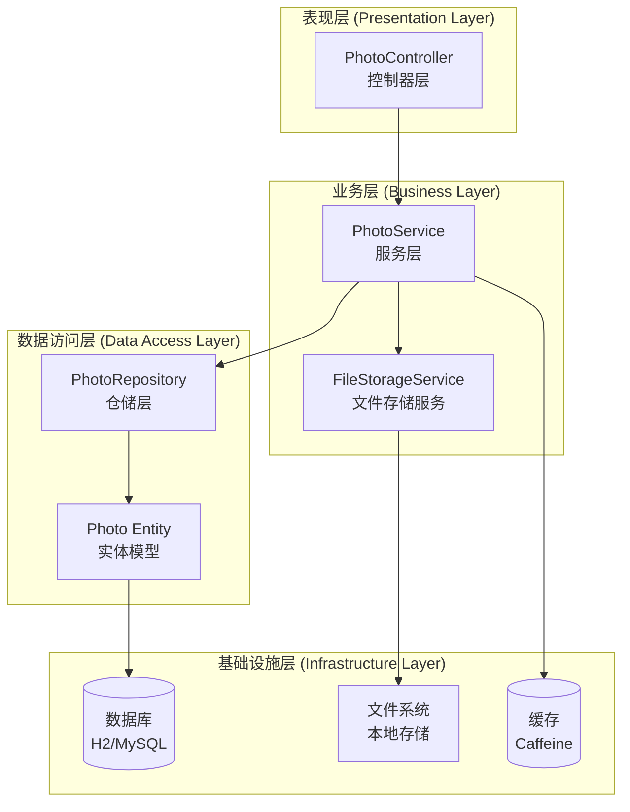
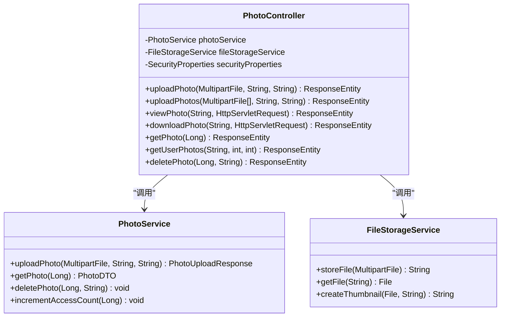
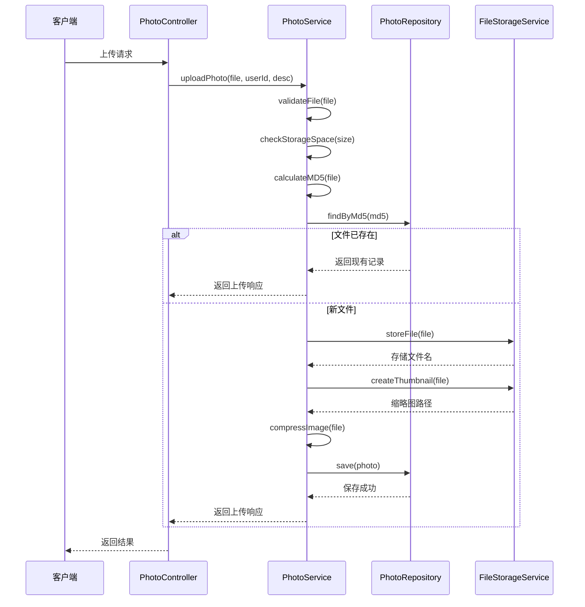
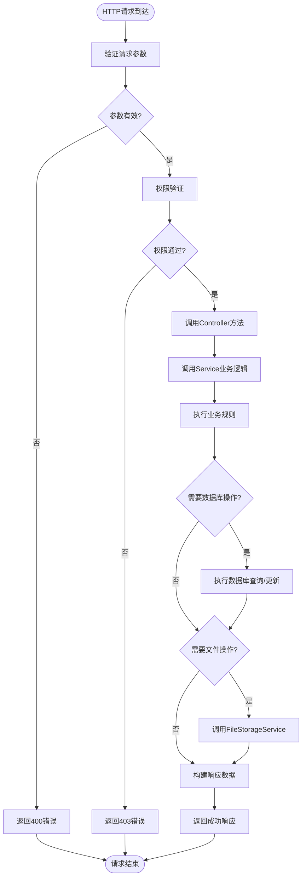
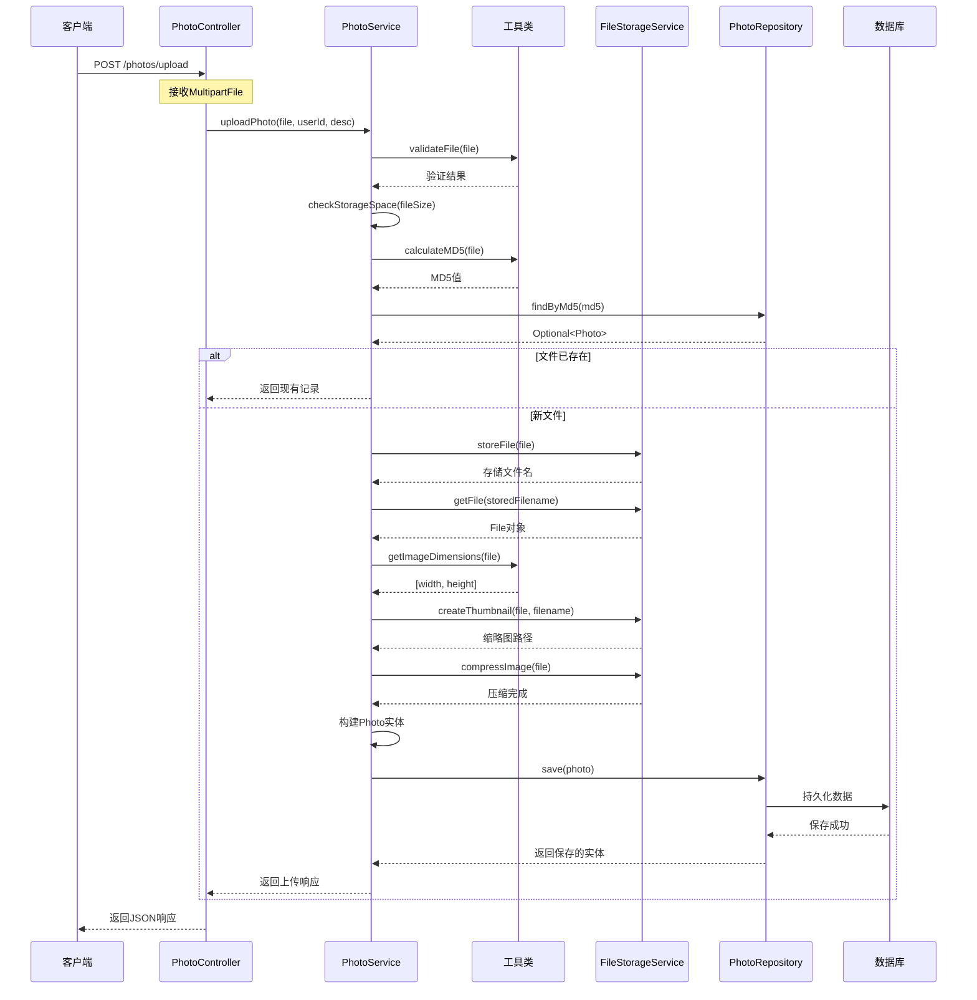
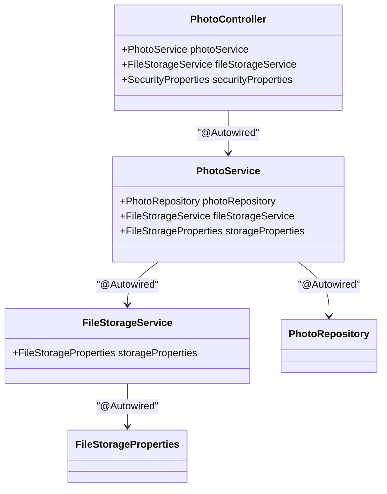
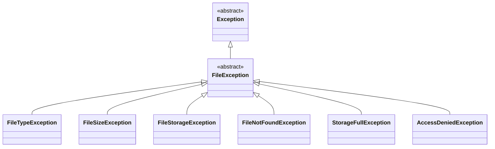

# 架构设计

<cite>
**本文档中引用的文件**
- [PhotoController.java](file://src/main/java/com/photo/controller/PhotoController.java)
- [PhotoService.java](file://src/main/java/com/photo/service/PhotoService.java)
- [PhotoRepository.java](file://src/main/java/com/photo/repository/PhotoRepository.java)
- [FileStorageService.java](file://src/main/java/com/photo/service/FileStorageService.java)
- [Photo.java](file://src/main/java/com/photo/entity/Photo.java)
- [PhotoDTO.java](file://src/main/java/com/photo/dto/PhotoDTO.java)
- [PhotoUploadResponse.java](file://src/main/java/com/photo/dto/PhotoUploadResponse.java)
- [FileStorageProperties.java](file://src/main/java/com/photo/config/FileStorageProperties.java)
- [application.yml](file://src/main/resources/application.yml)
- [pom.xml](file://pom.xml)
- [FileUtils.java](file://src/main/java/com/photo/util/FileUtils.java)
- [ImageUtils.java](file://src/main/java/com/photo/util/ImageUtils.java)
- [GlobalExceptionHandler.java](file://src/main/java/com/photo/exception/GlobalExceptionHandler.java)
</cite>

## 目录
1. [项目概述](#项目概述)
2. [系统架构概览](#系统架构概览)
3. [MVC分层架构详解](#mvc分层架构详解)
4. [核心组件分析](#核心组件分析)
5. [数据流处理机制](#数据流处理机制)
6. [依赖注入与设计模式](#依赖注入与设计模式)
7. [异常处理机制](#异常处理机制)
8. [性能优化策略](#性能优化策略)
9. [可维护性与可测试性](#可维护性与可测试性)
10. [总结](#总结)

## 项目概述

本项目是一个基于Spring Boot的图片上传与管理系统，采用经典的MVC分层架构设计。系统提供了完整的图片上传、存储、管理和访问功能，包括文件验证、缩略图生成、图片压缩、防盗链保护等高级特性。

### 核心功能特性
- **多格式支持**：支持JPG、PNG、GIF、BMP、WebP等多种图片格式
- **批量上传**：支持单文件和批量文件上传
- **智能去重**：基于MD5算法的文件去重机制
- **缩略图生成**：自动创建指定尺寸的缩略图
- **图片压缩**：可配置的图片压缩和质量调整
- **访问统计**：详细的访问和下载统计
- **安全防护**：防盗链、文件类型验证、存储空间限制

## 系统架构概览

系统采用经典的三层MVC架构，结合领域驱动设计原则，实现了清晰的职责分离和良好的可扩展性。

**图表来源**
- [PhotoController.java](file://src/main/java/com/photo/controller/PhotoController.java#L31-L316)
- [PhotoService.java](file://src/main/java/com/photo/service/PhotoService.java#L35-L385)
- [PhotoRepository.java](file://src/main/java/com/photo/repository/PhotoRepository.java#L19-L112)
- [FileStorageService.java](file://src/main/java/com/photo/service/FileStorageService.java#L23-L300)

## MVC分层架构详解

### 表现层 (Controller Layer)

表现层负责处理HTTP请求和响应，作为系统的入口点，提供RESTful API接口。

#### 核心职责
- **请求路由**：处理各种HTTP请求（GET、POST、PUT、DELETE）
- **参数验证**：验证请求参数的有效性
- **响应封装**：统一API响应格式
- **异常处理**：捕获并处理业务异常

#### 设计特点
- 使用`@RestController`注解提供RESTful接口
- 采用Swagger/OpenAPI规范生成API文档
- 实现了完整的CRUD操作和高级功能
- 支持文件上传、下载、断点续传等复杂场景

**章节来源**
- [PhotoController.java](file://src/main/java/com/photo/controller/PhotoController.java#L31-L316)

### 业务层 (Service Layer)

业务层是系统的核心，负责处理复杂的业务逻辑，协调各个组件的工作。

#### 核心职责
- **业务逻辑处理**：实现照片上传、查询、删除等核心业务
- **事务管理**：确保数据一致性（使用@Transactional注解）
- **缓存管理**：提供缓存策略以提高性能
- **跨组件协调**：协调Repository和FileStorageService的工作

#### 设计模式
- **依赖注入**：通过@Autowired注解实现松耦合
- **事务边界**：在Service层定义事务边界
- **缓存策略**：使用@Cacheable和@CacheEvict注解

**章节来源**
- [PhotoService.java](file://src/main/java/com/photo/service/PhotoService.java#L35-L385)

### 数据访问层 (Repository Layer)

数据访问层负责与数据库交互，提供数据持久化能力。

#### 核心职责
- **数据持久化**：提供CRUD操作
- **查询优化**：实现复杂查询和分页
- **索引管理**：利用数据库索引提高查询性能
- **软删除支持**：实现逻辑删除功能

#### 技术特点
- 基于Spring Data JPA简化数据访问
- 提供自定义查询方法
- 支持分页和排序
- 实现软删除和定期清理功能

**章节来源**
- [PhotoRepository.java](file://src/main/java/com/photo/repository/PhotoRepository.java#L19-L112)

## 核心组件分析

### PhotoController - 控制器层

PhotoController作为系统的HTTP接口层，负责处理所有客户端请求。

**图表来源**
- [PhotoController.java](file://src/main/java/com/photo/controller/PhotoController.java#L36-L43)
- [PhotoService.java](file://src/main/java/com/photo/service/PhotoService.java#L38-L43)
- [FileStorageService.java](file://src/main/java/com/photo/service/FileStorageService.java#L26-L28)

#### 核心功能模块

1. **文件上传模块**
   - 单文件上传：支持文件类型验证、大小限制
   - 批量上传：支持最多10个文件同时上传
   - 智能去重：基于MD5算法避免重复存储

2. **文件访问模块**
   - 在线预览：直接返回图片二进制数据
   - 缩略图访问：提供预设尺寸的缩略图
   - 下载功能：支持标准下载和断点续传

3. **文件管理模块**
   - 查询功能：按用户、公开状态、关键词搜索
   - 权限控制：基于用户ID的访问控制
   - 软删除：逻辑删除机制

**章节来源**
- [PhotoController.java](file://src/main/java/com/photo/controller/PhotoController.java#L48-L314)

### PhotoService - 业务服务层

PhotoService是系统的核心业务逻辑层，实现了复杂的业务规则和流程控制。

**图表来源**
- [PhotoService.java](file://src/main/java/com/photo/service/PhotoService.java#L50-L111)
- [PhotoController.java](file://src/main/java/com/photo/controller/PhotoController.java#L58-L60)
- [FileStorageService.java](file://src/main/java/com/photo/service/FileStorageService.java#L59-L95)

#### 核心业务流程

1. **文件上传流程**
   - 文件验证：类型检查、大小限制、格式验证
   - 去重检查：基于MD5值判断是否重复
   - 文件存储：调用FileStorageService保存文件
   - 缩略图生成：创建预览用的小图
   - 数据库持久化：保存元数据信息
   - 响应构建：返回上传结果

2. **访问统计机制**
   - 访问计数：记录每次访问次数
   - 下载统计：跟踪文件下载行为
   - 时间戳更新：记录最后访问时间

3. **存储管理**
   - 空间监控：实时检查可用存储空间
   - 定期清理：自动删除过期文件
   - 容量限制：防止存储空间耗尽

**章节来源**
- [PhotoService.java](file://src/main/java/com/photo/service/PhotoService.java#L50-L385)

### FileStorageService - 文件存储服务

FileStorageService专门负责文件系统的操作，提供可靠的文件存储和管理功能。

#### 核心功能

1. **文件存储**
   - 安全存储：防止路径遍历攻击
   - 唯一名生成：使用UUID确保文件名唯一性
   - 目录管理：自动创建必要的存储目录

2. **文件操作**
   - 文件读取：安全地获取文件内容
   - 缩略图管理：创建和管理缩略图
   - 图片处理：压缩、旋转、添加水印等

3. **文件传输**
   - 断点续传：支持Range请求的文件下载
   - 内容读取：高效读取文件部分内容
   - 大小查询：快速获取文件大小信息

**章节来源**
- [FileStorageService.java](file://src/main/java/com/photo/service/FileStorageService.java#L59-L300)

### PhotoRepository - 数据访问层

PhotoRepository继承Spring Data JPA的JpaRepository，提供数据持久化能力。

#### 查询方法设计

| 方法名称 | 功能描述 | 参数 | 返回类型 |
|---------|----------|------|----------|
| findByStoredFilename | 根据存储文件名查找 | String filename | Optional<Photo> |
| findByMd5 | 根据MD5值查找 | String md5 | Optional<Photo> |
| findByUserIdAndDeletedFalse | 查询用户照片 | String userId, Pageable pageable | Page<Photo> |
| searchByFilename | 模糊搜索文件名 | String filename, Pageable pageable | Page<Photo> |
| sumAllFileSize | 统计总文件大小 | 无 | Long |
| findExpiredPhotos | 查找过期文件 | LocalDateTime expiryDate | List<Photo> |

**章节来源**
- [PhotoRepository.java](file://src/main/java/com/photo/repository/PhotoRepository.java#L24-L111)

## 数据流处理机制

### 请求处理流程

系统采用管道式的数据流处理机制，每个请求都经过标准化的处理流程。

**图表来源**
- [PhotoController.java](file://src/main/java/com/photo/controller/PhotoController.java#L48-L314)
- [PhotoService.java](file://src/main/java/com/photo/service/PhotoService.java#L302-L385)

### 上传流程详解

以单文件上传为例，展示完整的数据流处理过程：

**图表来源**
- [PhotoService.java](file://src/main/java/com/photo/service/PhotoService.java#L50-L111)
- [FileStorageService.java](file://src/main/java/com/photo/service/FileStorageService.java#L59-L165)

## 依赖注入与设计模式

### 依赖注入机制

系统广泛使用Spring的依赖注入机制，实现组件间的松耦合。

**图表来源**
- [PhotoController.java](file://src/main/java/com/photo/controller/PhotoController.java#L36-L43)
- [PhotoService.java](file://src/main/java/com/photo/service/PhotoService.java#L38-L46)
- [FileStorageService.java](file://src/main/java/com/photo/service/FileStorageService.java#L26-L28)

### 设计模式应用

1. **Repository模式**
   - PhotoRepository提供数据访问抽象
   - 支持多种数据库后端切换
   - 实现了CRUD和自定义查询

2. **Service Layer模式**
   - 业务逻辑集中管理
   - 事务边界清晰
   - 可插拔的服务实现

3. **Strategy模式**
   - 不同的文件处理策略
   - 可配置的压缩和缩略图生成
   - 灵活的存储策略

4. **Template Method模式**
   - 统一的文件处理模板
   - 可扩展的验证和处理步骤
   - 一致的错误处理机制

**章节来源**
- [PhotoService.java](file://src/main/java/com/photo/service/PhotoService.java#L35-L385)
- [PhotoRepository.java](file://src/main/java/com/photo/repository/PhotoRepository.java#L19-L112)

## 异常处理机制

系统实现了完善的异常处理机制，确保系统的稳定性和用户体验。

### 异常层次结构

**图表来源**
- [GlobalExceptionHandler.java](file://src/main/java/com/photo/exception/GlobalExceptionHandler.java#L22-L139)

### 全局异常处理器

GlobalExceptionHandler统一处理系统中的各种异常，提供标准化的错误响应。

#### 异常处理策略

| 异常类型 | HTTP状态码 | 错误消息 | 处理方式 |
|---------|-----------|----------|----------|
| FileTypeException | 400 | 文件类型错误 | 返回具体错误信息 |
| FileSizeException | 400 | 文件大小超限 | 返回具体限制信息 |
| FileStorageException | 500 | 存储失败 | 记录详细日志 |
| FileNotFoundException | 404 | 文件未找到 | 返回资源不存在 |
| StorageFullException | 507 | 存储空间不足 | 返回容量信息 |
| AccessDeniedException | 403 | 访问被拒绝 | 返回权限错误 |

**章节来源**
- [GlobalExceptionHandler.java](file://src/main/java/com/photo/exception/GlobalExceptionHandler.java#L22-L139)

## 性能优化策略

### 缓存机制

系统实现了多层次的缓存策略以提高性能：

1. **内存缓存**：使用Caffeine本地缓存
2. **数据库查询缓存**：对频繁查询的结果进行缓存
3. **文件元数据缓存**：缓存照片的基本信息

### 性能优化技术

1. **懒加载**：延迟加载非关键数据
2. **批量操作**：支持批量文件上传和查询
3. **异步处理**：缩略图生成和压缩异步执行
4. **连接池**：数据库连接池优化
5. **压缩传输**：启用GZIP压缩减少网络传输

### 存储优化

1. **文件去重**：基于MD5的重复文件检测
2. **智能压缩**：可配置的图片压缩策略
3. **定期清理**：自动清理过期文件
4. **分层存储**：不同类型文件分类存储

**章节来源**
- [application.yml](file://src/main/resources/application.yml#L45-L49)
- [PhotoService.java](file://src/main/java/com/photo/service/PhotoService.java#L141-L141)

## 可维护性与可测试性

### 分层架构的优势

1. **职责分离**：每层都有明确的职责边界
2. **松耦合设计**：组件间通过接口通信
3. **高内聚**：同一层内的组件紧密相关
4. **可扩展性**：易于添加新功能和修改现有功能

### 测试策略

1. **单元测试**：每个Service方法都有对应的单元测试
2. **集成测试**：测试组件间的协作
3. **端到端测试**：模拟完整的用户操作流程
4. **性能测试**：验证系统在高负载下的表现

### 代码质量保证

1. **Lombok注解**：减少样板代码
2. **注释规范**：详细的JavaDoc注释
3. **命名约定**：一致的命名规范
4. **异常处理**：完善的错误处理机制

**章节来源**
- [PhotoServiceTest.java](file://src/test/java/com/photo/service/PhotoServiceTest.java)
- [PhotoControllerTest.java](file://src/test/java/com/photo/controller/PhotoControllerTest.java)

## 总结

本项目采用经典的MVC分层架构，结合现代Spring Boot框架的最佳实践，构建了一个功能完整、性能优异的图片管理系统。

### 架构优势

1. **清晰的分层**：表现层、业务层、数据访问层职责分明
2. **高度可维护**：松耦合设计便于维护和扩展
3. **优秀的可测试性**：模块化设计支持全面的测试
4. **强大的扩展性**：插件化的组件设计支持功能扩展
5. **完善的异常处理**：统一的异常处理机制确保系统稳定性

### 技术亮点

1. **智能文件管理**：去重、压缩、缩略图生成等高级功能
2. **安全防护**：防盗链、文件类型验证、权限控制
3. **性能优化**：缓存、异步处理、批量操作等优化策略
4. **监控运维**：完善的日志记录和监控指标

### 应用价值

该架构设计不仅适用于图片管理系统，其设计理念和最佳实践可以推广到其他类似的Web应用开发中，为构建高质量的企业级应用提供了参考范例。