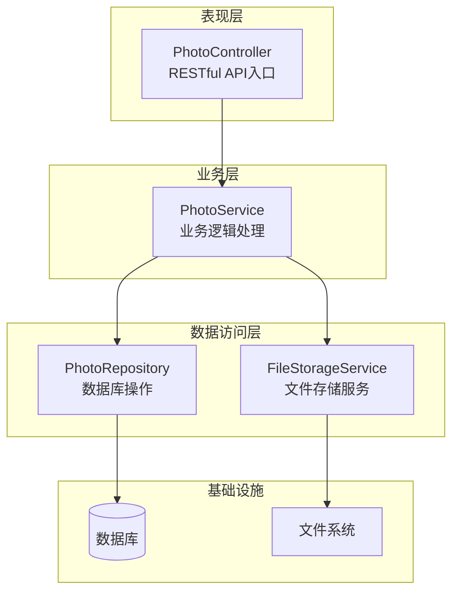
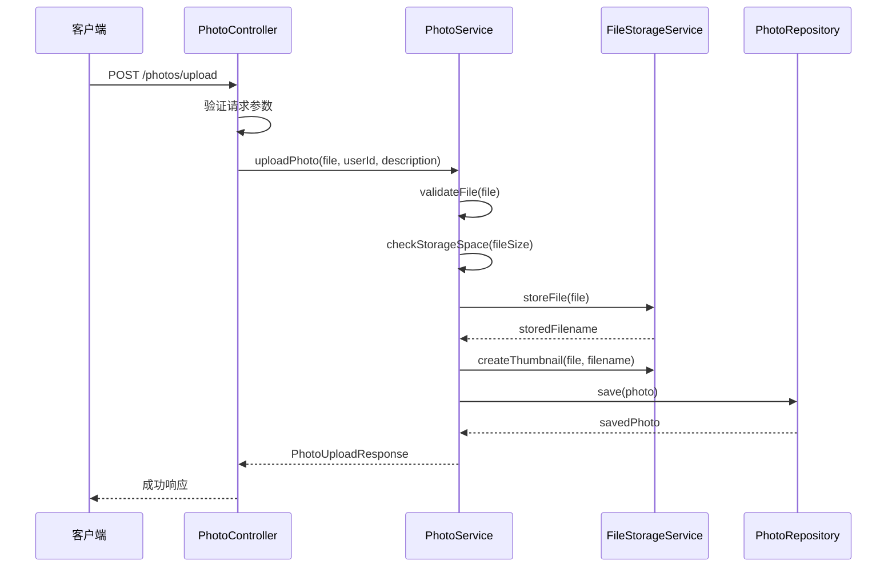
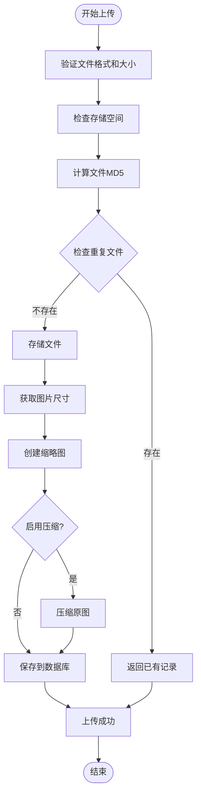
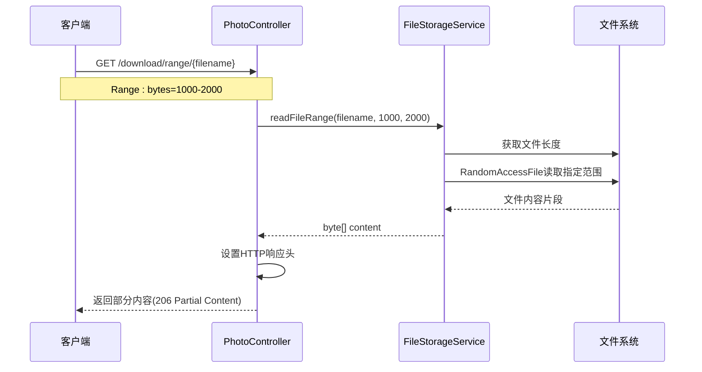
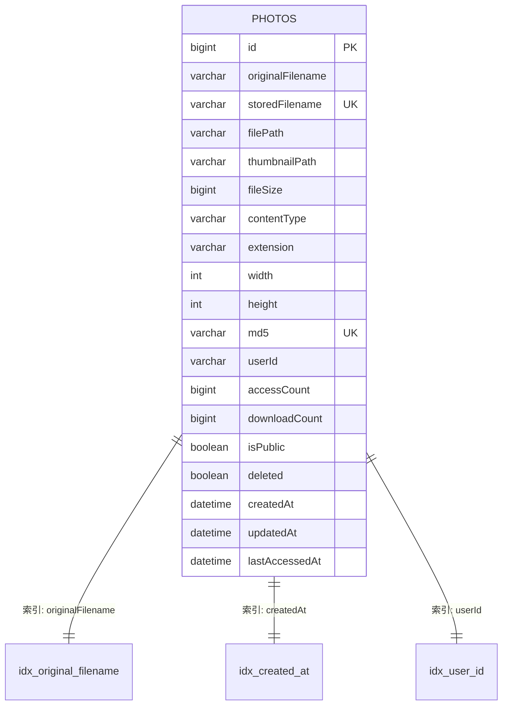
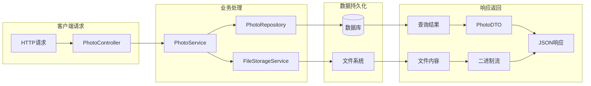

# 核心组件

<cite>
**本文档中引用的文件**
- [PhotoController.java](file://src/main/java/com/photo/controller/PhotoController.java)
- [PhotoService.java](file://src/main/java/com/photo/service/PhotoService.java)
- [FileStorageService.java](file://src/main/java/com/photo/service/FileStorageService.java)
- [PhotoRepository.java](file://src/main/java/com/photo/repository/PhotoRepository.java)
- [Photo.java](file://src/main/java/com/photo/entity/Photo.java)
- [PhotoDTO.java](file://src/main/java/com/photo/dto/PhotoDTO.java)
- [FileStorageProperties.java](file://src/main/java/com/photo/config/FileStorageProperties.java)
- [application.yml](file://src/main/resources/application.yml)
- [FileUtils.java](file://src/main/java/com/photo/util/FileUtils.java)
- [ImageUtils.java](file://src/main/java/com/photo/util/ImageUtils.java)
- [FileStorageException.java](file://src/main/java/com/photo/exception/FileStorageException.java)
</cite>

## 目录
1. [概述](#概述)
2. [PhotoController - HTTP请求入口](#photocontroller---http请求入口)
3. [PhotoService - 业务逻辑中枢](#photoservice---业务逻辑中枢)
4. [FileStorageService - 文件存储服务](#filestorageservice---文件存储服务)
5. [PhotoRepository - 数据访问层](#photorepository---数据访问层)
6. [组件协作流程](#组件协作流程)
7. [架构设计原则](#架构设计原则)
8. [性能优化策略](#性能优化策略)
9. [总结](#总结)

## 概述

本系统采用经典的三层架构设计，包含四大核心组件：PhotoController作为HTTP请求入口、PhotoService作为业务逻辑中枢、FileStorageService负责文件存储操作、PhotoRepository处理数据库访问。这些组件通过清晰的职责分离和依赖注入实现松耦合的系统架构。

**图表来源**
- [PhotoController.java](file://src/main/java/com/photo/controller/PhotoController.java#L31-L34)
- [PhotoService.java](file://src/main/java/com/photo/service/PhotoService.java#L35-L46)
- [PhotoRepository.java](file://src/main/java/com/photo/repository/PhotoRepository.java#L19-L20)
- [FileStorageService.java](file://src/main/java/com/photo/service/FileStorageService.java#L23-L24)

## PhotoController - HTTP请求入口

PhotoController是系统的核心HTTP接口层，通过@RestController和@RequestMapping注解暴露13个RESTful API端点，负责接收和处理来自客户端的所有HTTP请求。

### 核心特性

**RESTful API设计**
- 支持13个主要API端点，涵盖上传、下载、查询、管理等完整功能
- 统一的响应格式和错误处理机制
- Swagger/OpenAPI文档集成，提供API自动化文档

**安全防护机制**
- 防盗链检查，防止跨域恶意访问
- 请求参数验证和日志记录
- IP地址追踪和访问统计

### 主要API端点

| 端点 | 方法 | 功能描述 | 关键特性 |
|------|------|----------|----------|
| `/photos/upload` | POST | 单文件上传 | 支持多种图片格式，最大10MB |
| `/photos/upload/batch` | POST | 批量上传 | 最多10个文件同时上传 |
| `/photos/view/{filename}` | GET | 在线预览 | 支持防盗链检查 |
| `/photos/thumbnail/{filename}` | GET | 缩略图查看 | 高效缓存机制 |
| `/photos/download/{filename}` | GET | 文件下载 | 支持断点续传 |
| `/photos/search` | GET | 模糊搜索 | 基于文件名关键词搜索 |
| `/photos/storage/info` | GET | 存储空间信息 | 实时存储状态查询 |

### 上传流程实现

**图表来源**
- [PhotoController.java](file://src/main/java/com/photo/controller/PhotoController.java#L48-L61)
- [PhotoService.java](file://src/main/java/com/photo/service/PhotoService.java#L50-L111)

**章节来源**
- [PhotoController.java](file://src/main/java/com/photo/controller/PhotoController.java#L31-L316)

## PhotoService - 业务逻辑中枢

PhotoService作为系统的核心业务逻辑层，承担着照片上传、处理、管理和存储空间控制等关键职责。通过@Transactional、@Cacheable、@CacheEvict和@Scheduled等注解实现事务管理、缓存控制和定时任务功能。

### 核心业务功能

**事务管理与数据一致性**
- 使用@Transactional注解确保业务操作的原子性
- 支持单文件和批量文件上传的事务边界控制
- 实现软删除和硬删除的事务安全保障

**缓存策略优化**
- @Cacheable注解缓存频繁访问的照片信息
- @CacheEvict注解及时更新缓存数据
- 缓存键策略基于照片ID和文件名设计

**定时任务调度**
- @Scheduled注解实现定期清理过期文件
- 可配置的清理周期和保留策略
- 异常处理确保定时任务的稳定性

### 核心方法详解

**uploadPhoto方法实现流程**

uploadPhoto方法展示了PhotoService作为业务逻辑中枢的核心作用，协调多个服务完成完整的照片上传流程：

**图表来源**
- [PhotoService.java](file://src/main/java/com/photo/service/PhotoService.java#L50-L111)

**存储空间管理机制**

系统实现了多层次的存储空间控制：

| 控制层级 | 实现方式 | 配置参数 | 触发条件 |
|----------|----------|----------|----------|
| 单文件验证 | checkStorageSpace方法 | maxFileSize | 文件上传前 |
| 总空间监控 | sumAllFileSize查询 | maxStorageSize | 上传前检查 |
| 动态告警 | getStorageInfo方法 | usagePercentage | 实时查询 |
| 自动清理 | cleanupExpiredFiles | daysToKeep | 定时任务 |

**章节来源**
- [PhotoService.java](file://src/main/java/com/photo/service/PhotoService.java#L35-L385)

## FileStorageService - 文件存储服务

FileStorageService专门负责文件的存储、读取、管理和优化操作，提供了完整的文件生命周期管理功能，包括基础文件操作、缩略图生成、图片压缩和断点续传支持。

### 核心存储功能

**文件存储与检索**
- storeFile方法实现安全的文件存储，防止路径遍历攻击
- getFile方法提供文件对象获取，支持文件存在性验证
- 支持文件内容读取和范围读取（断点续传）

**缩略图处理系统**
- createThumbnail方法生成固定尺寸的缩略图
- 支持自定义缩略图尺寸和质量参数
- 自动生成缩略图文件名，避免冲突

**图片优化处理**
- compressImage方法实现图片压缩，支持质量控制
- 自动调整图片尺寸，适应不同显示需求
- 压缩失败不影响主流程，提供容错机制

### 断点续传支持

FileStorageService实现了完整的HTTP Range请求支持，为大文件下载提供断点续传功能：

**图表来源**
- [PhotoController.java](file://src/main/java/com/photo/controller/PhotoController.java#L184-L225)
- [FileStorageService.java](file://src/main/java/com/photo/service/FileStorageService.java#L229-L256)

### 存储目录结构

系统采用分层存储架构，确保文件组织的清晰性和安全性：

| 目录类型 | 路径配置 | 用途说明 | 权限设置 |
|----------|----------|----------|----------|
| 基础存储 | ./uploads | 原始文件存储 | rw-rw-rw- |
| 临时目录 | ./uploads/temp | 上传过程临时文件 | rw-rw-rw- |
| 缩略图目录 | ./uploads/thumbnails | 缩略图缓存 | rw-rw-rw- |

**章节来源**
- [FileStorageService.java](file://src/main/java/com/photo/service/FileStorageService.java#L23-L300)

## PhotoRepository - 数据访问层

PhotoRepository基于Spring Data JPA框架，提供类型安全的数据访问接口。通过继承JpaRepository和自定义查询方法，实现了高效的照片数据管理功能。

### 数据库访问模式

**JPA继承模式**
- 继承JpaRepository获得基本CRUD操作
- 提供类型安全的实体操作接口
- 支持分页查询和排序功能

**自定义查询方法**
- findByStoredFilename：基于存储文件名快速查找
- findByMd5：利用MD5值实现文件去重
- searchByFilename：支持模糊查询的照片搜索

### 查询优化策略

**@Query注解的高级查询**

PhotoRepository使用@Query注解实现复杂的数据库查询：

| 查询类型 | SQL语句特点 | 性能优化 | 使用场景 |
|----------|-------------|----------|----------|
| 聚合查询 | SUM/COUNT函数 | 索引优化 | 存储空间统计 |
| 软删除过滤 | deleted = false | 复合索引 | 安全数据查询 |
| 时间范围查询 | BETWEEN操作 | 索引利用 | 过期文件清理 |
| 排序查询 | ORDER BY子句 | 索引排序 | 热门照片排行 |

**索引设计策略**

**图表来源**
- [Photo.java](file://src/main/java/com/photo/entity/Photo.java#L18-L22)
- [PhotoRepository.java](file://src/main/java/com/photo/repository/PhotoRepository.java#L45-L111)

### 事务管理集成

PhotoRepository与PhotoService的事务管理紧密配合：

- @Transactional注解确保业务方法的事务边界
- @Modifying注解支持自定义更新查询
- 事务传播行为保证数据一致性

**章节来源**
- [PhotoRepository.java](file://src/main/java/com/photo/repository/PhotoRepository.java#L19-L112)

## 组件协作流程

四大核心组件通过明确的职责分工和依赖关系实现高效的协作：

**图表来源**
- [PhotoController.java](file://src/main/java/com/photo/controller/PhotoController.java#L36-L43)
- [PhotoService.java](file://src/main/java/com/photo/service/PhotoService.java#L38-L46)

### 典型上传流程分析

以单文件上传为例，展示组件间的协作过程：

1. **请求接收阶段**：PhotoController接收HTTP请求，验证参数
2. **业务逻辑处理**：PhotoService执行文件验证、存储空间检查
3. **文件存储操作**：FileStorageService负责实际文件存储
4. **数据持久化**：PhotoRepository保存照片元数据
5. **响应构建**：各组件协作构建最终响应

**章节来源**
- [PhotoController.java](file://src/main/java/com/photo/controller/PhotoController.java#L48-L61)
- [PhotoService.java](file://src/main/java/com/photo/service/PhotoService.java#L50-L111)

## 架构设计原则

### 分层架构设计

系统严格遵循分层架构原则，确保各层职责清晰：

- **表现层**：专注于HTTP请求处理和响应构建
- **业务层**：实现核心业务逻辑和规则控制
- **数据访问层**：提供类型安全的数据操作接口
- **基础设施层**：文件系统和数据库访问

### 依赖注入与控制反转

通过Spring框架的依赖注入机制实现松耦合设计：

- 使用@Autowired注解自动注入依赖
- 通过构造函数注入确保不可变性
- 利用接口编程提高可测试性

### 异常处理策略

建立统一的异常处理体系：

- 自定义异常类提供语义化的错误信息
- 全局异常处理器统一处理各类异常
- 结构化的错误响应格式便于客户端处理

## 性能优化策略

### 缓存机制

**多级缓存策略**
- 内存缓存：Caffeine本地缓存，提升热点数据访问速度
- 数据库查询缓存：JPA二级缓存减少数据库访问
- 文件系统缓存：缩略图和压缩图片的本地缓存

### 并发控制

**线程安全设计**
- 不可变对象设计，避免并发修改问题
- 事务隔离级别确保数据一致性
- 合理的锁策略避免死锁

### 资源管理

**文件系统优化**
- 流式处理大文件，避免内存溢出
- 连接池管理数据库连接
- 定期清理临时文件和过期数据

## 总结

本系统通过精心设计的四大核心组件，实现了功能完整、性能优异的照片管理系统。PhotoController作为HTTP请求入口，提供了RESTful API接口；PhotoService作为业务逻辑中枢，协调各种业务操作；FileStorageService专注文件存储和处理；PhotoRepository提供类型安全的数据访问。

各组件通过清晰的接口和依赖关系实现松耦合设计，支持高并发访问和大规模数据处理。完善的异常处理机制、缓存策略和性能优化措施确保了系统的稳定性和可扩展性。

这种架构设计不仅满足了当前的功能需求，也为未来的功能扩展和性能优化奠定了坚实的基础。