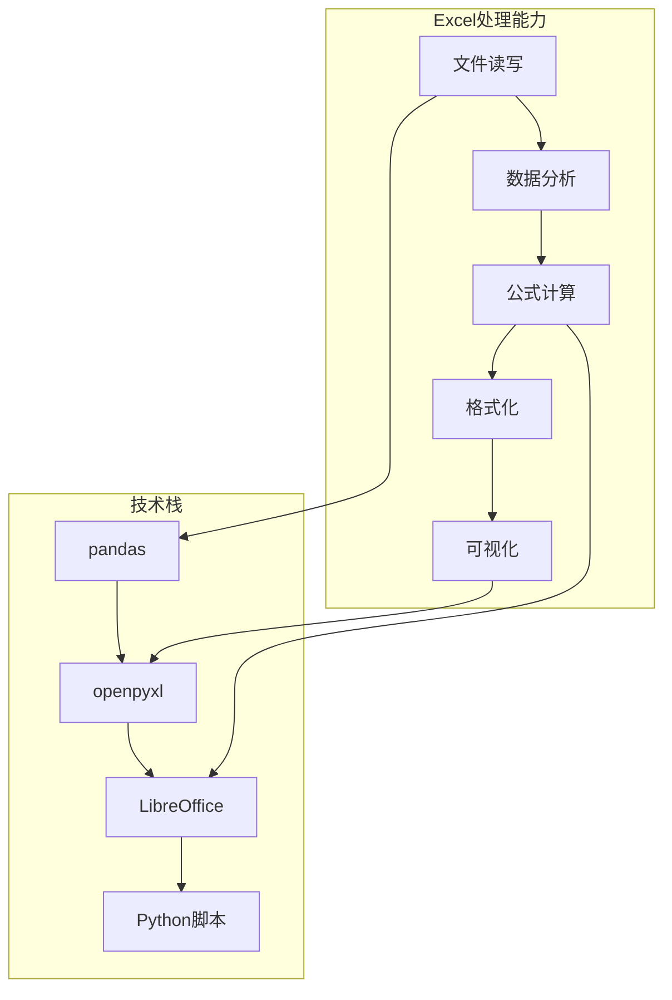
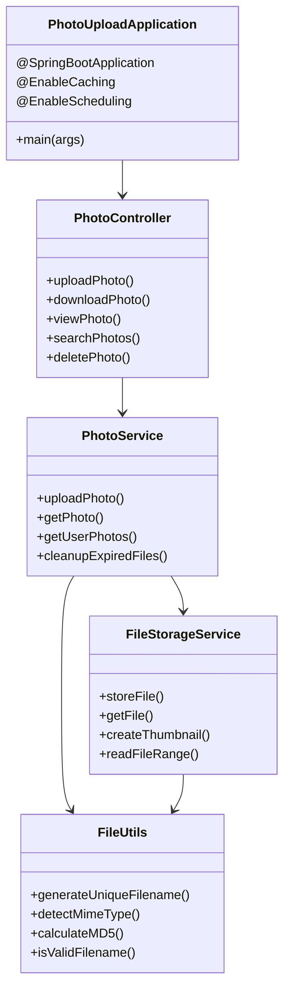
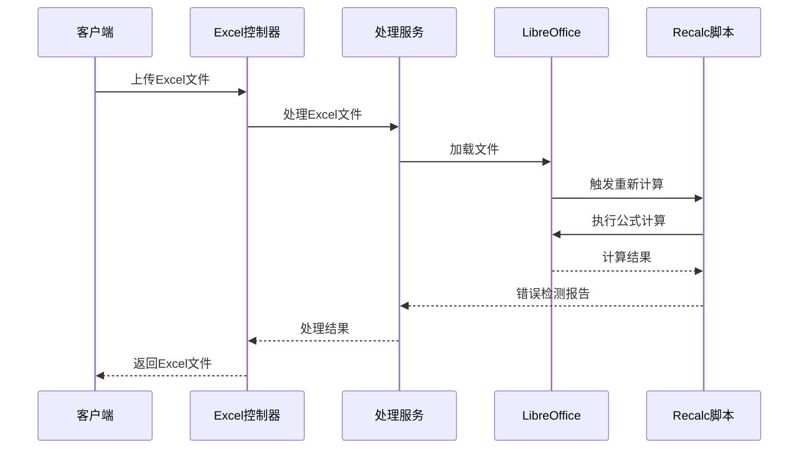
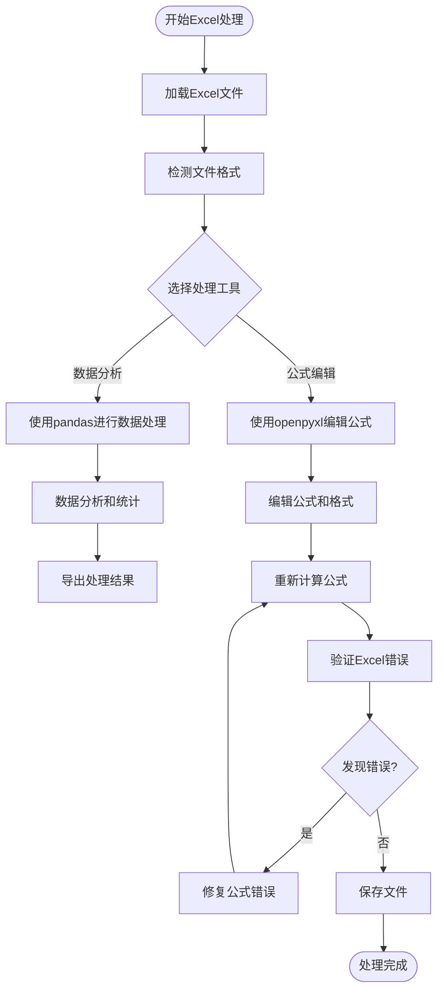
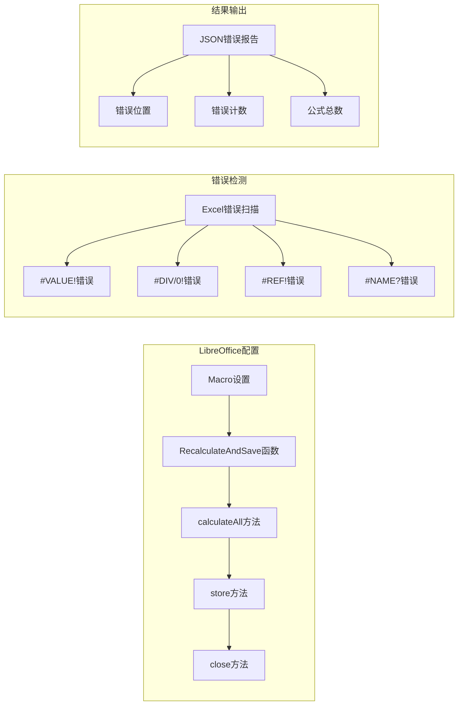
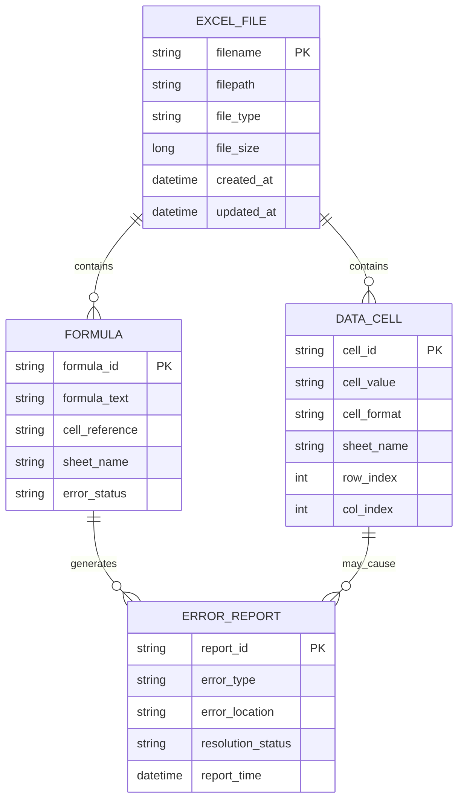
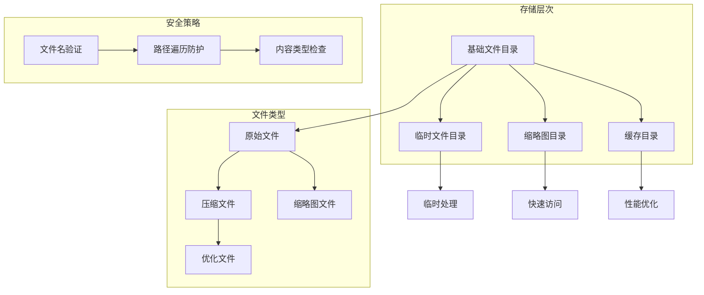
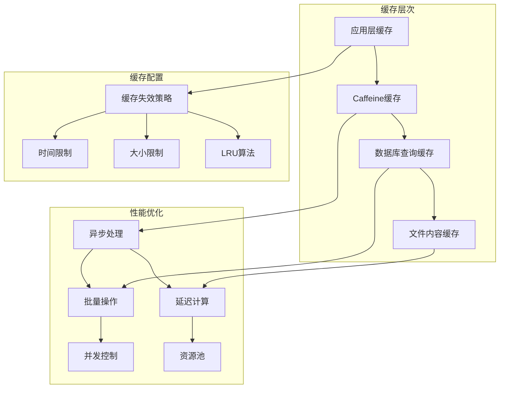
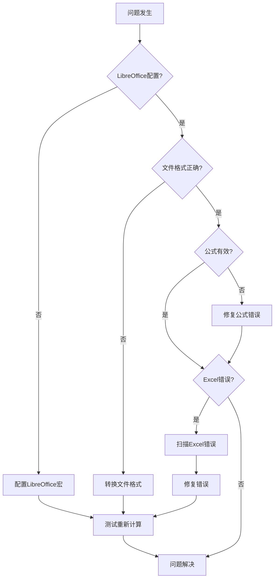

# Excel处理技能

<cite>
**本文档引用的文件**
- [README.md](file://README.md)
- [API_DOCUMENTATION.md](file://API_DOCUMENTATION.md)
- [PhotoUploadApplication.java](file://src/main/java/com/photo/PhotoUploadApplication.java)
- [PhotoController.java](file://src/main/java/com/photo/controller/PhotoController.java)
- [PhotoService.java](file://src/main/java/com/photo/service/PhotoService.java)
- [FileStorageService.java](file://src/main/java/com/photo/service/FileStorageService.java)
- [FileUtils.java](file://src/main/java/com/photo/util/FileUtils.java)
- [Photo.java](file://src/main/java/com/photo/entity/Photo.java)
- [PhotoDTO.java](file://src/main/java/com/photo/dto/PhotoDTO.java)
- [pom.xml](file://pom.xml)
- [.lingma/skills/lingmaProjectSkillExlcel/SKILL.md](file://.lingma/skills/lingmaProjectSkillExlcel/SKILL.md)
- [.lingma/skills/lingmaProjectSkillExlcel/recalc.py](file://.lingma/skills/lingmaProjectSkillExlcel/recalc.py)
</cite>

## 目录
1. [项目简介](#项目简介)
2. [Excel处理技能概述](#excel处理技能概述)
3. [核心组件架构](#核心组件架构)
4. [Excel文件处理工作流](#excel文件处理工作流)
5. [公式计算与验证](#公式计算与验证)
6. [数据模型与实体关系](#数据模型与实体关系)
7. [API接口与集成](#api接口与集成)
8. [性能优化与最佳实践](#性能优化与最佳实践)
9. [故障排除指南](#故障排除指南)
10. [总结](#总结)

## 项目简介

这是一个基于Spring Boot开发的综合Excel处理技能系统，专门设计用于处理各种Excel文件操作需求。该系统提供了从基础的Excel文件读写到复杂的财务建模和数据分析的完整解决方案。

### 主要功能特性

- **多格式支持**: 完整支持.xlsx、.xlsm、.csv、.tsv等多种Excel文件格式
- **动态计算**: 基于LibreOffice的公式自动重新计算功能
- **数据验证**: 全面的Excel错误检测和修复机制
- **模板维护**: 严格的现有模板格式保护和一致性维护
- **财务建模**: 专业的财务模型标准和颜色编码体系

## Excel处理技能概述

### 技能核心能力

Excel处理技能系统具备以下核心能力：



**图表来源**
- [.lingma/skills/lingmaProjectSkillExlcel/SKILL.md:63-289](file://.lingma/skills/lingmaProjectSkillExlcel/SKILL.md#L63-L289)

### 文件处理标准

系统遵循严格的Excel文件处理标准：

| 处理类型 | 要求 | 实现方式 |
|---------|------|----------|
| 公式准确性 | 零公式错误 | recalc.py自动计算 |
| 模板保护 | 保持现有格式 | 严格匹配现有约定 |
| 颜色编码 | 行业标准 | Blue/Black/Green/Red/Yellow |
| 数字格式 | 标准格式规则 | Currency/Percentage/Multiples |

**章节来源**
- [.lingma/skills/lingmaProjectSkillExlcel/SKILL.md:9-62](file://.lingma/skills/lingmaProjectSkillExlcel/SKILL.md#L9-L62)

## 核心组件架构

### 系统架构设计



**图表来源**
- [PhotoUploadApplication.java:11-19](file://src/main/java/com/photo/PhotoUploadApplication.java#L11-L19)
- [PhotoController.java:30-316](file://src/main/java/com/photo/controller/PhotoController.java#L30-L316)
- [PhotoService.java:34-385](file://src/main/java/com/photo/service/PhotoService.java#L34-L385)
- [FileStorageService.java:22-300](file://src/main/java/com/photo/service/FileStorageService.java#L22-L300)
- [FileUtils.java:19-178](file://src/main/java/com/photo/util/FileUtils.java#L19-L178)

### Excel处理组件



**图表来源**
- [.lingma/skills/lingmaProjectSkillExlcel/recalc.py:53-156](file://.lingma/skills/lingmaProjectSkillExlcel/recalc.py#L53-L156)

**章节来源**
- [PhotoUploadApplication.java:1-20](file://src/main/java/com/photo/PhotoUploadApplication.java#L1-L20)
- [PhotoController.java:1-316](file://src/main/java/com/photo/controller/PhotoController.java#L1-L316)

## Excel文件处理工作流

### 数据分析工作流



**图表来源**
- [.lingma/skills/lingmaProjectSkillExlcel/SKILL.md:73-147](file://.lingma/skills/lingmaProjectSkillExlcel/SKILL.md#L73-L147)

### 公式处理流程

系统采用严格的工作流程确保Excel文件的正确处理：

1. **工具选择**: 根据需求选择pandas或openpyxl
2. **文件加载**: 支持多种Excel格式的读取
3. **数据修改**: 添加/编辑数据、公式和格式
4. **文件保存**: 写入到输出文件
5. **公式重新计算**: 使用recalc.py脚本
6. **错误验证**: 检测和修复Excel错误

**章节来源**
- [.lingma/skills/lingmaProjectSkillExlcel/SKILL.md:129-245](file://.lingma/skills/lingmaProjectSkillExlcel/SKILL.md#L129-L245)

## 公式计算与验证

### LibreOffice集成

系统通过LibreOffice实现Excel公式的自动重新计算：



**图表来源**
- [.lingma/skills/lingmaProjectSkillExlcel/recalc.py:16-51](file://.lingma/skills/lingmaProjectSkillExlcel/recalc.py#L16-L51)
- [.lingma/skills/lingmaProjectSkillExlcel/recalc.py:101-156](file://.lingma/skills/lingmaProjectSkillExlcel/recalc.py#L101-L156)

### 错误处理机制

系统实现了全面的Excel错误检测和处理机制：

| 错误类型 | 描述 | 处理方式 |
|---------|------|----------|
| #REF! | 无效单元格引用 | 检查单元格坐标和工作表名称 |
| #DIV/0! | 除零错误 | 验证分母单元格非零 |
| #VALUE! | 数据类型错误 | 验证公式参数类型 |
| #NAME? | 未识别的公式名称 | 检查函数名称拼写 |

**章节来源**
- [.lingma/skills/lingmaProjectSkillExlcel/recalc.py:105-120](file://.lingma/skills/lingmaProjectSkillExlcel/recalc.py#L105-L120)

## 数据模型与实体关系

### Excel处理数据模型



**图表来源**
- [Photo.java:27-174](file://src/main/java/com/photo/entity/Photo.java#L27-L174)

### 文件存储策略

系统采用分层文件存储策略：



**图表来源**
- [FileStorageService.java:36-54](file://src/main/java/com/photo/service/FileStorageService.java#L36-L54)
- [FileUtils.java:157-177](file://src/main/java/com/photo/util/FileUtils.java#L157-L177)

**章节来源**
- [Photo.java:17-174](file://src/main/java/com/photo/entity/Photo.java#L17-L174)
- [FileStorageService.java:19-300](file://src/main/java/com/photo/service/FileStorageService.java#L19-L300)

## API接口与集成

### RESTful API设计

系统提供完整的RESTful API接口：

```mermaid
graph LR
subgraph "API端点"
A[/api/photos/upload] --> B[单文件上传]
C[/api/photos/upload/batch] --> D[批量上传]
E[/api/photos/view/{filename}] --> F[在线预览]
G[/api/photos/download/{filename}] --> H[文件下载]
I[/api/photos/download/range/{filename}] --> J[断点续传]
end
subgraph "响应格式"
K[统一响应结构] --> L[状态码]
K --> M[消息]
K --> N[数据]
K --> O[时间戳]
end
A --> K
C --> K
E --> K
G --> K
I --> K
```

**图表来源**
- [API_DOCUMENTATION.md:34-509](file://API_DOCUMENTATION.md#L34-L509)

### 文件处理API

| 接口 | 方法 | 功能 | 参数 |
|------|------|------|------|
| /photos/upload | POST | 单文件上传 | file, userId, description |
| /photos/upload/batch | POST | 批量上传 | files[], userId, description |
| /photos/view/{filename} | GET | 在线预览 | filename |
| /photos/download/{filename} | GET | 文件下载 | filename |
| /photos/download/range/{filename} | GET | 断点续传 | filename, Range头 |

**章节来源**
- [API_DOCUMENTATION.md:105-169](file://API_DOCUMENTATION.md#L105-L169)
- [PhotoController.java:46-316](file://src/main/java/com/photo/controller/PhotoController.java#L46-L316)

## 性能优化与最佳实践

### 缓存策略

系统采用多层次缓存机制：



**图表来源**
- [PhotoUploadApplication.java:5-6](file://src/main/java/com/photo/PhotoUploadApplication.java#L5-L6)
- [PhotoService.java:12-13](file://src/main/java/com/photo/service/PhotoService.java#L12-L13)

### 安全特性

系统实施了全面的安全防护措施：

1. **文件类型验证**: 使用Apache Tika进行MIME类型检测
2. **文件名安全**: 防止路径遍历攻击
3. **访问控制**: 防盗链和权限验证
4. **XSS防护**: 输入数据的HTML转义
5. **CORS配置**: 跨域资源共享控制

**章节来源**
- [FileUtils.java:21-36](file://src/main/java/com/photo/util/FileUtils.java#L21-L36)
- [FileUtils.java:157-177](file://src/main/java/com/photo/util/FileUtils.java#L157-L177)

## 故障排除指南

### 常见问题诊断



**图表来源**
- [.lingma/skills/lingmaProjectSkillExlcel/recalc.py:158-178](file://.lingma/skills/lingmaProjectSkillExlcel/recalc.py#L158-L178)

### 错误处理流程

系统提供了完善的错误处理和恢复机制：

1. **错误检测**: 自动扫描Excel文件中的各种错误
2. **错误分类**: 区分不同类型的Excel错误
3. **错误定位**: 精确定位错误发生的单元格位置
4. **错误修复**: 提供修复建议和自动修复选项
5. **验证确认**: 确保修复后的文件质量

**章节来源**
- [.lingma/skills/lingmaProjectSkillExlcel/recalc.py:101-156](file://.lingma/skills/lingmaProjectSkillExlcel/recalc.py#L101-L156)

## 总结

Excel处理技能系统是一个功能完整、架构清晰的综合处理平台。它结合了传统的Java文件处理能力和现代的Excel自动化技术，为用户提供了一站式的Excel文件处理解决方案。

### 核心优势

1. **技术整合**: 将Spring Boot、LibreOffice、pandas等技术有机结合
2. **标准化流程**: 建立了完整的Excel文件处理标准和工作流程
3. **质量保证**: 通过自动化的错误检测和修复确保文件质量
4. **性能优化**: 采用多层缓存和异步处理提升系统性能
5. **安全保障**: 实施了全面的安全防护措施

### 应用场景

该系统适用于各种需要Excel文件处理的场景，包括但不限于：
- 财务数据分析和建模
- 业务报表生成和处理
- 数据导入导出操作
- Excel模板维护和更新
- 大规模数据处理和分析

通过严格的标准和规范，Excel处理技能系统为复杂的数据处理任务提供了可靠的技术支撑。