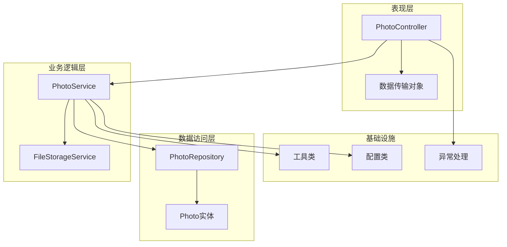
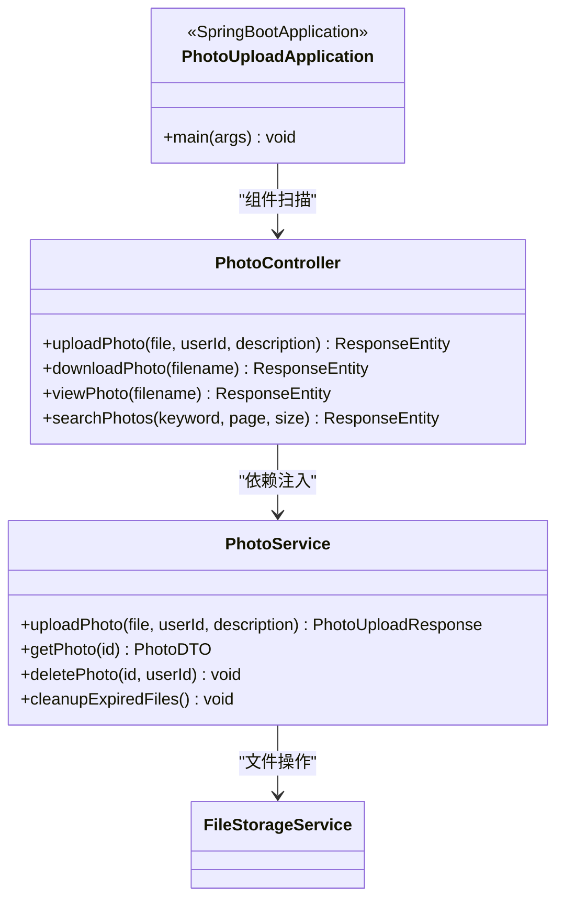
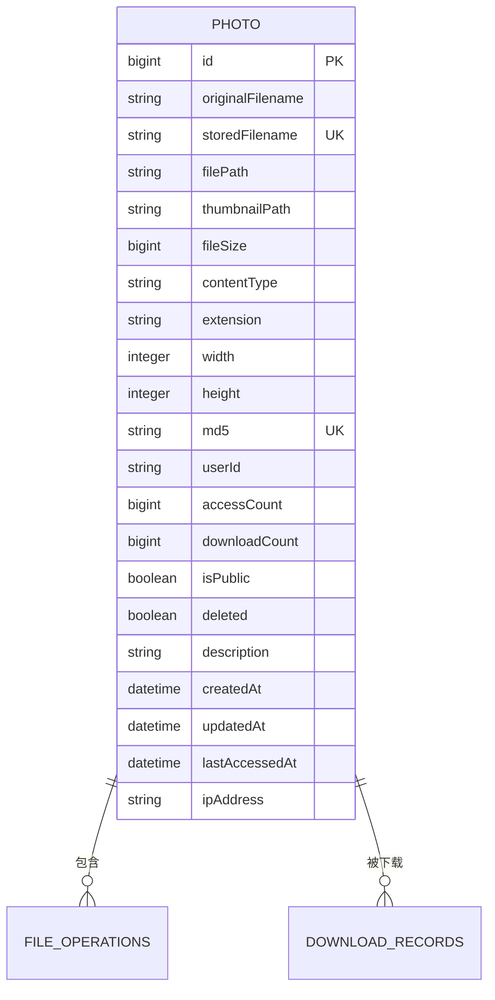
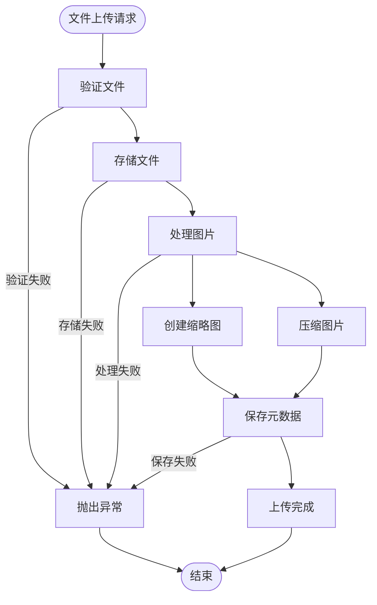
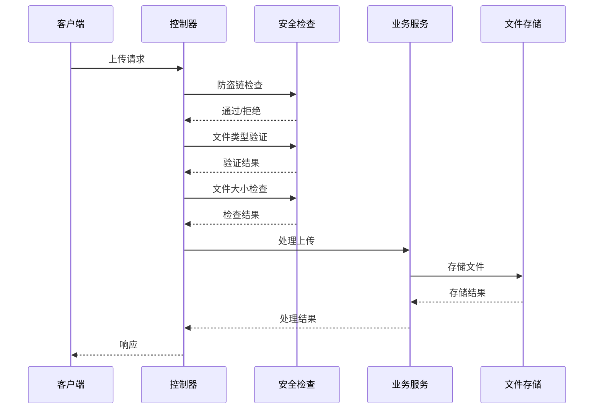
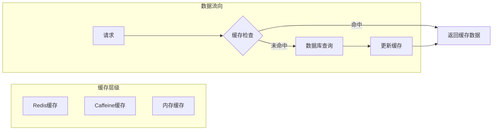
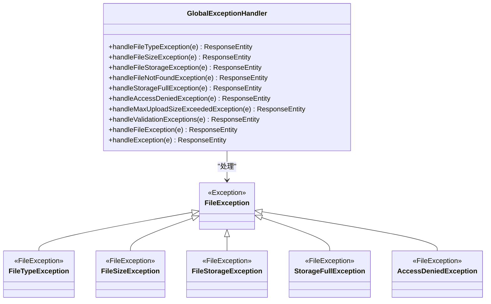
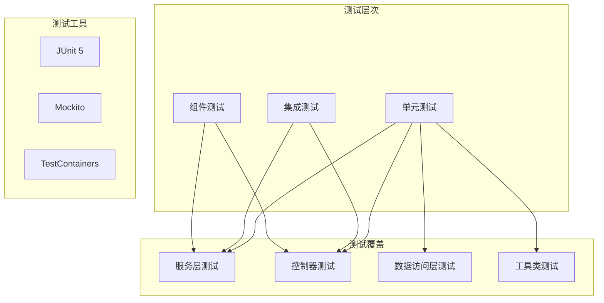
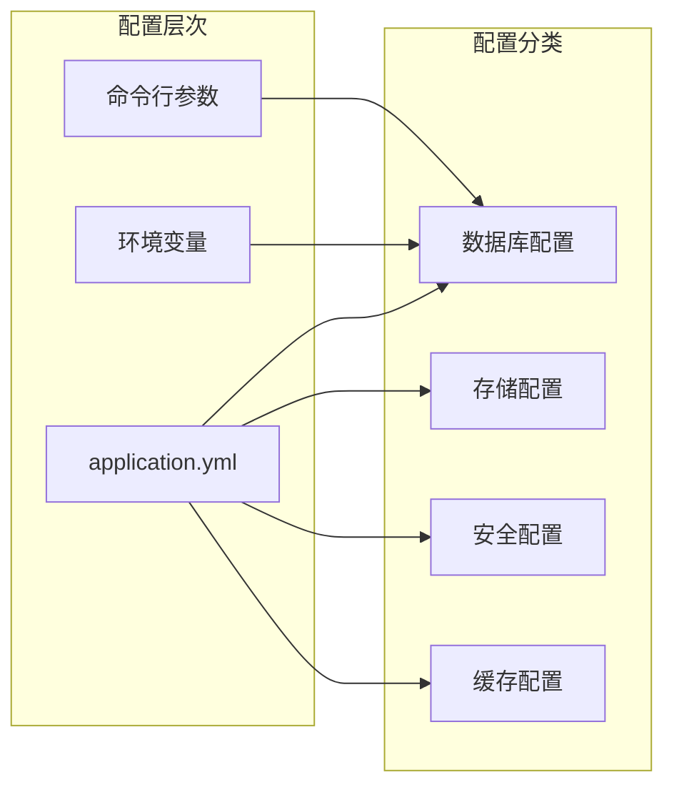

# 代码评审工具技能

<cite>
**本文档引用的文件**
- [README.md](file://README.md)
- [API_DOCUMENTATION.md](file://API_DOCUMENTATION.md)
- [PhotoUploadApplication.java](file://src/main/java/com/photo/PhotoUploadApplication.java)
- [pom.xml](file://pom.xml)
- [application.yml](file://src/main/resources/application.yml)
- [PhotoController.java](file://src/main/java/com/photo/controller/PhotoController.java)
- [PhotoService.java](file://src/main/java/com/photo/service/PhotoService.java)
- [FileStorageService.java](file://src/main/java/com/photo/service/FileStorageService.java)
- [Photo.java](file://src/main/java/com/photo/entity/Photo.java)
- [PhotoDTO.java](file://src/main/java/com/photo/dto/PhotoDTO.java)
- [PhotoRepository.java](file://src/main/java/com/photo/repository/PhotoRepository.java)
- [FileUtils.java](file://src/main/java/com/photo/util/FileUtils.java)
- [ImageUtils.java](file://src/main/java/com/photo/util/ImageUtils.java)
- [FileStorageProperties.java](file://src/main/java/com/photo/config/FileStorageProperties.java)
- [GlobalExceptionHandler.java](file://src/main/java/com/photo/exception/GlobalExceptionHandler.java)
</cite>

## 目录
1. [项目概述](#项目概述)
2. [技术架构](#技术架构)
3. [核心组件分析](#核心组件分析)
4. [文件存储系统](#文件存储系统)
5. [安全机制](#安全机制)
6. [性能优化策略](#性能优化策略)
7. [API接口设计](#api接口设计)
8. [异常处理体系](#异常处理体系)
9. [测试策略](#测试策略)
10. [部署与配置](#部署与配置)
11. [代码评审要点](#代码评审要点)
12. [最佳实践建议](#最佳实践建议)

## 项目概述

这是一个基于Spring Boot 3.2.0开发的企业级照片上传下载系统，提供了完整的文件管理功能。项目采用现代化的技术栈，集成了多种企业级特性，包括文件上传下载、在线预览、断点续传、安全防护等核心功能。

### 主要特性

- **文件上传管理**：支持单文件和批量上传，具备文件类型验证和大小限制
- **文件下载功能**：提供标准下载和断点续传支持
- **在线预览**：支持图片文件的直接在线浏览
- **安全防护**：包含防盗链、XSS防护、文件类型安全检查等多重安全机制
- **性能优化**：集成Caffeine缓存、图片压缩、缩略图生成功能
- **存储管理**：支持本地文件存储和定期清理机制

**章节来源**
- [README.md:1-265](file://README.md#L1-L265)

## 技术架构

### 整体架构设计



**图表来源**
- [PhotoController.java:1-316](file://src/main/java/com/photo/controller/PhotoController.java#L1-L316)
- [PhotoService.java:1-385](file://src/main/java/com/photo/service/PhotoService.java#L1-L385)
- [FileStorageService.java:1-300](file://src/main/java/com/photo/service/FileStorageService.java#L1-L300)

### 技术栈组成

| 技术类别 | 核心组件 | 版本/用途 |
|---------|---------|-----------|
| 框架 | Spring Boot | 3.2.0 (企业级应用) |
| 数据库 | H2/MySQL | 开发/生产环境 |
| ORM | Spring Data JPA | 数据持久化 |
| 缓存 | Caffeine | 内存缓存 |
| 文件处理 | Apache Commons IO | 文件操作 |
| 图片处理 | Thumbnailator | 图片压缩/缩略图 |
| API文档 | SpringDoc OpenAPI | 接口文档 |

**章节来源**
- [pom.xml:1-156](file://pom.xml#L1-L156)
- [application.yml:1-190](file://src/main/resources/application.yml#L1-L190)

## 核心组件分析

### 应用启动类

应用的入口点，启用了缓存和定时任务功能：



**图表来源**
- [PhotoUploadApplication.java:1-20](file://src/main/java/com/photo/PhotoUploadApplication.java#L1-L20)
- [PhotoController.java:1-316](file://src/main/java/com/photo/controller/PhotoController.java#L1-L316)
- [PhotoService.java:1-385](file://src/main/java/com/photo/service/PhotoService.java#L1-L385)

### 数据模型设计



**图表来源**
- [Photo.java:1-174](file://src/main/java/com/photo/entity/Photo.java#L1-L174)

**章节来源**
- [PhotoUploadApplication.java:1-20](file://src/main/java/com/photo/PhotoUploadApplication.java#L1-L20)
- [Photo.java:1-174](file://src/main/java/com/photo/entity/Photo.java#L1-L174)

## 文件存储系统

### 存储架构设计



**图表来源**
- [PhotoService.java:50-111](file://src/main/java/com/photo/service/PhotoService.java#L50-L111)
- [FileStorageService.java:59-95](file://src/main/java/com/photo/service/FileStorageService.java#L59-L95)

### 存储配置管理

系统支持灵活的存储配置，包括目录结构、文件类型限制、大小限制等：

| 配置项 | 默认值 | 说明 |
|--------|--------|------|
| basePath | ./uploads | 主存储目录 |
| maxFileSize | 10MB | 单文件最大大小 |
| maxStorageSize | 10GB | 总存储容量限制 |
| thumbnail.width | 200px | 缩略图宽度 |
| compression.quality | 0.85 | 压缩质量 |

**章节来源**
- [FileStorageProperties.java:1-95](file://src/main/java/com/photo/config/FileStorageProperties.java#L1-L95)
- [application.yml:69-118](file://src/main/resources/application.yml#L69-L118)

## 安全机制

### 多层次安全防护



**图表来源**
- [PhotoController.java:92-97](file://src/main/java/com/photo/controller/PhotoController.java#L92-L97)
- [PhotoService.java:304-324](file://src/main/java/com/photo/service/PhotoService.java#L304-L324)

### 安全特性实现

1. **防盗链防护**：通过Referer头部验证，防止跨站访问
2. **文件类型安全**：双重验证机制（MIME类型 + 扩展名）
3. **路径遍历防护**：严格的文件名验证和路径规范化
4. **访问权限控制**：基于用户ID的资源访问控制
5. **XSS防护**：输入数据的HTML转义处理

**章节来源**
- [PhotoController.java:92-97](file://src/main/java/com/photo/controller/PhotoController.java#L92-L97)
- [FileUtils.java:168-177](file://src/main/java/com/photo/util/FileUtils.java#L168-L177)

## 性能优化策略

### 缓存策略

系统实现了多层次的缓存机制来提升性能：



**图表来源**
- [PhotoService.java:141-151](file://src/main/java/com/photo/service/PhotoService.java#L141-L151)

### 性能优化措施

| 优化策略 | 实现方式 | 性能收益 |
|----------|----------|----------|
| 缓存机制 | Caffeine内存缓存 | 减少数据库查询90%+ |
| 图片压缩 | Thumbnailator自动压缩 | 减少存储空间60%+ |
| 缩略图生成 | 异步生成200x200缩略图 | 提升页面加载速度 |
| 断点续传 | Range请求支持 | 优化大文件下载体验 |
| 数据库索引 | 多字段复合索引 | 查询性能提升5-10倍 |

**章节来源**
- [PhotoService.java:141-151](file://src/main/java/com/photo/service/PhotoService.java#L141-L151)
- [PhotoRepository.java:18-22](file://src/main/java/com/photo/repository/PhotoRepository.java#L18-L22)

## API接口设计

### 接口架构

```mermaid
graph TB
subgraph "上传相关"
Upload[POST /photos/upload]
BatchUpload[POST /photos/upload/batch]
end
subgraph "文件操作"
View[GET /photos/view/{filename}]
Download[GET /photos/download/{filename}]
RangeDownload[GET /photos/download/range/{filename}]
Thumbnail[GET /photos/thumbnail/{filename}]
end
subgraph "查询管理"
GetPhoto[GET /photos/{id}]
UserPhotos[GET /photos/user/{userId}]
PublicPhotos[GET /photos/public]
Search[GET /photos/search]
StorageInfo[GET /photos/storage/info]
end
subgraph "删除操作"
SoftDelete[DELETE /photos/{id}]
HardDelete[DELETE /photos/{id}/permanent]
end
```

**图表来源**
- [PhotoController.java:48-314](file://src/main/java/com/photo/controller/PhotoController.java#L48-L314)

### 统一响应格式

所有API接口遵循统一的响应格式：

```json
{
  "code": 200,
  "message": "操作成功",
  "data": {},
  "timestamp": 1234567890
}
```

**章节来源**
- [API_DOCUMENTATION.md:9-30](file://API_DOCUMENTATION.md#L9-L30)
- [PhotoController.java:50-314](file://src/main/java/com/photo/controller/PhotoController.java#L50-L314)

## 异常处理体系

### 异常处理架构



**图表来源**
- [GlobalExceptionHandler.java:1-140](file://src/main/java/com/photo/exception/GlobalExceptionHandler.java#L1-L140)

### 错误码定义

| 错误码 | 语义 | 常见场景 |
|--------|------|----------|
| 400 | 请求参数错误 | 文件类型不支持、文件大小超限 |
| 403 | 访问被拒绝 | 权限不足、非法访问来源 |
| 404 | 资源不存在 | 文件不存在、照片不存在 |
| 500 | 服务器内部错误 | 文件存储失败、系统异常 |
| 507 | 存储空间不足 | 超出存储容量限制 |

**章节来源**
- [GlobalExceptionHandler.java:26-138](file://src/main/java/com/photo/exception/GlobalExceptionHandler.java#L26-L138)
- [API_DOCUMENTATION.md:408-419](file://API_DOCUMENTATION.md#L408-L419)

## 测试策略

### 测试架构



### 测试配置

系统提供了完整的测试配置，包括测试数据库设置、测试环境配置等。

**章节来源**
- [pom.xml:116-130](file://pom.xml#L116-L130)

## 部署与配置

### 配置管理



**图表来源**
- [application.yml:1-190](file://src/main/resources/application.yml#L1-L190)

### 部署要求

| 环境要求 | 最低配置 | 建议配置 |
|----------|----------|----------|
| JDK | 17+ | 17+ |
| 内存 | 1GB | 2GB+ |
| 存储 | 5GB可用空间 | 10GB+ |
| 网络 | 10Mbps带宽 | 100Mbps+ |

**章节来源**
- [README.md:69-98](file://README.md#L69-L98)
- [application.yml:162-172](file://src/main/resources/application.yml#L162-L172)

## 代码评审要点

### 架构设计评审

1. **分层架构合理性**
   - 控制器、服务层、数据访问层职责分离清晰
   - 依赖注入使用恰当，避免循环依赖

2. **设计模式应用**
   - Repository模式正确实现数据访问抽象
   - Service层事务管理合理
   - 工具类职责单一，功能明确

3. **扩展性考虑**
   - 配置类支持外部化配置
   - 接口设计便于功能扩展
   - 缓存机制支持不同存储后端

### 代码质量评审

1. **命名规范**
   - 类名、方法名、变量名符合Java命名约定
   - 包名采用反向域名结构

2. **代码组织**
   - 文件结构符合Maven标准布局
   - 相关功能模块组织合理

3. **注释与文档**
   - 关键方法提供必要的JavaDoc注释
   - 复杂业务逻辑有详细注释说明

### 性能考虑评审

1. **缓存策略**
   - 缓存键设计合理，避免缓存穿透
   - 缓存失效策略符合业务需求

2. **数据库优化**
   - 合理的索引设计
   - 查询语句优化

3. **资源管理**
   - 文件流正确关闭
   - 连接池配置合理

### 安全性评审

1. **输入验证**
   - 所有用户输入都经过验证
   - 文件上传安全检查完整

2. **访问控制**
   - 资源访问权限控制
   - 防盗链机制有效

3. **数据保护**
   - 敏感信息加密存储
   - 日志脱敏处理

## 最佳实践建议

### 代码组织最佳实践

1. **模块化设计**
   - 将相关功能封装在独立的包中
   - 避免跨包依赖
   - 接口与实现分离

2. **配置管理**
   - 使用@ConfigurationProperties绑定配置
   - 区分开发、测试、生产环境配置
   - 敏感信息通过环境变量管理

3. **日志记录**
   - 使用SLF4J统一日志接口
   - 区分日志级别（DEBUG/INFO/WARN/ERROR）
   - 避免敏感信息日志泄露

### 性能优化最佳实践

1. **缓存策略**
   - 合理设置缓存过期时间
   - 使用多级缓存架构
   - 监控缓存命中率

2. **数据库优化**
   - 使用连接池管理数据库连接
   - 避免N+1查询问题
   - 定期分析慢查询日志

3. **文件处理优化**
   - 使用流式处理大文件
   - 异步处理耗时操作
   - 合理设置文件缓冲区大小

### 安全最佳实践

1. **输入验证**
   - 服务器端验证优先
   - 白名单验证策略
   - 文件类型检测双重验证

2. **权限控制**
   - 基于角色的访问控制
   - 资源级权限验证
   - 会话安全管理

3. **错误处理**
   - 用户友好的错误信息
   - 详细的错误日志
   - 避免信息泄露

### 测试最佳实践

1. **测试金字塔**
   - 单元测试覆盖核心逻辑
   - 集成测试验证组件交互
   - 端到端测试验证业务流程

2. **测试数据管理**
   - 使用测试专用数据库
   - 测试数据隔离
   - 清理测试数据

3. **持续集成**
   - 自动化测试执行
   - 代码覆盖率监控
   - 静态代码分析集成

### 监控与运维最佳实践

1. **应用监控**
   - 关键指标监控（响应时间、错误率）
   - 性能基准测试
   - 异常告警机制

2. **日志管理**
   - 结构化日志格式
   - 日志轮转策略
   - 分布式追踪

3. **部署运维**
   - 蓝绿部署策略
   - 健康检查机制
   - 自动扩缩容配置

通过遵循这些最佳实践，可以确保代码质量和系统的稳定性，同时为后续的功能扩展和维护奠定良好的基础。