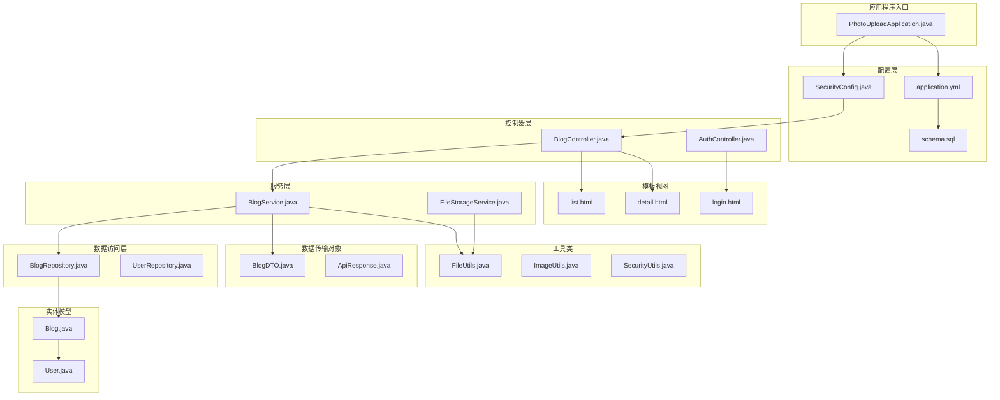
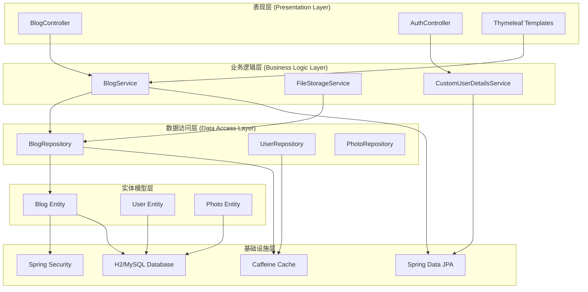
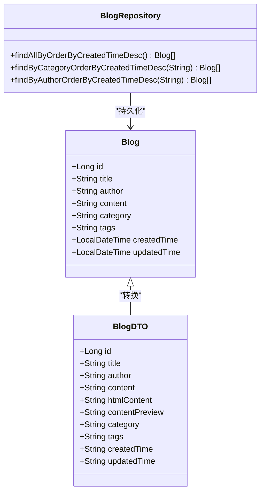
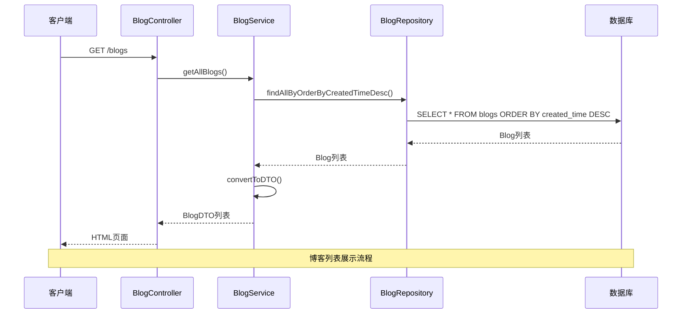
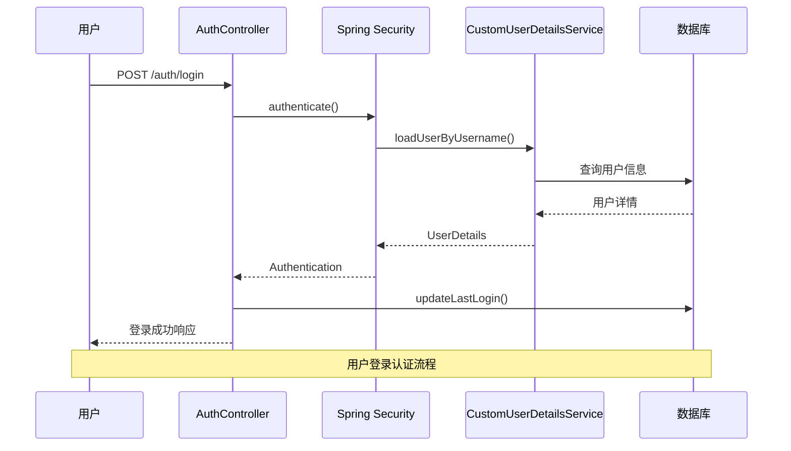
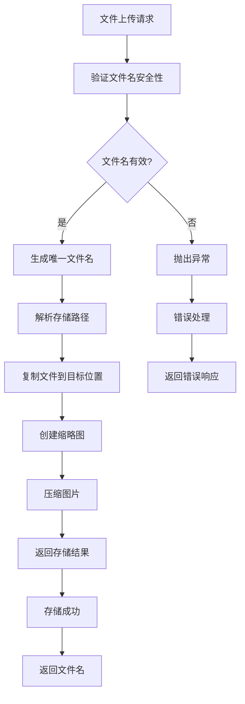
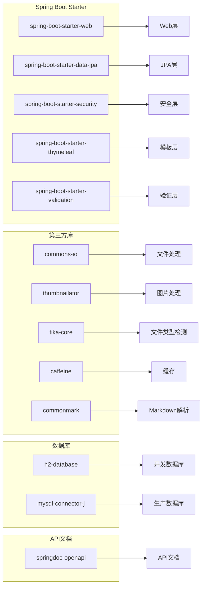

# 博客管理系统

<cite>
**本文档引用的文件**
- [README.md](file://README.md)
- [pom.xml](file://pom.xml)
- [application.yml](file://src/main/resources/application.yml)
- [PhotoUploadApplication.java](file://src/main/java/com/photo/PhotoUploadApplication.java)
- [BlogController.java](file://src/main/java/com/photo/controller/BlogController.java)
- [BlogService.java](file://src/main/java/com/photo/service/BlogService.java)
- [BlogRepository.java](file://src/main/java/com/photo/repository/BlogRepository.java)
- [Blog.java](file://src/main/java/com/photo/entity/Blog.java)
- [BlogDTO.java](file://src/main/java/com/photo/dto/BlogDTO.java)
- [SecurityConfig.java](file://src/main/java/com/photo/config/SecurityConfig.java)
- [AuthController.java](file://src/main/java/com/photo/controller/AuthController.java)
- [FileStorageService.java](file://src/main/java/com/photo/service/FileStorageService.java)
- [FileUtils.java](file://src/main/java/com/photo/util/FileUtils.java)
- [schema.sql](file://src/main/resources/schema.sql)
- [list.html](file://src/main/resources/templates/blog/list.html)
- [detail.html](file://src/main/resources/templates/blog/detail.html)
</cite>

## 目录
1. [项目简介](#项目简介)
2. [项目结构](#项目结构)
3. [核心组件](#核心组件)
4. [架构概览](#架构概览)
5. [详细组件分析](#详细组件分析)
6. [依赖关系分析](#依赖关系分析)
7. [性能考虑](#性能考虑)
8. [故障排除指南](#故障排除指南)
9. [结论](#结论)

## 项目简介

博客管理系统是一个基于Spring Boot 3.2.0开发的企业级博客管理平台。该系统提供了完整的博客管理功能，包括博客的创建、编辑、删除、分类管理和标签系统。系统采用现代化的赛博朋克设计风格，支持Markdown格式的内容编辑和实时预览。

### 主要功能特性

- **博客管理**: 支持博客的CRUD操作，包括标题、作者、内容、分类和标签管理
- **Markdown支持**: 完整的Markdown语法支持，实时内容渲染
- **分类系统**: 基于分类和作者的博客过滤功能
- **用户认证**: Spring Security集成，支持用户登录和权限控制
- **模板引擎**: Thymeleaf模板引擎，提供动态页面渲染
- **数据库集成**: Spring Data JPA，支持H2和MySQL数据库
- **静态资源**: 赛博朋克风格的CSS样式和JavaScript交互

**章节来源**
- [README.md](file://README.md#L1-L265)
- [application.yml](file://src/main/resources/application.yml#L1-L190)

## 项目结构

项目采用标准的Spring Boot多模块结构，按照功能层次进行组织：

**图表来源**
- [PhotoUploadApplication.java](file://src/main/java/com/photo/PhotoUploadApplication.java#L1-L20)
- [SecurityConfig.java](file://src/main/java/com/photo/config/SecurityConfig.java#L1-L99)
- [BlogController.java](file://src/main/java/com/photo/controller/BlogController.java#L1-L173)

**章节来源**
- [pom.xml](file://pom.xml#L1-L169)
- [PhotoUploadApplication.java](file://src/main/java/com/photo/PhotoUploadApplication.java#L1-L20)

## 核心组件

### 应用程序入口

应用程序的启动类位于`PhotoUploadApplication.java`，启用了缓存和定时任务功能，作为整个系统的入口点。

### 控制器层

系统包含两个主要的控制器：
- **BlogController**: 处理博客相关的HTTP请求，提供博客列表、详情、创建、更新和删除功能
- **AuthController**: 处理用户认证相关请求，包括登录、注销和用户注册

### 服务层

- **BlogService**: 提供博客业务逻辑，包括Markdown内容渲染、内容摘要生成和数据库操作
- **FileStorageService**: 处理文件存储相关的业务逻辑，支持文件上传、下载和管理

### 数据访问层

- **BlogRepository**: 继承JpaRepository，提供博客数据的CRUD操作和自定义查询方法
- **UserRepository**: 处理用户数据的访问和管理

**章节来源**
- [BlogController.java](file://src/main/java/com/photo/controller/BlogController.java#L1-L173)
- [BlogService.java](file://src/main/java/com/photo/service/BlogService.java#L1-L212)
- [BlogRepository.java](file://src/main/java/com/photo/repository/BlogRepository.java#L1-L36)

## 架构概览

系统采用经典的三层架构模式，结合Spring Boot的自动配置特性：

**图表来源**
- [SecurityConfig.java](file://src/main/java/com/photo/config/SecurityConfig.java#L1-L99)
- [BlogService.java](file://src/main/java/com/photo/service/BlogService.java#L1-L212)
- [BlogRepository.java](file://src/main/java/com/photo/repository/BlogRepository.java#L1-L36)

## 详细组件分析

### 博客实体模型

博客实体类定义了博客文章的核心属性和数据库映射关系：

**图表来源**
- [Blog.java](file://src/main/java/com/photo/entity/Blog.java#L1-L77)
- [BlogDTO.java](file://src/main/java/com/photo/dto/BlogDTO.java#L1-L68)
- [BlogRepository.java](file://src/main/java/com/photo/repository/BlogRepository.java#L1-L36)

### 博客服务层

BlogService类提供了完整的博客业务逻辑实现：

**图表来源**
- [BlogController.java](file://src/main/java/com/photo/controller/BlogController.java#L30-L51)
- [BlogService.java](file://src/main/java/com/photo/service/BlogService.java#L36-L42)
- [BlogRepository.java](file://src/main/java/com/photo/repository/BlogRepository.java#L20)

### 认证与授权

系统集成了Spring Security提供用户认证和授权功能：

**图表来源**
- [AuthController.java](file://src/main/java/com/photo/controller/AuthController.java#L47-L80)
- [SecurityConfig.java](file://src/main/java/com/photo/config/SecurityConfig.java#L37-L58)

### 文件存储服务

FileStorageService类处理文件的存储、检索和管理：

**图表来源**
- [FileStorageService.java](file://src/main/java/com/photo/service/FileStorageService.java#L59-L95)
- [FileUtils.java](file://src/main/java/com/photo/util/FileUtils.java#L41-L44)

**章节来源**
- [Blog.java](file://src/main/java/com/photo/entity/Blog.java#L1-L77)
- [BlogService.java](file://src/main/java/com/photo/service/BlogService.java#L1-L212)
- [AuthController.java](file://src/main/java/com/photo/controller/AuthController.java#L1-L111)

## 依赖关系分析

系统使用Maven进行依赖管理，核心依赖包括：

**图表来源**
- [pom.xml](file://pom.xml#L30-L149)

**章节来源**
- [pom.xml](file://pom.xml#L1-L169)

## 性能考虑

系统在多个层面进行了性能优化：

### 缓存策略
- 使用Caffeine本地缓存，配置最大1000个条目，过期时间为3600秒
- 支持定时任务清理过期缓存

### 数据库优化
- 为博客表创建了`created_time`和`author`索引
- 使用H2数据库进行开发，支持MySQL迁移

### 文件处理优化
- 图片压缩功能，支持最大1920x1080像素和85%质量
- 缩略图自动生成，尺寸为200x200像素
- 支持断点续传下载

### 安全配置
- 启用CORS跨域资源共享
- 防盗链配置，限制Referer域名
- Spring Security集成，提供认证和授权

**章节来源**
- [application.yml](file://src/main/resources/application.yml#L50-L118)
- [SecurityConfig.java](file://src/main/java/com/photo/config/SecurityConfig.java#L79-L92)

## 故障排除指南

### 常见问题及解决方案

#### 数据库连接问题
- **症状**: 应用启动时报数据库连接错误
- **原因**: 数据库配置不正确或数据库服务未启动
- **解决**: 检查`application.yml`中的数据库连接配置

#### 文件存储问题
- **症状**: 文件上传失败或存储目录创建失败
- **原因**: 存储权限不足或磁盘空间不足
- **解决**: 确认存储目录权限和磁盘空间

#### 认证失败
- **症状**: 用户登录失败
- **原因**: 用户名或密码错误，或用户未激活
- **解决**: 检查用户凭证和数据库中的用户状态

#### 模板渲染错误
- **症状**: 页面显示异常或模板加载失败
- **原因**: Thymeleaf模板文件缺失或语法错误
- **解决**: 检查模板文件完整性和语法正确性

**章节来源**
- [schema.sql](file://src/main/resources/schema.sql#L1-L144)
- [FileStorageService.java](file://src/main/java/com/photo/service/FileStorageService.java#L36-L54)

## 结论

博客管理系统是一个功能完整、架构清晰的企业级应用。系统采用了现代的Spring Boot技术栈，实现了良好的分层架构和模块化设计。主要特点包括：

1. **完整的博客管理功能**: 支持博客的全生命周期管理
2. **现代化的技术栈**: 基于Spring Boot 3.2.0，集成多种企业级特性
3. **优秀的用户体验**: 赛博朋克风格的设计和Markdown编辑支持
4. **完善的错误处理**: 全局异常处理和详细的日志记录
5. **可扩展的架构**: 清晰的分层设计便于功能扩展

系统适合中小型团队的博客管理需求，也为企业级应用提供了良好的基础架构。通过合理的配置和扩展，可以满足更复杂的功能需求。