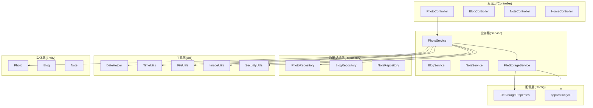
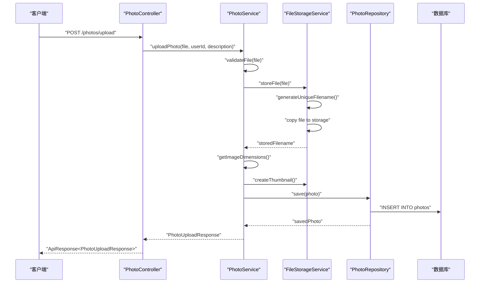
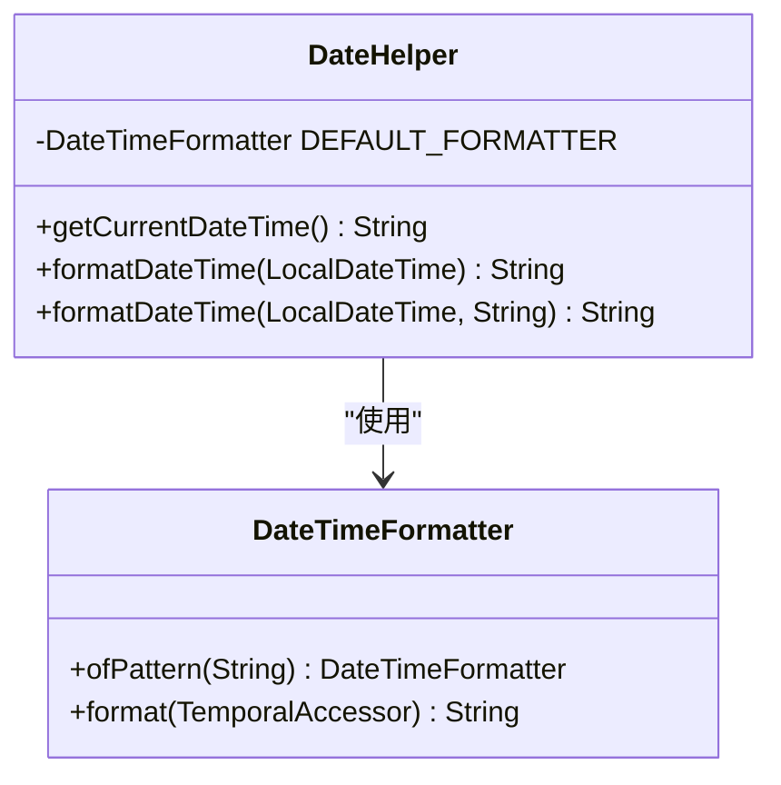
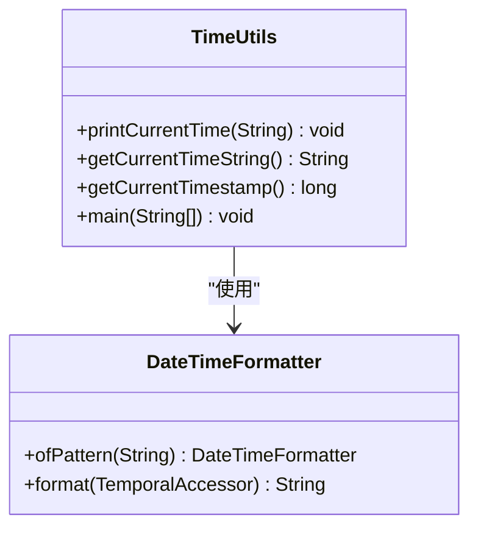
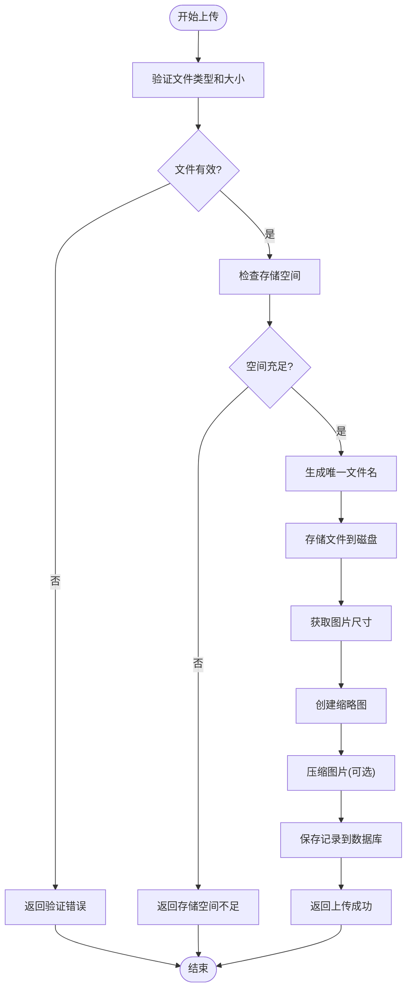
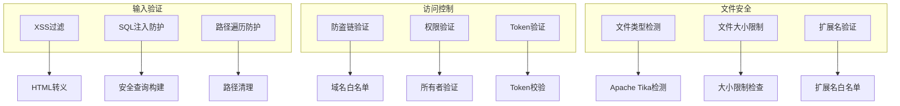
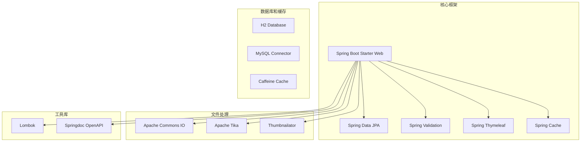

# 日期助手工具

<cite>
**本文档引用的文件**
- [DateHelper.java](file://src/main/java/com/photo/util/DateHelper.java)
- [TimeUtils.java](file://src/main/java/com/photo/TimeUtils.java)
- [README.md](file://README.md)
- [API_DOCUMENTATION.md](file://API_DOCUMENTATION.md)
- [application.yml](file://src/main/resources/application.yml)
- [FileUtils.java](file://src/main/java/com/photo/util/FileUtils.java)
- [ImageUtils.java](file://src/main/java/com/photo/util/ImageUtils.java)
- [SecurityUtils.java](file://src/main/java/com/photo/util/SecurityUtils.java)
- [PhotoController.java](file://src/main/java/com/photo/controller/PhotoController.java)
- [PhotoService.java](file://src/main/java/com/photo/service/PhotoService.java)
- [FileStorageService.java](file://src/main/java/com/photo/service/FileStorageService.java)
- [Photo.java](file://src/main/java/com/photo/entity/Photo.java)
- [FileStorageProperties.java](file://src/main/java/com/photo/config/FileStorageProperties.java)
- [PhotoUploadResponse.java](file://src/main/java/com/photo/dto/PhotoUploadResponse.java)
- [GlobalExceptionHandler.java](file://src/main/java/com/photo/exception/GlobalExceptionHandler.java)
- [pom.xml](file://pom.xml)
</cite>

## 目录
1. [项目简介](#项目简介)
2. [项目结构](#项目结构)
3. [核心组件](#核心组件)
4. [架构概览](#架构概览)
5. [详细组件分析](#详细组件分析)
6. [依赖关系分析](#依赖关系分析)
7. [性能考虑](#性能考虑)
8. [故障排除指南](#故障排除指南)
9. [结论](#结论)

## 项目简介

这是一个基于Spring Boot 3.2.0开发的企业级照片上传下载系统，提供完整的文件管理功能。虽然项目名称为"照片上传下载系统"，但其中包含了专门的日期助手工具模块。

该项目的核心功能包括：
- 照片上传和下载管理
- 在线预览和缩略图生成
- 断点续传支持
- 文件类型验证和安全防护
- 存储空间管理和定期清理
- 统一的API响应格式

## 项目结构

项目采用标准的Spring Boot三层架构设计，主要分为以下层次：

**图表来源**
- [PhotoController.java:1-316](file://src/main/java/com/photo/controller/PhotoController.java#L1-L316)
- [PhotoService.java:1-385](file://src/main/java/com/photo/service/PhotoService.java#L1-L385)
- [FileStorageService.java:1-300](file://src/main/java/com/photo/service/FileStorageService.java#L1-L300)
- [DateHelper.java:1-51](file://src/main/java/com/photo/util/DateHelper.java#L1-L51)
- [TimeUtils.java:1-62](file://src/main/java/com/photo/TimeUtils.java#L1-L62)

**章节来源**
- [README.md:214-252](file://README.md#L214-L252)
- [PhotoController.java:1-316](file://src/main/java/com/photo/controller/PhotoController.java#L1-L316)

## 核心组件

### 日期助手工具模块

项目中的日期助手工具主要包含两个核心类：

#### DateHelper - 日期格式化工具
- 提供默认日期时间格式化功能
- 支持自定义格式模式
- 使用Java 8的LocalDateTime和DateTimeFormatter

#### TimeUtils - 时间工具类
- 提供当前时间打印功能
- 支持自定义时间格式
- 包含时间戳获取功能

### 文件管理核心组件

#### PhotoController - 照片管理控制器
- 处理所有照片相关的HTTP请求
- 实现RESTful API接口
- 集成安全验证和性能优化

#### PhotoService - 照片业务逻辑
- 处理照片上传、下载、删除等业务逻辑
- 集成文件存储和图片处理功能
- 实现缓存和定时清理任务

#### FileStorageService - 文件存储服务
- 提供底层文件操作功能
- 支持文件读取、写入、删除
- 实现断点续传和范围读取

**章节来源**
- [DateHelper.java:1-51](file://src/main/java/com/photo/util/DateHelper.java#L1-L51)
- [TimeUtils.java:1-62](file://src/main/java/com/photo/TimeUtils.java#L1-L62)
- [PhotoController.java:1-316](file://src/main/java/com/photo/controller/PhotoController.java#L1-L316)
- [PhotoService.java:1-385](file://src/main/java/com/photo/service/PhotoService.java#L1-L385)
- [FileStorageService.java:1-300](file://src/main/java/com/photo/service/FileStorageService.java#L1-L300)

## 架构概览

系统采用分层架构设计，各层职责明确，耦合度低：

**图表来源**
- [PhotoController.java:48-61](file://src/main/java/com/photo/controller/PhotoController.java#L48-L61)
- [PhotoService.java:50-111](file://src/main/java/com/photo/service/PhotoService.java#L50-L111)
- [FileStorageService.java:59-95](file://src/main/java/com/photo/service/FileStorageService.java#L59-L95)

**章节来源**
- [PhotoController.java:1-316](file://src/main/java/com/photo/controller/PhotoController.java#L1-L316)
- [PhotoService.java:1-385](file://src/main/java/com/photo/service/PhotoService.java#L1-L385)

## 详细组件分析

### DateHelper 日期工具类分析

DateHelper类提供了完整的日期时间处理功能：

**图表来源**
- [DateHelper.java:10-50](file://src/main/java/com/photo/util/DateHelper.java#L10-L50)

#### 核心功能特性
- **默认格式化**: 使用"yyyy-MM-dd HH:mm:ss"格式
- **空值处理**: 对null参数进行安全检查
- **灵活定制**: 支持自定义格式模式
- **线程安全**: 使用静态final格式化器

#### 使用场景
- 日志记录时间戳
- 数据库时间字段存储
- API响应时间格式化

**章节来源**
- [DateHelper.java:1-51](file://src/main/java/com/photo/util/DateHelper.java#L1-L51)

### TimeUtils 时间工具类分析

TimeUtils类专注于时间输出和格式化：

**图表来源**
- [TimeUtils.java:10-62](file://src/main/java/com/photo/TimeUtils.java#L10-L62)

#### 核心功能特性
- **多种格式支持**: 支持中文和英文格式
- **时间戳获取**: 提供毫秒级时间戳
- **演示功能**: 包含完整的使用示例
- **实用工具**: 适合调试和测试场景

**章节来源**
- [TimeUtils.java:1-62](file://src/main/java/com/photo/TimeUtils.java#L1-L62)

### 文件上传处理流程

**图表来源**
- [PhotoService.java:50-111](file://src/main/java/com/photo/service/PhotoService.java#L50-L111)
- [FileStorageService.java:59-95](file://src/main/java/com/photo/service/FileStorageService.java#L59-L95)

**章节来源**
- [PhotoService.java:1-385](file://src/main/java/com/photo/service/PhotoService.java#L1-L385)
- [FileStorageService.java:1-300](file://src/main/java/com/photo/service/FileStorageService.java#L1-L300)

### 安全防护机制

系统实现了多层次的安全防护：

**图表来源**
- [SecurityUtils.java:15-167](file://src/main/java/com/photo/util/SecurityUtils.java#L15-L167)
- [FileUtils.java:19-178](file://src/main/java/com/photo/util/FileUtils.java#L19-L178)

**章节来源**
- [SecurityUtils.java:1-167](file://src/main/java/com/photo/util/SecurityUtils.java#L1-L167)
- [FileUtils.java:1-178](file://src/main/java/com/photo/util/FileUtils.java#L1-L178)

## 依赖关系分析

项目使用Maven进行依赖管理，主要依赖包括：

**图表来源**
- [pom.xml:30-137](file://pom.xml#L30-L137)

**章节来源**
- [pom.xml:1-156](file://pom.xml#L1-L156)

## 性能考虑

### 缓存策略
- **Caffeine缓存**: 使用本地缓存提高查询性能
- **图片缓存**: 缩略图和原图的智能缓存
- **配置缓存**: 存储配置的动态缓存

### 文件处理优化
- **异步处理**: 大文件上传的异步处理
- **内存管理**: 合理的内存使用和垃圾回收
- **并发控制**: 线程安全的文件操作

### 网络优化
- **压缩传输**: Gzip压缩减少带宽使用
- **CDN支持**: 缩略图和静态资源的CDN加速
- **连接池**: 数据库连接池优化

## 故障排除指南

### 常见问题及解决方案

#### 文件上传失败
**问题症状**: 上传过程中出现500错误
**可能原因**:
- 存储空间不足
- 文件类型不支持
- 权限问题

**解决步骤**:
1. 检查存储空间使用情况
2. 验证文件类型和大小限制
3. 确认文件权限设置

#### 下载失败
**问题症状**: 下载文件时出现404错误
**可能原因**:
- 文件已被删除
- 文件名错误
- 权限不足

**解决步骤**:
1. 检查文件是否存在
2. 验证文件访问权限
3. 确认文件路径正确性

#### 性能问题
**问题症状**: 系统响应缓慢
**可能原因**:
- 缓存未命中
- 数据库查询慢
- 磁盘I/O瓶颈

**解决步骤**:
1. 检查缓存配置
2. 分析数据库查询
3. 监控系统资源使用

**章节来源**
- [GlobalExceptionHandler.java:1-140](file://src/main/java/com/photo/exception/GlobalExceptionHandler.java#L1-L140)
- [PhotoService.java:276-299](file://src/main/java/com/photo/service/PhotoService.java#L276-L299)

## 结论

这个日期助手工具项目展现了现代Java企业级应用的最佳实践：

### 主要优势
- **架构清晰**: 采用标准的分层架构设计
- **功能完整**: 提供了从日期处理到文件管理的完整解决方案
- **安全可靠**: 实现了多层次的安全防护机制
- **性能优化**: 通过缓存和异步处理提升系统性能
- **易于维护**: 清晰的代码结构和完善的异常处理

### 技术亮点
- **日期处理**: 简洁高效的日期格式化工具
- **文件管理**: 完整的文件上传下载解决方案
- **安全防护**: 全面的安全验证和防护机制
- **性能优化**: 多层次的性能优化策略

### 改进建议
- 可以考虑引入分布式缓存方案
- 增加更多的监控和日志功能
- 考虑支持云存储服务
- 增强API的版本管理

这个项目为类似的企业级应用开发提供了很好的参考模板，展示了如何在保证功能完整性的同时，确保系统的安全性、性能和可维护性。