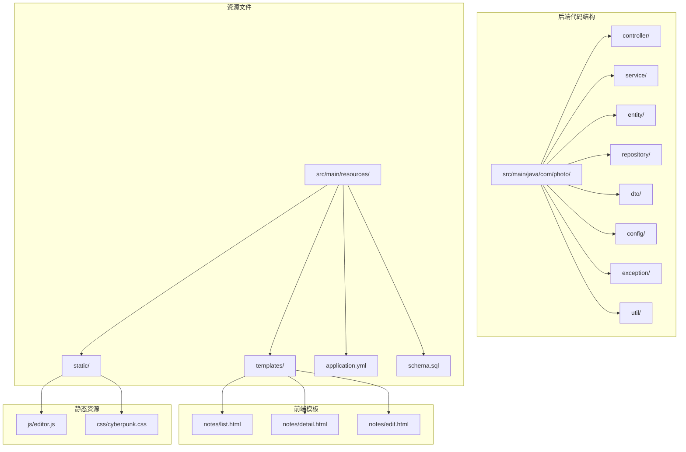
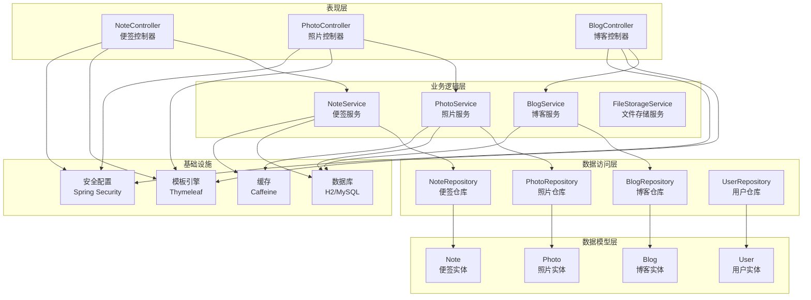
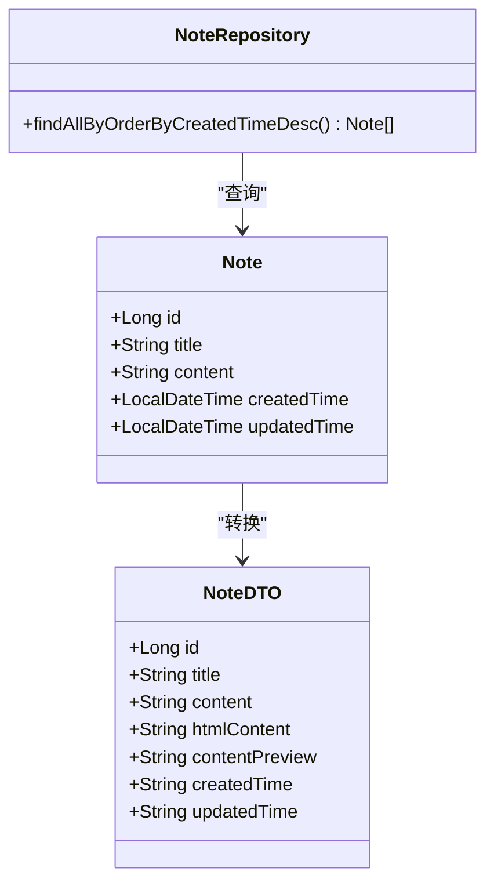
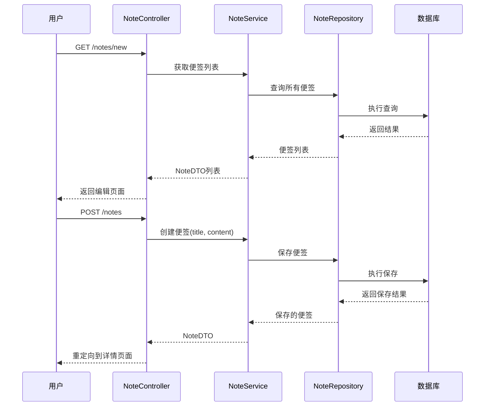
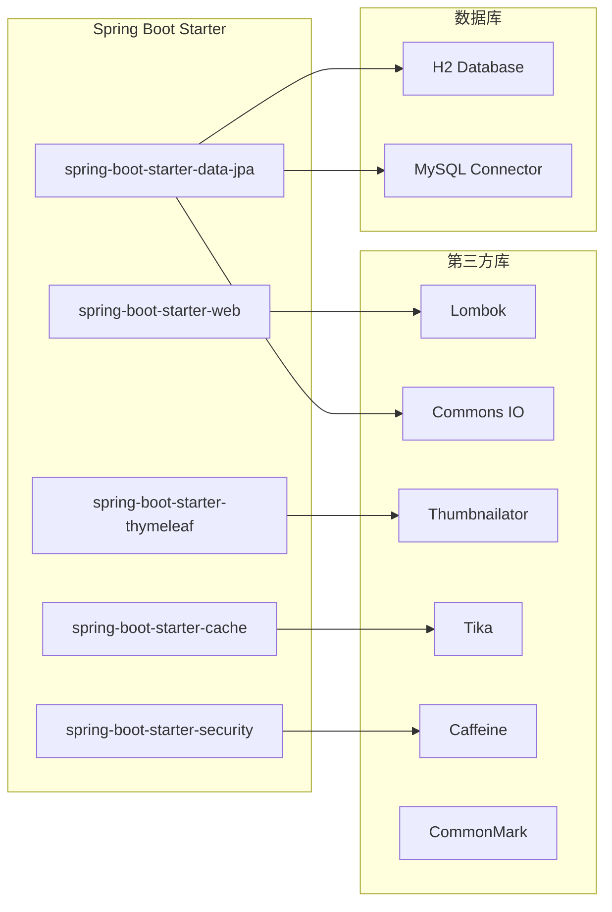

# 笔记管理系统

<cite>
**本文档引用的文件**
- [PhotoUploadApplication.java](file://src/main/java/com/photo/PhotoUploadApplication.java)
- [NoteController.java](file://src/main/java/com/photo/controller/NoteController.java)
- [NoteService.java](file://src/main/java/com/photo/service/NoteService.java)
- [Note.java](file://src/main/java/com/photo/entity/Note.java)
- [NoteRepository.java](file://src/main/java/com/photo/repository/NoteRepository.java)
- [NoteDTO.java](file://src/main/java/com/photo/dto/NoteDTO.java)
- [application.yml](file://src/main/resources/application.yml)
- [list.html](file://src/main/resources/templates/notes/list.html)
- [editor.js](file://src/main/resources/static/js/editor.js)
- [cyberpunk.css](file://src/main/resources/static/css/cyberpunk.css)
- [pom.xml](file://pom.xml)
- [README.md](file://README.md)
- [NOTE_SYSTEM_README.md](file://NOTE_SYSTEM_README.md)
- [API_DOCUMENTATION.md](file://API_DOCUMENTATION.md)
</cite>

## 目录
1. [项目简介](#项目简介)
2. [项目结构](#项目结构)
3. [核心组件](#核心组件)
4. [架构概览](#架构概览)
5. [详细组件分析](#详细组件分析)
6. [依赖关系分析](#依赖关系分析)
7. [性能考虑](#性能考虑)
8. [故障排除指南](#故障排除指南)
9. [结论](#结论)

## 项目简介

这是一个基于Spring Boot开发的便签管理系统，采用了赛博朋克风格的设计理念。系统提供了完整的便签管理功能，包括创建、编辑、删除、查看便签，支持Markdown格式和实时预览。

### 主要特性

- **便签管理**：完整的CRUD操作，支持实时预览
- **Markdown支持**：完整的Markdown语法支持
- **赛博朋克风格**：霓虹色调、发光效果、暗色主题
- **快捷键支持**：Ctrl+S保存、Ctrl+B加粗、Ctrl+I斜体等
- **响应式设计**：适配桌面和移动设备
- **前后端分离**：后端Spring Boot + 前端原生JavaScript

## 项目结构



**图表来源**
- [PhotoUploadApplication.java](file://src/main/java/com/photo/PhotoUploadApplication.java#L1-L20)
- [NoteController.java](file://src/main/java/com/photo/controller/NoteController.java#L1-L162)

**章节来源**
- [PhotoUploadApplication.java](file://src/main/java/com/photo/PhotoUploadApplication.java#L1-L20)
- [pom.xml](file://pom.xml#L1-L169)

## 核心组件

### 应用入口类

应用的主入口类启用了缓存和定时任务功能，是整个Spring Boot应用的启动点。

### 控制器层

系统包含多个控制器，其中便签控制器负责处理便签相关的HTTP请求：

- **NoteController**：处理便签的CRUD操作和页面跳转
- **PhotoController**：处理照片上传下载相关操作
- **BlogController**：处理博客文章管理
- **AuthController**：处理用户认证
- **HomeController**：处理主页展示

### 服务层

服务层提供业务逻辑处理：

- **NoteService**：便签业务逻辑，包括Markdown渲染
- **PhotoService**：照片管理业务逻辑
- **BlogService**：博客业务逻辑
- **FileStorageService**：文件存储管理

### 数据访问层

使用Spring Data JPA简化数据库操作：

- **NoteRepository**：便签数据访问接口
- **PhotoRepository**：照片数据访问接口
- **BlogRepository**：博客数据访问接口
- **UserRepository**：用户数据访问接口

**章节来源**
- [NoteController.java](file://src/main/java/com/photo/controller/NoteController.java#L1-L162)
- [NoteService.java](file://src/main/java/com/photo/service/NoteService.java#L1-L171)
- [NoteRepository.java](file://src/main/java/com/photo/repository/NoteRepository.java#L1-L22)

## 架构概览



**图表来源**
- [NoteController.java](file://src/main/java/com/photo/controller/NoteController.java#L1-L162)
- [NoteService.java](file://src/main/java/com/photo/service/NoteService.java#L1-L171)
- [NoteRepository.java](file://src/main/java/com/photo/repository/NoteRepository.java#L1-L22)
- [Note.java](file://src/main/java/com/photo/entity/Note.java#L1-L58)

## 详细组件分析

### 便签实体模型

便签实体使用JPA注解定义，包含完整的字段映射和时间戳管理。



**图表来源**
- [Note.java](file://src/main/java/com/photo/entity/Note.java#L1-L58)
- [NoteDTO.java](file://src/main/java/com/photo/dto/NoteDTO.java#L1-L53)
- [NoteRepository.java](file://src/main/java/com/photo/repository/NoteRepository.java#L1-L22)

### 便签服务层

NoteService类实现了完整的业务逻辑，包括：

- 便签的创建、更新、删除
- Markdown内容的渲染和预览
- 数据库事务管理
- 时间格式化处理

**章节来源**
- [NoteService.java](file://src/main/java/com/photo/service/NoteService.java#L1-L171)

### 控制器层流程

便签控制器处理用户请求的完整流程：



**图表来源**
- [NoteController.java](file://src/main/java/com/photo/controller/NoteController.java#L1-L162)
- [NoteService.java](file://src/main/java/com/photo/service/NoteService.java#L1-L171)

### Markdown渲染机制

系统集成了CommonMark解析器，提供实时的Markdown预览功能：

```mermaid
flowchart TD
A[用户输入Markdown] --> B[前端监听输入变化]
B --> C[防抖处理(300ms)]
C --> D[调用/preview API]
D --> E[NoteService.renderMarkdown]
E --> F[CommonMark解析器]
F --> G[HTML渲染器]
G --> H[返回HTML内容]
H --> I[更新预览区域]
J[快捷键操作] --> K[insertMarkdown函数]
K --> L[在光标位置插入标记]
L --> M[触发预览更新]
```

**图表来源**
- [editor.js](file://src/main/resources/static/js/editor.js#L1-L207)
- [NoteService.java](file://src/main/java/com/photo/service/NoteService.java#L120-L132)

**章节来源**
- [editor.js](file://src/main/resources/static/js/editor.js#L1-L207)

### 前端界面设计

系统采用赛博朋克风格的CSS设计，包含：

- 霓虹色调配色方案
- 发光效果和阴影
- 响应式布局
- 动画效果

**章节来源**
- [cyberpunk.css](file://src/main/resources/static/css/cyberpunk.css#L1-L629)

## 依赖关系分析

### Maven依赖结构

系统使用Maven管理依赖，主要依赖包括：



**图表来源**
- [pom.xml](file://pom.xml#L30-L150)

### 配置文件分析

application.yml文件包含了完整的系统配置：

- **数据库配置**：H2开发环境和MySQL生产环境
- **文件上传配置**：大小限制、类型限制
- **缓存配置**：Caffeine缓存设置
- **安全配置**：防盗链、CORS、Token配置
- **Thymeleaf配置**：模板引擎设置

**章节来源**
- [application.yml](file://src/main/resources/application.yml#L1-L190)

## 性能考虑

### 缓存策略

系统使用Caffeine作为本地缓存，提升数据访问性能：

- **缓存配置**：最大1000个条目，写入后3600秒过期
- **适用场景**：便签列表、热门内容缓存
- **性能收益**：减少数据库查询压力

### 数据库优化

- **索引设计**：便签创建时间字段建立索引
- **查询优化**：按创建时间倒序查询
- **连接池**：Tomcat连接池配置

### 前端性能优化

- **防抖机制**：Markdown预览300ms防抖
- **响应式设计**：适配不同设备
- **CSS动画**：硬件加速的动画效果

## 故障排除指南

### 常见问题

1. **数据库连接问题**
   - 检查application.yml中的数据库配置
   - 确认数据库服务是否启动
   - 验证用户名和密码

2. **文件上传失败**
   - 检查文件大小限制(10MB)
   - 验证文件类型是否在允许列表中
   - 确认存储路径权限

3. **Markdown渲染错误**
   - 检查网络连接到/preview API
   - 验证Markdown语法格式
   - 查看浏览器控制台错误信息

### 日志配置

系统配置了详细的日志输出：

- **根日志级别**：INFO
- **应用包日志**：DEBUG
- **文件输出**：日志文件轮转，最大10MB，保留30天

**章节来源**
- [application.yml](file://src/main/resources/application.yml#L146-L160)

## 结论

这个便签管理系统展现了现代Web应用的最佳实践：

### 技术优势

- **清晰的分层架构**：MVC模式，职责分离明确
- **现代化技术栈**：Spring Boot + Thymeleaf + 原生JavaScript
- **优秀的用户体验**：实时预览、快捷键、响应式设计
- **完善的配置管理**：YAML配置文件，环境隔离

### 设计亮点

- **赛博朋克风格**：独特的视觉设计，符合目标用户群体
- **Markdown支持**：专业的文本编辑体验
- **性能优化**：缓存、防抖、响应式设计
- **可扩展性**：模块化设计，易于功能扩展

### 改进建议

1. **增加用户认证**：目前为单用户设计，可扩展多用户支持
2. **数据导入导出**：添加便签数据的导入导出功能
3. **全文搜索**：实现便签内容的全文检索
4. **云端同步**：支持多设备数据同步

这个项目为学习Spring Boot开发和Web应用设计提供了优秀的参考案例，代码结构清晰，功能完整，具有良好的可维护性和扩展性。