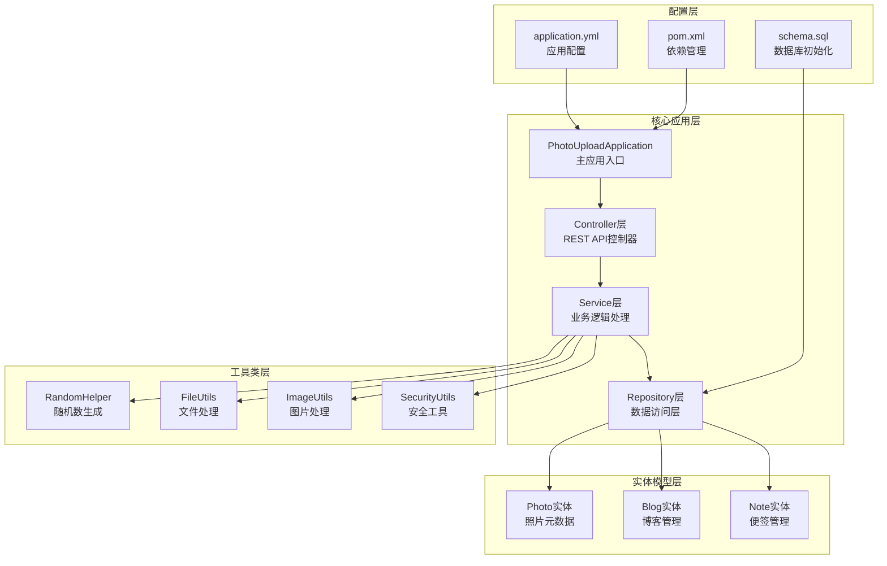
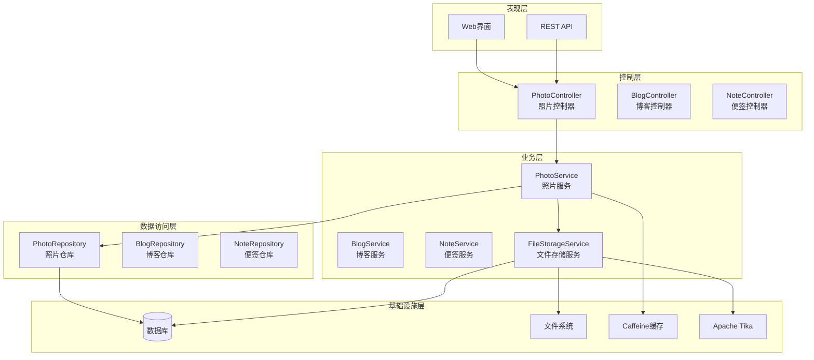
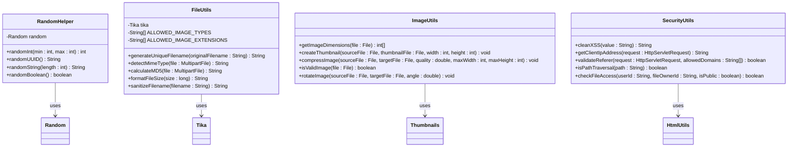
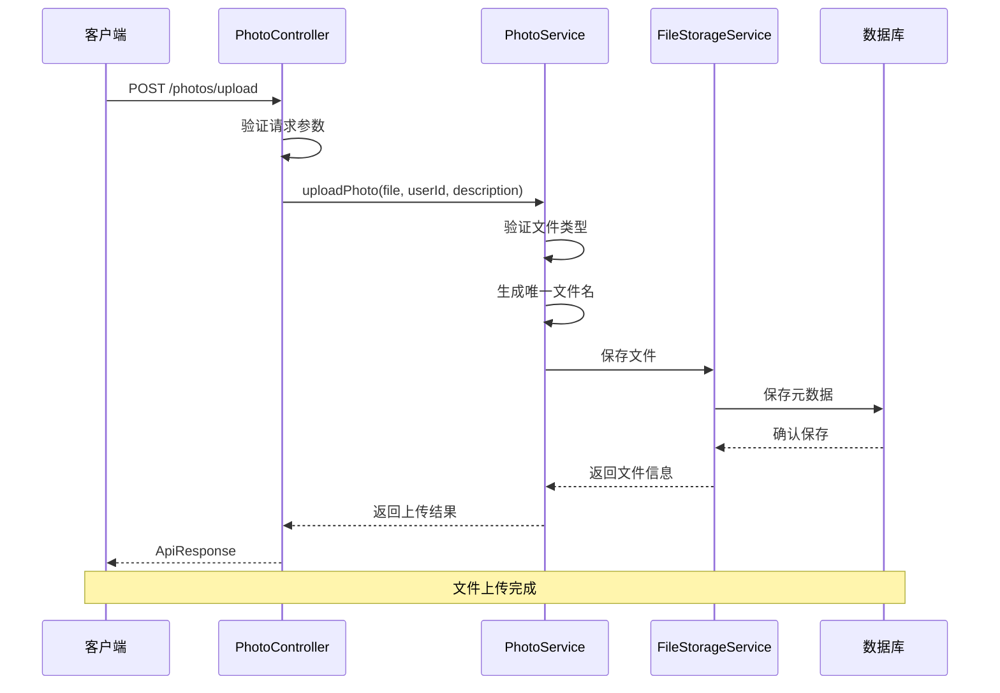
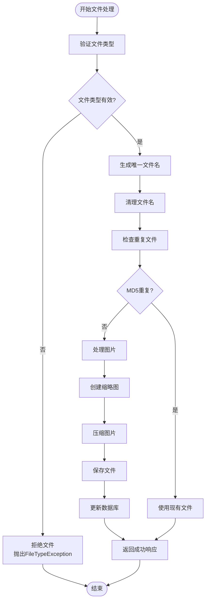
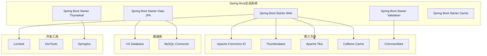

# 随机数助手工具

<cite>
**本文档引用的文件**
- [RandomHelper.java](file://src/main/java/com/photo/util/RandomHelper.java)
- [README.md](file://README.md)
- [API_DOCUMENTATION.md](file://API_DOCUMENTATION.md)
- [PhotoUploadApplication.java](file://src/main/java/com/photo/PhotoUploadApplication.java)
- [FileUtils.java](file://src/main/java/com/photo/util/FileUtils.java)
- [ImageUtils.java](file://src/main/java/com/photo/util/ImageUtils.java)
- [SecurityUtils.java](file://src/main/java/com/photo/util/SecurityUtils.java)
- [pom.xml](file://pom.xml)
- [application.yml](file://src/main/resources/application.yml)
- [PhotoController.java](file://src/main/java/com/photo/controller/PhotoController.java)
- [Photo.java](file://src/main/java/com/photo/entity/Photo.java)
- [schema.sql](file://src/main/resources/schema.sql)
</cite>

## 目录
1. [项目简介](#项目简介)
2. [项目结构](#项目结构)
3. [核心组件](#核心组件)
4. [架构概览](#架构概览)
5. [详细组件分析](#详细组件分析)
6. [依赖关系分析](#依赖关系分析)
7. [性能考虑](#性能考虑)
8. [故障排除指南](#故障排除指南)
9. [结论](#结论)

## 项目简介

这是一个基于Spring Boot开发的照片上传下载系统，提供了完整的文件管理功能。虽然项目名称为"随机数助手工具"，但实际项目是一个功能完整的企业级照片管理系统，包含上传、下载、在线预览、断点续传等核心功能。

系统采用现代化的技术栈，包括Spring Boot 3.2.0、Spring Data JPA、Caffeine缓存、Apache Tika文件类型检测等技术，为企业级应用提供了稳定可靠的基础架构。

## 项目结构

项目采用标准的Spring Boot多模块结构，主要分为以下几个核心部分：

**图表来源**
- [PhotoUploadApplication.java:1-20](file://src/main/java/com/photo/PhotoUploadApplication.java#L1-L20)
- [PhotoController.java:1-200](file://src/main/java/com/photo/controller/PhotoController.java#L1-L200)
- [RandomHelper.java:1-58](file://src/main/java/com/photo/util/RandomHelper.java#L1-L58)

**章节来源**
- [README.md:214-252](file://README.md#L214-L252)
- [pom.xml:1-156](file://pom.xml#L1-L156)

## 核心组件

### 随机数生成器 (RandomHelper)

RandomHelper是项目中的核心随机数生成工具类，提供了多种随机数据生成功能：

| 方法 | 功能 | 参数 | 返回值 | 时间复杂度 |
|------|------|------|--------|------------|
| randomInt(min, max) | 生成指定范围内的随机整数 | min: 最小值, max: 最大值 | int: 随机整数 | O(1) |
| randomUUID() | 生成随机UUID字符串 | 无 | String: UUID字符串 | O(1) |
| randomString(length) | 生成指定长度的随机字符串 | length: 字符串长度 | String: 随机字符串 | O(n) |
| randomBoolean() | 生成随机布尔值 | 无 | boolean: 随机布尔值 | O(1) |

### 文件处理工具 (FileUtils)

FileUtils提供了完整的文件处理功能，包括文件类型验证、MD5计算、文件名清理等：

- **文件类型验证**: 使用Apache Tika进行MIME类型检测
- **MD5计算**: 支持从MultipartFile和InputStream计算MD5
- **文件名清理**: 防止路径遍历攻击的安全处理
- **文件大小格式化**: 将字节数转换为人类可读的格式

### 图片处理工具 (ImageUtils)

ImageUtils专注于图片处理功能：

- **图片尺寸获取**: 支持从File和MultipartFile获取图片尺寸
- **缩略图创建**: 自动生成200x200像素的缩略图
- **图片压缩**: 支持质量压缩和尺寸压缩
- **图片验证**: 验证文件是否为有效图片格式

### 安全工具 (SecurityUtils)

SecurityUtils提供了多层次的安全防护：

- **XSS防护**: HTML转义防止跨站脚本攻击
- **防盗链**: Referer验证防止文件盗链
- **路径遍历防护**: 检测和阻止路径遍历攻击
- **SQL注入防护**: 基础的SQL注入字符过滤

**章节来源**
- [RandomHelper.java:10-58](file://src/main/java/com/photo/util/RandomHelper.java#L10-L58)
- [FileUtils.java:19-178](file://src/main/java/com/photo/util/FileUtils.java#L19-L178)
- [ImageUtils.java:15-182](file://src/main/java/com/photo/util/ImageUtils.java#L15-L182)
- [SecurityUtils.java:15-167](file://src/main/java/com/photo/util/SecurityUtils.java#L15-L167)

## 架构概览

系统采用经典的三层架构模式，结合Spring Boot的自动配置特性：

**图表来源**
- [PhotoController.java:30-200](file://src/main/java/com/photo/controller/PhotoController.java#L30-L200)
- [PhotoUploadApplication.java:11-19](file://src/main/java/com/photo/PhotoUploadApplication.java#L11-L19)

## 详细组件分析

### 随机数生成器类图

**图表来源**
- [RandomHelper.java:10-58](file://src/main/java/com/photo/util/RandomHelper.java#L10-L58)
- [FileUtils.java:21-178](file://src/main/java/com/photo/util/FileUtils.java#L21-L178)
- [ImageUtils.java:16-182](file://src/main/java/com/photo/util/ImageUtils.java#L16-L182)
- [SecurityUtils.java:15-167](file://src/main/java/com/photo/util/SecurityUtils.java#L15-L167)

### API调用流程图

**图表来源**
- [PhotoController.java:48-61](file://src/main/java/com/photo/controller/PhotoController.java#L48-L61)
- [PhotoController.java:66-79](file://src/main/java/com/photo/controller/PhotoController.java#L66-L79)

### 文件处理算法流程图

**图表来源**
- [FileUtils.java:56-102](file://src/main/java/com/photo/util/FileUtils.java#L56-L102)
- [ImageUtils.java:53-99](file://src/main/java/com/photo/util/ImageUtils.java#L53-L99)

**章节来源**
- [PhotoController.java:1-200](file://src/main/java/com/photo/controller/PhotoController.java#L1-L200)
- [Photo.java:27-174](file://src/main/java/com/photo/entity/Photo.java#L27-L174)

## 依赖关系分析

### Maven依赖关系

项目使用Maven进行依赖管理，核心依赖包括：

**图表来源**
- [pom.xml:30-137](file://pom.xml#L30-L137)

### 配置文件分析

应用配置采用YAML格式，主要配置包括：

| 配置类别 | 关键配置项 | 默认值 | 用途 |
|----------|------------|--------|------|
| 数据源 | datasource.url | jdbc:h2:file:./data/notesdb | 数据库连接 |
| 文件上传 | servlet.multipart.max-file-size | 10MB | 文件大小限制 |
| 缓存 | cache.type | caffeine | 缓存类型 |
| 文件存储 | file.storage.base-path | ./uploads | 存储根目录 |
| 安全 | security.referer.enabled | true | 防盗链开关 |
| 日志 | logging.level.com.photo | DEBUG | 日志级别 |

**章节来源**
- [pom.xml:1-156](file://pom.xml#L1-L156)
- [application.yml:1-190](file://src/main/resources/application.yml#L1-L190)

## 性能考虑

### 缓存策略

系统实现了多层次的缓存机制：

1. **应用级缓存**: 使用Caffeine作为本地缓存，提高频繁访问数据的性能
2. **图片缓存**: 缩略图和处理后的图片文件缓存
3. **数据库查询缓存**: 对常用查询结果进行缓存

### 性能优化特性

- **异步处理**: 大文件上传采用异步处理机制
- **流式传输**: 支持大文件的流式下载，避免内存溢出
- **断点续传**: 支持Range请求，实现断点续传功能
- **图片压缩**: 自动压缩大尺寸图片，减少存储空间和带宽消耗

### 数据库优化

- **索引优化**: 为常用查询字段建立索引
- **连接池**: 配置合理的数据库连接池参数
- **查询优化**: 使用分页查询避免大量数据加载

## 故障排除指南

### 常见问题及解决方案

| 问题类型 | 症状 | 可能原因 | 解决方案 |
|----------|------|----------|----------|
| 文件上传失败 | 400错误 | 文件类型不支持 | 检查文件扩展名和MIME类型 |
| 存储空间不足 | 507错误 | 磁盘空间不足 | 清理存储空间或增加配额 |
| 图片无法预览 | 404错误 | 文件路径错误 | 检查文件存储路径配置 |
| 访问被拒绝 | 403错误 | 防盗链设置 | 配置允许的Referer域名 |
| 性能问题 | 响应缓慢 | 缓存未生效 | 检查缓存配置和索引 |

### 日志分析

系统提供了详细的日志记录，包括：

- **访问日志**: 记录所有HTTP请求的详细信息
- **错误日志**: 记录异常和错误信息
- **调试日志**: 开发阶段的详细调试信息
- **性能日志**: 关键操作的性能指标

### 监控指标

- **系统健康状态**: 通过Actuator端点监控
- **数据库连接状态**: 连接池使用情况
- **文件存储使用率**: 存储空间使用情况
- **API响应时间**: 接口性能监控

**章节来源**
- [API_DOCUMENTATION.md:408-419](file://API_DOCUMENTATION.md#L408-L419)
- [application.yml:174-182](file://src/main/resources/application.yml#L174-L182)

## 结论

这个随机数助手工具项目实际上是一个功能完整的企业级照片管理系统，展现了现代Java Web应用的最佳实践。项目的主要特点包括：

### 技术优势

1. **架构清晰**: 采用标准的三层架构，职责分离明确
2. **功能完整**: 提供了从文件上传到在线预览的完整功能链
3. **安全可靠**: 多层次的安全防护机制
4. **性能优化**: 丰富的性能优化特性和缓存策略
5. **易于扩展**: 模块化的架构设计便于功能扩展

### 应用价值

- **企业级应用**: 适合构建企业级的文件管理平台
- **学习参考**: 优秀的Spring Boot项目实践案例
- **二次开发**: 良好的代码结构便于二次开发和定制
- **生产就绪**: 包含完整的配置和部署指导

### 发展建议

1. **微服务化**: 可以考虑将不同功能模块拆分为独立的服务
2. **容器化**: 提供Docker支持，便于部署和扩展
3. **云原生**: 集成云存储服务，支持分布式部署
4. **监控完善**: 增强APM监控和告警机制

这个项目为开发者提供了一个学习和参考的优秀范例，展示了如何构建一个功能完整、性能优良、安全可靠的现代Web应用。