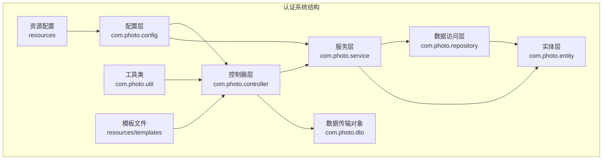
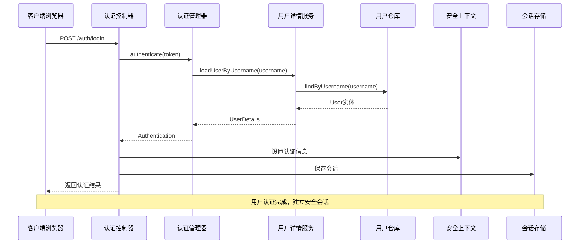
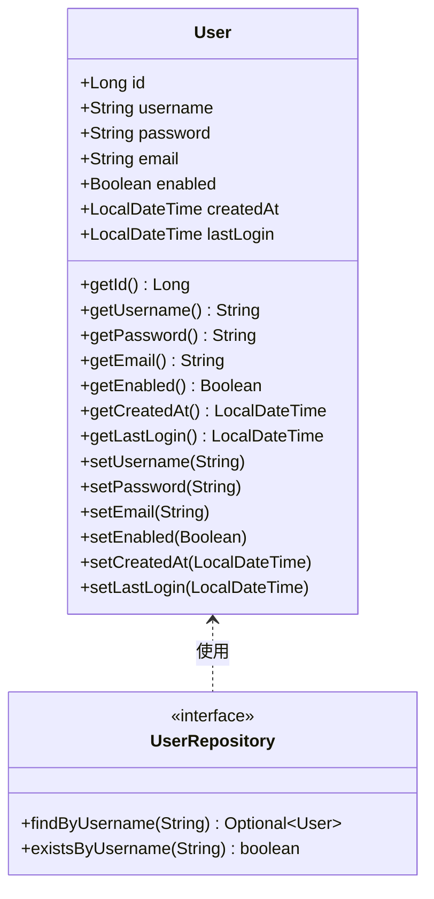
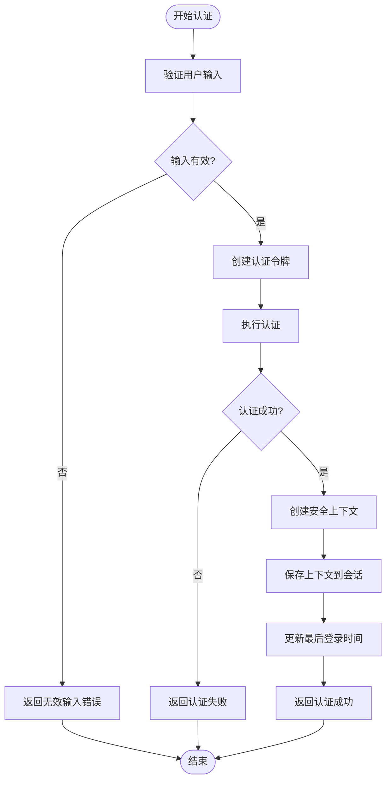
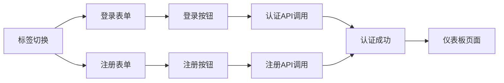
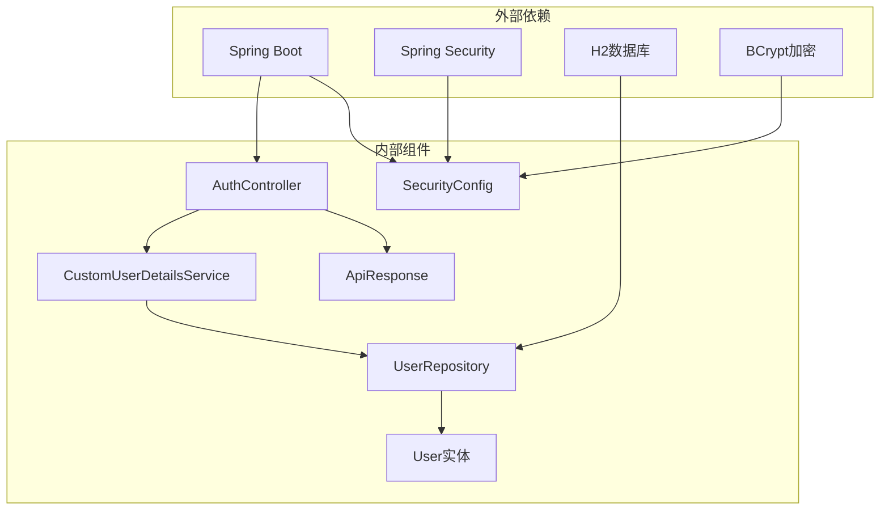

# 认证系统

<cite>
**本文档引用的文件**
- [AuthController.java](file://src/main/java/com/photo/controller/AuthController.java)
- [CustomUserDetailsService.java](file://src/main/java/com/photo/service/CustomUserDetailsService.java)
- [SecurityConfig.java](file://src/main/java/com/photo/config/SecurityConfig.java)
- [User.java](file://src/main/java/com/photo/entity/User.java)
- [UserRepository.java](file://src/main/java/com/photo/repository/UserRepository.java)
- [application.yml](file://src/main/resources/application.yml)
- [login.html](file://src/main/resources/templates/login.html)
- [SecurityProperties.java](file://src/main/java/com/photo/config/SecurityProperties.java)
- [SecurityUtils.java](file://src/main/java/com/photo/util/SecurityUtils.java)
- [DataInitializer.java](file://src/main/java/com/photo/config/DataInitializer.java)
- [ApiResponse.java](file://src/main/java/com/photo/dto/ApiResponse.java)
- [pom.xml](file://pom.xml)
</cite>

## 目录
1. [简介](#简介)
2. [项目结构](#项目结构)
3. [核心组件](#核心组件)
4. [架构概览](#架构概览)
5. [详细组件分析](#详细组件分析)
6. [依赖关系分析](#依赖关系分析)
7. [性能考虑](#性能考虑)
8. [故障排除指南](#故障排除指南)
9. [结论](#结论)

## 简介

这是一个基于Spring Boot构建的照片上传系统的认证模块。该系统实现了完整的用户认证、授权和安全管理功能，包括用户注册、登录、注销、密码加密存储、会话管理等核心功能。系统采用Spring Security进行安全控制，支持多种安全机制如CSRF防护、CORS配置、防盗链等。

## 项目结构

该项目采用标准的Spring Boot项目结构，认证相关的代码主要分布在以下包中：

**图表来源**
- [AuthController.java](file://src/main/java/com/photo/controller/AuthController.java#L1-L111)
- [CustomUserDetailsService.java](file://src/main/java/com/photo/service/CustomUserDetailsService.java#L1-L70)
- [SecurityConfig.java](file://src/main/java/com/photo/config/SecurityConfig.java#L1-L99)

**章节来源**
- [AuthController.java](file://src/main/java/com/photo/controller/AuthController.java#L1-L111)
- [application.yml](file://src/main/resources/application.yml#L1-L190)

## 核心组件

### 认证控制器 (AuthController)

认证控制器是系统的核心入口点，负责处理所有用户认证相关的HTTP请求。它提供了三个主要功能：
- 登录页面显示
- 用户登录验证
- 用户注销功能
- 用户注册功能

### 自定义用户详情服务 (CustomUserDetailsService)

实现了Spring Security的UserDetailsService接口，提供用户信息加载和管理功能：
- 用户名密码验证
- 新用户创建
- 最后登录时间更新
- 用户状态检查

### 安全配置 (SecurityConfig)

配置了Spring Security的安全策略：
- CSRF防护禁用
- CORS跨域配置
- URL访问权限控制
- 表单登录配置
- 注销配置
- 密码编码器设置

**章节来源**
- [AuthController.java](file://src/main/java/com/photo/controller/AuthController.java#L20-L111)
- [CustomUserDetailsService.java](file://src/main/java/com/photo/service/CustomUserDetailsService.java#L15-L70)
- [SecurityConfig.java](file://src/main/java/com/photo/config/SecurityConfig.java#L22-L99)

## 架构概览

系统采用分层架构设计，遵循Spring Boot的最佳实践：

**图表来源**
- [AuthController.java](file://src/main/java/com/photo/controller/AuthController.java#L47-L80)
- [CustomUserDetailsService.java](file://src/main/java/com/photo/service/CustomUserDetailsService.java#L27-L41)
- [SecurityConfig.java](file://src/main/java/com/photo/config/SecurityConfig.java#L36-L58)

## 详细组件分析

### 用户实体模型

用户实体类定义了用户的基本信息和状态管理：

**图表来源**
- [User.java](file://src/main/java/com/photo/entity/User.java#L9-L100)
- [UserRepository.java](file://src/main/java/com/photo/repository/UserRepository.java#L12-L25)

### 认证流程详解

系统实现了完整的认证流程，从用户提交凭据到建立安全会话：

**图表来源**
- [AuthController.java](file://src/main/java/com/photo/controller/AuthController.java#L47-L80)
- [CustomUserDetailsService.java](file://src/main/java/com/photo/service/CustomUserDetailsService.java#L63-L68)

### 安全配置分析

系统配置了多层次的安全防护机制：

| 安全特性 | 配置位置 | 实现方式 | 作用范围 |
|---------|---------|---------|---------|
| CSRF防护 | SecurityConfig | 禁用CSRF | 所有请求 |
| CORS跨域 | SecurityConfig | 动态配置 | API接口 |
| URL权限 | SecurityConfig | 白名单机制 | 资源访问 |
| 密码加密 | SecurityConfig | BCrypt | 用户密码 |
| 会话管理 | SecurityConfig | HTTP Session | 用户会话 |

**章节来源**
- [SecurityConfig.java](file://src/main/java/com/photo/config/SecurityConfig.java#L36-L99)
- [SecurityProperties.java](file://src/main/java/com/photo/config/SecurityProperties.java#L12-L53)

### 前端认证界面

登录页面采用Thymeleaf模板引擎，提供了现代化的用户界面：

**图表来源**
- [login.html](file://src/main/resources/templates/login.html#L232-L447)

**章节来源**
- [login.html](file://src/main/resources/templates/login.html#L1-L447)

## 依赖关系分析

系统采用了模块化的依赖设计，各组件之间的耦合度较低：

**图表来源**
- [pom.xml](file://pom.xml#L30-L150)
- [AuthController.java](file://src/main/java/com/photo/controller/AuthController.java#L1-L111)

**章节来源**
- [pom.xml](file://pom.xml#L1-L169)

## 性能考虑

系统在设计时充分考虑了性能优化：

### 缓存策略
- 使用Caffeine本地缓存
- 配置合理的缓存大小和过期时间
- 减少数据库查询频率

### 数据库优化
- 使用JPA懒加载机制
- 合理的索引设计
- 连接池配置优化

### 安全性能
- BCrypt密码加密的性能平衡
- 会话存储的高效管理
- CORS配置的性能影响最小化

## 故障排除指南

### 常见认证问题

| 问题类型 | 症状 | 可能原因 | 解决方案 |
|---------|------|---------|---------|
| 登录失败 | 返回401错误 | 用户名或密码错误 | 检查用户凭据，确认用户状态 |
| 注册失败 | 返回400错误 | 用户名已存在 | 更换用户名，检查唯一性约束 |
| 会话超时 | 页面重定向到登录页 | 会话过期 | 增加会话超时时间 |
| CORS错误 | 跨域请求被拒绝 | CORS配置不当 | 检查allowedOrigins配置 |

### 调试建议

1. **启用详细日志**：在application.yml中调整日志级别
2. **检查数据库连接**：确认H2或MySQL配置正确
3. **验证安全配置**：确保SecurityConfig配置符合预期
4. **测试API端点**：使用Postman或curl测试认证API

**章节来源**
- [application.yml](file://src/main/resources/application.yml#L146-L160)
- [DataInitializer.java](file://src/main/java/com/photo/config/DataInitializer.java#L27-L55)

## 结论

该认证系统实现了完整的企业级安全功能，具有以下特点：

### 优势
- **安全性高**：采用Spring Security框架，提供多层安全防护
- **可扩展性强**：模块化设计，易于添加新的认证方式
- **用户体验好**：提供现代化的前端界面和流畅的交互体验
- **性能优化**：合理的缓存策略和数据库优化

### 改进建议
- **增强令牌管理**：考虑使用JWT替代传统的Session机制
- **添加多因素认证**：提升系统的安全级别
- **完善审计日志**：记录重要的安全事件
- **监控告警**：添加系统健康监控和异常告警

该系统为照片上传平台提供了坚实的安全基础，能够满足大多数企业应用的认证需求。