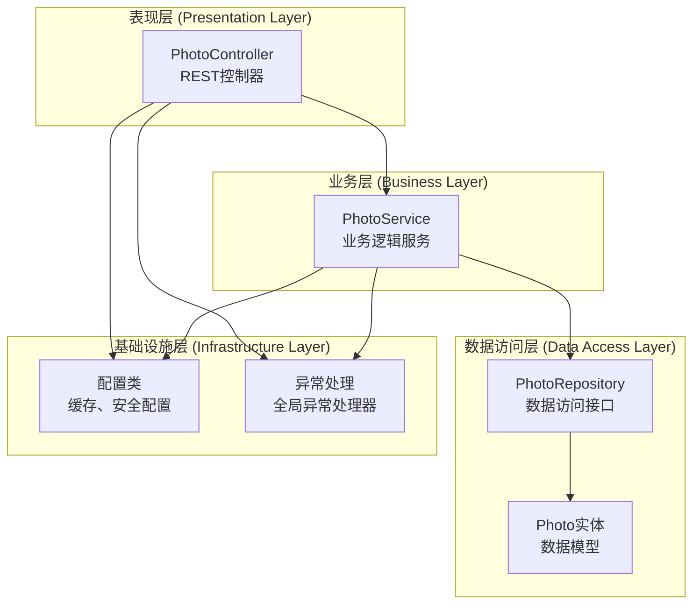
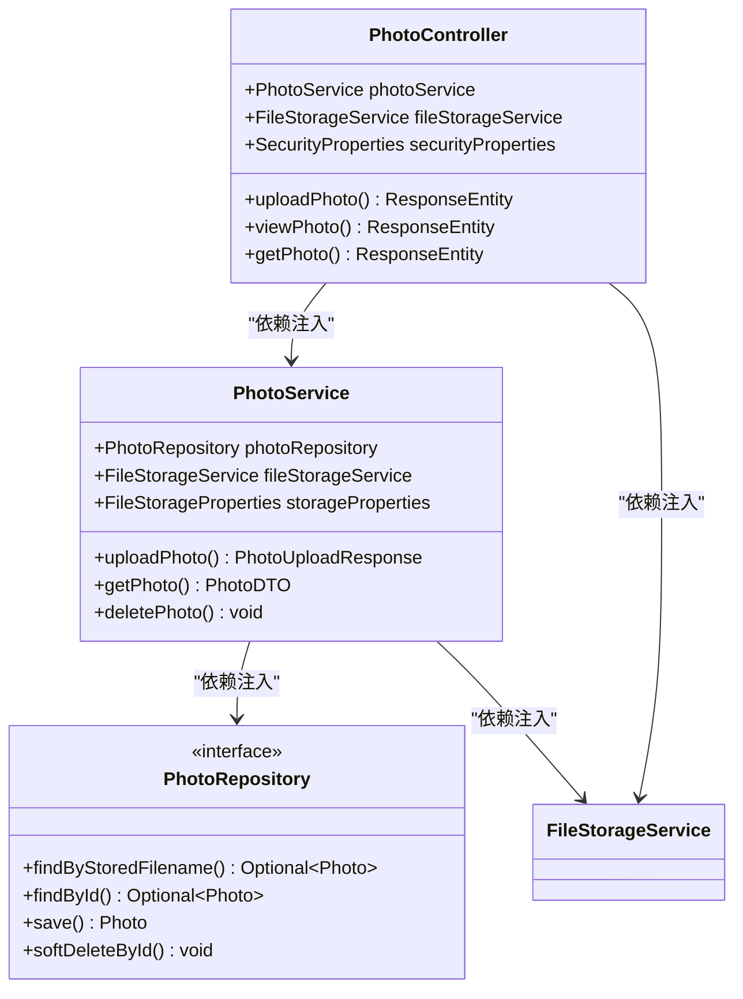
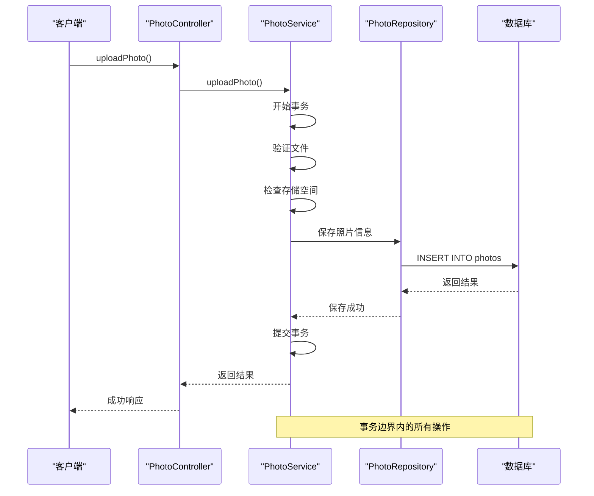
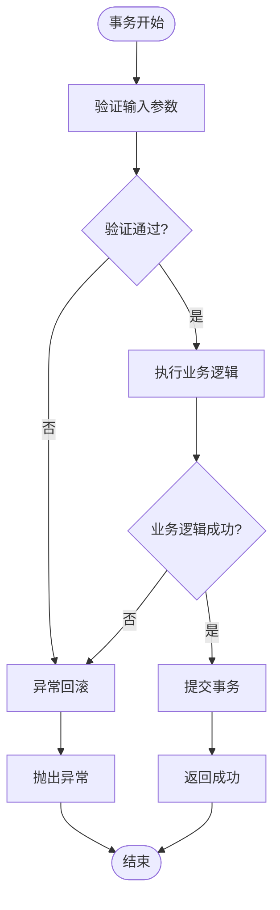
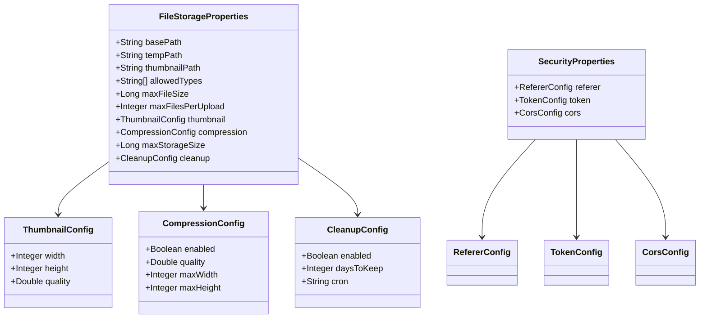
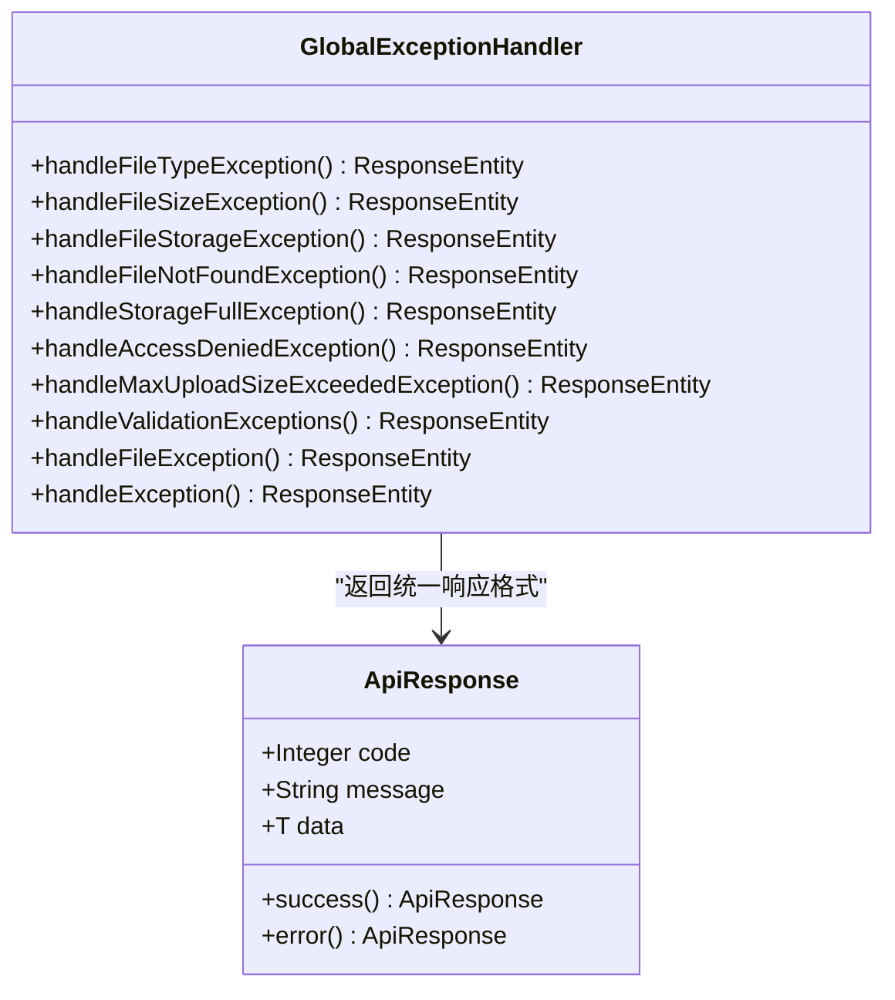
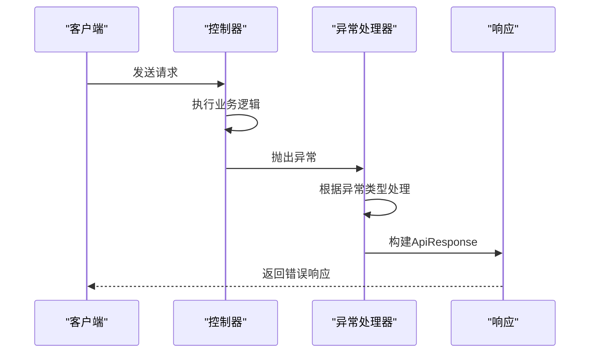

# 设计模式

<cite>
**本文档引用的文件**
- [PhotoController.java](file://src/main/java/com/photo/controller/PhotoController.java)
- [PhotoService.java](file://src/main/java/com/photo/service/PhotoService.java)
- [PhotoRepository.java](file://src/main/java/com/photo/repository/PhotoRepository.java)
- [CacheConfig.java](file://src/main/java/com/photo/config/CacheConfig.java)
- [FileStorageProperties.java](file://src/main/java/com/photo/config/FileStorageProperties.java)
- [SecurityProperties.java](file://src/main/java/com/photo/config/SecurityProperties.java)
- [GlobalExceptionHandler.java](file://src/main/java/com/photo/exception/GlobalExceptionHandler.java)
- [Photo.java](file://src/main/java/com/photo/entity/Photo.java)
- [application.yml](file://src/main/resources/application.yml)
</cite>

## 目录
1. [引言](#引言)
2. [MVC分层架构](#mvc分层架构)
3. [依赖注入与松耦合](#依赖注入与松耦合)
4. [事务管理模式](#事务管理模式)
5. [缓存设计模式](#缓存设计模式)
6. [配置外化模式](#配置外化模式)
7. [异常处理模式](#异常处理模式)
8. [架构实践总结](#架构实践总结)

## 引言

本系统采用现代化的Spring Boot架构，通过多种设计模式的综合应用，实现了高内聚、低耦合的软件架构。系统主要展现了MVC分层架构、依赖注入、事务管理、缓存策略、配置管理和异常处理等核心设计模式。

## MVC分层架构

### 架构概览

系统严格遵循MVC（Model-View-Controller）分层架构原则，通过清晰的职责分离实现模块化设计：



**图表来源**
- [PhotoController.java](file://src/main/java/com/photo/controller/PhotoController.java#L35-L44)
- [PhotoService.java](file://src/main/java/com/photo/service/PhotoService.java#L38-L46)
- [PhotoRepository.java](file://src/main/java/com/photo/repository/PhotoRepository.java#L19-L20)

### 表现层设计

Controller层负责HTTP请求的接收和响应的生成，采用RESTful设计原则：

- **单一职责**: 每个Controller专注于特定的资源操作
- **无状态设计**: Controller保持无状态特性，提高并发性能
- **统一响应格式**: 通过ApiResponse统一返回格式

**章节来源**
- [PhotoController.java](file://src/main/java/com/photo/controller/PhotoController.java#L35-L316)

### 业务层设计

Service层封装核心业务逻辑，实现领域驱动设计：

- **业务规则集中**: 将复杂的业务逻辑集中在Service层
- **事务边界明确**: 通过@Transactional注解明确定义事务范围
- **依赖倒置**: Service层依赖于抽象接口而非具体实现

**章节来源**
- [PhotoService.java](file://src/main/java/com/photo/service/PhotoService.java#L38-L385)

### 数据访问层设计

Repository层提供数据访问抽象，实现数据持久化：

- **DAO模式**: 通过JpaRepository提供标准的数据访问方法
- **查询优化**: 使用@Query注解进行复杂查询的SQL定制
- **软删除支持**: 实现逻辑删除功能，保护数据完整性

**章节来源**
- [PhotoRepository.java](file://src/main/java/com/photo/repository/PhotoRepository.java#L19-L112)

## 依赖注入与松耦合

### @Autowired注解的应用

系统广泛使用Spring的依赖注入机制，通过@Autowired注解实现组件间的松耦合：



**图表来源**
- [PhotoController.java](file://src/main/java/com/photo/controller/PhotoController.java#L36-L43)
- [PhotoService.java](file://src/main/java/com/photo/service/PhotoService.java#L38-L46)

### 松耦合实现机制

1. **接口依赖**: 通过接口而非具体类进行依赖注入
2. **构造函数注入**: 使用构造函数注入确保必需依赖的初始化
3. **自动装配**: Spring容器自动管理组件生命周期和依赖关系

**章节来源**
- [PhotoController.java](file://src/main/java/com/photo/controller/PhotoController.java#L36-L43)
- [PhotoService.java](file://src/main/java/com/photo/service/PhotoService.java#L38-L46)

## 事务管理模式

### @Transactional注解详解

系统在关键业务操作上使用@Transactional注解，确保数据一致性和完整性：



**图表来源**
- [PhotoService.java](file://src/main/java/com/photo/service/PhotoService.java#L50-L111)

### 事务边界分析

系统在以下场景中使用事务管理：

1. **照片上传**: 包含文件存储和数据库记录的原子性操作
2. **照片删除**: 软删除操作确保数据一致性
3. **访问统计**: 增加访问次数和下载次数的操作
4. **定期清理**: 批量删除过期文件的事务保证

**章节来源**
- [PhotoService.java](file://src/main/java/com/photo/service/PhotoService.java#L50-L111)
- [PhotoService.java](file://src/main/java/com/photo/service/PhotoService.java#L190-L234)
- [PhotoService.java](file://src/main/java/com/photo/service/PhotoService.java#L237-L250)

### 异常传播机制

当事务方法中发生异常时，Spring会自动回滚事务：



**图表来源**
- [PhotoService.java](file://src/main/java/com/photo/service/PhotoService.java#L50-L111)

## 缓存设计模式

### Caffeine缓存架构

系统采用Caffeine本地缓存，结合Spring Cache注解实现高效的缓存策略：

```mermaid
graph TB
subgraph "缓存层次结构"
CacheManager[缓存管理器<br/>CaffeineCacheManager]
PhotoCache[照片缓存<br/>photos]
MetadataCache[元数据缓存<br/>metadata]
end
subgraph "缓存配置"
CacheConfig[CacheConfig<br/>@EnableCaching]
PhotoBean[photoCacheConfig<br/>最大500条，30分钟]
MetaBean[metadataCacheConfig<br/>最大1000条，60分钟]
end
subgraph "缓存操作"
GetPhoto["@Cacheable<br/>获取照片信息"]
DeletePhoto["@CacheEvict<br/>删除照片缓存"]
EvictAll["@CacheEvict(allEntries=true)<br/>清空缓存"]
end
CacheManager --> PhotoCache
CacheManager --> MetadataCache
CacheConfig --> CacheManager
PhotoBean --> PhotoCache
MetaBean --> MetadataCache
GetPhoto --> PhotoCache
DeletePhoto --> PhotoCache
EvictAll --> PhotoCache
```

**图表来源**
- [CacheConfig.java](file://src/main/java/com/photo/config/CacheConfig.java#L15-L54)
- [PhotoService.java](file://src/main/java/com/photo/service/PhotoService.java#L141-L160)

### @Cacheable注解应用

系统在以下方法上使用@Cacheable注解：

1. **getPhoto()**: 根据ID获取照片信息，缓存时间为30分钟
2. **getPhotoByFilename()**: 根据文件名获取照片，同样使用缓存

**章节来源**
- [PhotoService.java](file://src/main/java/com/photo/service/PhotoService.java#L141-L160)

### @CacheEvict注解应用

在修改操作中使用@CacheEvict注解确保缓存一致性：

1. **deletePhoto()**: 删除照片时清除对应缓存
2. **permanentlyDeletePhoto()**: 物理删除时同步清除缓存

**章节来源**
- [PhotoService.java](file://src/main/java/com/photo/service/PhotoService.java#L192-L234)

### 缓存配置策略

| 缓存名称 | 最大条目数 | 过期时间 | 用途 |
|---------|-----------|---------|------|
| photos | 500 | 30分钟 | 照片基本信息缓存 |
| metadata | 1000 | 60分钟 | 文件元数据缓存 |
| default | 1000 | 60分钟 | 默认缓存 |

**章节来源**
- [CacheConfig.java](file://src/main/java/com/photo/config/CacheConfig.java#L22-L53)

## 配置外化模式

### 属性配置分离

系统采用Spring Boot的配置外化模式，将配置从代码中分离：



**图表来源**
- [FileStorageProperties.java](file://src/main/java/com/photo/config/FileStorageProperties.java#L14-L94)
- [SecurityProperties.java](file://src/main/java/com/photo/config/SecurityProperties.java#L14-L53)

### 配置分类管理

1. **文件存储配置**: 控制文件上传、存储路径、大小限制等
2. **安全配置**: 管理防盗链、Token认证、CORS设置
3. **缓存配置**: 定义缓存策略和过期时间

**章节来源**
- [FileStorageProperties.java](file://src/main/java/com/photo/config/FileStorageProperties.java#L14-L94)
- [SecurityProperties.java](file://src/main/java/com/photo/config/SecurityProperties.java#L14-L53)

### 配置文件映射

系统通过@ConfigurationProperties注解将application.yml中的配置映射到Java对象：

| 配置前缀 | 类名 | 主要配置项 |
|---------|------|-----------|
| file.storage | FileStorageProperties | basePath, maxFileSize, compression |
| security | SecurityProperties | referer, token, cors |
| spring.cache | CacheConfig | 缓存策略配置 |

**章节来源**
- [application.yml](file://src/main/resources/application.yml#L50-L126)

## 异常处理模式

### 全局异常处理器

系统采用@RestControllerAdvice注解实现全局异常处理：



**图表来源**
- [GlobalExceptionHandler.java](file://src/main/java/com/photo/exception/GlobalExceptionHandler.java#L20-L140)

### 异常分类处理

系统对不同类型的异常进行分类处理：

| 异常类型 | HTTP状态码 | 处理策略 |
|---------|-----------|---------|
| FileTypeException | 400 | 文件类型验证失败 |
| FileSizeException | 400 | 文件大小超出限制 |
| StorageFullException | 507 | 存储空间不足 |
| AccessDeniedException | 403 | 权限验证失败 |
| FileNotFoundException | 404 | 文件未找到 |
| FileStorageException | 500 | 文件存储失败 |

**章节来源**
- [GlobalExceptionHandler.java](file://src/main/java/com/photo/exception/GlobalExceptionHandler.java#L23-L140)

### 统一响应格式

所有异常处理都返回统一的ApiResponse格式：



**图表来源**
- [GlobalExceptionHandler.java](file://src/main/java/com/photo/exception/GlobalExceptionHandler.java#L23-L140)

## 架构实践总结

### 设计模式综合应用

本系统通过以下设计模式的综合应用，实现了高质量的软件架构：

1. **MVC分层架构**: 清晰的职责分离，提高代码可维护性
2. **依赖注入模式**: 实现松耦合，增强组件可测试性
3. **事务管理模式**: 确保数据一致性，处理业务边界
4. **缓存模式**: 提升系统性能，减少数据库压力
5. **配置外化模式**: 实现配置与代码分离，提高灵活性
6. **异常处理模式**: 统一错误处理，提供良好的用户体验

### 架构优势

- **高内聚低耦合**: 各层职责明确，组件间依赖最小化
- **可扩展性强**: 新功能易于添加，不影响现有代码
- **可测试性好**: 依赖注入便于单元测试和集成测试
- **性能优异**: 缓存机制和事务优化提升系统性能
- **维护成本低**: 统一的异常处理和配置管理降低维护难度

### 最佳实践建议

1. **事务边界明确**: 只在必要的业务操作上使用@Transactional
2. **缓存策略合理**: 根据数据访问模式选择合适的缓存策略
3. **异常处理完整**: 覆盖所有可能的异常场景
4. **配置管理规范**: 使用@ConfigurationProperties统一管理配置
5. **日志记录充分**: 在关键业务节点添加适当的日志记录

通过这些设计模式的合理应用，系统实现了既满足业务需求又具有良好架构质量的目标，为后续的功能扩展和性能优化奠定了坚实的基础。