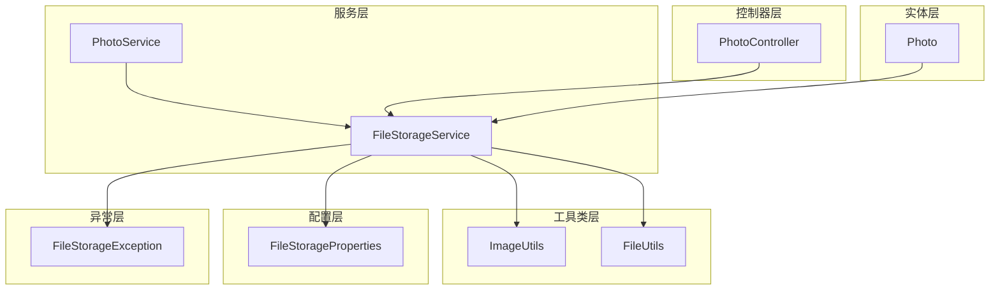
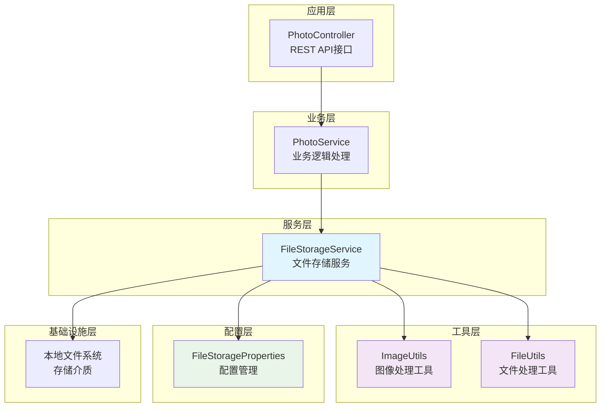
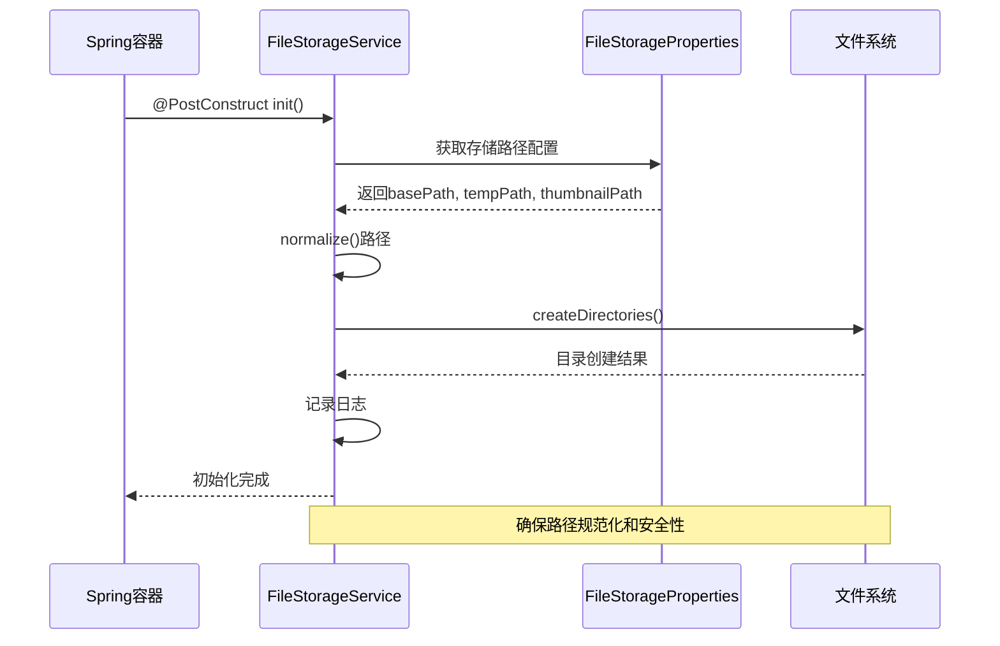
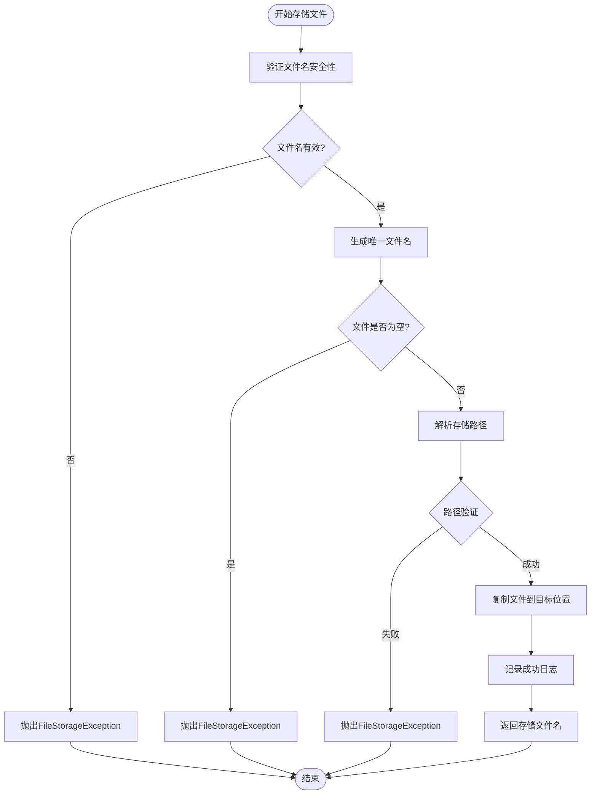
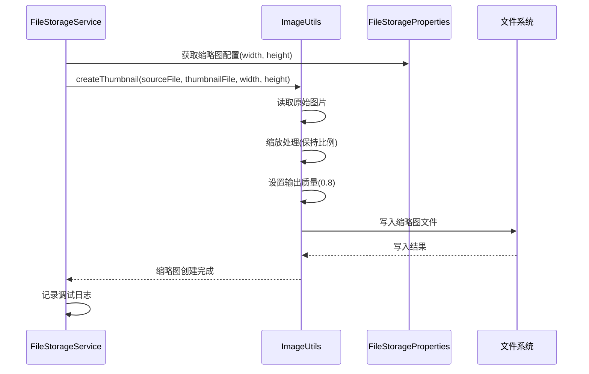
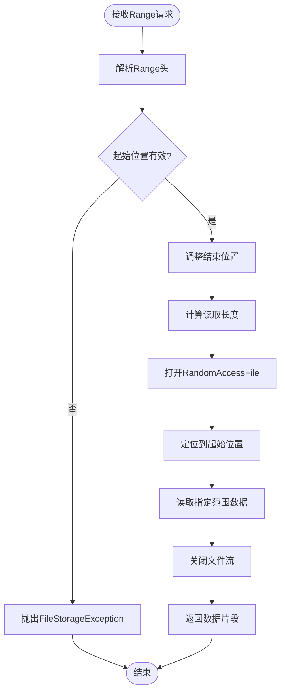
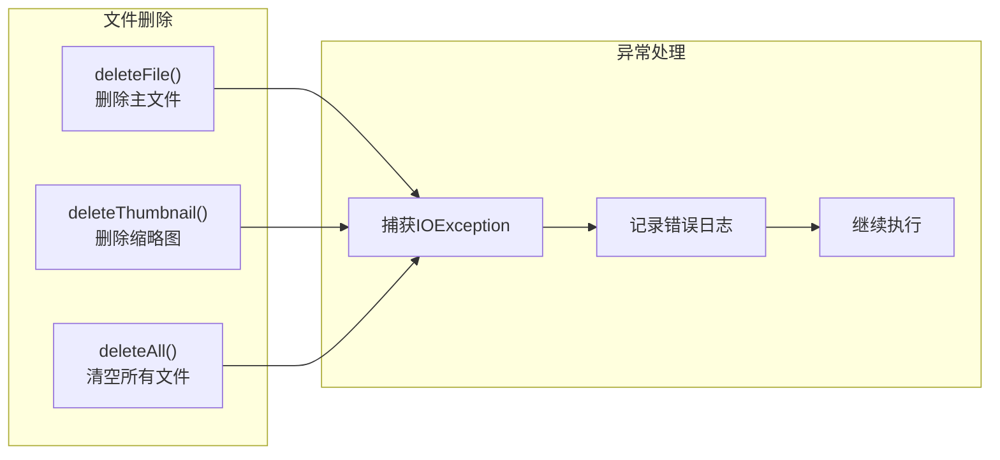
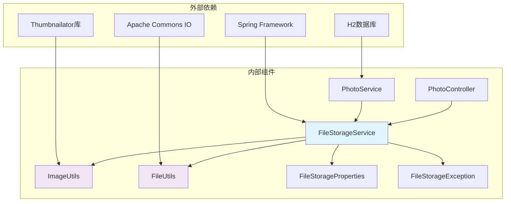

# 文件存储服务

<cite>
**本文档中引用的文件**
- [FileStorageService.java](file://src/main/java/com/photo/service/FileStorageService.java)
- [ImageUtils.java](file://src/main/java/com/photo/util/ImageUtils.java)
- [FileStorageProperties.java](file://src/main/java/com/photo/config/FileStorageProperties.java)
- [FileUtils.java](file://src/main/java/com/photo/util/FileUtils.java)
- [PhotoService.java](file://src/main/java/com/photo/service/PhotoService.java)
- [PhotoController.java](file://src/main/java/com/photo/controller/PhotoController.java)
- [Photo.java](file://src/main/java/com/photo/entity/Photo.java)
- [FileStorageException.java](file://src/main/java/com/photo/exception/FileStorageException.java)
- [application.yml](file://src/main/resources/application.yml)
</cite>

## 目录
1. [简介](#简介)
2. [项目结构](#项目结构)
3. [核心组件](#核心组件)
4. [架构概览](#架构概览)
5. [详细组件分析](#详细组件分析)
6. [依赖关系分析](#依赖关系分析)
7. [性能考量](#性能考量)
8. [故障排除指南](#故障排除指南)
9. [结论](#结论)

## 简介

FileStorageService是PhotoUploadSystem项目中的核心文件操作组件，负责管理本地文件系统的读写操作。该服务提供了安全、可靠的文件存储解决方案，具备防止路径遍历攻击的安全机制、智能的文件名生成策略、高效的缩略图生成和图片压缩功能，以及支持断点续传的文件范围读取技术。

该服务的设计充分考虑了文件操作的安全性、可靠性和性能优化，为上层业务逻辑（如PhotoService）提供了稳定的基础支撑。通过与ImageUtils工具类的紧密协作，实现了完整的图片处理流水线，包括缩略图创建、图片压缩、尺寸检测等功能。

## 项目结构

FileStorageService位于项目的`com.photo.service`包中，作为Spring框架的服务组件，采用依赖注入的方式与其他组件协作。其文件组织结构如下：

**图表来源**
- [FileStorageService.java](file://src/main/java/com/photo/service/FileStorageService.java#L1-L300)
- [PhotoService.java](file://src/main/java/com/photo/service/PhotoService.java#L1-L385)
- [PhotoController.java](file://src/main/java/com/photo/controller/PhotoController.java#L1-L316)

**章节来源**
- [FileStorageService.java](file://src/main/java/com/photo/service/FileStorageService.java#L1-L50)
- [FileStorageProperties.java](file://src/main/java/com/photo/config/FileStorageProperties.java#L1-L94)

## 核心组件

FileStorageService的核心功能围绕以下几个关键组件展开：

### 目录管理组件
- **基础存储目录** (`basePath`)：主文件存储根目录
- **临时目录** (`tempPath`)：文件上传过程中的临时存储
- **缩略图目录** (`thumbnailPath`)：生成的缩略图存储位置

### 文件操作组件
- **文件存储** (`storeFile`)：安全的文件写入操作
- **文件读取** (`getFile`, `readFileContent`)：多种文件读取方式
- **文件删除** (`deleteFile`, `deleteAll`)：安全的文件清理机制

### 图像处理组件
- **缩略图生成** (`createThumbnail`)：基于ImageUtils的缩略图创建
- **图片压缩** (`compressImage`)：多级压缩策略
- **尺寸检测** (`getImageDimensions`)：图片尺寸信息获取

### 安全防护组件
- **路径验证** (`normalize()`)：防止路径遍历攻击
- **文件名验证** (`isValidFilename`)：安全的文件名校验
- **异常处理**：全面的错误捕获和处理机制

**章节来源**
- [FileStorageService.java](file://src/main/java/com/photo/service/FileStorageService.java#L25-L50)
- [FileStorageProperties.java](file://src/main/java/com/photo/config/FileStorageProperties.java#L15-L40)

## 架构概览

FileStorageService采用分层架构设计，确保了良好的可维护性和扩展性：

**图表来源**
- [PhotoController.java](file://src/main/java/com/photo/controller/PhotoController.java#L30-L50)
- [PhotoService.java](file://src/main/java/com/photo/service/PhotoService.java#L35-L50)
- [FileStorageService.java](file://src/main/java/com/photo/service/FileStorageService.java#L15-L30)

## 详细组件分析

### 目录初始化与安全管理

FileStorageService在启动时通过`@PostConstruct`注解的方法进行目录初始化，确保所有必要的存储目录都已正确创建：

**图表来源**
- [FileStorageService.java](file://src/main/java/com/photo/service/FileStorageService.java#L32-L50)
- [FileStorageProperties.java](file://src/main/java/com/photo/config/FileStorageProperties.java#L15-L30)

#### 路径安全校验机制

服务实现了多层次的安全防护机制来防止路径遍历攻击：

1. **路径规范化**：使用`normalize()`方法消除相对路径符号
2. **父目录验证**：确保目标路径始终在允许的目录范围内
3. **文件名验证**：通过`FileUtils.isValidFilename()`检查文件名安全性

**章节来源**
- [FileStorageService.java](file://src/main/java/com/photo/service/FileStorageService.java#L32-L50)
- [FileUtils.java](file://src/main/java/com/photo/util/FileUtils.java#L160-L178)

### 文件存储与读取流程

#### 文件存储流程

**图表来源**
- [FileStorageService.java](file://src/main/java/com/photo/service/FileStorageService.java#L52-L90)

#### 文件读取流程

服务提供了多种文件读取方式以满足不同的业务需求：

1. **完整文件读取**：`readFileContent()` - 适用于小文件的完整内容读取
2. **范围读取**：`readFileRange()` - 支持断点续传的大文件处理
3. **文件对象获取**：`getFile()` - 获取Java File对象进行直接操作

**章节来源**
- [FileStorageService.java](file://src/main/java/com/photo/service/FileStorageService.java#L120-L150)
- [FileStorageService.java](file://src/main/java/com/photo/service/FileStorageService.java#L200-L230)

### 缩略图生成与图片压缩

#### 缩略图生成机制

FileStorageService通过委托给ImageUtils类来实现缩略图生成功能：

**图表来源**
- [FileStorageService.java](file://src/main/java/com/photo/service/FileStorageService.java#L140-L155)
- [ImageUtils.java](file://src/main/java/com/photo/util/ImageUtils.java#L45-L60)

#### 图片压缩策略

服务实现了智能的图片压缩策略，根据图片尺寸自动选择合适的压缩方案：

1. **尺寸检测**：判断图片是否需要尺寸压缩
2. **质量压缩**：对于小尺寸图片仅进行质量压缩
3. **双压缩**：对于大尺寸图片同时进行尺寸和质量压缩
4. **临时文件处理**：使用临时文件确保压缩过程的原子性

**章节来源**
- [FileStorageService.java](file://src/main/java/com/photo/service/FileStorageService.java#L157-L165)
- [ImageUtils.java](file://src/main/java/com/photo/util/ImageUtils.java#L62-L85)

### 断点续传文件范围读取

#### 技术实现原理

`readFileRange()`方法实现了HTTP Range请求支持，为大文件下载提供了断点续传能力：

**图表来源**
- [FileStorageService.java](file://src/main/java/com/photo/service/FileStorageService.java#L200-L230)

#### 性能优化考量

1. **内存效率**：只读取需要的数据范围，避免加载整个文件
2. **并发安全**：使用RandomAccessFile确保线程安全
3. **边界处理**：智能调整结束位置，防止越界访问
4. **异常恢复**：完善的异常处理确保服务稳定性

**章节来源**
- [FileStorageService.java](file://src/main/java/com/photo/service/FileStorageService.java#L200-L230)

### 文件生命周期管理

#### 删除操作流程

**图表来源**
- [FileStorageService.java](file://src/main/java/com/photo/service/FileStorageService.java#L167-L190)

**章节来源**
- [FileStorageService.java](file://src/main/java/com/photo/service/FileStorageService.java#L167-L190)

## 依赖关系分析

FileStorageService与项目中的其他组件形成了清晰的依赖关系网络：

**图表来源**
- [FileStorageService.java](file://src/main/java/com/photo/service/FileStorageService.java#L1-L20)
- [PhotoService.java](file://src/main/java/com/photo/service/PhotoService.java#L1-L25)

### 关键依赖说明

1. **ImageUtils**：提供图像处理功能，FileStorageService通过它实现缩略图生成和图片压缩
2. **FileUtils**：提供文件操作工具，用于文件名生成和安全性验证
3. **FileStorageProperties**：配置管理，提供存储路径和参数配置
4. **FileStorageException**：异常处理，统一的文件操作异常类型

**章节来源**
- [FileStorageService.java](file://src/main/java/com/photo/service/FileStorageService.java#L1-L20)
- [FileStorageProperties.java](file://src/main/java/com/photo/config/FileStorageProperties.java#L1-L20)

## 性能考量

### 存储性能优化

1. **异步处理**：缩略图生成和图片压缩采用异步处理，避免阻塞主线程
2. **缓存策略**：文件路径和基本信息采用缓存机制减少磁盘访问
3. **批量操作**：支持批量文件操作，提高处理效率
4. **资源池化**：合理利用Java NIO的缓冲区和流处理机制

### 内存管理

1. **流式处理**：大文件采用流式读取，避免内存溢出
2. **及时释放**：使用try-with-resources确保资源及时释放
3. **临时文件**：图片压缩使用临时文件，避免内存占用过大

### 并发安全

1. **线程安全**：所有文件操作都是线程安全的
2. **原子操作**：文件写入采用原子性操作，确保数据一致性
3. **锁机制**：在必要时使用适当的同步机制

## 故障排除指南

### 常见问题与解决方案

#### 目录创建失败

**问题现象**：服务启动时抛出`FileStorageException`，提示无法创建存储目录

**可能原因**：
1. 磁盘空间不足
2. 权限不足
3. 路径配置错误

**解决方案**：
1. 检查磁盘空间和权限设置
2. 验证配置文件中的路径设置
3. 使用绝对路径代替相对路径

#### 文件存储失败

**问题现象**：文件上传过程中出现存储异常

**排查步骤**：
1. 检查文件大小是否超过限制
2. 验证文件类型是否被允许
3. 确认存储空间是否充足
4. 查看详细的错误日志

#### 缩略图生成失败

**问题现象**：图片上传成功但缩略图无法生成

**解决方案**：
1. 检查ImageUtils的依赖是否正确配置
2. 验证图片文件是否损坏
3. 确认缩略图目录是否有写入权限

**章节来源**
- [FileStorageService.java](file://src/main/java/com/photo/service/FileStorageService.java#L32-L50)
- [FileStorageException.java](file://src/main/java/com/photo/exception/FileStorageException.java#L1-L16)

### 监控与日志

服务提供了详细的日志记录，包括：

1. **操作日志**：记录所有文件操作的详细信息
2. **错误日志**：记录异常情况和错误详情
3. **性能日志**：记录操作耗时和资源使用情况
4. **安全日志**：记录安全相关的操作和验证结果

## 结论

FileStorageService作为PhotoUploadSystem项目的核心文件操作组件，展现了优秀的架构设计和实现质量。其主要优势包括：

### 设计优势

1. **安全性优先**：通过多层次的安全防护机制，有效防止各种文件操作攻击
2. **功能完整**：涵盖了文件存储、读取、处理、删除等完整的生命周期管理
3. **性能优化**：采用流式处理、缓存策略等技术提升性能表现
4. **易于扩展**：清晰的接口设计和模块化架构便于功能扩展

### 技术亮点

1. **断点续传**：支持HTTP Range请求，提供优秀的用户体验
2. **智能压缩**：根据图片尺寸自动选择最优的压缩策略
3. **异常处理**：完善的异常处理机制确保服务稳定性
4. **配置灵活**：丰富的配置选项适应不同的部署需求

### 最佳实践建议

1. **合理配置存储路径**：确保路径具有适当的读写权限
2. **监控存储空间**：定期检查存储使用情况，及时清理过期文件
3. **备份重要文件**：对关键文件实施备份策略
4. **性能调优**：根据实际负载情况调整缓存和并发参数

FileStorageService的设计和实现为现代Web应用的文件管理提供了可靠的技术解决方案，其安全、高效、易用的特点使其成为企业级应用的理想选择。