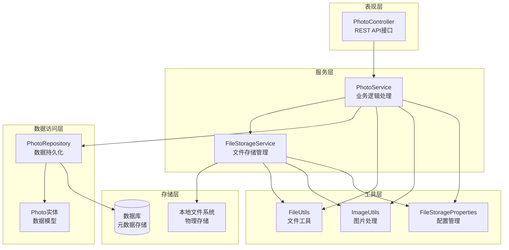
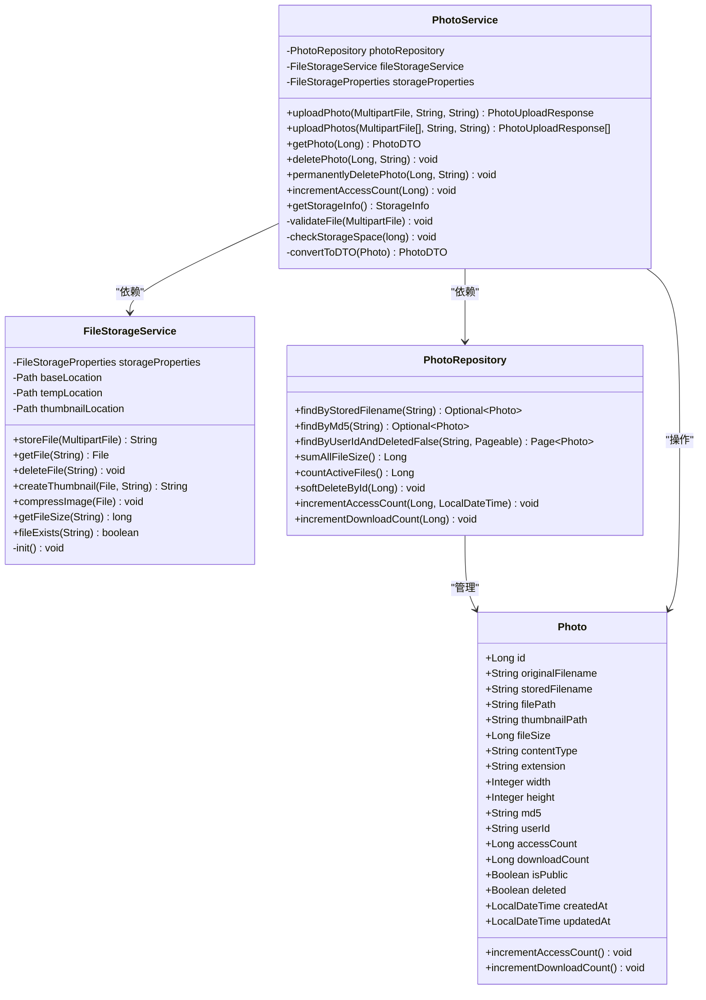
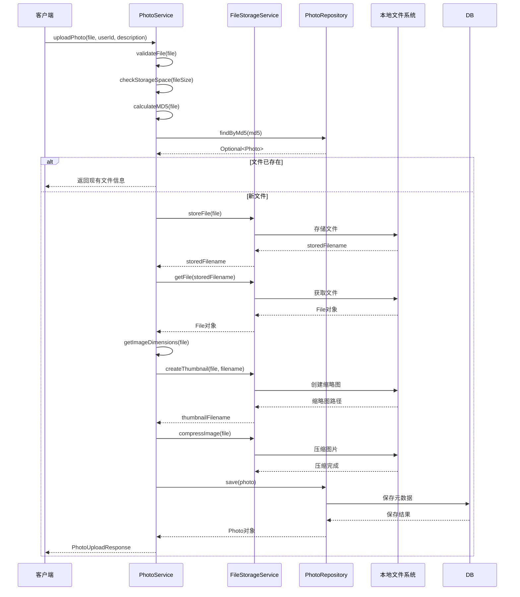
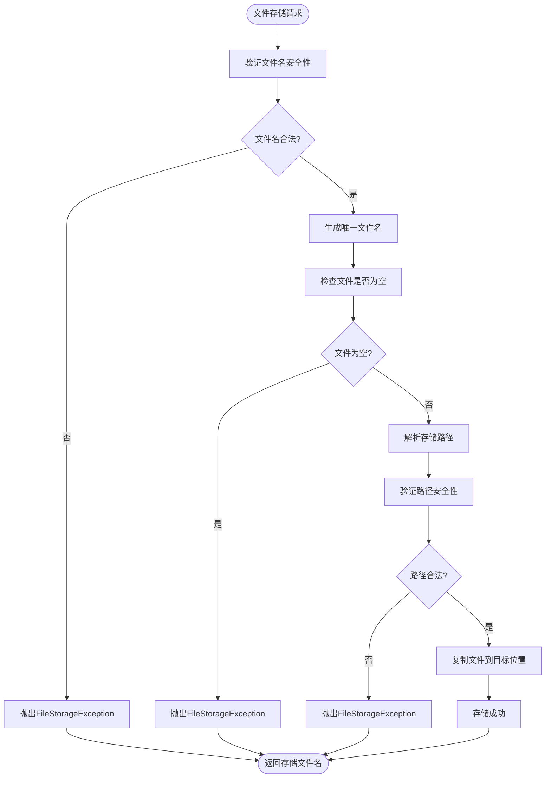
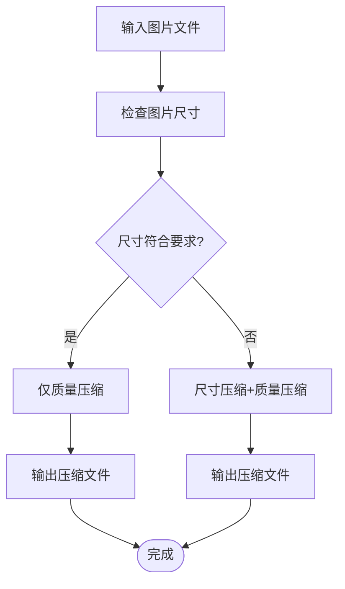
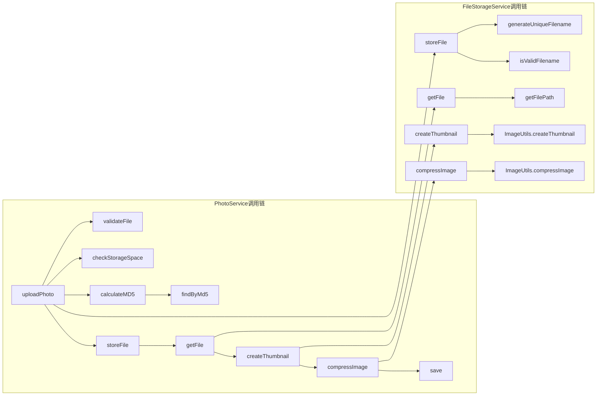
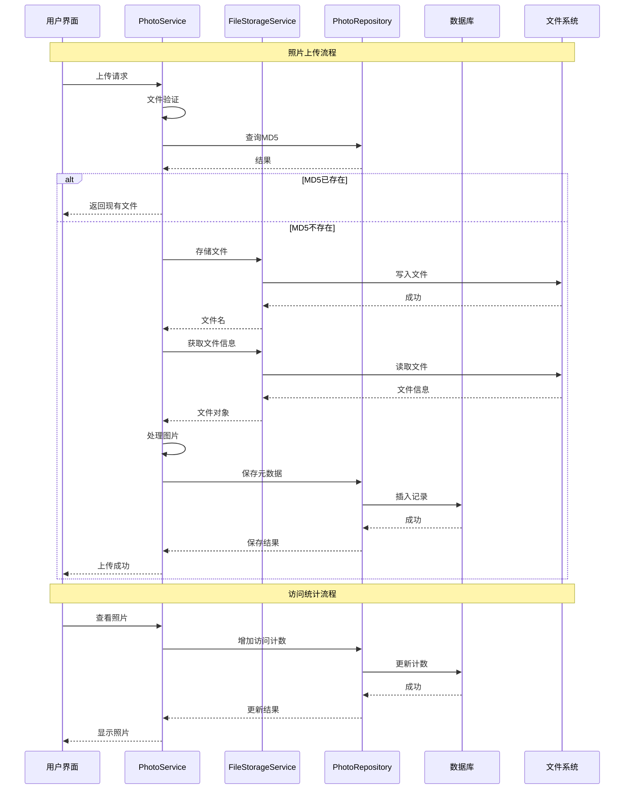
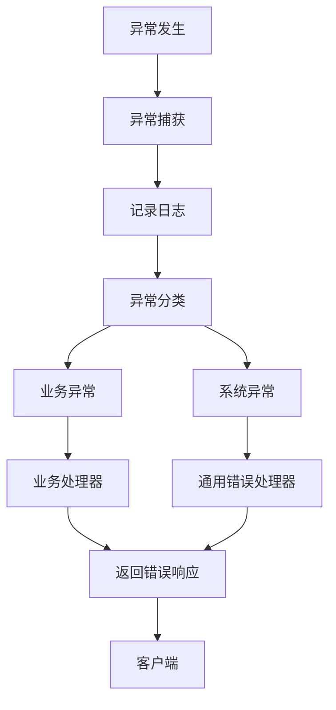

# 核心服务架构文档

<cite>
**本文档引用的文件**
- [PhotoService.java](file://src/main/java/com/photo/service/PhotoService.java)
- [FileStorageService.java](file://src/main/java/com/photo/service/FileStorageService.java)
- [PhotoRepository.java](file://src/main/java/com/photo/repository/PhotoRepository.java)
- [Photo.java](file://src/main/java/com/photo/entity/Photo.java)
- [FileStorageProperties.java](file://src/main/java/com/photo/config/FileStorageProperties.java)
- [FileUtils.java](file://src/main/java/com/photo/util/FileUtils.java)
- [ImageUtils.java](file://src/main/java/com/photo/util/ImageUtils.java)
- [PhotoDTO.java](file://src/main/java/com/photo/dto/PhotoDTO.java)
- [application.yml](file://src/main/resources/application.yml)
- [PhotoServiceTest.java](file://src/test/java/com/photo/service/PhotoServiceTest.java)
</cite>

## 目录
1. [项目概述](#项目概述)
2. [系统架构概览](#系统架构概览)
3. [核心服务组件](#核心服务组件)
4. [PhotoService深度分析](#photoservice深度分析)
5. [FileStorageService深度分析](#filestorageservice深度分析)
6. [服务间协作机制](#服务间协作机制)
7. [数据流与事务管理](#数据流与事务管理)
8. [安全机制与异常处理](#安全机制与异常处理)
9. [性能优化策略](#性能优化策略)
10. [总结](#总结)

## 项目概述

本项目是一个基于Spring Boot的照片上传管理系统，采用分层架构设计，主要包含两个核心业务服务：PhotoService负责照片元数据管理和业务逻辑处理，FileStorageService负责物理文件的存储和管理。系统实现了完整的照片上传、存储、检索、访问统计等功能，同时具备软删除、文件去重、压缩优化等高级特性。

## 系统架构概览

**图表来源**
- [PhotoService.java](file://src/main/java/com/photo/service/PhotoService.java#L1-L50)
- [FileStorageService.java](file://src/main/java/com/photo/service/FileStorageService.java#L1-L50)
- [PhotoRepository.java](file://src/main/java/com/photo/repository/PhotoRepository.java#L1-L30)

## 核心服务组件

### 服务组件关系图

**图表来源**
- [PhotoService.java](file://src/main/java/com/photo/service/PhotoService.java#L25-L45)
- [FileStorageService.java](file://src/main/java/com/photo/service/FileStorageService.java#L20-L40)
- [PhotoRepository.java](file://src/main/java/com/photo/repository/PhotoRepository.java#L15-L35)
- [Photo.java](file://src/main/java/com/photo/entity/Photo.java#L20-L80)

## PhotoService深度分析

PhotoService是系统的核心业务服务，负责协调PhotoRepository和FileStorageService完成完整的照片管理流程。

### 核心功能模块

#### 1. 照片上传流程编排

**图表来源**
- [PhotoService.java](file://src/main/java/com/photo/service/PhotoService.java#L45-L120)
- [FileStorageService.java](file://src/main/java/com/photo/service/FileStorageService.java#L50-L100)

#### 2. 文件去重机制

PhotoService实现了基于MD5的文件去重机制，通过以下步骤确保文件唯一性：

- **MD5计算**：使用`FileUtils.calculateMD5()`计算文件的MD5哈希值
- **重复检查**：通过`photoRepository.findByMd5(md5)`查询是否存在相同文件
- **智能返回**：如果发现重复文件，直接返回现有记录而非重新存储

#### 3. 访问统计更新

系统提供了两种访问统计机制：
- **访问计数**：记录每次查看的次数，使用`incrementAccessCount()`方法
- **下载计数**：记录每次下载的次数，使用`incrementDownloadCount()`方法

#### 4. 软删除机制

系统采用软删除策略，通过设置`deleted`字段为true来标记删除状态，而不是物理删除记录。软删除操作通过`photoRepository.softDeleteById(id)`实现。

**章节来源**
- [PhotoService.java](file://src/main/java/com/photo/service/PhotoService.java#L45-L200)

### 关键方法实现分析

#### 文件验证方法
`validateFile()`方法实现了多层文件验证：
- 空文件检查
- 图片类型验证（MIME类型和扩展名）
- 文件大小限制检查
- 图片有效性验证

#### 存储空间检查
`checkStorageSpace()`方法通过比较当前使用空间与最大限制来防止存储溢出。

#### 批量上传处理
`uploadPhotos()`方法支持批量上传，具有错误隔离机制，即使某个文件上传失败也不会影响其他文件。

## FileStorageService深度分析

FileStorageService是独立的文件存储服务，负责物理文件的存储、读取、删除和属性提取，与本地文件系统直接交互。

### 核心功能模块

#### 1. 文件存储流程

**图表来源**
- [FileStorageService.java](file://src/main/java/com/photo/service/FileStorageService.java#L50-L100)

#### 2. 文件安全管理

FileStorageService实现了多层次的安全防护：

##### 路径遍历攻击防护
- 使用`Paths.get(filename).normalize()`规范化文件路径
- 验证目标路径是否在允许的基目录内
- 检查文件名是否包含危险字符（..、/、\\）

##### 文件名清理
`FileUtils.sanitizeFilename()`方法移除潜在危险字符，替换为安全字符。

#### 3. 缩略图生成功能

系统自动为上传的图片创建缩略图：
- **尺寸控制**：默认200×200像素
- **质量保持**：使用80%的质量参数
- **异步处理**：在后台线程中创建缩略图

#### 4. 图片压缩优化

**图表来源**
- [ImageUtils.java](file://src/main/java/com/photo/util/ImageUtils.java#L60-L100)

**章节来源**
- [FileStorageService.java](file://src/main/java/com/photo/service/FileStorageService.java#L50-L200)
- [ImageUtils.java](file://src/main/java/com/photo/util/ImageUtils.java#L1-L100)

### 关键技术特性

#### 1. 断点续传支持
`readFileRange()`方法支持HTTP Range请求，实现断点续传功能。

#### 2. 文件大小检测
提供精确的文件大小检测，支持大文件处理。

#### 3. 批量操作
支持批量文件删除和清理操作。

## 服务间协作机制

### 调用关系图

**图表来源**
- [PhotoService.java](file://src/main/java/com/photo/service/PhotoService.java#L45-L120)
- [FileStorageService.java](file://src/main/java/com/photo/service/FileStorageService.java#L50-L150)

### 事务边界管理

系统采用声明式事务管理，主要事务边界如下：

#### 1. 上传事务
- **范围**：整个上传过程
- **回滚条件**：任何环节失败
- **涉及组件**：PhotoService、FileStorageService、PhotoRepository

#### 2. 删除事务
- **范围**：软删除或物理删除
- **回滚条件**：文件删除失败
- **涉及组件**：PhotoService、FileStorageService

#### 3. 统计更新事务
- **范围**：访问计数和下载计数更新
- **回滚条件**：数据库更新失败
- **涉及组件**：PhotoRepository

**章节来源**
- [PhotoService.java](file://src/main/java/com/photo/service/PhotoService.java#L45-L50)
- [PhotoRepository.java](file://src/main/java/com/photo/repository/PhotoRepository.java#L80-L110)

## 数据流与事务管理

### 数据流架构

**图表来源**
- [PhotoService.java](file://src/main/java/com/photo/service/PhotoService.java#L45-L120)
- [PhotoRepository.java](file://src/main/java/com/photo/repository/PhotoRepository.java#L80-L110)

### 异常传播机制

系统实现了完善的异常处理和传播机制：

#### 1. 异常分类体系

| 异常类型 | 触发条件 | 处理策略 |
|---------|---------|---------|
| FileTypeException | 文件类型不支持 | 返回400 Bad Request |
| FileSizeException | 文件大小超限 | 返回413 Payload Too Large |
| StorageFullException | 存储空间不足 | 返回507 Insufficient Storage |
| FileNotFoundException | 文件不存在 | 返回404 Not Found |
| AccessDeniedException | 权限不足 | 返回403 Forbidden |

#### 2. 异常处理流程

**图表来源**
- [PhotoService.java](file://src/main/java/com/photo/service/PhotoService.java#L120-L150)

**章节来源**
- [PhotoService.java](file://src/main/java/com/photo/service/PhotoService.java#L120-L180)

## 安全机制与异常处理

### 安全防护措施

#### 1. 文件名安全处理
- **路径遍历防护**：严格验证文件名，防止../等危险字符
- **字符过滤**：移除潜在危险字符，使用安全字符集
- **长度限制**：对文件名长度进行合理限制

#### 2. 文件类型验证
- **MIME类型检测**：使用Apache Tika进行准确的文件类型识别
- **扩展名验证**：双重验证确保文件类型一致性
- **内容验证**：通过图像库验证文件内容的有效性

#### 3. 存储空间保护
- **实时监控**：上传前检查可用空间
- **容量限制**：配置最大存储容量
- **定期清理**：自动清理过期文件

### 异常处理策略

#### 1. 分层异常处理
- **服务层**：业务逻辑异常处理
- **控制器层**：HTTP响应异常处理
- **全局异常**：统一异常处理机制

#### 2. 错误恢复机制
- **文件删除回退**：删除失败时的回滚机制
- **事务回滚**：数据库操作失败时的事务回滚
- **缓存同步**：删除操作时的缓存同步

**章节来源**
- [FileUtils.java](file://src/main/java/com/photo/util/FileUtils.java#L100-L150)
- [PhotoService.java](file://src/main/java/com/photo/service/PhotoService.java#L300-L350)

## 性能优化策略

### 缓存机制

系统实现了多级缓存策略：

#### 1. 照片信息缓存
- **缓存键**：照片ID或文件名
- **缓存时间**：1小时
- **失效策略**：写操作时主动失效

#### 2. 存储信息缓存
- **缓存内容**：存储使用情况
- **更新频率**：定期刷新

### 异步处理

#### 1. 缩略图生成
缩略图创建采用异步处理，避免阻塞主流程。

#### 2. 定期清理任务
使用Spring Schedule实现定时清理，减少系统负载。

### 批量操作优化

#### 1. 批量上传
支持最多10个文件的批量上传，提高网络效率。

#### 2. 批量删除
提供批量软删除功能，减少数据库操作次数。

**章节来源**
- [PhotoService.java](file://src/main/java/com/photo/service/PhotoService.java#L200-L250)
- [FileStorageProperties.java](file://src/main/java/com/photo/config/FileStorageProperties.java#L70-L94)

## 总结

本项目的核心服务架构展现了现代Java应用的最佳实践：

### 架构优势

1. **职责分离**：PhotoService专注于业务逻辑，FileStorageService专注文件存储，职责清晰
2. **事务一致性**：通过声明式事务保证数据一致性
3. **安全防护**：多层次的安全机制保护系统免受攻击
4. **性能优化**：缓存、异步处理等优化策略提升系统性能
5. **可扩展性**：模块化设计便于功能扩展和维护

### 技术亮点

1. **文件去重**：基于MD5的智能去重机制节省存储空间
2. **软删除**：灵活的数据删除策略保护数据完整性
3. **压缩优化**：智能图片压缩平衡质量和存储需求
4. **异常处理**：完善的异常处理和恢复机制
5. **监控告警**：定期清理和存储监控确保系统稳定运行

### 应用价值

该架构不仅满足了基本的照片管理需求，还通过以下特性提升了系统价值：
- **高可靠性**：多重备份和恢复机制
- **高性能**：缓存和异步处理优化
- **高安全性**：全面的安全防护措施
- **易维护性**：清晰的架构和完善的日志

这种设计模式可以作为企业级文件管理系统的重要参考，为类似项目提供了完整的解决方案。