# 照片服务详细文档

<cite>
**本文档引用的文件**
- [PhotoService.java](file://src/main/java/com/photo/service/PhotoService.java)
- [PhotoRepository.java](file://src/main/java/com/photo/repository/PhotoRepository.java)
- [FileStorageService.java](file://src/main/java/com/photo/service/FileStorageService.java)
- [Photo.java](file://src/main/java/com/photo/entity/Photo.java)
- [PhotoDTO.java](file://src/main/java/com/photo/dto/PhotoDTO.java)
- [PhotoController.java](file://src/main/java/com/photo/controller/PhotoController.java)
- [FileStorageProperties.java](file://src/main/java/com/photo/config/FileStorageProperties.java)
- [FileUtils.java](file://src/main/java/com/photo/util/FileUtils.java)
- [ImageUtils.java](file://src/main/java/com/photo/util/ImageUtils.java)
- [application.yml](file://src/main/resources/application.yml)
</cite>

## 目录
1. [简介](#简介)
2. [系统架构概览](#系统架构概览)
3. [核心组件分析](#核心组件分析)
4. [照片上传功能](#照片上传功能)
5. [照片查询与检索](#照片查询与检索)
6. [照片删除管理](#照片删除管理)
7. [访问统计与计数](#访问统计与计数)
8. [缓存策略与性能优化](#缓存策略与性能优化)
9. [定时清理任务](#定时清理任务)
10. [异常处理机制](#异常处理机制)
11. [数据传输对象(DTO)](#数据传输对象dto)
12. [最佳实践与建议](#最佳实践与建议)

## 简介

PhotoService是照片管理系统的核心业务协调者，负责整合PhotoRepository和FileStorageService两大核心组件，实现照片的全生命周期管理。该服务提供了完整的照片上传、查询、删除、统计等功能，采用Spring Boot框架构建，具备高可用性和可扩展性。

## 系统架构概览

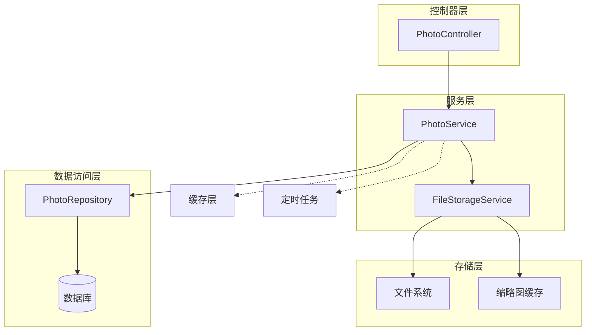

**图表来源**
- [PhotoService.java](file://src/main/java/com/photo/service/PhotoService.java#L1-L385)
- [PhotoController.java](file://src/main/java/com/photo/controller/PhotoController.java#L1-L316)
- [FileStorageService.java](file://src/main/java/com/photo/service/FileStorageService.java#L1-L300)

**章节来源**
- [PhotoService.java](file://src/main/java/com/photo/service/PhotoService.java#L1-L50)
- [PhotoController.java](file://src/main/java/com/photo/controller/PhotoController.java#L1-L50)

## 核心组件分析

### PhotoService核心职责

PhotoService作为核心业务协调者，承担以下关键职责：

1. **业务逻辑协调**：整合数据访问和文件存储的复杂业务逻辑
2. **事务管理**：确保数据一致性的事务边界控制
3. **缓存管理**：智能缓存策略提升系统性能
4. **权限验证**：用户权限和资源访问控制
5. **异常处理**：统一的异常处理和错误响应机制

### 架构设计原则

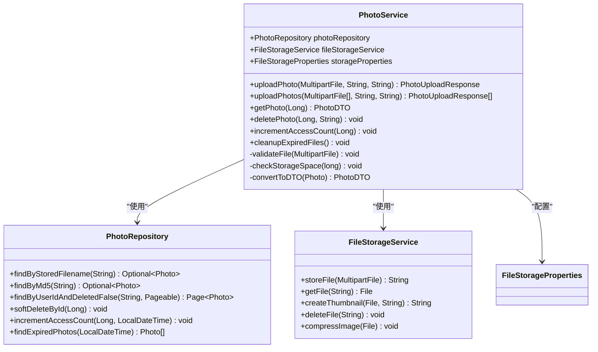

**图表来源**
- [PhotoService.java](file://src/main/java/com/photo/service/PhotoService.java#L25-L50)
- [PhotoRepository.java](file://src/main/java/com/photo/repository/PhotoRepository.java#L15-L30)
- [FileStorageService.java](file://src/main/java/com/photo/service/FileStorageService.java#L25-L45)

**章节来源**
- [PhotoService.java](file://src/main/java/com/photo/service/PhotoService.java#L25-L100)
- [PhotoRepository.java](file://src/main/java/com/photo/repository/PhotoRepository.java#L15-L50)
- [FileStorageService.java](file://src/main/java/com/photo/service/FileStorageService.java#L25-L70)

## 照片上传功能

### 单文件上传实现

PhotoService的单文件上传功能实现了完整的照片处理流程：

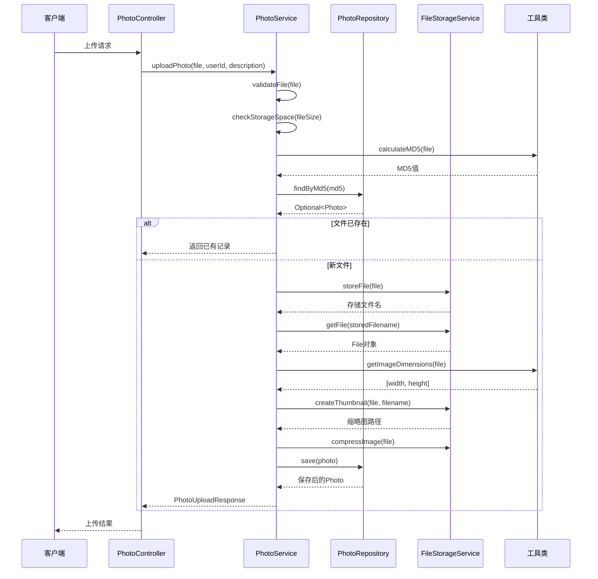

**图表来源**
- [PhotoService.java](file://src/main/java/com/photo/service/PhotoService.java#L45-L120)
- [FileStorageService.java](file://src/main/java/com/photo/service/FileStorageService.java#L60-L100)
- [FileUtils.java](file://src/main/java/com/photo/util/FileUtils.java#L100-L130)

### 批量上传功能

批量上传功能支持一次性上传多个文件，具有以下特点：

1. **并发处理**：每个文件独立处理，互不影响
2. **错误隔离**：单个文件失败不影响其他文件处理
3. **性能优化**：减少HTTP请求次数
4. **容量限制**：防止恶意批量上传

### 基于MD5的文件去重机制

系统采用MD5哈希值进行文件去重，确保相同内容的文件只存储一份：

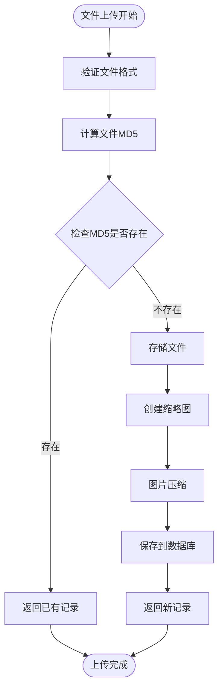

**图表来源**
- [PhotoService.java](file://src/main/java/com/photo/service/PhotoService.java#L45-L85)
- [FileUtils.java](file://src/main/java/com/photo/util/FileUtils.java#L100-L130)

**章节来源**
- [PhotoService.java](file://src/main/java/com/photo/service/PhotoService.java#L45-L150)
- [FileUtils.java](file://src/main/java/com/photo/util/FileUtils.java#L100-L150)

## 照片查询与检索

### 分页查询功能

PhotoService提供了多种分页查询方法，支持不同场景的查询需求：

| 查询类型 | 方法 | 功能描述 | 排序规则 |
|---------|------|----------|----------|
| 用户照片 | `getUserPhotos()` | 查询指定用户的照片列表 | 按创建时间倒序 |
| 公开照片 | `getPublicPhotos()` | 查询所有公开的照片 | 按创建时间倒序 |
| 搜索照片 | `searchPhotos()` | 根据文件名关键词搜索 | 按创建时间倒序 |
| 热门照片 | `findPopularPhotos()` | 查询访问量最高的照片 | 按访问次数倒序 |

### 搜索功能实现

搜索功能支持模糊匹配文件名，提供灵活的查询能力：

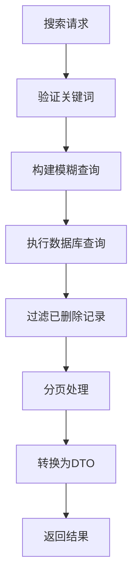

**图表来源**
- [PhotoService.java](file://src/main/java/com/photo/service/PhotoService.java#L150-L180)
- [PhotoRepository.java](file://src/main/java/com/photo/repository/PhotoRepository.java#L35-L45)

### 缓存策略

查询功能采用了智能缓存策略，提升系统性能：

1. **单条查询缓存**：对单个照片信息使用`@Cacheable`注解
2. **查询结果缓存**：对分页查询结果进行缓存
3. **缓存失效**：在数据变更时自动清除相关缓存

**章节来源**
- [PhotoService.java](file://src/main/java/com/photo/service/PhotoService.java#L150-L200)
- [PhotoRepository.java](file://src/main/java/com/photo/repository/PhotoRepository.java#L25-L80)

## 照片删除管理

### 软删除机制

系统采用软删除机制，保留数据完整性的同时实现逻辑删除：

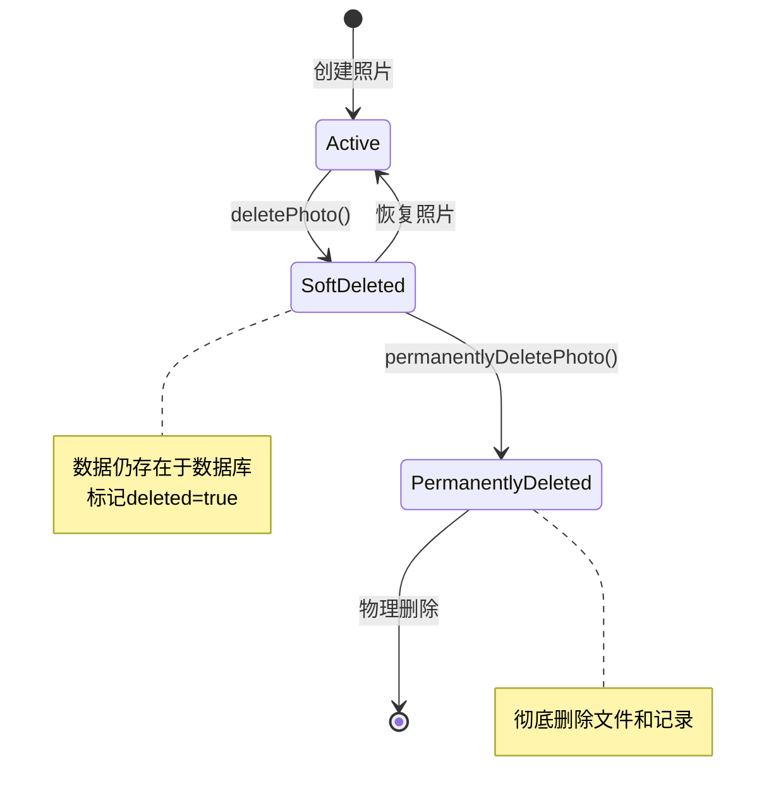

**图表来源**
- [PhotoService.java](file://src/main/java/com/photo/service/PhotoService.java#L200-L250)
- [PhotoRepository.java](file://src/main/java/com/photo/repository/PhotoRepository.java#L70-L90)

### 权限控制机制

删除操作实施严格的权限控制：

1. **身份验证**：验证用户身份
2. **资源所有权检查**：确认用户是否拥有删除权限
3. **操作审计**：记录删除操作日志

### 物理删除流程

物理删除不仅删除数据库记录，还同步删除文件系统中的文件：

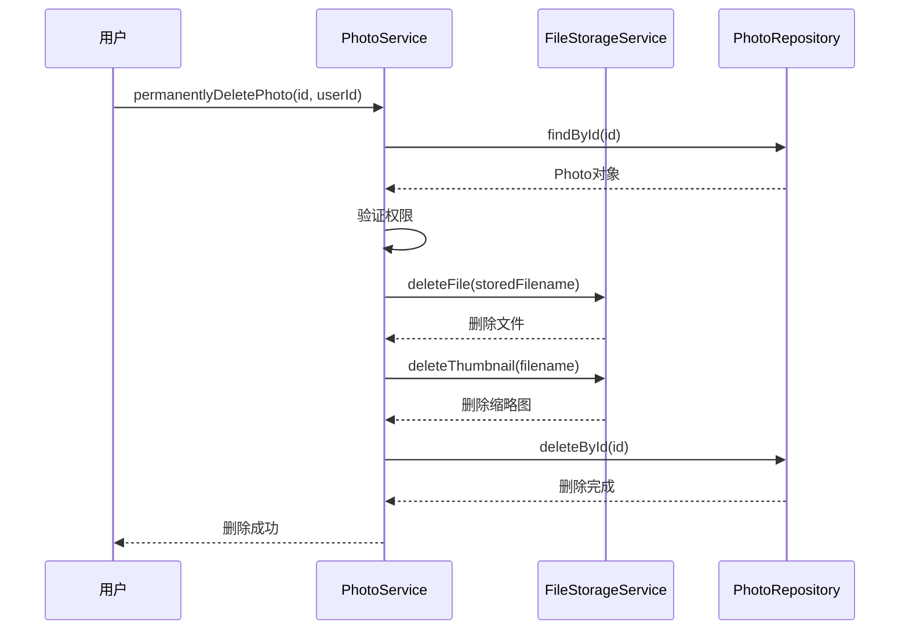

**图表来源**
- [PhotoService.java](file://src/main/java/com/photo/service/PhotoService.java#L220-L250)
- [FileStorageService.java](file://src/main/java/com/photo/service/FileStorageService.java#L180-L220)

**章节来源**
- [PhotoService.java](file://src/main/java/com/photo/service/PhotoService.java#L200-L280)
- [PhotoRepository.java](file://src/main/java/com/photo/repository/PhotoRepository.java#L70-L110)

## 访问统计与计数

### 访问计数更新策略

系统提供了两种计数器更新机制：

1. **访问计数器**：记录每次查看操作
2. **下载计数器**：记录每次下载操作

### 计数器更新流程

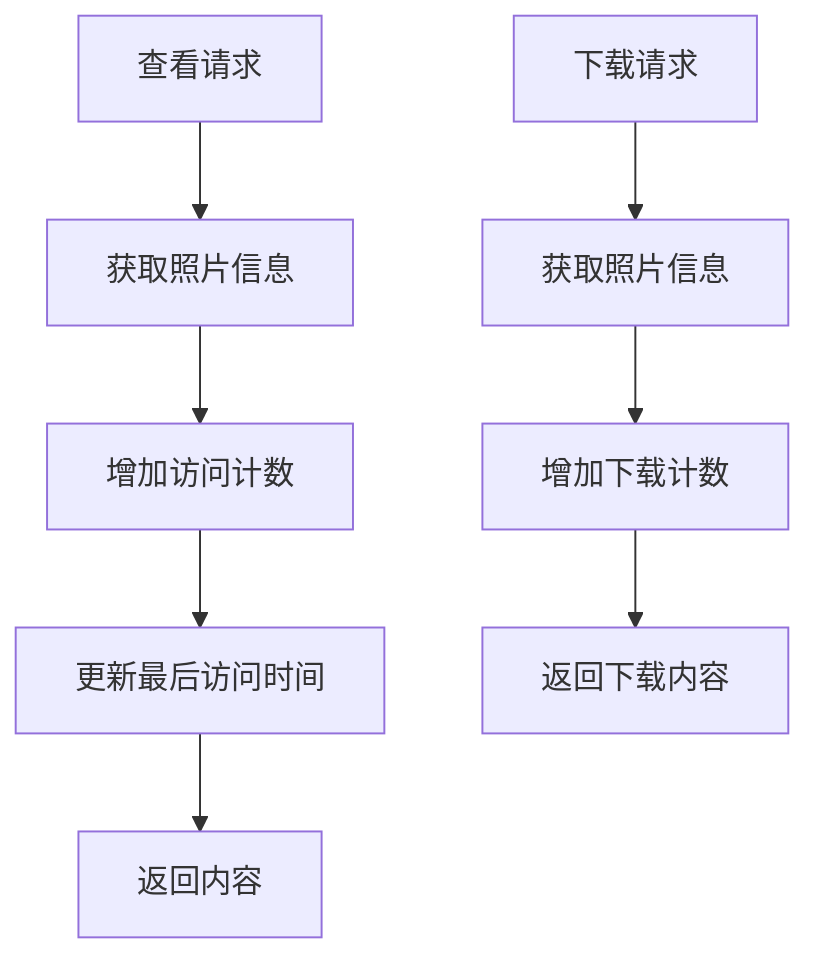

**图表来源**
- [PhotoService.java](file://src/main/java/com/photo/service/PhotoService.java#L280-L300)
- [PhotoRepository.java](file://src/main/java/com/photo/repository/PhotoRepository.java#L90-L110)

### 性能优化考虑

1. **异步更新**：计数器更新采用异步方式，避免阻塞主要业务流程
2. **批量更新**：支持批量更新多个计数器
3. **缓存策略**：热点数据缓存，减少数据库访问

**章节来源**
- [PhotoService.java](file://src/main/java/com/photo/service/PhotoService.java#L280-L320)
- [PhotoRepository.java](file://src/main/java/com/photo/repository/PhotoRepository.java#L90-L112)

## 缓存策略与性能优化

### Spring缓存注解应用

PhotoService充分利用Spring缓存注解提升性能：

| 注解 | 使用场景 | 缓存键 | 过期策略 |
|------|----------|--------|----------|
| `@Cacheable` | 查询单个照片 | `photos:id` | 1小时 |
| `@CacheEvict` | 删除操作 | `photos:id` | 立即清除 |
| `@Cacheable` | 查询文件名 | `photos:filename` | 1小时 |

### 缓存配置详解

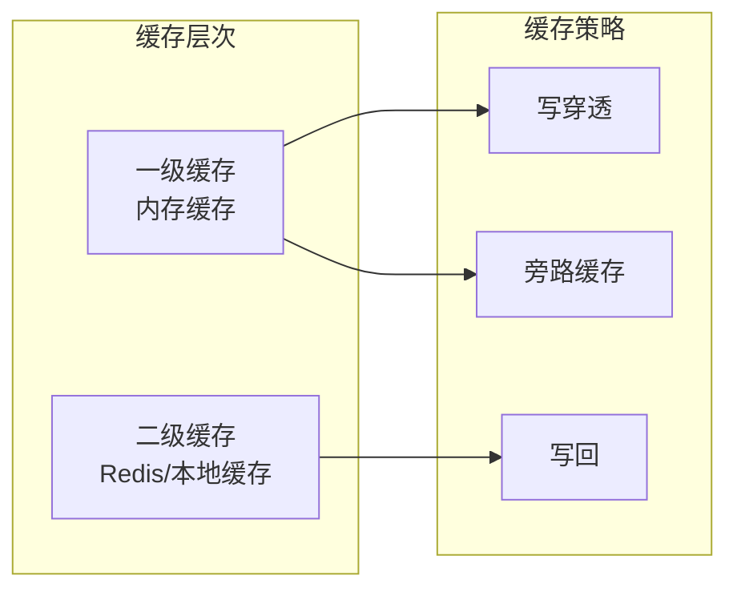

**图表来源**
- [PhotoService.java](file://src/main/java/com/photo/service/PhotoService.java#L130-L150)
- [application.yml](file://src/main/resources/application.yml#L50-L60)

### 性能优化手段

1. **数据库索引优化**：为常用查询字段建立索引
2. **连接池配置**：优化数据库连接池参数
3. **批量操作**：减少数据库交互次数
4. **异步处理**：非关键操作异步执行

**章节来源**
- [PhotoService.java](file://src/main/java/com/photo/service/PhotoService.java#L130-L160)
- [application.yml](file://src/main/resources/application.yml#L50-L70)

## 定时清理任务

### 定时任务配置

系统配置了定期清理任务，自动清理过期文件：

```mermaid
gantt
title 定时清理任务执行计划
dateFormat HH:mm
axisFormat %H:%M
section 清理周期
每日凌晨2点 :daily, 02:00, 02:05
section 执行步骤
检查过期文件 :milestone, 02:00, 0m
物理删除文件 :active, 02:00, 02:03
清理数据库记录 :active, 02:03, 02:05
```

**图表来源**
- [PhotoService.java](file://src/main/java/com/photo/service/PhotoService.java#L320-L360)
- [FileStorageProperties.java](file://src/main/java/com/photo/config/FileStorageProperties.java#L70-L85)

### 清理任务执行流程

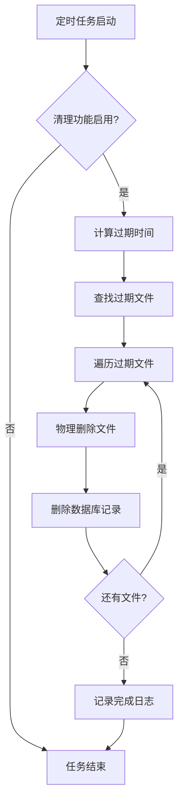

**图表来源**
- [PhotoService.java](file://src/main/java/com/photo/service/PhotoService.java#L320-L360)

### 配置参数说明

| 参数 | 默认值 | 说明 |
|------|--------|------|
| `enabled` | `true` | 是否启用清理功能 |
| `daysToKeep` | `30` | 保留天数 |
| `cron` | `"0 0 2 * * ?"` | 定时任务表达式 |

**章节来源**
- [PhotoService.java](file://src/main/java/com/photo/service/PhotoService.java#L320-L385)
- [FileStorageProperties.java](file://src/main/java/com/photo/config/FileStorageProperties.java#L70-L94)

## 异常处理机制

### 异常分类体系

PhotoService建立了完善的异常处理体系：

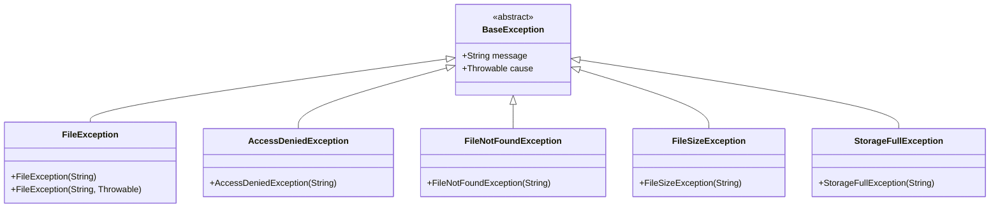

**图表来源**
- [PhotoService.java](file://src/main/java/com/photo/service/PhotoService.java#L15-L25)
- [PhotoController.java](file://src/main/java/com/photo/controller/PhotoController.java#L15-L30)

### 异常处理最佳实践

1. **统一异常处理**：通过全局异常处理器统一处理
2. **详细错误信息**：提供具体的错误原因和解决建议
3. **安全考虑**：避免泄露敏感信息
4. **日志记录**：详细记录异常信息便于排查

**章节来源**
- [PhotoService.java](file://src/main/java/com/photo/service/PhotoService.java#L15-L30)
- [PhotoController.java](file://src/main/java/com/photo/controller/PhotoController.java#L15-L50)

## 数据传输对象(DTO)

### DTO设计原则

PhotoService使用DTO模式实现数据传输的解耦：

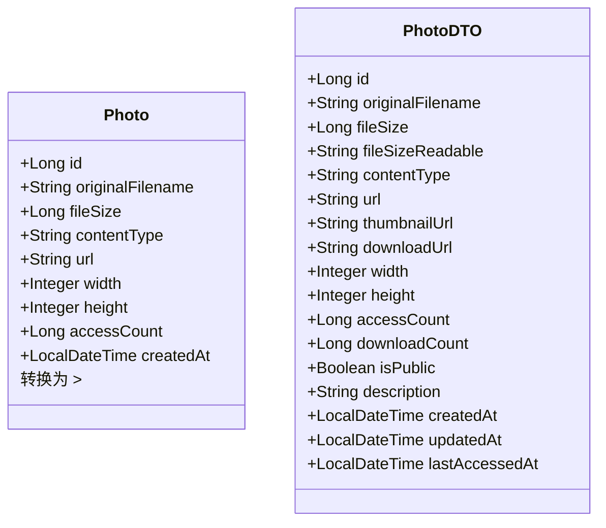

**图表来源**
- [Photo.java](file://src/main/java/com/photo/entity/Photo.java#L20-L100)
- [PhotoDTO.java](file://src/main/java/com/photo/dto/PhotoDTO.java#L15-L80)

### DTO转换策略

1. **选择性暴露**：只暴露必要的字段
2. **格式化处理**：对文件大小等字段进行格式化
3. **URL生成**：动态生成访问链接
4. **权限过滤**：根据用户权限过滤敏感信息

**章节来源**
- [PhotoDTO.java](file://src/main/java/com/photo/dto/PhotoDTO.java#L15-L104)
- [PhotoService.java](file://src/main/java/com/photo/service/PhotoService.java#L360-L385)

## 最佳实践与建议

### 事务管理最佳实践

1. **合理定义事务边界**：在业务方法上使用`@Transactional`
2. **异常处理**：确保异常时事务正确回滚
3. **性能考虑**：避免长时间持有事务锁

### 缓存使用建议

1. **缓存粒度**：选择合适的缓存粒度
2. **缓存一致性**：及时更新和清除缓存
3. **缓存容量**：合理设置缓存容量限制

### 性能优化建议

1. **数据库优化**：合理使用索引和查询优化
2. **文件存储**：采用分布式文件存储
3. **并发控制**：合理设置并发限制
4. **监控告警**：建立完善的监控体系

### 安全考虑

1. **文件验证**：严格验证上传文件
2. **权限控制**：实施细粒度权限管理
3. **输入校验**：对所有输入进行严格校验
4. **日志审计**：记录重要操作日志

### 扩展性设计

1. **模块化设计**：保持组件间的低耦合
2. **配置化管理**：通过配置文件管理参数
3. **插件机制**：支持功能扩展
4. **版本兼容**：保证API版本兼容性

**章节来源**
- [PhotoService.java](file://src/main/java/com/photo/service/PhotoService.java#L45-L385)
- [application.yml](file://src/main/resources/application.yml#L1-L173)