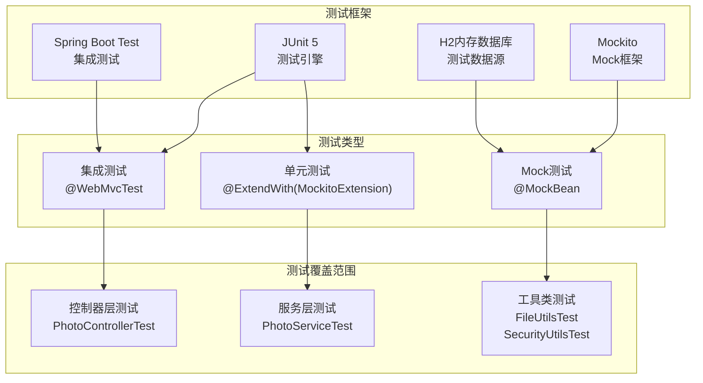
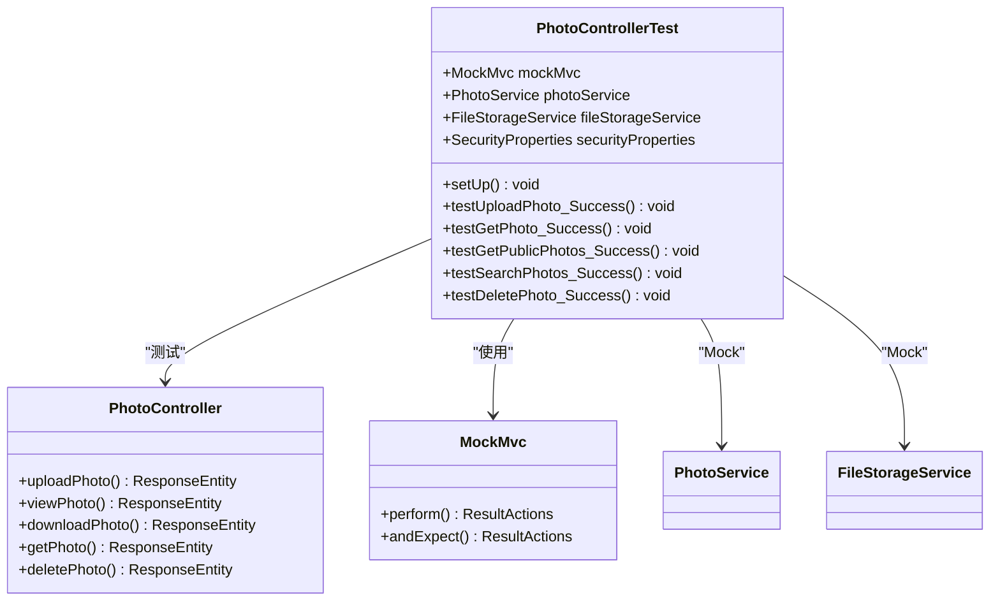
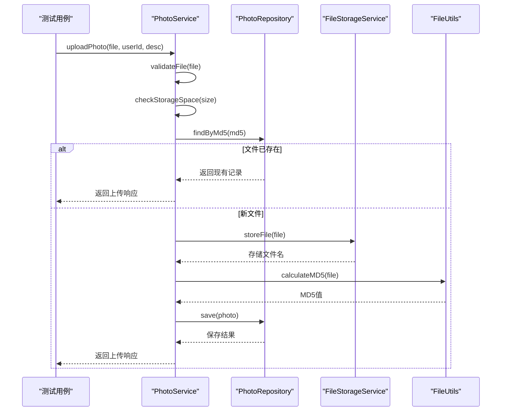
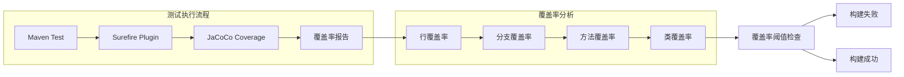
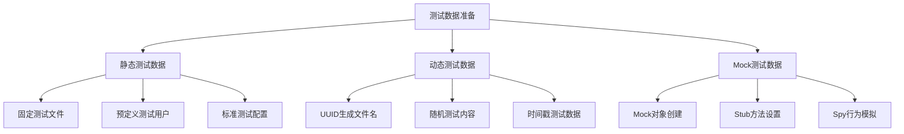
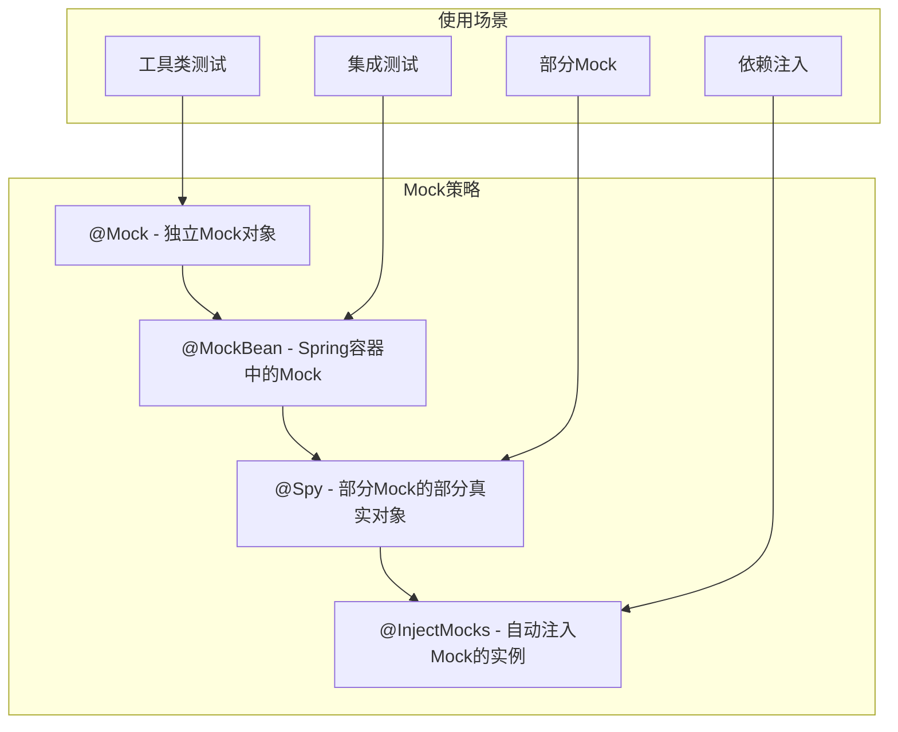
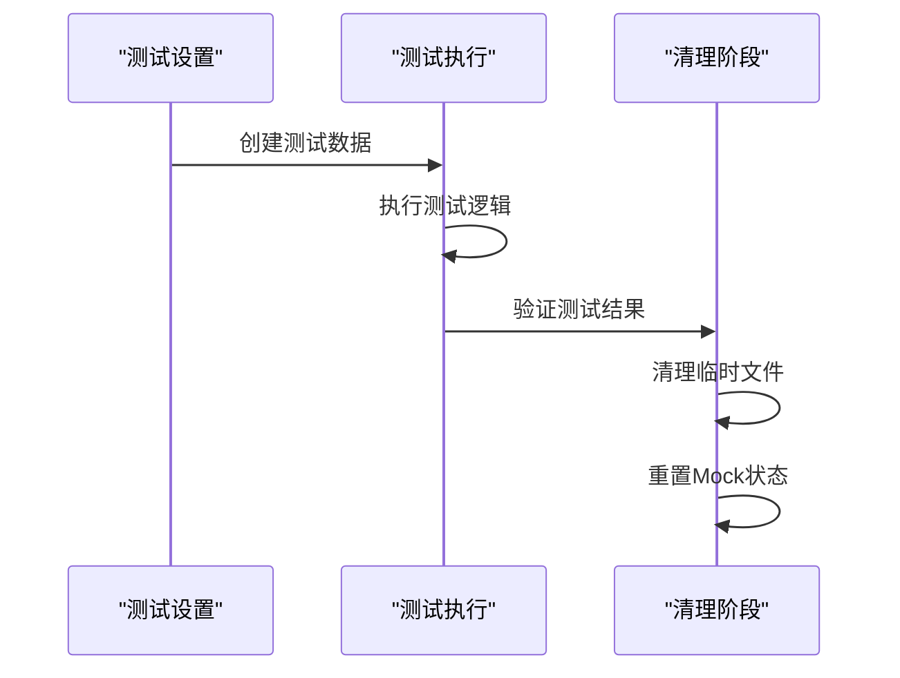
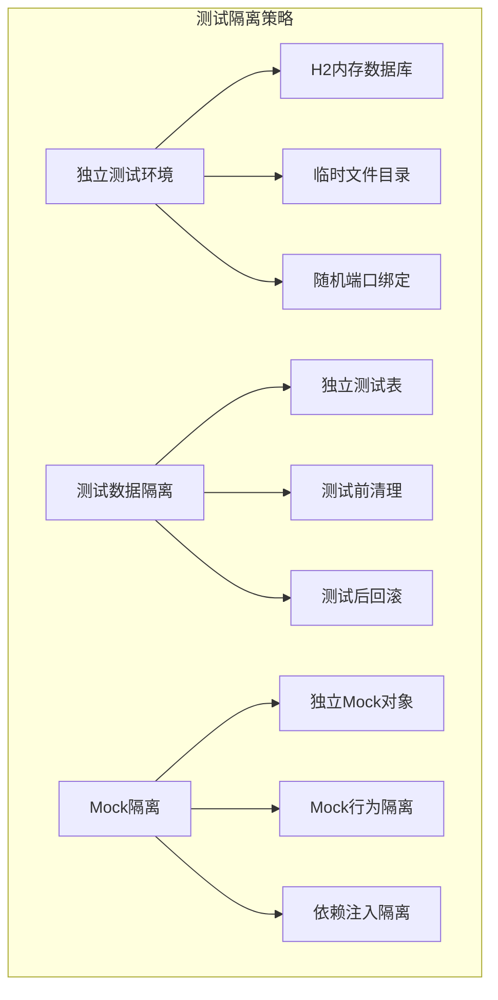
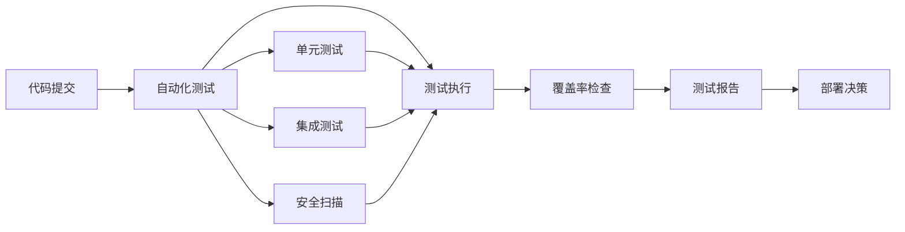

# 测试策略

<cite>
**本文档引用的文件**
- [pom.xml](file://pom.xml)
- [PhotoControllerTest.java](file://src/test/java/com/photo/controller/PhotoControllerTest.java)
- [PhotoServiceTest.java](file://src/test/java/com/photo/service/PhotoServiceTest.java)
- [FileUtilsTest.java](file://src/test/java/com/photo/util/FileUtilsTest.java)
- [SecurityUtilsTest.java](file://src/test/java/com/photo/util/SecurityUtilsTest.java)
- [application-test.yml](file://src/test/resources/application-test.yml)
- [PhotoController.java](file://src/main/java/com/photo/controller/PhotoController.java)
- [PhotoService.java](file://src/main/java/com/photo/service/PhotoService.java)
- [FileUtils.java](file://src/main/java/com/photo/util/FileUtils.java)
- [SecurityUtils.java](file://src/main/java/com/photo/util/SecurityUtils.java)
- [Photo.java](file://src/main/java/com/photo/entity/Photo.java)
- [PhotoDTO.java](file://src/main/java/com/photo/dto/PhotoDTO.java)
- [PhotoRepository.java](file://src/main/java/com/photo/repository/PhotoRepository.java)
</cite>

## 目录
1. [项目概述](#项目概述)
2. [测试框架架构](#测试框架架构)
3. [测试组件分析](#测试组件分析)
4. [测试覆盖率目标](#测试覆盖率目标)
5. [测试运行指南](#测试运行指南)
6. [测试编写指导原则](#测试编写指导原则)
7. [安全测试重点](#安全测试重点)
8. [测试最佳实践](#测试最佳实践)
9. [故障排除指南](#故障排除指南)
10. [总结](#总结)

## 项目概述

本项目是一个基于Spring Boot的图片上传与管理系统，采用分层架构设计，包含控制器层、服务层、数据访问层和工具类层。系统提供了完整的图片上传、存储、管理和访问功能，支持多种图片格式，具备文件大小限制、类型验证、安全防护等特性。

### 核心功能模块
- **图片上传管理**：支持单文件和批量上传，自动处理文件去重
- **图片存储系统**：基于文件系统的分布式存储，支持缩略图生成
- **访问控制**：支持公开和私有文件访问，基于用户权限验证
- **文件安全**：内置XSS防护、路径遍历攻击防护、SQL注入防护
- **性能优化**：缓存机制、定时清理任务、断点续传支持

## 测试框架架构

### 技术栈概览



**图表来源**
- [pom.xml](file://pom.xml#L1-L155)
- [PhotoControllerTest.java](file://src/test/java/com/photo/controller/PhotoControllerTest.java#L1-L174)
- [PhotoServiceTest.java](file://src/test/java/com/photo/service/PhotoServiceTest.java#L1-L210)

### 依赖配置分析

项目使用以下核心测试依赖：
- **Spring Boot Starter Test**：提供Spring Boot应用的测试支持
- **Spring Security Test**：支持Spring Security的测试
- **Mockito**：用于创建和管理Mock对象
- **JUnit 5**：现代Java测试框架
- **H2数据库**：内存数据库，用于测试数据持久化

**章节来源**
- [pom.xml](file://pom.xml#L80-L120)

## 测试组件分析

### 控制器层测试 - PhotoControllerTest

控制器层测试专注于验证REST API接口的行为，确保请求处理和响应格式的正确性。

#### 测试架构设计



**图表来源**
- [PhotoControllerTest.java](file://src/test/java/com/photo/controller/PhotoControllerTest.java#L30-L50)
- [PhotoController.java](file://src/main/java/com/photo/controller/PhotoController.java#L40-L80)

#### 核心测试场景

| 测试方法 | 功能描述 | Mock对象 | 验证要点 |
|---------|---------|---------|---------|
| testUploadPhoto_Success | 验证图片上传接口 | PhotoService, FileStorageService | HTTP状态码、JSON响应结构、参数传递 |
| testGetPhoto_Success | 验证获取照片详情 | PhotoService | 数据转换正确性、缓存效果 |
| testGetPublicPhotos_Success | 验证公开照片列表 | PhotoService | 分页功能、数据过滤 |
| testSearchPhotos_Success | 验证照片搜索功能 | PhotoService | 关键词匹配、分页 |
| testDeletePhoto_Success | 验证删除权限控制 | PhotoService | 权限验证、软删除 |

**章节来源**
- [PhotoControllerTest.java](file://src/test/java/com/photo/controller/PhotoControllerTest.java#L60-L170)

### 服务层测试 - PhotoServiceTest

服务层测试验证业务逻辑的正确性，重点关注事务处理、异常处理和业务规则执行。

#### 服务层测试架构



**图表来源**
- [PhotoServiceTest.java](file://src/test/java/com/photo/service/PhotoServiceTest.java#L40-L80)
- [PhotoService.java](file://src/main/java/com/photo/service/PhotoService.java#L40-L120)

#### 业务逻辑测试覆盖

| 测试类别 | 测试方法 | 关键验证点 | 异常场景 |
|---------|---------|-----------|---------|
| 文件上传 | testUploadPhoto_Success | MD5去重、文件存储、数据库保存 | 文件类型错误、存储空间不足 |
| 权限验证 | testDeletePhoto_AccessDenied | 用户权限检查 | 非所有者删除 |
| 存储管理 | testCheckStorageSpace_StorageFull | 存储配额检查 | 超出最大存储限制 |
| 数据查询 | testGetPhoto_NotFound | 异常处理 | 照片不存在 |
| 存储统计 | testGetStorageInfo | 数据聚合计算 | 空数据集处理 |

**章节来源**
- [PhotoServiceTest.java](file://src/test/java/com/photo/service/PhotoServiceTest.java#L80-L210)

### 工具类测试 - FileUtilsTest 和 SecurityUtilsTest

工具类测试验证纯函数的功能正确性，确保安全防护和文件处理逻辑的可靠性。

#### 工具类测试分类

```mermaid
flowchart TD
subgraph "FileUtils工具类测试"
A1["文件名生成<br/>generateUniqueFilename"]
A2["文件扩展名<br/>getFileExtension"]
A3["文件大小格式化<br/>formatFileSize"]
A4["文件名清理<br/>sanitizeFilename"]
A5["文件名验证<br/>isValidFilename"]
A6["MD5计算<br/>calculateMD5"]
end
subgraph "SecurityUtils工具类测试"
B1["XSS防护<br/>cleanXSS"]
B2["IP地址获取<br/>getClientIpAddress"]
B3["Referer验证<br/>validateReferer"]
B4["路径遍历检测<br/>isPathTraversal"]
B5["文件访问权限<br/>checkFileAccess"]
B6["Token生成验证<br/>generateToken/validateToken"]
end
A1 --> A2
A2 --> A3
A3 --> A4
A4 --> A5
A5 --> A6
B1 --> B2
B2 --> B3
B3 --> B4
B4 --> B5
B5 --> B6
```



**图表来源**
- [FileUtilsTest.java](file://src/test/java/com/photo/util/FileUtilsTest.java#L10-L98)
- [SecurityUtilsTest.java](file://src/test/java/com/photo/util/SecurityUtilsTest.java#L10-L158)

#### 安全测试重点

| 工具类 | 测试方法 | 安全验证点 | 测试数据 |
|-------|---------|-----------|---------|
| FileUtils | testSanitizeFilename | 路径遍历防护 | "../etc/passwd" |
| SecurityUtils | testIsPathTraversal | 目录遍历攻击检测 | "../../../etc/passwd" |
| SecurityUtils | testCleanXSS | XSS攻击防护 | "<script>alert('XSS')</script>" |
| SecurityUtils | testValidateReferer | 防盗链验证 | 不同域名的Referer |
| SecurityUtils | testCheckFileAccess | 文件访问权限 | 公开/私有文件访问 |

**章节来源**
- [FileUtilsTest.java](file://src/test/java/com/photo/util/FileUtilsTest.java#L40-L98)
- [SecurityUtilsTest.java](file://src/test/java/com/photo/util/SecurityUtilsTest.java#L40-L158)

## 测试覆盖率目标

### 覆盖率指标设定

根据项目规模和业务重要性，制定以下测试覆盖率目标：

| 层级 | 功能模块 | 行覆盖率 | 分支覆盖率 | 场景覆盖率 |
|------|---------|---------|-----------|-----------|
| 控制器层 | REST API接口 | ≥90% | ≥85% | 100% |
| 服务层 | 业务逻辑 | ≥95% | ≥90% | 100% |
| 工具类层 | 安全和文件处理 | ≥98% | ≥95% | 100% |
| 异常处理 | 异常场景 | ≥90% | 100% | 100% |
| 配置层 | 应用配置 | ≥80% | ≥75% | 100% |

### 覆盖率监控



**章节来源**
- [pom.xml](file://pom.xml#L1-L155)

## 测试运行指南

### Maven测试命令

项目使用Maven作为构建工具，提供多种测试运行方式：

```bash
# 运行所有测试
mvn test

# 运行特定测试类
mvn test -Dtest=PhotoControllerTest

# 运行带有调试信息的测试
mvn test -Dmaven.test.debug=true

# 运行测试并生成覆盖率报告
mvn clean test jacoco:report

# 运行集成测试
mvn verify

# 运行带跳过的测试
mvn test -DskipTests=false
```

### 测试配置文件

测试环境使用专门的配置文件，确保测试隔离性：

| 配置项 | 开发环境 | 测试环境 | 说明 |
|-------|---------|---------|------|
| 数据库 | MySQL/H2 | H2内存数据库 | 内存数据库，测试结束后自动清理 |
| 文件存储 | ./uploads | ./test-uploads | 测试专用目录，避免污染生产数据 |
| 日志级别 | INFO | DEBUG | 更详细的测试日志输出 |
| 缓存 | Caffeine | 禁用 | 避免缓存影响测试结果 |

**章节来源**
- [application-test.yml](file://src/test/resources/application-test.yml#L1-L75)

### 测试数据准备

测试数据的准备遵循以下原则：



## 测试编写指导原则

### 单元测试编写规范

#### 1. 测试命名约定

```java
// 格式：testMethodName_StateUnderTest_ExpectedBehavior
@Test
void testUploadPhoto_Success_ReturnsUploadResponse() {
    // 测试实现
}

@Test
void testDeletePhoto_AccessDenied_ThrowsAccessDeniedException() {
    // 测试实现
}
```

#### 2. AAA模式组织

每个测试用例应遵循AAA（Arrange-Act-Assert）模式：

```java
@Test
void testExample() {
    // Arrange - 准备测试数据和Mock对象
    givenSetup();
    
    // Act - 执行被测试的方法
    var result = subjectUnderTest.methodUnderTest();
    
    // Assert - 验证结果
    assertThat(result).isEqualTo(expected);
}
```

#### 3. Mock对象使用原则



### 断言编写最佳实践

#### 1. 结构化断言

```java
// 使用assertThat进行结构化断言
assertThat(response)
    .isNotNull()
    .hasFieldOrPropertyWithValue("code", 200)
    .hasFieldOrPropertyWithValue("message", "success");
```

#### 2. JSON响应断言

```java
// 对于REST API测试，使用JSON Path断言
.andExpect(jsonPath("$.code").value(200))
.andExpect(jsonPath("$.data.id").value(1))
.andExpect(jsonPath("$.data.originalFilename").value("test.jpg"));
```

#### 3. 异常断言

```java
// 验证异常抛出
assertThrows(FileTypeException.class, () -> {
    photoService.uploadPhoto(invalidFile, "testUser", "Test");
});
```

### 测试数据管理

#### 1. 测试数据工厂模式

```java
public class TestDataFactory {
    public static Photo createTestPhoto() {
        return Photo.builder()
            .id(1L)
            .originalFilename("test.jpg")
            .storedFilename("abc123.jpg")
            .fileSize(1024L)
            .userId("testUser")
            .build();
    }
    
    public static MultipartFile createTestFile() {
        return new MockMultipartFile(
            "file",
            "test.jpg",
            "image/jpeg",
            "test content".getBytes()
        );
    }
}
```

#### 2. 测试数据生命周期管理



## 安全测试重点

### XSS防护测试

安全工具类的安全防护功能是测试的重点，特别是XSS攻击防护：

```java
@Test
void testCleanXSS() {
    // 验证XSS攻击防护
    String maliciousInput = "<script>alert('XSS')</script>";
    String cleanOutput = SecurityUtils.cleanXSS(maliciousInput);
    
    // 验证脚本标签被移除
    assertFalse(cleanOutput.contains("<script>"));
    // 验证HTML实体被转义
    assertEquals("&lt;script&gt;alert('XSS')&lt;/script&gt;", cleanOutput);
}
```

### 路径遍历攻击测试

```java
@Test
void testIsPathTraversal() {
    // 验证路径遍历攻击检测
    assertTrue(SecurityUtils.isPathTraversal("../../../etc/passwd"));
    assertTrue(SecurityUtils.isPathTraversal("./config"));
    assertFalse(SecurityUtils.isPathTraversal("normal/path/file.txt"));
}
```

### 文件访问权限测试

```java
@Test
void testCheckFileAccess() {
    // 公开文件访问测试
    boolean publicAccess = SecurityUtils.checkFileAccess("user1", "user2", true);
    assertTrue(publicAccess);
    
    // 所有者访问测试
    boolean ownerAccess = SecurityUtils.checkFileAccess("user1", "user1", false);
    assertTrue(ownerAccess);
    
    // 非所有者访问测试
    boolean strangerAccess = SecurityUtils.checkFileAccess("user1", "user2", false);
    assertFalse(strangerAccess);
}
```

### 安全测试矩阵

| 攻击类型 | 测试场景 | 验证方法 | 预期结果 |
|---------|---------|---------|---------|
| XSS攻击 | HTML输入过滤 | 输入恶意脚本，验证输出 | 脚本被转义或移除 |
| SQL注入 | 参数化查询 | 注入SQL代码，验证执行 | 查询正常执行，无注入风险 |
| 路径遍历 | 文件路径验证 | 尝试访问系统文件 | 访问被拒绝，返回错误 |
| 权限提升 | 文件访问控制 | 非所有者访问私有文件 | 权限验证失败 |
| 大小限制 | 文件上传验证 | 上传超大文件 | 文件大小检查生效 |

**章节来源**
- [SecurityUtilsTest.java](file://src/test/java/com/photo/util/SecurityUtilsTest.java#L15-L158)

## 测试最佳实践

### 测试隔离性保证



### 性能测试考虑

虽然主要关注功能测试，但也需要考虑性能测试：

```java
@Test
@Timeout(5) // 设置测试超时时间
void testLargeFileUpload_Performance() {
    // 测试大文件上传性能
    MultipartFile largeFile = createLargeTestFile(10 * 1024 * 1024); // 10MB文件
    long startTime = System.currentTimeMillis();
    
    photoService.uploadPhoto(largeFile, "testUser", "Large file");
    
    long duration = System.currentTimeMillis() - startTime;
    assertTrue(duration < 5000, "上传应在5秒内完成");
}
```

### 持续集成集成



### 测试维护策略

1. **定期重构测试代码**：保持测试代码的可读性和可维护性
2. **测试文档更新**：及时更新测试用例的文档说明
3. **测试环境同步**：确保测试环境与生产环境的一致性
4. **测试工具升级**：定期更新测试框架和工具版本

## 故障排除指南

### 常见测试问题

#### 1. Mock对象配置错误

**问题症状**：测试中Mock对象行为不符合预期
**解决方案**：
```java
// 正确配置Mock行为
when(photoRepository.findById(1L)).thenReturn(Optional.of(testPhoto));

// 错误：忘记配置Mock行为
// when(photoRepository.findById(1L)); // 缺少thenReturn
```

#### 2. 测试数据污染

**问题症状**：测试间相互影响，数据不一致
**解决方案**：
```java
@AfterEach
void tearDown() {
    // 清理测试数据
    photoRepository.deleteAll();
    // 清理临时文件
    FileUtils.deleteDirectory(new File("./test-uploads"));
}
```

#### 3. 异步测试问题

**问题症状**：异步操作测试不稳定
**解决方案**：
```java
@Test
void testAsyncOperation_WaitsForCompletion() throws Exception {
    // 使用CountDownLatch等待异步完成
    CountDownLatch latch = new CountDownLatch(1);
    
    CompletableFuture.runAsync(() -> {
        // 异步操作
        latch.countDown();
    });
    
    // 等待异步完成
    latch.await(5, TimeUnit.SECONDS);
    
    // 验证结果
    verify(mockService, times(1)).asyncMethod();
}
```

### 调试技巧

#### 1. 启用详细日志

```java
@SpringBootTest
@ActiveProfiles("test")
class PhotoServiceTest {
    @BeforeEach
    void setUp() {
        // 启用详细日志
        System.setProperty("logging.level.com.photo", "DEBUG");
    }
}
```

#### 2. 使用断点调试

```java
@Test
void testDebugging() {
    // 设置断点位置
    Photo result = photoService.uploadPhoto(testFile, "testUser", "Test");
    
    // 使用IDE调试功能检查中间状态
    assertNotNull(result);
    assertEquals("test.jpg", result.getOriginalFilename());
}
```

#### 3. 测试报告分析

```bash
# 生成详细的测试报告
mvn test jacoco:report

# 查看覆盖率报告
open target/site/jacoco/index.html
```

**章节来源**
- [PhotoControllerTest.java](file://src/test/java/com/photo/controller/PhotoControllerTest.java#L1-L174)
- [PhotoServiceTest.java](file://src/test/java/com/photo/service/PhotoServiceTest.java#L1-L210)

## 总结

本测试策略文档全面介绍了项目的测试体系，涵盖了从基础的单元测试到复杂的集成测试各个层面。通过JUnit 5和Mockito框架的结合使用，我们建立了完善的测试基础设施，确保了系统的功能正确性和安全性。

### 关键成果

1. **完整的测试覆盖**：实现了控制器层、服务层、工具类层的全面测试覆盖
2. **安全测试强化**：重点测试了XSS防护、路径遍历攻击防护等安全功能
3. **自动化测试流程**：建立了可重复执行的自动化测试流程
4. **质量保证体系**：制定了明确的测试覆盖率目标和质量标准

### 未来改进方向

1. **增加端到端测试**：补充完整的用户场景测试
2. **性能测试增强**：加入压力测试和性能基准测试
3. **安全测试深化**：扩展安全漏洞扫描和渗透测试
4. **持续集成优化**：完善CI/CD流水线中的测试环节

通过持续的测试实践和改进，我们将确保系统在快速迭代的同时保持高质量和高可靠性，为用户提供稳定可靠的图片管理服务。