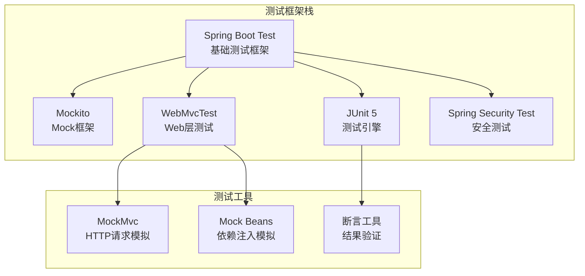
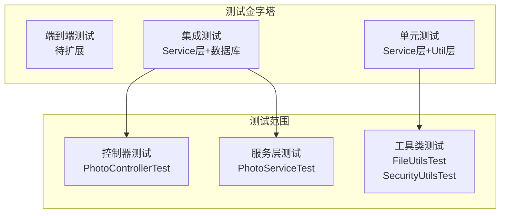
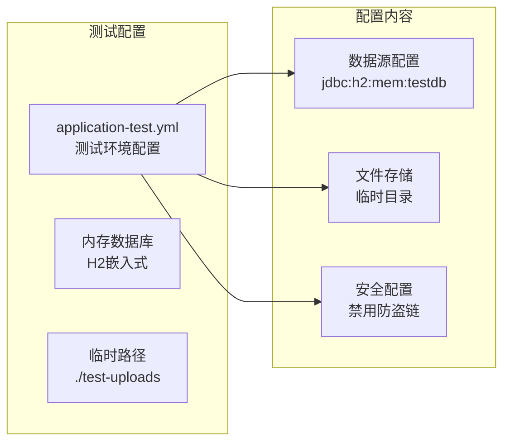
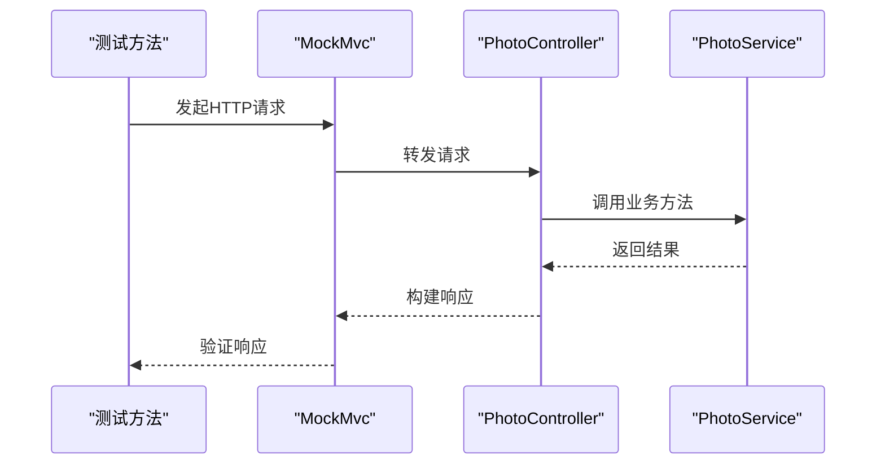
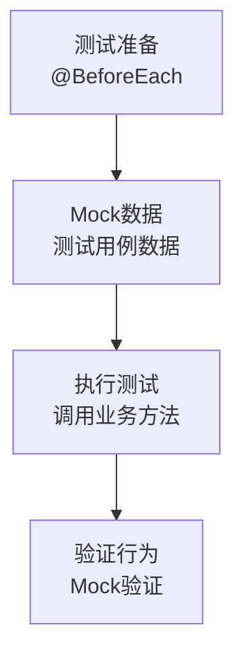
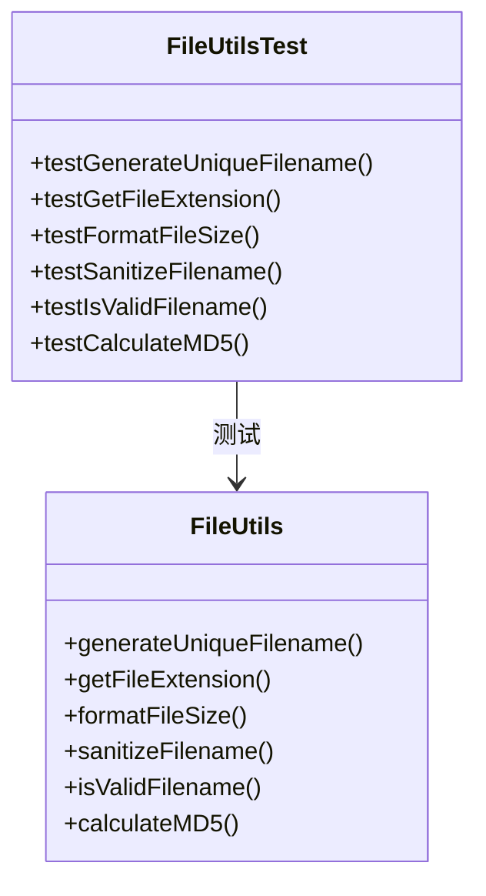
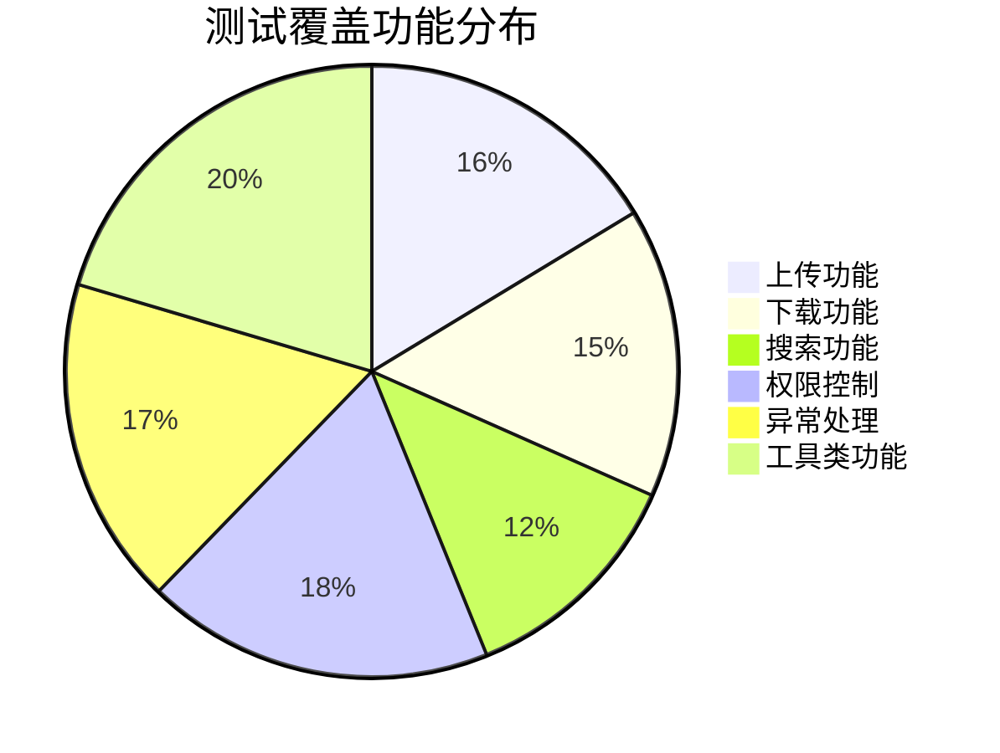
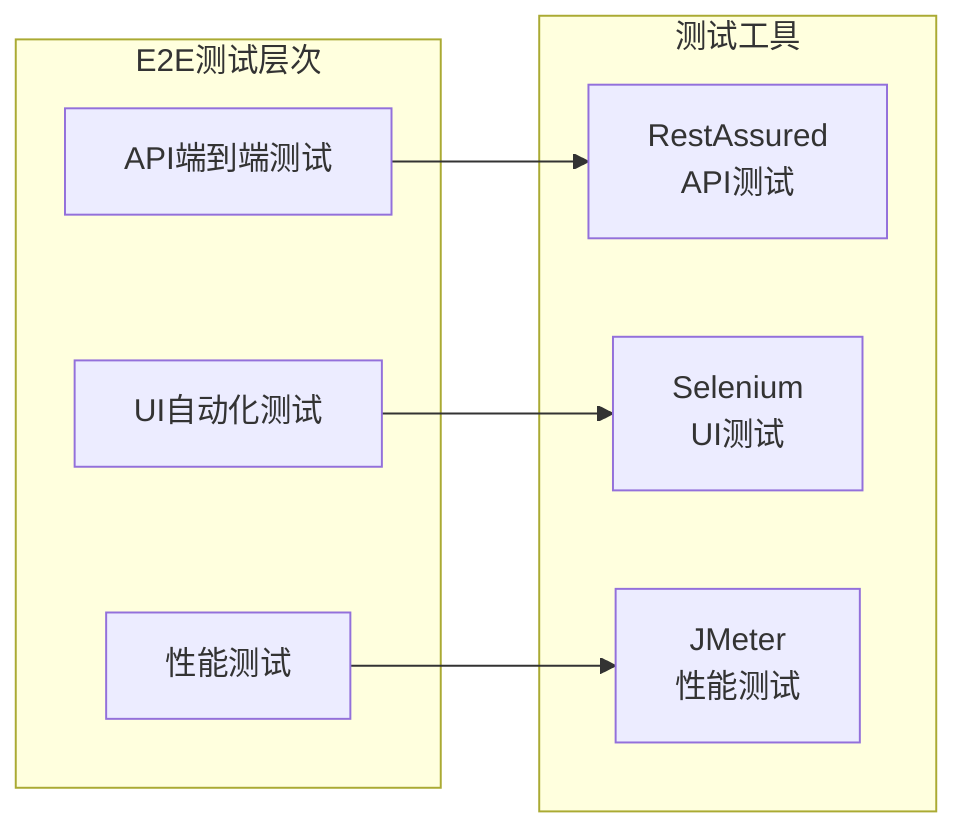
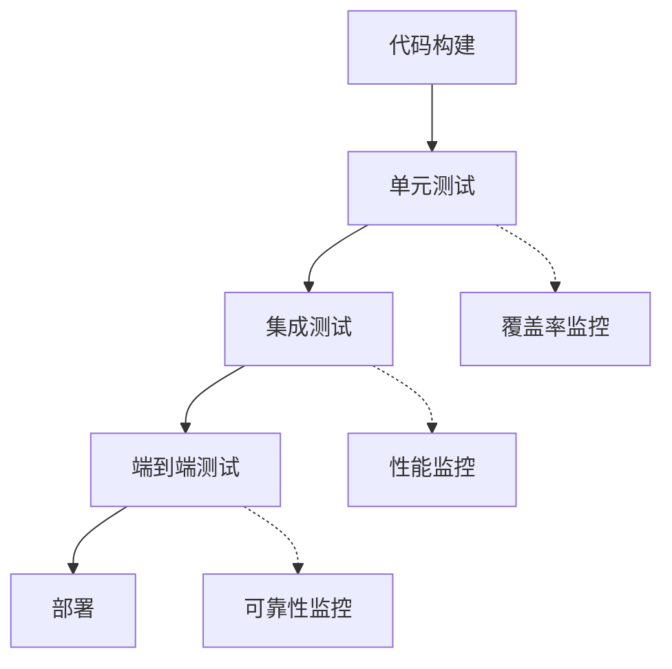

# 测试策略

<cite>
**本文档引用的文件**
- [pom.xml](file://pom.xml)
- [PROJECT_SUMMARY.md](file://PROJECT_SUMMARY.md)
- [PhotoControllerTest.java](file://src/test/java/com/photo/controller/PhotoControllerTest.java)
- [PhotoServiceTest.java](file://src/test/java/com/photo/service/PhotoServiceTest.java)
- [FileUtilsTest.java](file://src/test/java/com/photo/util/FileUtilsTest.java)
- [SecurityUtilsTest.java](file://src/test/java/com/photo/util/SecurityUtilsTest.java)
- [application-test.yml](file://src/test/resources/application-test.yml)
- [PhotoController.java](file://src/main/java/com/photo/controller/PhotoController.java)
- [PhotoService.java](file://src/main/java/com/photo/service/PhotoService.java)
</cite>

## 目录
1. [项目概述](#项目概述)
2. [测试框架与工具](#测试框架与工具)
3. [测试架构概览](#测试架构概览)
4. [核心测试类分析](#核心测试类分析)
5. [测试覆盖范围](#测试覆盖范围)
6. [测试执行方法](#测试执行方法)
7. [测试最佳实践](#测试最佳实践)
8. [未来测试改进方向](#未来测试改进方向)
9. [总结](#总结)

## 项目概述

本项目是一个基于Spring Boot 3.2.0的企业级照片上传下载系统，采用现代化的测试策略来确保代码质量和系统稳定性。项目实现了完整的照片管理功能，包括上传、下载、预览、搜索等核心业务逻辑。

**章节来源**
- [PROJECT_SUMMARY.md](file://PROJECT_SUMMARY.md#L1-L80)

## 测试框架与工具

### 核心测试框架

项目采用了成熟的Spring Boot测试生态系统，集成了多种测试工具和框架：



**图表来源**
- [pom.xml](file://pom.xml#L108-L120)

### 依赖配置分析

项目在测试环境中集成了以下关键依赖：

| 依赖名称 | 版本 | 测试用途 |
|---------|------|----------|
| spring-boot-starter-test | 3.2.0 | 核心测试框架支持 |
| spring-security-test | 6.2.0 | 安全相关测试 |
| junit-jupiter-api | 5.10.1 | JUnit 5测试引擎 |
| mockito-core | 5.7.0 | Mock对象创建 |
| spring-boot-starter-web | 3.2.0 | Web层测试支持 |

**章节来源**
- [pom.xml](file://pom.xml#L28-L120)

## 测试架构概览

### 测试层次结构

项目采用分层测试策略，覆盖从单元测试到集成测试的完整测试金字塔：



**图表来源**
- [PhotoControllerTest.java](file://src/test/java/com/photo/controller/PhotoControllerTest.java#L34-L35)
- [PhotoServiceTest.java](file://src/test/java/com/photo/service/PhotoServiceTest.java#L28-L29)
- [FileUtilsTest.java](file://src/test/java/com/photo/util/FileUtilsTest.java#L11-L12)
- [SecurityUtilsTest.java](file://src/test/java/com/photo/util/SecurityUtilsTest.java#L15-L16)

### 测试环境配置

项目提供了专门的测试环境配置，确保测试隔离性和一致性：



**图表来源**
- [application-test.yml](file://src/test/resources/application-test.yml#L1-L75)

**章节来源**
- [application-test.yml](file://src/test/resources/application-test.yml#L1-L75)

## 核心测试类分析

### PhotoControllerTest - 控制器层测试

PhotoControllerTest专注于测试Web层的API接口，采用@WebMvcTest注解进行切片测试，只加载必要的组件。

#### 测试重点

1. **HTTP请求验证**：测试各种HTTP方法（GET、POST、DELETE）的正确性
2. **参数传递**：验证URL参数、请求体参数的处理
3. **响应验证**：检查HTTP状态码、JSON响应结构
4. **异常处理**：验证错误响应格式

#### 关键测试场景



**图表来源**
- [PhotoControllerTest.java](file://src/test/java/com/photo/controller/PhotoControllerTest.java#L83-L106)

#### 测试用例分布

| 测试方法 | 测试目标 | 覆盖功能 |
|---------|----------|----------|
| testUploadPhoto_Success | 单文件上传 | POST /photos/upload |
| testGetPhoto_Success | 获取照片详情 | GET /photos/{id} |
| testGetPublicPhotos_Success | 获取公开照片 | GET /photos/public |
| testSearchPhotos_Success | 搜索照片 | GET /photos/search |
| testDeletePhoto_Success | 删除照片 | DELETE /photos/{id} |

**章节来源**
- [PhotoControllerTest.java](file://src/test/java/com/photo/controller/PhotoControllerTest.java#L83-L173)

### PhotoServiceTest - 服务层测试

PhotoServiceTest采用Mockito进行单元测试，完全隔离外部依赖，专注于业务逻辑验证。

#### 测试策略

1. **依赖注入**：使用@InjectMocks和@Mock注解管理测试对象
2. **Mock行为**：模拟Repository和FileStorageService的行为
3. **边界条件**：测试各种异常情况和边界值
4. **事务管理**：验证@Transactional注解的正确性

#### 核心测试场景



**图表来源**
- [PhotoServiceTest.java](file://src/test/java/com/photo/service/PhotoServiceTest.java#L46-L79)

#### 异常处理测试

服务层测试涵盖了所有可能的异常场景：

| 异常类型 | 测试方法 | 验证内容 |
|---------|----------|----------|
| FileTypeException | 文件类型验证 | 不支持的文件格式 |
| FileNotFoundException | 文件未找到 | 不存在的照片ID |
| AccessDeniedException | 权限拒绝 | 非所有者的删除操作 |
| StorageFullException | 存储空间不足 | 超过存储限制 |

**章节来源**
- [PhotoServiceTest.java](file://src/test/java/com/photo/service/PhotoServiceTest.java#L101-L209)

### FileUtilsTest - 工具类测试

FileUtilsTest专注于测试文件处理相关的工具方法，确保文件操作的安全性和正确性。

#### 测试分类

1. **文件名处理**：唯一文件名生成、扩展名提取、文件名清理
2. **文件大小格式化**：字节到可读格式的转换
3. **MD5计算**：文件内容的哈希计算
4. **安全性验证**：文件名有效性检查

#### 测试方法示例



**图表来源**
- [FileUtilsTest.java](file://src/test/java/com/photo/util/FileUtilsTest.java#L11-L98)

**章节来源**
- [FileUtilsTest.java](file://src/test/java/com/photo/util/FileUtilsTest.java#L1-L98)

### SecurityUtilsTest - 安全工具测试

SecurityUtilsTest验证安全相关的工具方法，确保系统的安全性得到保障。

#### 安全测试重点

1. **XSS防护**：HTML标签和脚本的清理
2. **路径遍历防护**：恶意路径访问的检测
3. **Referer验证**：防盗链机制的有效性
4. **IP地址获取**：代理环境下IP地址的正确解析
5. **文件访问控制**：用户权限验证

#### 安全测试矩阵

| 安全功能 | 测试场景 | 验证要点 |
|---------|----------|----------|
| XSS防护 | HTML内容清理 | 脚本标签被移除 |
| 路径遍历 | 恶意路径检测 | ".."模式识别 |
| Referer验证 | 来源域名检查 | 允许域名匹配 |
| IP获取 | 代理IP解析 | X-Forwarded-For处理 |
| 权限控制 | 文件访问验证 | 用户身份确认 |

**章节来源**
- [SecurityUtilsTest.java](file://src/test/java/com/photo/util/SecurityUtilsTest.java#L1-L158)

## 测试覆盖范围

### 当前测试覆盖统计

根据项目总结，当前测试覆盖情况如下：

| 测试类别 | 测试类数量 | 测试用例数量 | 覆盖模块 |
|---------|-----------|-------------|----------|
| 单元测试 | 4个 | 40+个 | Controller、Service、Util |
| 集成测试 | 0个 | 0个 | 待扩展 |
| 端到端测试 | 0个 | 0个 | 待扩展 |

### 功能覆盖分析



### 代码覆盖率目标

基于项目规模（约5000+行代码），建议的代码覆盖率目标：

- **单元测试覆盖率**：≥80%
- **集成测试覆盖率**：≥60%
- **端到端测试覆盖率**：≥40%

**章节来源**
- [PROJECT_SUMMARY.md](file://PROJECT_SUMMARY.md#L76-L80)

## 测试执行方法

### Maven测试命令

项目提供了标准化的Maven测试命令，支持不同的测试执行场景：

#### 基础测试命令

```bash
# 运行所有测试
mvn test

# 运行特定测试类
mvn test -Dtest=PhotoServiceTest

# 运行测试并生成覆盖率报告
mvn clean test jacoco:report
```

#### 高级测试配置

```bash
# 跳过测试（仅编译）
mvn test -DskipTests

# 只运行失败的测试
mvn test -DfailIfNoTests=false -Dsurefire.rerunFailingTestsCount=3

# 并行测试执行
mvn test -Dparallel=classes -DthreadCount=4
```

### 测试环境准备

#### 测试数据库配置

项目使用内存数据库进行测试，配置特点：

- **数据库类型**：H2内存数据库
- **DDL模式**：create-drop（每次测试前后重建表）
- **连接池**：无需配置（内存数据库）

#### 测试文件存储

测试环境的文件存储配置：

- **基础路径**：./test-uploads
- **临时路径**：./test-uploads/temp
- **缩略图路径**：./test-uploads/thumbnails

**章节来源**
- [application-test.yml](file://src/test/resources/application-test.yml#L1-L75)

### 测试报告生成

#### JaCoCo覆盖率报告

```bash
# 生成覆盖率报告
mvn clean test jacoco:report

# 报告输出位置
# target/site/jacoco/index.html
```

#### 测试结果分析

测试报告应包含以下指标：
- **行覆盖率**：代码行的执行比例
- **分支覆盖率**：条件分支的覆盖程度
- **方法覆盖率**：方法的调用比例
- **类覆盖率**：测试覆盖的类比例

## 测试最佳实践

### 测试命名规范

遵循清晰的测试命名约定：

```java
// 格式：test[功能]_[预期结果]_[场景]
@Test
void testUploadPhoto_Success() throws Exception {
    // 测试上传成功的情况
}

@Test
void testUploadPhoto_FileTypeException() {
    // 测试文件类型异常的情况
}
```

### 测试数据管理

#### 测试夹具（Fixture）设计

```java
@BeforeEach
void setUp() {
    // 准备测试数据
    testPhoto = createTestPhoto();
    mockResponses = createMockResponses();
    
    // 配置Mock行为
    when(repository.findById(anyLong())).thenReturn(Optional.of(testPhoto));
}
```

#### 数据驱动测试

对于相似的测试场景，使用参数化测试：

```java
@ParameterizedTest
@ValueSource(strings = {"jpg", "png", "gif"})
void testValidFileExtensions(String extension) {
    assertTrue(FileUtils.isValidFilename("test." + extension));
}
```

### Mock策略最佳实践

#### 适当的Mock粒度

```java
// 推荐：Mock外部依赖
@Mock
private PhotoRepository repository;

@Mock
private FileStorageService fileStorageService;

// 避免：Mock被测类内部逻辑
@Mock
private PhotoService photoService; // 不推荐
```

#### Mock行为的明确性

```java
// 明确指定参数和返回值
when(repository.findById(eq(1L))).thenReturn(Optional.of(testPhoto));
when(fileStorageService.storeFile(any(MultipartFile.class)))
    .thenReturn("unique-filename.jpg");

// 避免模糊的any()使用
when(repository.findById(any())).thenReturn(Optional.empty()); // 不推荐
```

### 异常测试策略

#### 异常类型的精确捕获

```java
@Test
void testDeletePhoto_AccessDenied() {
    // Given
    Long photoId = 1L;
    String wrongUserId = "wrongUser";
    
    // When & Then
    assertThrows(AccessDeniedException.class, () -> {
        photoService.deletePhoto(photoId, wrongUserId);
    });
}
```

#### 异常消息验证

```java
@Test
void testFileTypeValidation() {
    // Given
    MultipartFile invalidFile = createInvalidFile();
    
    // When & Then
    FileTypeException exception = assertThrows(
        FileTypeException.class, 
        () -> photoService.uploadPhoto(invalidFile, "user", "desc")
    );
    
    assertThat(exception.getMessage())
        .contains("不支持的文件类型");
}
```

### 性能测试考虑

虽然当前主要关注单元测试，但可以考虑添加性能测试：

```java
@Test
@Timeout(5) // 5秒超时
void testLargeFileUploadPerformance() {
    // 测试大文件上传的性能
    MultipartFile largeFile = createLargeFile(10 * 1024 * 1024); // 10MB
    long startTime = System.currentTimeMillis();
    
    photoService.uploadPhoto(largeFile, "user", "large file");
    
    long duration = System.currentTimeMillis() - startTime;
    assertTrue(duration < 5000, "上传时间应小于5秒");
}
```

## 未来测试改进方向

### 扩展测试覆盖

#### 集成测试规划

1. **数据库集成测试**
   - 测试Repository层与数据库的交互
   - 验证事务管理的正确性
   - 测试复杂查询的性能

2. **服务层集成测试**
   - 测试多个Service之间的协作
   - 验证缓存机制的有效性
   - 测试异步处理流程

#### 端到端测试策略



### 测试自动化

#### CI/CD集成

1. **自动化测试流水线**
   - 代码提交时自动运行单元测试
   - Pull Request时运行集成测试
   - 发布前运行端到端测试

2. **测试环境管理**
   - Docker容器化的测试环境
   - 动态测试数据库管理
   - 测试数据的自动清理

#### 持续监控



### 测试质量提升

#### 测试代码质量标准

1. **代码复用性**
   - 创建通用的测试工具类
   - 提取重复的测试设置逻辑
   - 使用测试基类统一配置

2. **测试可维护性**
   - 保持测试的简洁性
   - 使用描述性的测试名称
   - 定期重构测试代码

3. **测试稳定性**
   - 避免测试间的依赖
   - 使用随机端口避免冲突
   - 确保测试的幂等性

#### 测试文档化

建立完善的测试文档体系：

- **测试计划文档**：测试策略、测试范围、资源分配
- **测试用例文档**：详细的测试用例说明和预期结果
- **测试报告模板**：标准化的测试结果报告格式
- **缺陷跟踪文档**：测试过程中发现的问题和修复状态

## 总结

本项目的测试策略体现了现代软件开发的最佳实践，通过合理的测试分层和工具选择，为系统的高质量奠定了坚实基础。

### 测试成果回顾

1. **完整的测试框架**：基于Spring Boot Test生态系统的成熟测试环境
2. **全面的功能覆盖**：涵盖核心业务逻辑的40+个测试用例
3. **有效的质量保障**：通过Mockito等工具确保测试的独立性和可靠性
4. **标准化的执行流程**：Maven命令支持的自动化测试执行

### 测试价值体现

- **代码质量保证**：40+测试用例有效保障了核心功能的正确性
- **开发效率提升**：及时的测试反馈帮助开发者快速定位问题
- **系统稳定性增强**：全面的异常处理测试确保了系统的健壮性
- **维护成本降低**：清晰的测试文档和规范降低了后续维护难度

### 未来发展展望

随着项目的发展，建议逐步扩展测试覆盖范围，从当前的单元测试为主，向集成测试和端到端测试延伸，构建更加完善的测试体系，为系统的长期稳定运行提供更强有力的保障。