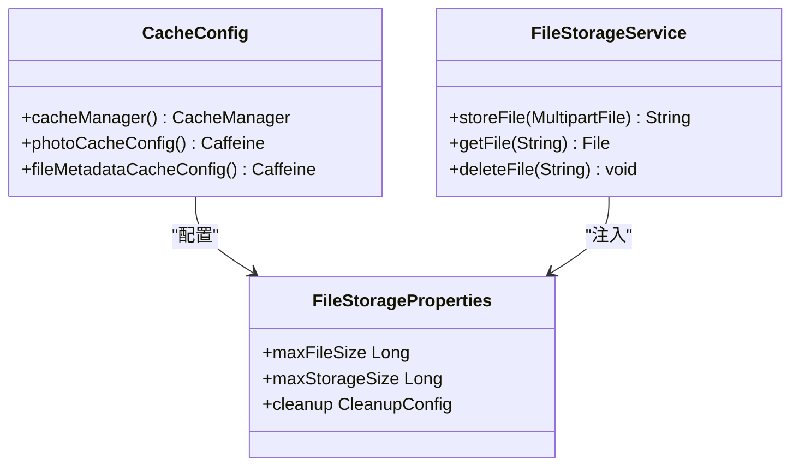
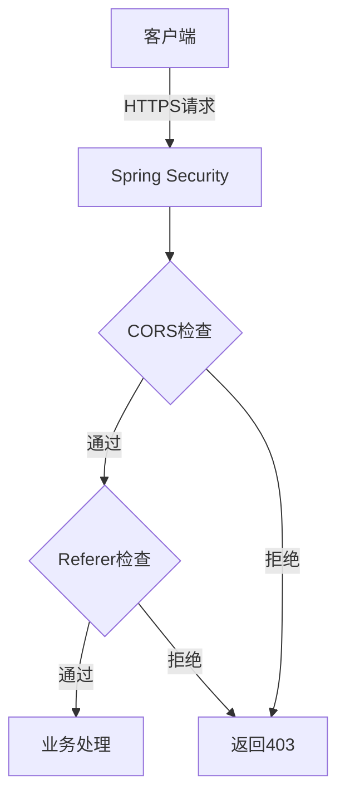

# 生产环境配置

<cite>
**本文档引用的文件**  
- [application.yml](file://src/main/resources/application.yml)
- [FileStorageProperties.java](file://src/main/java/com/photo/config/FileStorageProperties.java)
- [SecurityConfig.java](file://src/main/java/com/photo/config/SecurityConfig.java)
- [CacheConfig.java](file://src/main/java/com/photo/config/CacheConfig.java)
- [SecurityProperties.java](file://src/main/java/com/photo/config/SecurityProperties.java)
- [FileStorageService.java](file://src/main/java/com/photo/service/FileStorageService.java)
- [pom.xml](file://pom.xml)
</cite>

## 目录
1. [引言](#引言)
2. [数据库迁移：从H2到MySQL](#数据库迁移从h2到mysql)
3. [HTTPS配置](#https配置)
4. [文件存储配置优化](#文件存储配置优化)
5. [缓存策略配置](#缓存策略配置)
6. [定时任务配置](#定时任务配置)
7. [性能参数调优](#性能参数调优)
8. [日志管理与滚动策略](#日志管理与滚动策略)
9. [安全与CORS配置](#安全与cors配置)
10. [对象存储服务集成建议](#对象存储服务集成建议)

## 引言
本文档旨在指导如何将照片上传系统从开发环境顺利迁移到生产环境。基于项目中的 `application.yml` 配置文件，详细说明在生产环境中必须调整的关键配置项，包括数据库切换、HTTPS启用、文件存储路径与容量限制、缓存优化、定时任务设置、性能调优及日志管理等。所有配置均需确保系统稳定性、安全性与可维护性。

## 数据库迁移：从H2到MySQL
在开发环境中，系统使用嵌入式H2数据库以简化部署。但在生产环境中，必须替换为更稳定、可扩展的MySQL数据库。

### MySQL数据库连接配置
在 `application.yml` 中，需取消注释并配置以下生产环境数据库连接参数：

```yaml
spring:
  datasource:
    url: jdbc:mysql://localhost:3306/photo_db?useUnicode=true&characterEncoding=utf8&useSSL=false&serverTimezone=Asia/Shanghai
    driver-class-name: com.mysql.cj.jdbc.Driver
    username: root
    password: your_mysql_password
  jpa:
    properties:
      hibernate:
        dialect: org.hibernate.dialect.MySQLDialect
```

**配置说明：**
- **JDBC URL**：指定MySQL服务器地址、数据库名及连接参数，其中 `serverTimezone=Asia/Shanghai` 确保时区正确。
- **驱动类**：使用 `com.mysql.cj.jdbc.Driver` 以兼容MySQL 8.0+。
- **方言（Dialect）**：将Hibernate方言从H2切换为MySQL，以生成正确的SQL语句。

**依赖项说明：**
`pom.xml` 中已包含 `mysql-connector-j` 依赖，确保在生产环境中可用。

**Section sources**
- [application.yml](file://src/main/resources/application.yml#L7-L18)
- [pom.xml](file://pom.xml#L45-L49)

## HTTPS配置
为确保数据传输安全，生产环境必须启用HTTPS。虽然 `application.yml` 未直接包含HTTPS配置，但可通过Spring Boot的标准方式实现。

### 启用HTTPS的步骤：
1. **生成或获取SSL证书**：使用Let's Encrypt或商业CA获取 `.crt` 和 `.key` 文件。
2. **转换证书格式**：将证书转换为Java支持的JKS或PKCS12格式。
3. **配置application.yml**：
```yaml
server:
  port: 8443
  ssl:
    enabled: true
    key-store: classpath:keystore.p12
    key-store-password: your_password
    key-store-type: PKCS12
    key-alias: tomcat
```
4. **重定向HTTP到HTTPS**：可通过配置额外的HTTP连接器或使用反向代理（如Nginx）实现。

**Section sources**
- [application.yml](file://src/main/resources/application.yml#L138-L145)

## 文件存储配置优化
生产环境需调整文件存储路径、容量限制及清理策略，避免使用默认的本地相对路径。

### 文件存储路径配置
将 `file.storage.base-path` 从 `./uploads` 修改为绝对路径，确保文件存储位置明确且持久：

```yaml
file:
  storage:
    base-path: /var/data/photo-uploads
    temp-path: /var/data/photo-uploads/temp
    thumbnail-path: /var/data/photo-uploads/thumbnails
```

### 存储容量与文件限制
根据生产负载调整以下参数：
- **最大文件大小**：`max-file-size: 50MB`（根据业务需求调整）
- **最大请求大小**：`spring.servlet.multipart.max-request-size: 100MB`
- **存储容量限制**：`max-storage-size: 107374182400`（100GB）

这些配置在 `FileStorageProperties` 类中通过 `@ConfigurationProperties` 绑定，确保类型安全。

**Section sources**
- [application.yml](file://src/main/resources/application.yml#L48-L77)
- [FileStorageProperties.java](file://src/main/java/com/photo/config/FileStorageProperties.java#L16-L38)

## 缓存策略配置
生产环境需优化缓存以提升性能。当前使用Caffeine作为本地缓存。

### Caffeine缓存配置
在 `application.yml` 中配置基础缓存行为：
```yaml
spring:
  cache:
    type: caffeine
    caffeine:
      spec: maximumSize=1000,expireAfterWrite=3600s
```

在 `CacheConfig.java` 中进一步定义了细粒度缓存：
- **photoCacheConfig**：最大500条，30分钟过期
- **fileMetadataCacheConfig**：最大1000条，60分钟过期

此分层缓存策略可有效减少数据库查询压力。



**Diagram sources**
- [CacheConfig.java](file://src/main/java/com/photo/config/CacheConfig.java#L20-L52)
- [FileStorageProperties.java](file://src/main/java/com/photo/config/FileStorageProperties.java#L16-L88)

**Section sources**
- [application.yml](file://src/main/resources/application.yml#L40-L46)
- [CacheConfig.java](file://src/main/java/com/photo/config/CacheConfig.java#L1-L53)

## 定时任务配置
系统通过 `file.storage.cleanup.cron` 配置定时清理过期文件。

### 定时任务Cron表达式
```yaml
file:
  storage:
    cleanup:
      enabled: true
      days-to-keep: 30
      cron: "0 0 2 * * ?"  # 每天凌晨2点执行
```

此配置由 `FileStorageProperties.CleanupConfig` 类管理，并可通过Spring的 `@Scheduled` 注解在服务中实现定时清理逻辑。

**Section sources**
- [application.yml](file://src/main/resources/application.yml#L74-L77)
- [FileStorageProperties.java](file://src/main/java/com/photo/config/FileStorageProperties.java#L80-L88)

## 性能参数调优
根据生产负载调整服务器性能参数，确保高并发下的稳定性。

### Tomcat线程池配置
```yaml
server:
  tomcat:
    max-connections: 10000
    threads:
      max: 200
      min-spare: 10
```
- **max-connections**：最大连接数，根据预期并发量设置。
- **max threads**：最大工作线程数，避免过多线程导致上下文切换开销。

### 文件上传性能
```yaml
spring:
  servlet:
    multipart:
      max-file-size: 50MB
      max-request-size: 100MB
      file-size-threshold: 10MB
```
- **file-size-threshold**：超过此大小的文件将写入磁盘，减少内存占用。

**Section sources**
- [application.yml](file://src/main/resources/application.yml#L138-L145)

## 日志管理与滚动策略
生产环境需合理配置日志，便于问题排查与运维监控。

### 日志配置
```yaml
logging:
  level:
    root: INFO
    com.photo: WARN  # 生产环境降低业务日志级别
    org.springframework.web: INFO
    org.hibernate: WARN
  file:
    name: /var/log/photo-upload-system/photo-upload-system.log
    max-size: 50MB
    max-history: 90
```
- **日志级别**：生产环境建议将业务包日志级别设为 `WARN` 或 `ERROR`，减少日志量。
- **日志路径**：使用绝对路径 `/var/log`，便于集中管理。
- **滚动策略**：单个日志文件最大50MB，保留最近90天的日志。

**Section sources**
- [application.yml](file://src/main/resources/application.yml#L115-L132)

## 安全与CORS配置
生产环境需强化安全配置，防止未授权访问。

### 安全配置要点
- **Token密钥**：`security.token.secret` 必须替换为强随机密钥，不可使用默认值。
- **防盗链**：`security.referer.allowed-domains` 应仅包含生产环境域名。
- **CORS**：`security.cors.allowed-origins` 需配置为生产前端地址，如 `https://yourdomain.com`。



**Diagram sources**
- [SecurityConfig.java](file://src/main/java/com/photo/config/SecurityConfig.java#L1-L70)
- [SecurityProperties.java](file://src/main/java/com/photo/config/SecurityProperties.java#L1-L52)

**Section sources**
- [application.yml](file://src/main/resources/application.yml#L79-L113)
- [SecurityConfig.java](file://src/main/java/com/photo/config/SecurityConfig.java#L1-L70)

## 对象存储服务集成建议
为提升可扩展性与可靠性，建议将本地文件存储替换为专业对象存储服务（如阿里云OSS、AWS S3）。

### 集成方案
1. **创建OSS/S3配置类**：定义 `OssProperties` 或 `S3Properties`。
2. **实现云存储服务**：创建 `OssFileStorageService` 实现 `FileStorageService` 接口。
3. **条件化配置**：通过 `@ConditionalOnProperty` 根据配置选择本地或云存储。
4. **配置示例**：
```yaml
file:
  storage:
    type: oss # 或 s3
    oss:
      endpoint: oss-cn-beijing.aliyuncs.com
      bucket-name: your-bucket
      access-key: your-access-key
      secret-key: your-secret-key
```

此方案可实现存储后端的无缝切换，满足生产环境对高可用和扩展性的要求。

**Section sources**
- [FileStorageService.java](file://src/main/java/com/photo/service/FileStorageService.java#L1-L299)