# 监控与维护指南

<cite>
**本文档中引用的文件**
- [application.yml](file://src/main/resources/application.yml)
- [PhotoController.java](file://src/main/java/com/photo/controller/PhotoController.java)
- [StorageInfo.java](file://src/main/java/com/photo/dto/StorageInfo.java)
- [PhotoService.java](file://src/main/java/com/photo/service/PhotoService.java)
- [FileStorageService.java](file://src/main/java/com/photo/service/FileStorageService.java)
- [FileStorageProperties.java](file://src/main/java/com/photo/config/FileStorageProperties.java)
- [FileUtils.java](file://src/main/java/com/photo/util/FileUtils.java)
- [pom.xml](file://pom.xml)
</cite>

## 目录
1. [系统概述](#系统概述)
2. [日志监控与管理](#日志监控与管理)
3. [Spring Boot Actuator监控](#spring-boot-actuator监控)
4. [存储空间监控](#存储空间监控)
5. [定期清理策略](#定期清理策略)
6. [数据备份策略](#数据备份策略)
7. [性能监控指标](#性能监控指标)
8. [故障排除指南](#故障排除指南)
9. [自动化运维脚本](#自动化运维脚本)
10. [最佳实践建议](#最佳实践建议)

## 系统概述

本照片上传系统采用Spring Boot框架构建，提供了完整的照片上传、存储、管理和访问功能。系统具备以下核心特性：
- 支持多种图片格式的上传和处理
- 内置缓存机制提升性能
- 自动化的文件压缩和缩略图生成功能
- 完善的安全防护措施
- 可配置的存储空间限制和清理策略

**章节来源**
- [application.yml](file://src/main/resources/application.yml#L1-L173)
- [PhotoController.java](file://src/main/java/com/photo/controller/PhotoController.java#L1-L316)

## 日志监控与管理

### 日志配置详解

系统通过Spring Boot的logging配置实现了完善的日志管理机制：

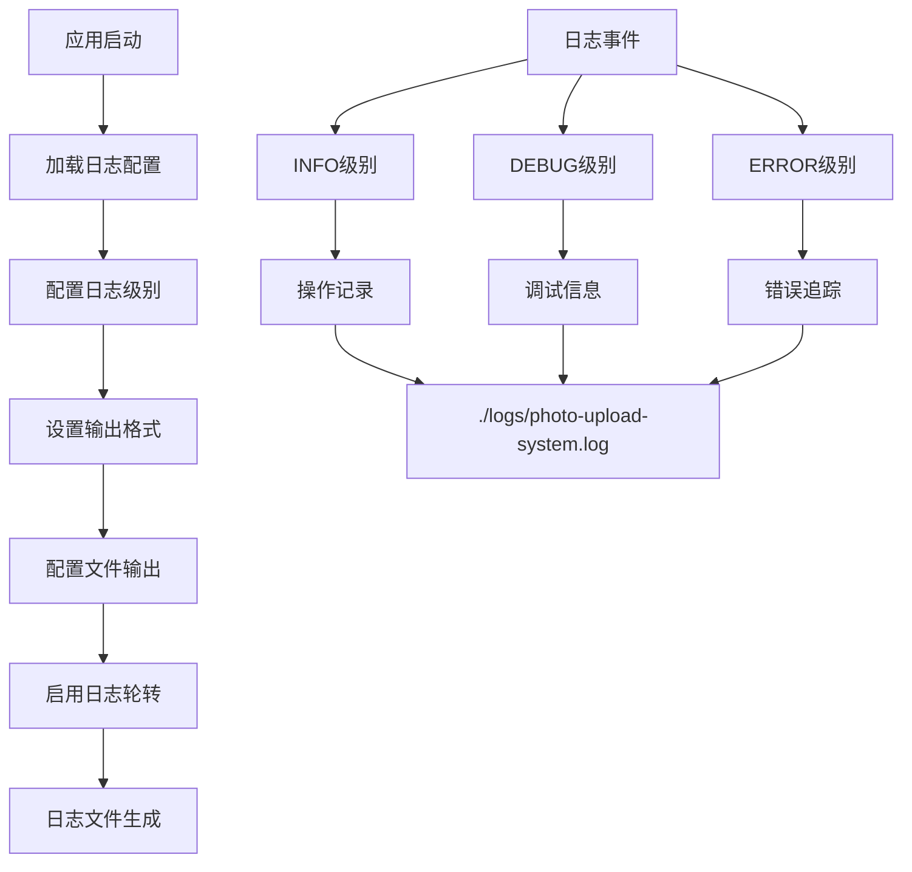

**图表来源**
- [application.yml](file://src/main/resources/application.yml#L108-L120)

### 日志文件结构

系统日志文件位于以下位置：
- **主日志文件**: `./logs/photo-upload-system.log`
- **日志轮转**: 每个日志文件最大10MB
- **历史保留**: 最多保留30个历史文件

### 日志级别配置

| 日志级别 | 应用范围 | 用途 |
|---------|---------|------|
| ERROR | 全局 | 错误信息记录 |
| WARN | 全局 | 警告信息记录 |
| INFO | com.photo | 主要业务操作记录 |
| DEBUG | com.photo | 详细调试信息 |
| INFO | org.springframework.web | Web层请求跟踪 |

### 日志轮转策略

系统采用基于大小的日志轮转策略：

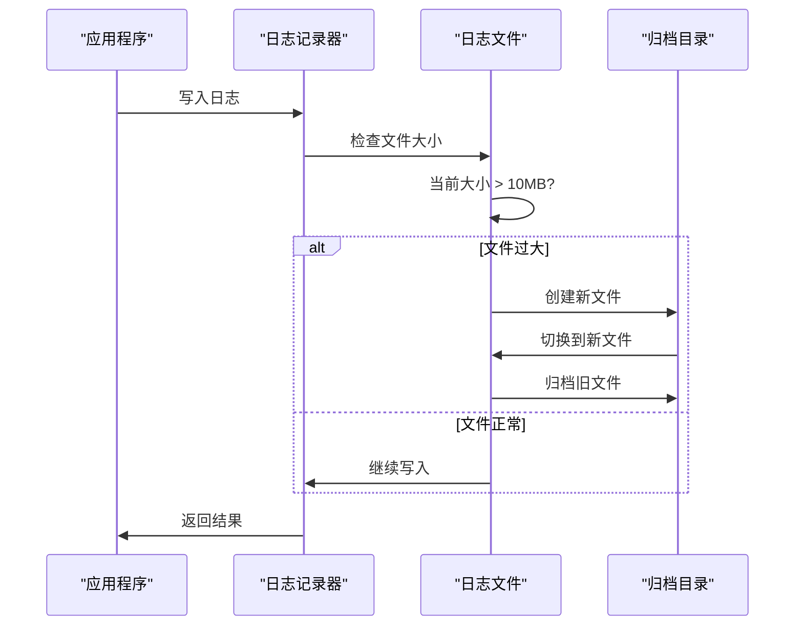

**图表来源**
- [application.yml](file://src/main/resources/application.yml#L118-L120)

**章节来源**
- [application.yml](file://src/main/resources/application.yml#L108-L120)

## Spring Boot Actuator监控

### Actuator端点配置

系统集成了Spring Boot Actuator，提供以下监控端点：

| 端点名称 | URL路径 | 功能描述 |
|---------|---------|----------|
| Health | `/actuator/health` | 系统健康状态检查 |
| Info | `/actuator/info` | 应用基本信息 |
| Metrics | `/actuator/metrics` | 性能指标统计 |
| Environment | `/actuator/env` | 环境变量信息 |

### 健康检查配置

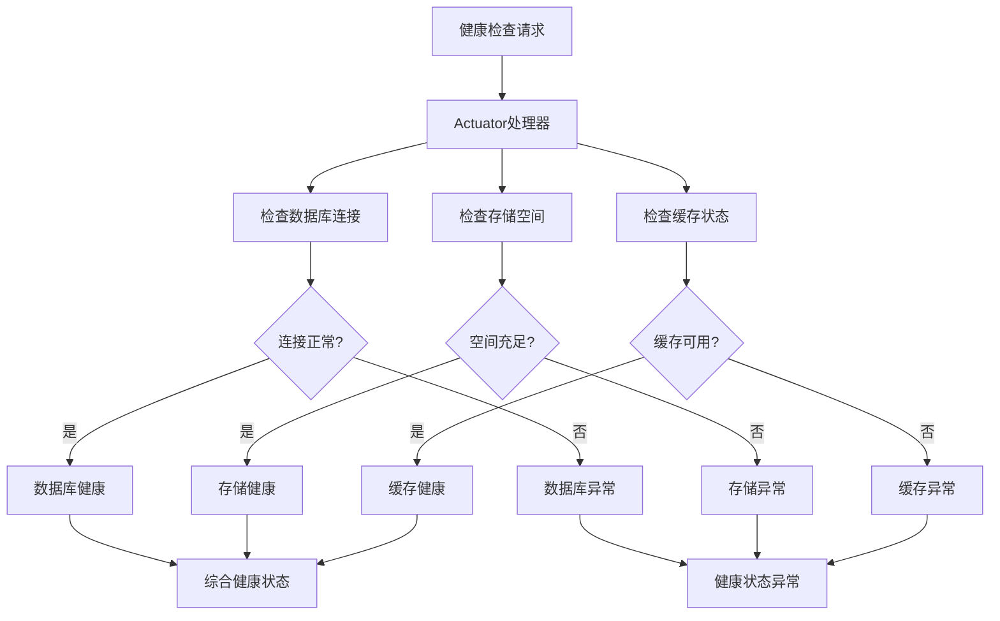

**图表来源**
- [application.yml](file://src/main/resources/application.yml#L154-L157)

### 监控端点访问

系统配置了受保护的健康检查端点：

```yaml
management:
  endpoints:
    web:
      exposure:
        include: health,info,metrics
  endpoint:
    health:
      show-details: when-authorized
```

**章节来源**
- [application.yml](file://src/main/resources/application.yml#L154-L160)

## 存储空间监控

### 存储信息接口

系统提供了专门的存储空间监控接口：

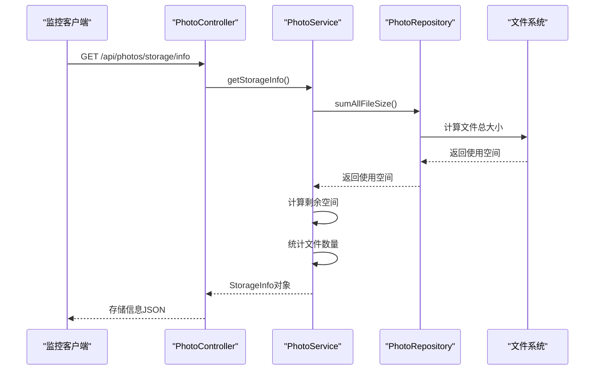

**图表来源**
- [PhotoController.java](file://src/main/java/com/photo/controller/PhotoController.java#L308-L315)
- [PhotoService.java](file://src/main/java/com/photo/service/PhotoService.java#L238-L256)

### 存储监控指标

系统存储监控提供以下关键指标：

| 指标名称 | 数据类型 | 描述 |
|---------|---------|------|
| usedSpace | Long | 已使用存储空间(字节) |
| totalSpace | Long | 总存储空间(字节) |
| freeSpace | Long | 剩余可用空间(字节) |
| usagePercentage | Double | 存储使用百分比 |
| totalFiles | Long | 当前文件总数 |

### 存储容量预警

系统配置了10GB的存储上限，当使用率达到一定阈值时应触发预警：

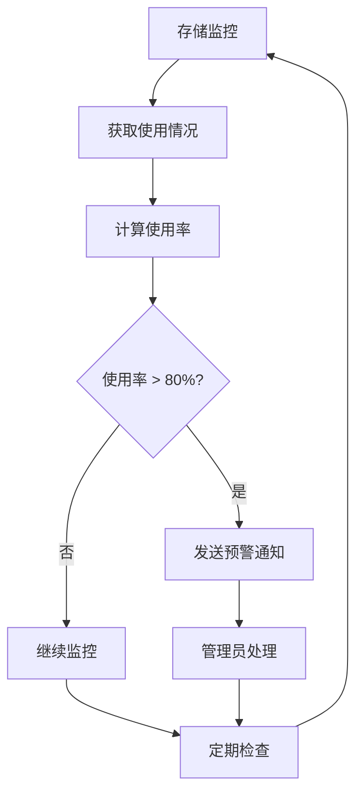

**图表来源**
- [FileStorageProperties.java](file://src/main/java/com/photo/config/FileStorageProperties.java#L58-L60)

**章节来源**
- [PhotoController.java](file://src/main/java/com/photo/controller/PhotoController.java#L308-L315)
- [StorageInfo.java](file://src/main/java/com/photo/dto/StorageInfo.java#L1-L57)
- [PhotoService.java](file://src/main/java/com/photo/service/PhotoService.java#L238-L256)

## 定期清理策略

### 自动清理机制

系统实现了自动化的文件清理机制：

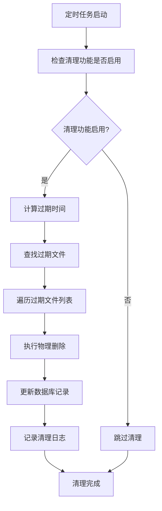

**图表来源**
- [PhotoService.java](file://src/main/java/com/photo/service/PhotoService.java#L258-L285)

### 清理配置参数

| 参数名称 | 默认值 | 配置路径 | 描述 |
|---------|--------|----------|------|
| 启用清理 | true | `file.storage.cleanup.enabled` | 是否启用自动清理 |
| 保留天数 | 30天 | `file.storage.cleanup.daysToKeep` | 文件保留期限 |
| 定时任务 | 每日凌晨2点 | `file.storage.cleanup.cron` | 清理任务执行时间 |

### 清理任务调度

系统使用Cron表达式调度清理任务：

```yaml
file:
  storage:
    cleanup:
      cron: "0 0 2 * * ?"  # 每天凌晨2点执行
```

### 清理流程详解

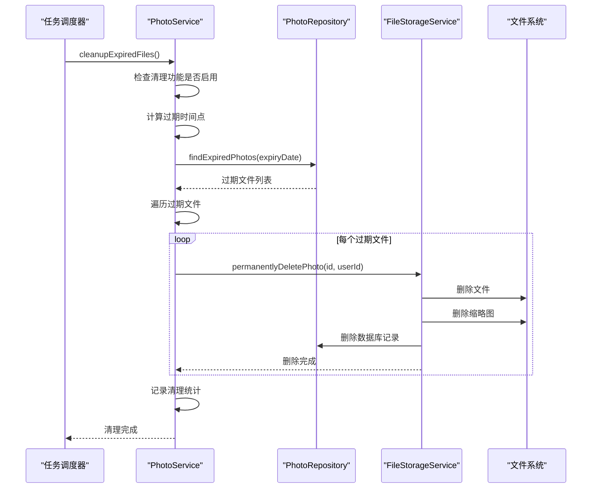

**图表来源**
- [PhotoService.java](file://src/main/java/com/photo/service/PhotoService.java#L258-L285)

**章节来源**
- [PhotoService.java](file://src/main/java/com/photo/service/PhotoService.java#L258-L285)
- [FileStorageProperties.java](file://src/main/java/com/photo/config/FileStorageProperties.java#L75-L79)

## 数据备份策略

### 备份架构设计

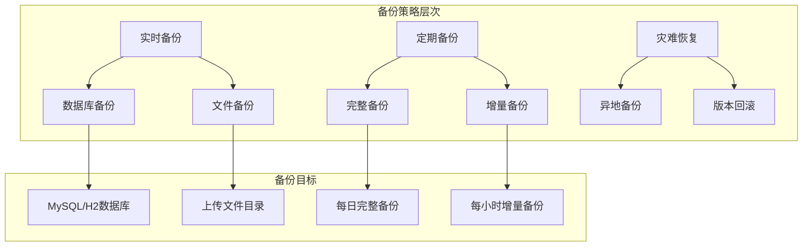

### 数据库备份方案

#### H2数据库备份
```bash
# 开发环境(H2)备份脚本示例
#!/bin/bash
BACKUP_DIR="/backup/h2"
TIMESTAMP=$(date +%Y%m%d_%H%M%S)
DB_FILE="./data/photodb.mv.db"

mkdir -p $BACKUP_DIR/$TIMESTAMP
cp $DB_FILE $BACKUP_DIR/$TIMESTAMP/
echo "H2数据库备份完成: $BACKUP_DIR/$TIMESTAMP/$(basename $DB_FILE)"
```

#### MySQL数据库备份
```bash
# 生产环境(MySQL)备份脚本示例
#!/bin/bash
BACKUP_DIR="/backup/mysql"
TIMESTAMP=$(date +%Y%m%d_%H%M%S)
DB_NAME="photo_db"
DB_USER="root"
DB_PASSWORD="your_password"

mkdir -p $BACKUP_DIR/$TIMESTAMP
mysqldump -u$DB_USER -p$DB_PASSWORD $DB_NAME > $BACKUP_DIR/$TIMESTAMP/${DB_NAME}_$(date +%Y%m%d).sql
echo "MySQL数据库备份完成: $BACKUP_DIR/$TIMESTAMP/${DB_NAME}_$(date +%Y%m%d).sql"
```

### 文件备份方案

#### 上传文件备份
```bash
#!/bin/bash
# 文件备份脚本
SOURCE_DIR="./uploads"
BACKUP_DIR="/backup/files"
TIMESTAMP=$(date +%Y%m%d_%H%M%S)

mkdir -p $BACKUP_DIR/$TIMESTAMP
rsync -av --progress $SOURCE_DIR/ $BACKUP_DIR/$TIMESTAMP/

# 压缩备份文件
tar -czf $BACKUP_DIR/$TIMESTAMP/uploads_backup.tar.gz -C $BACKUP_DIR/$TIMESTAMP .
rm -rf $BACKUP_DIR/$TIMESTAMP/*

echo "文件备份完成: $BACKUP_DIR/$TIMESTAMP/uploads_backup.tar.gz"
```

### 备份验证机制

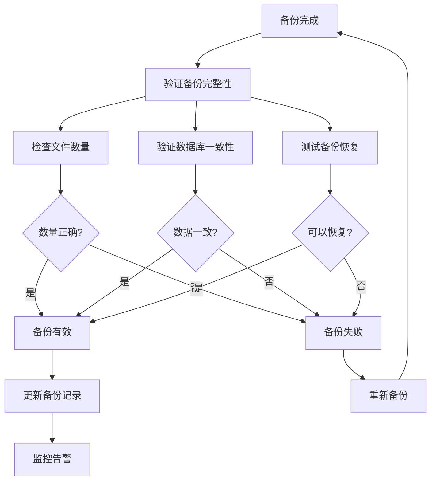

### 备份调度计划

| 备份类型 | 执行频率 | 保留期限 | 存储位置 |
|---------|---------|----------|----------|
| 实时备份 | 每次文件上传后 | 7天 | 本地缓存 |
| 小时备份 | 每小时 | 24小时 | 本地存储 |
| 日备份 | 每日 | 30天 | 本地存储 |
| 周备份 | 每周 | 12周 | 本地存储 |
| 月备份 | 每月 | 12个月 | 异地存储 |

## 性能监控指标

### 关键性能指标(KPI)

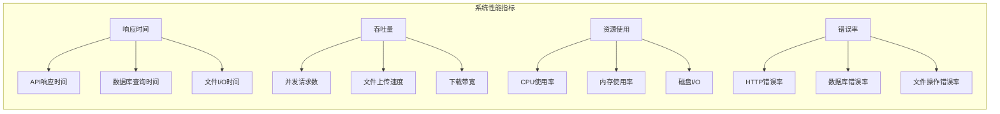

### 监控指标收集

#### JVM监控指标
- **堆内存使用**: 监控应用内存使用情况
- **GC频率**: 监控垃圾回收频率和耗时
- **线程池状态**: 监控Web容器线程池使用情况

#### 应用层监控指标
- **API响应时间**: 监控各接口的平均响应时间
- **并发连接数**: 监控当前活跃连接数
- **缓存命中率**: 监控缓存使用效率

#### 存储层监控指标
- **磁盘使用率**: 监控存储空间使用情况
- **文件读写速度**: 监控文件系统性能
- **网络IO**: 监控文件传输速度

### 性能基准参考

| 指标类别 | 正常范围 | 警告阈值 | 严重阈值 |
|---------|---------|----------|----------|
| API响应时间 | < 200ms | 200-500ms | > 500ms |
| 并发连接数 | < 80% | 80-90% | > 90% |
| CPU使用率 | < 70% | 70-85% | > 85% |
| 内存使用率 | < 80% | 80-90% | > 90% |
| 磁盘使用率 | < 80% | 80-90% | > 90% |

## 故障排除指南

### 常见问题诊断

#### 1. 存储空间不足

**症状表现**:
- 上传文件时出现"存储空间不足"错误
- 系统日志显示存储配额超限

**诊断步骤**:
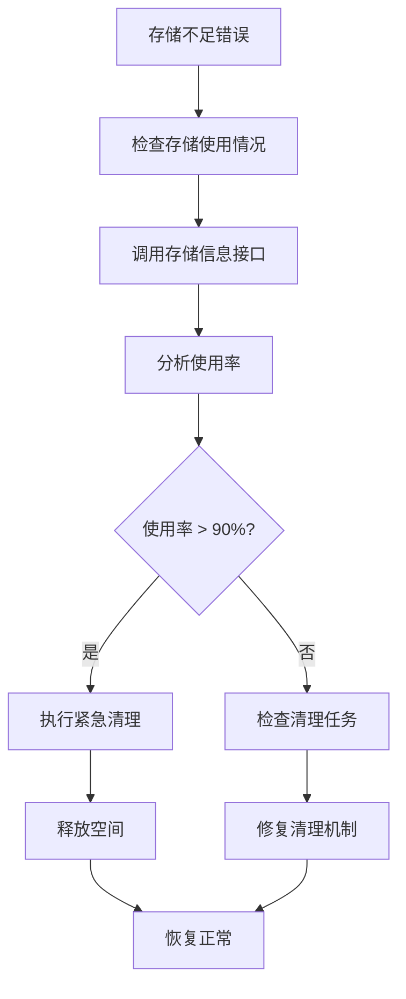

**解决方案**:
1. 手动触发清理任务
2. 调整存储配额
3. 清理历史文件

#### 2. 文件上传失败

**常见原因**:
- 文件大小超过限制
- 文件类型不支持
- 存储空间不足
- 权限问题

**排查流程**:
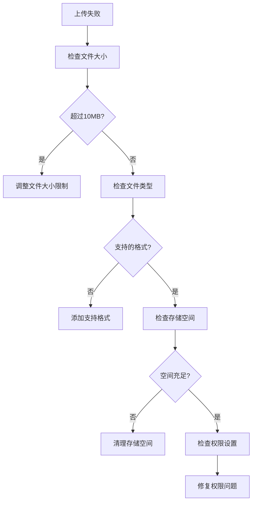

#### 3. 数据库连接问题

**症状**:
- 数据库连接超时
- 查询性能下降
- 连接池耗尽

**解决步骤**:
1. 检查数据库服务状态
2. 监控连接池使用情况
3. 优化查询语句
4. 调整连接池配置

### 日志分析技巧

#### 错误日志模式识别

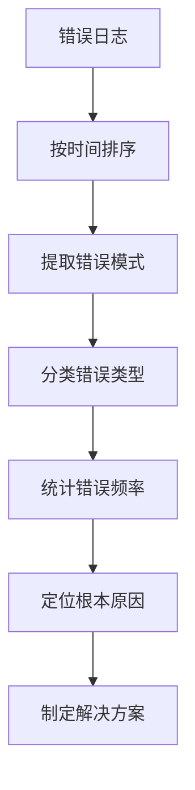

#### 关键日志关键字

| 错误类型 | 关键字 | 示例 |
|---------|--------|------|
| 文件操作错误 | "FileStorageException" | 文件存储失败 |
| 数据库错误 | "SQLException" | 数据库连接异常 |
| 权限错误 | "AccessDeniedException" | 访问被拒绝 |
| 网络错误 | "ConnectException" | 连接超时 |

**章节来源**
- [PhotoService.java](file://src/main/java/com/photo/service/PhotoService.java#L320-L340)
- [FileStorageService.java](file://src/main/java/com/photo/service/FileStorageService.java#L280-L300)

## 自动化运维脚本

### 系统监控脚本

#### 基础监控脚本
```bash
#!/bin/bash
# 系统监控脚本

APP_NAME="photo-upload-system"
LOG_FILE="./logs/photo-upload-system.log"
METRICS_FILE="/tmp/system_metrics.txt"

# 检查应用运行状态
check_app_status() {
    PID=$(pgrep -f "$APP_NAME")
    if [ -n "$PID" ]; then
        echo "应用运行中，PID: $PID"
    else
        echo "应用未运行"
        exit 1
    fi
}

# 检查磁盘空间
check_disk_space() {
    DISK_USAGE=$(df -h ./uploads | awk 'NR==2 {print $5}' | sed 's/%//')
    if [ $DISK_USAGE -gt 80 ]; then
        echo "警告: 磁盘使用率 $DISK_USAGE%"
    fi
}

# 检查日志文件大小
check_log_size() {
    LOG_SIZE=$(du -h $LOG_FILE | cut -f1)
    echo "日志文件大小: $LOG_SIZE"
}

# 检查存储使用情况
check_storage_usage() {
    STORAGE_INFO=$(curl -s http://localhost:8080/api/photos/storage/info)
    USED_SPACE=$(echo $STORAGE_INFO | jq '.data.usedSpace')
    TOTAL_SPACE=$(echo $STORAGE_INFO | jq '.data.totalSpace')
    USAGE_PERCENT=$(echo $STORAGE_INFO | jq '.data.usagePercentage')
    
    echo "存储使用情况:"
    echo "  已使用: $(echo $USED_SPACE/1024/1024 | bc) MB"
    echo "  总空间: $(echo $TOTAL_SPACE/1024/1024/1024 | bc) GB"
    echo "  使用率: $USAGE_PERCENT%"
}

# 主执行函数
main() {
    echo "=== 系统监控报告 ==="
    echo "时间: $(date)"
    echo
    
    check_app_status
    echo
    check_disk_space
    echo
    check_log_size
    echo
    check_storage_usage
    echo
    echo "=== 监控完成 ==="
}

main
```

#### 健康检查脚本
```bash
#!/bin/bash
# 健康检查脚本

ACTUATOR_URL="http://localhost:8080/actuator/health"
METRICS_URL="http://localhost:8080/actuator/metrics"

check_health() {
    echo "=== 健康检查 ==="
    
    # 检查应用健康状态
    HEALTH_RESPONSE=$(curl -s $ACTUATOR_URL)
    STATUS=$(echo $HEALTH_RESPONSE | jq -r '.status')
    
    echo "应用状态: $STATUS"
    
    if [ "$STATUS" = "UP" ]; then
        echo "✓ 应用运行正常"
    else
        echo "✗ 应用状态异常"
        echo "详细信息: $HEALTH_RESPONSE"
        return 1
    fi
    
    # 检查数据库连接
    DB_STATUS=$(echo $HEALTH_RESPONSE | jq -r '.components.db.status')
    echo "数据库状态: $DB_STATUS"
    
    # 检查存储空间
    STORAGE_INFO=$(curl -s http://localhost:8080/api/photos/storage/info)
    USAGE_PERCENT=$(echo $STORAGE_INFO | jq '.data.usagePercentage')
    
    echo "存储使用率: ${USAGE_PERCENT}%"
    
    if (( $(echo "$USAGE_PERCENT > 90" | bc -l) )); then
        echo "⚠ 存储空间接近满载"
    elif (( $(echo "$USAGE_PERCENT > 80" | bc -l) )); then
        echo "✓ 存储空间使用正常"
    fi
}

check_health
```

### 自动化部署脚本

#### 部署脚本模板
```bash
#!/bin/bash
# 自动化部署脚本

VERSION=$1
DEPLOY_DIR="/opt/photo-upload"
BACKUP_DIR="/backup/deployments"

# 部署前检查
check_preconditions() {
    echo "=== 部署前检查 ==="
    
    # 检查版本参数
    if [ -z "$VERSION" ]; then
        echo "错误: 未指定版本号"
        exit 1
    fi
    
    # 检查部署目录
    if [ ! -d "$DEPLOY_DIR" ]; then
        echo "创建部署目录: $DEPLOY_DIR"
        mkdir -p $DEPLOY_DIR
    fi
    
    # 备份当前版本
    CURRENT_VERSION=$(cd $DEPLOY_DIR && ls -t | head -1)
    if [ -n "$CURRENT_VERSION" ]; then
        echo "备份当前版本: $CURRENT_VERSION"
        cp -r $DEPLOY_DIR/$CURRENT_VERSION $BACKUP_DIR/
    fi
}

# 部署新版本
deploy_new_version() {
    echo "=== 开始部署版本 $VERSION ==="
    
    # 停止应用
    echo "停止现有应用..."
    pkill -f "photo-upload-system"
    
    # 备份配置文件
    if [ -f "$DEPLOY_DIR/application.yml" ]; then
        cp $DEPLOY_DIR/application.yml $DEPLOY_DIR/application.yml.backup
    fi
    
    # 部署新版本
    echo "部署新版本文件..."
    tar -xzf "photo-upload-$VERSION.tar.gz" -C $DEPLOY_DIR/
    
    # 启动应用
    echo "启动新版本应用..."
    cd $DEPLOY_DIR
    java -jar photo-upload-system.jar &
    
    # 等待启动完成
    sleep 30
    
    # 验证启动状态
    if pgrep -f "photo-upload-system" > /dev/null; then
        echo "✓ 版本 $VERSION 部署成功"
    else
        echo "✗ 版本 $VERSION 部署失败"
        exit 1
    fi
}

# 执行部署
check_preconditions
deploy_new_version
```

### 容量规划脚本
```bash
#!/bin/bash
# 容量规划脚本

LOG_FILE="./logs/photo-upload-system.log"
REPORT_FILE="/var/www/html/storage-report.html"

generate_capacity_report() {
    echo "<html><head><title>存储容量报告</title></head><body>"
    echo "<h1>存储容量报告</h1>"
    
    # 获取存储信息
    STORAGE_INFO=$(curl -s http://localhost:8080/api/photos/storage/info)
    USED_SPACE=$(echo $STORAGE_INFO | jq '.data.usedSpace')
    TOTAL_SPACE=$(echo $STORAGE_INFO | jq '.data.totalSpace')
    FREE_SPACE=$(echo $STORAGE_INFO | jq '.data.freeSpace')
    USAGE_PERCENT=$(echo $STORAGE_INFO | jq '.data.usagePercentage')
    TOTAL_FILES=$(echo $STORAGE_INFO | jq '.data.totalFiles')
    
    # 生成HTML报告
    echo "<h2>当前使用情况</h2>"
    echo "<table border='1'>"
    echo "<tr><th>指标</th><th>数值</th></tr>"
    echo "<tr><td>已使用空间</td><td>$(echo $USED_SPACE/1024/1024 | bc) MB</td></tr>"
    echo "<tr><td>总空间</td><td>$(echo $TOTAL_SPACE/1024/1024/1024 | bc) GB</td></tr>"
    echo "<tr><td>剩余空间</td><td>$(echo $FREE_SPACE/1024/1024 | bc) MB</td></tr>"
    echo "<tr><td>使用率</td><td>${USAGE_PERCENT}%</td></tr>"
    echo "<tr><td>文件总数</td><td>$TOTAL_FILES</td></tr>"
    echo "</table>"
    
    # 生成趋势图表
    echo "<h2>使用趋势</h2>"
    echo ""
    
    echo "</body></html>" > $REPORT_FILE
    
    echo "容量报告已生成: $REPORT_FILE"
}

generate_capacity_report
```

## 最佳实践建议

### 监控最佳实践

#### 1. 监控指标选择原则
- **关键业务指标**: 优先监控影响用户体验的核心指标
- **系统健康指标**: 关注系统资源使用和运行状态
- **业务增长指标**: 监控用户增长和使用模式变化

#### 2. 告警策略设计
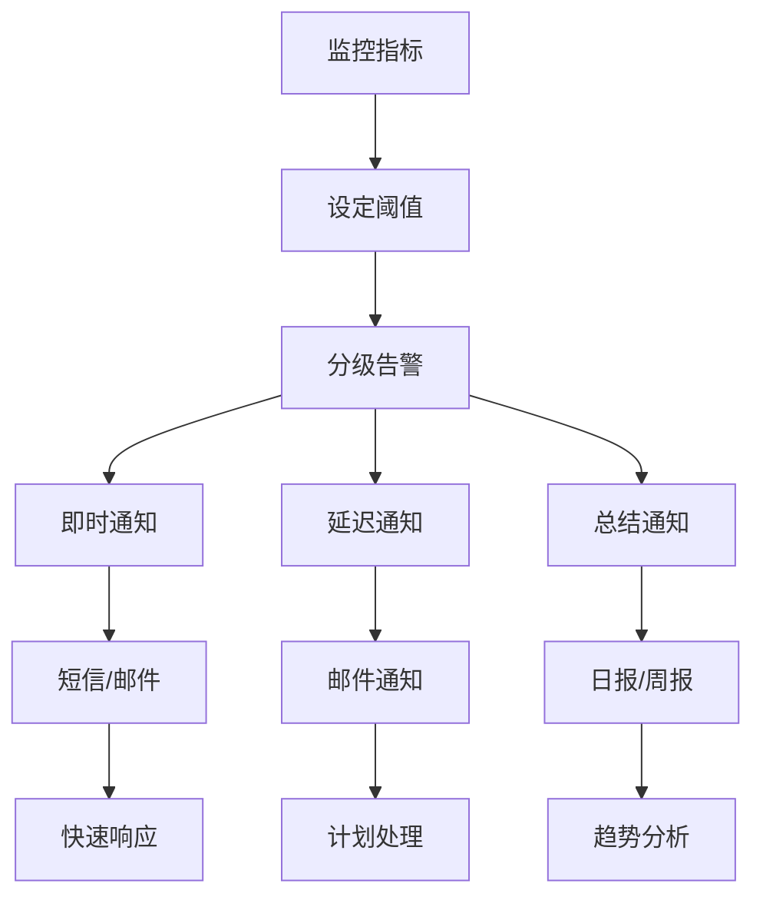

#### 3. 监控工具集成
- **Prometheus + Grafana**: 实现时序数据监控和可视化
- **ELK Stack**: 集成日志分析和检索
- **自定义监控面板**: 提供业务特定的监控界面

### 运维自动化建议

#### 1. 自动化部署流水线
- **代码质量检查**: 集成静态代码分析
- **自动化测试**: 包含单元测试和集成测试
- **蓝绿部署**: 减少部署风险
- **回滚机制**: 快速回滚到稳定版本

#### 2. 基础设施即代码
- **Terraform**: 管理基础设施配置
- **Ansible**: 自动化配置管理
- **Docker**: 容器化部署
- **Kubernetes**: 容器编排和管理

#### 3. 安全监控
- **漏洞扫描**: 定期扫描依赖库漏洞
- **权限审计**: 监控权限变更和异常访问
- **数据加密**: 敏感数据加密存储
- **网络安全**: 防火墙规则和入侵检测

### 性能优化建议

#### 1. 缓存策略优化
- **多级缓存**: 结合内存缓存和分布式缓存
- **缓存预热**: 预先加载热点数据
- **缓存失效**: 合理设置缓存过期时间
- **缓存穿透防护**: 防止恶意请求穿透缓存

#### 2. 数据库优化
- **索引优化**: 为常用查询字段建立索引
- **查询优化**: 避免N+1查询问题
- **连接池配置**: 合理配置数据库连接池
- **读写分离**: 实现读写分离架构

#### 3. 文件系统优化
- **SSD存储**: 使用高性能存储设备
- **RAID配置**: 实现数据冗余和性能提升
- **文件系统选择**: 根据需求选择合适的文件系统
- **I/O调度**: 优化磁盘I/O性能

### 安全加固建议

#### 1. 应用安全
- **输入验证**: 严格验证所有用户输入
- **输出编码**: 防止XSS攻击
- **身份认证**: 实现强密码策略和多因素认证
- **授权控制**: 基于角色的访问控制(RBAC)

#### 2. 网络安全
- **HTTPS强制**: 全站启用HTTPS
- **CORS配置**: 合理配置跨域资源共享
- **防火墙规则**: 限制不必要的网络访问
- **DDoS防护**: 部署DDoS防护措施

#### 3. 数据安全
- **数据加密**: 敏感数据加密存储
- **备份加密**: 备份数据也需加密
- **访问审计**: 记录所有数据访问行为
- **数据脱敏**: 测试环境使用脱敏数据

通过实施这些监控与维护策略，可以确保照片上传系统的高可用性、稳定性和安全性，为用户提供优质的文件管理服务。