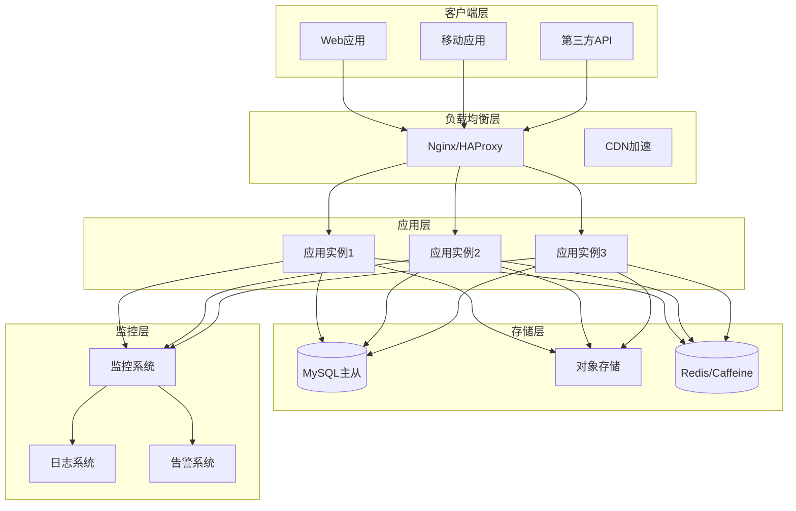
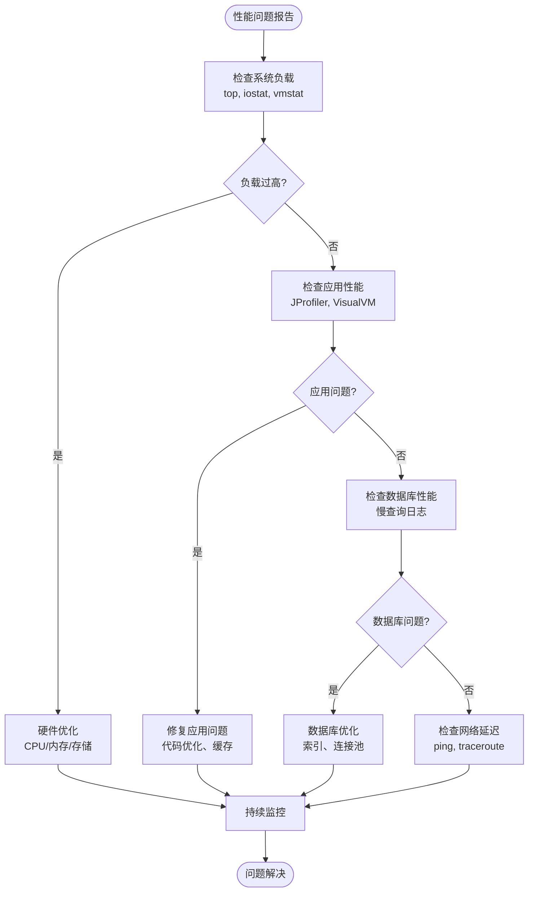

# 部署指南

<cite>
**本文档引用的文件**
- [README.md](file://README.md)
- [PROJECT_SUMMARY.md](file://PROJECT_SUMMARY.md)
- [application.yml](file://src/main/resources/application.yml)
- [pom.xml](file://pom.xml)
- [SecurityConfig.java](file://src/main/java/com/photo/config/SecurityConfig.java)
- [SecurityProperties.java](file://src/main/java/com/photo/config/SecurityProperties.java)
- [FileStorageProperties.java](file://src/main/java/com/photo/config/FileStorageProperties.java)
- [FileStorageService.java](file://src/main/java/com/photo/service/FileStorageService.java)
- [SecurityUtils.java](file://src/main/java/com/photo/util/SecurityUtils.java)
- [schema.sql](file://src/main/resources/schema.sql)
- [application-test.yml](file://src/test/resources/application-test.yml)
- [API_DOCUMENTATION.md](file://API_DOCUMENTATION.md)
</cite>

## 目录
1. [项目概述](#项目概述)
2. [生产环境准备](#生产环境准备)
3. [数据库迁移](#数据库迁移)
4. [文件存储配置](#文件存储配置)
5. [安全配置升级](#安全配置升级)
6. [性能优化配置](#性能优化配置)
7. [监控与日志](#监控与日志)
8. [部署最佳实践](#部署最佳实践)
9. [故障排查指南](#故障排查指南)
10. [维护与备份](#维护与备份)

## 项目概述

zcyTest2是一个基于Spring Boot 3.2.0构建的企业级照片上传下载系统，提供完整的文件管理功能，包括上传、下载、在线预览、断点续传等核心功能。该项目已在开发环境中经过充分测试，现需迁移到生产环境。

### 核心特性
- **文件管理**: 支持单文件和批量上传，文件类型验证，大小限制
- **安全防护**: 多层安全检查，防盗链，XSS防护，SQL注入防护
- **性能优化**: 图片压缩，缩略图生成，Caffeine缓存，断点续传
- **API设计**: RESTful API，OpenAPI文档，统一响应格式

**章节来源**
- [README.md](file://README.md#L1-L50)
- [PROJECT_SUMMARY.md](file://PROJECT_SUMMARY.md#L1-L100)

## 生产环境准备

### 环境要求

#### 硬件要求
- **CPU**: 至少2核，推荐4核以上
- **内存**: 最小4GB，推荐8GB以上
- **存储**: 至少10GB可用空间，根据预期存储量调整
- **网络**: 稳定的互联网连接

#### 软件要求
- **JDK**: Java 17+
- **数据库**: MySQL 5.7+ 或 MariaDB 10.2+
- **操作系统**: Linux (推荐Ubuntu 20.04+) 或 Windows Server
- **容器化**: Docker (可选但推荐)

### 系统架构概览



**图表来源**
- [application.yml](file://src/main/resources/application.yml#L1-L50)
- [pom.xml](file://pom.xml#L1-L50)

### 依赖组件配置

#### 数据库配置
```yaml
# MySQL生产环境配置
spring:
  datasource:
    url: jdbc:mysql://db-host:3306/photo_db?useUnicode=true&characterEncoding=utf8&useSSL=false&serverTimezone=Asia/Shanghai
    username: photo_user
    password: ${DB_PASSWORD}
    driver-class-name: com.mysql.cj.jdbc.Driver
    hikari:
      maximum-pool-size: 20
      minimum-idle: 5
      connection-timeout: 30000
      idle-timeout: 600000
      max-lifetime: 1800000
```

#### 缓存配置
```yaml
# Redis缓存配置
spring:
  cache:
    type: redis
    redis:
      host: ${REDIS_HOST}
      port: ${REDIS_PORT}
      password: ${REDIS_PASSWORD}
      timeout: 5000
      lettuce:
        pool:
          max-active: 20
          max-idle: 10
          min-idle: 5
```

**章节来源**
- [application.yml](file://src/main/resources/application.yml#L1-L30)
- [pom.xml](file://pom.xml#L40-L80)

## 数据库迁移

### 从H2到MySQL迁移

#### 1. 数据库选择与配置

**MySQL配置建议**：
- **存储引擎**: InnoDB
- **字符集**: utf8mb4
- **排序规则**: utf8mb4_unicode_ci
- **事务隔离级别**: READ-COMMITTED

#### 2. 数据库初始化脚本

基于现有的schema.sql文件，创建生产环境数据库：

```sql
-- 生产环境数据库初始化脚本
CREATE DATABASE IF NOT EXISTS photo_db CHARACTER SET utf8mb4 COLLATE utf8mb4_unicode_ci;

USE photo_db;

-- 照片表
CREATE TABLE photos (
    id BIGINT AUTO_INCREMENT PRIMARY KEY,
    original_filename VARCHAR(500) NOT NULL COMMENT '原始文件名',
    stored_filename VARCHAR(100) NOT NULL UNIQUE COMMENT '存储文件名',
    file_path VARCHAR(1000) NOT NULL COMMENT '文件路径',
    thumbnail_path VARCHAR(1000) COMMENT '缩略图路径',
    file_size BIGINT NOT NULL COMMENT '文件大小(字节)',
    content_type VARCHAR(100) NOT NULL COMMENT '文件类型',
    extension VARCHAR(20) NOT NULL COMMENT '文件扩展名',
    width INT COMMENT '图片宽度',
    height INT COMMENT '图片高度',
    md5 VARCHAR(32) UNIQUE COMMENT 'MD5值',
    user_id VARCHAR(50) NOT NULL COMMENT '上传用户ID',
    access_count BIGINT DEFAULT 0 NOT NULL COMMENT '访问次数',
    download_count BIGINT DEFAULT 0 NOT NULL COMMENT '下载次数',
    is_public BOOLEAN DEFAULT TRUE NOT NULL COMMENT '是否公开',
    deleted BOOLEAN DEFAULT FALSE NOT NULL COMMENT '是否已删除',
    description VARCHAR(1000) COMMENT '描述',
    created_at TIMESTAMP DEFAULT CURRENT_TIMESTAMP NOT NULL COMMENT '创建时间',
    updated_at TIMESTAMP DEFAULT CURRENT_TIMESTAMP ON UPDATE CURRENT_TIMESTAMP NOT NULL COMMENT '更新时间',
    last_accessed_at TIMESTAMP COMMENT '最后访问时间',
    ip_address VARCHAR(50) COMMENT 'IP地址',
    
    INDEX idx_original_filename (original_filename),
    INDEX idx_created_at (created_at),
    INDEX idx_user_id (user_id),
    INDEX idx_md5 (md5)
) ENGINE=InnoDB DEFAULT CHARSET=utf8mb4 COMMENT='照片信息表';

-- 创建数据库用户
CREATE USER 'photo_user'@'%' IDENTIFIED BY '${DB_PASSWORD}';
GRANT SELECT, INSERT, UPDATE, DELETE ON photo_db.* TO 'photo_user'@'%';
FLUSH PRIVILEGES;
```

#### 3. 数据迁移策略

**增量迁移方案**：
1. **停机迁移**: 关闭应用，导出H2数据，导入MySQL
2. **在线迁移**: 使用数据库同步工具，如Canal或Debezium
3. **双写模式**: 新旧数据库同时写入，逐步迁移数据

#### 4. 数据库连接池优化

```yaml
spring:
  datasource:
    hikari:
      maximum-pool-size: 20
      minimum-idle: 5
      connection-timeout: 30000
      idle-timeout: 600000
      max-lifetime: 1800000
      leak-detection-threshold: 60000
      pool-name: PhotoPool
```

**章节来源**
- [schema.sql](file://src/main/resources/schema.sql#L1-L37)
- [application.yml](file://src/main/resources/application.yml#L5-L25)

## 文件存储配置

### 对象存储解决方案

#### 1. AWS S3配置

```yaml
file:
  storage:
    type: s3
    s3:
      bucket: photo-storage-prod
      region: ap-southeast-1
      access-key: ${AWS_ACCESS_KEY}
      secret-key: ${AWS_SECRET_KEY}
      endpoint: s3.amazonaws.com
      max-file-size: 52428800  # 50MB
      max-storage-size: 107374182400  # 100GB
```

#### 2. 阿里云OSS配置

```yaml
file:
  storage:
    type: oss
    oss:
      bucket: photo-storage-prod
      endpoint: oss-ap-southeast-1.aliyuncs.com
      access-key: ${ALIBABA_ACCESS_KEY}
      secret-key: ${ALIBABA_SECRET_KEY}
      max-file-size: 52428800  # 50MB
      max-storage-size: 107374182400  # 100GB
```

#### 3. 本地存储配置（不推荐生产）

```yaml
file:
  storage:
    type: local
    local:
      base-path: /data/uploads
      temp-path: /data/uploads/temp
      thumbnail-path: /data/uploads/thumbnails
      max-file-size: 10485760  # 10MB
      max-storage-size: 10737418240  # 10GB
```

### 存储容量监控

```yaml
file:
  storage:
    monitoring:
      enabled: true
      alert-threshold: 80  # 百分比
      notification-email: admin@example.com
      cleanup:
        threshold-days: 60
        retention-policy:
          public-files: 30
          private-files: 90
```

### 文件清理策略

```yaml
file:
  storage:
    cleanup:
      enabled: true
      schedule: "0 0 3 * * ?"  # 每天凌晨3点执行
      max-concurrent-deletes: 10
      batch-size: 100
      dry-run: false
```

**章节来源**
- [FileStorageProperties.java](file://src/main/java/com/photo/config/FileStorageProperties.java#L1-L94)
- [FileStorageService.java](file://src/main/java/com/photo/service/FileStorageService.java#L1-L100)

## 安全配置升级

### HTTPS配置

#### 1. Nginx反向代理配置

```nginx
upstream photo_backend {
    server 127.0.0.1:8080;
}

server {
    listen 443 ssl http2;
    server_name photos.example.com;
    
    # SSL证书配置
    ssl_certificate /etc/ssl/certs/ssl-bundle.crt;
    ssl_certificate_key /etc/ssl/private/domain.key;
    ssl_protocols TLSv1.2 TLSv1.3;
    ssl_ciphers ECDHE-RSA-AES256-GCM-SHA512:DHE-RSA-AES256-GCM-SHA512;
    ssl_prefer_server_ciphers off;
    
    # 安全头
    add_header X-Frame-Options DENY;
    add_header X-Content-Type-Options nosniff;
    add_header X-XSS-Protection "1; mode=block";
    add_header Strict-Transport-Security "max-age=31536000; includeSubDomains";
    
    location /api/ {
        proxy_pass http://photo_backend;
        proxy_set_header Host $host;
        proxy_set_header X-Real-IP $remote_addr;
        proxy_set_header X-Forwarded-For $proxy_add_x_forwarded_for;
        proxy_set_header X-Forwarded-Proto $scheme;
        
        # 限制文件上传大小
        client_max_body_size 50M;
        
        # 超时设置
        proxy_connect_timeout 60s;
        proxy_send_timeout 60s;
        proxy_read_timeout 60s;
    }
}
```

#### 2. Spring Security JWT配置

```java
@Configuration
@EnableWebSecurity
public class SecurityConfig {
    
    @Bean
    public SecurityFilterChain filterChain(HttpSecurity http) throws Exception {
        http
            .csrf(csrf -> csrf.disable())
            .cors(cors -> cors.configurationSource(corsConfigurationSource()))
            .sessionManagement(session -> 
                session.sessionCreationPolicy(SessionCreationPolicy.STATELESS))
            .authorizeHttpRequests(auth -> auth
                .requestMatchers(
                    "/h2-console/**",
                    "/api-docs/**",
                    "/swagger-ui/**",
                    "/photos/view/**",
                    "/photos/download/**",
                    "/photos/public/**"
                ).permitAll()
                .anyRequest().authenticated()
            )
            .addFilterBefore(jwtAuthenticationFilter(), UsernamePasswordAuthenticationFilter.class);
        
        return http.build();
    }
    
    @Bean
    public JwtAuthenticationFilter jwtAuthenticationFilter() {
        return new JwtAuthenticationFilter(jwtTokenProvider);
    }
}
```

### JWT认证配置

```yaml
security:
  jwt:
    secret: ${JWT_SECRET_KEY}
    expiration: 86400000  # 24小时
    refresh-token-expiration: 604800000  # 7天
    issuer: photos.example.com
    audience: photo-users
  referer:
    enabled: true
    allowed-domains:
      - https://photos.example.com
      - https://app.example.com
  cors:
    enabled: true
    allowed-origins:
      - https://photos.example.com
      - https://app.example.com
    allowed-methods:
      - GET
      - POST
      - PUT
      - DELETE
      - OPTIONS
    allowed-headers:
      - Authorization
      - Content-Type
      - X-Requested-With
    allow-credentials: true
```

### 防火墙规则配置

#### 1. iptables规则

```bash
#!/bin/bash
# 生产环境防火墙配置

# 允许SSH连接
iptables -A INPUT -p tcp --dport 22 -j ACCEPT

# 允许HTTP(S)流量
iptables -A INPUT -p tcp --dport 80 -j ACCEPT
iptables -A INPUT -p tcp --dport 443 -j ACCEPT

# 允许应用端口
iptables -A INPUT -p tcp --dport 8080 -j ACCEPT

# 拒绝其他所有入站连接
iptables -P INPUT DROP
iptables -P FORWARD DROP

# 允许所有出站连接
iptables -P OUTPUT ACCEPT

# 保存规则
iptables-save > /etc/iptables/rules.v4
```

#### 2. ufw配置

```bash
# 启用ufw
sudo ufw enable

# 允许SSH
sudo ufw allow ssh

# 允许HTTP/HTTPS
sudo ufw allow 80/tcp
sudo ufw allow 443/tcp

# 允许应用端口
sudo ufw allow 8080/tcp

# 设置默认拒绝策略
sudo ufw default deny incoming
```

**章节来源**
- [SecurityConfig.java](file://src/main/java/com/photo/config/SecurityConfig.java#L1-L71)
- [SecurityProperties.java](file://src/main/java/com/photo/config/SecurityProperties.java#L1-L53)
- [SecurityUtils.java](file://src/main/java/com/photo/util/SecurityUtils.java#L1-L100)

## 性能优化配置

### JVM调优参数

```bash
# 生产环境JVM参数
JAVA_OPTS="-Xms4g -Xmx8g \
  -XX:+UseG1GC \
  -XX:MaxGCPauseMillis=200 \
  -XX:+HeapDumpOnOutOfMemoryError \
  -XX:HeapDumpPath=/var/log/photo-upload/heapdump.hprof \
  -XX:+PrintGCDetails \
  -XX:+PrintGCTimeStamps \
  -Xloggc:/var/log/photo-upload/gc.log \
  -XX:+UseGCLogFileRotation \
  -XX:NumberOfGCLogFiles=5 \
  -XX:GCLogFileSize=100M \
  -Djava.awt.headless=true \
  -Dfile.encoding=UTF-8 \
  -Dsun.jnu.encoding=UTF-8"
```

### 应用程序配置优化

```yaml
# 生产环境应用程序配置
server:
  port: 8080
  servlet:
    context-path: /api
  compression:
    enabled: true
    mime-types: text/html,text/xml,text/plain,text/css,application/javascript,application/json,image/svg+xml
  
spring:
  servlet:
    multipart:
      max-file-size: 50MB
      max-request-size: 100MB
      file-size-threshold: 10MB
  
  cache:
    type: caffeine
    caffeine:
      spec: maximumSize=10000,expireAfterWrite=3600s,record-stats
  
  jpa:
    hibernate:
      ddl-auto: validate
    show-sql: false
    properties:
      hibernate:
        format_sql: false
        use_sql_comments: false
        jdbc:
          time_zone: UTC
        connection:
          provider_disables_autocommit: true
```

### 数据库连接池优化

```yaml
spring:
  datasource:
    hikari:
      maximum-pool-size: 20
      minimum-idle: 5
      connection-timeout: 30000
      idle-timeout: 600000
      max-lifetime: 1800000
      leak-detection-threshold: 60000
      initialization-fail-timeout: 0
      pool-name: PhotoPool
      connection-test-query: SELECT 1
      validation-timeout: 5000
      transaction-isolation: TRANSACTION_READ_COMMITTED
```

### 缓存策略优化

```yaml
# 多级缓存配置
cache:
  redis:
    host: ${REDIS_HOST}
    port: ${REDIS_PORT}
    password: ${REDIS_PASSWORD}
    timeout: 5000
    lettuce:
      pool:
        max-active: 20
        max-idle: 10
        min-idle: 5
        max-wait: -1ms
        
  local:
    maximum-size: 10000
    expire-after-access: 3600s
    refresh-after-write: 1800s
```

**章节来源**
- [application.yml](file://src/main/resources/application.yml#L100-L173)

## 监控与日志

### 监控系统配置

#### 1. Spring Boot Actuator

```yaml
management:
  endpoints:
    web:
      exposure:
        include: health,info,metrics,prometheus,logfile
  endpoint:
    health:
      show-details: when-authorized
    metrics:
      enabled: true
  health:
    db:
      enabled: true
    disk-space:
      enabled: true
    mail:
      enabled: false
```

#### 2. Prometheus指标配置

```yaml
# Prometheus指标配置
management:
  metrics:
    export:
      prometheus:
        enabled: true
        descriptions: true
        step: PT1M
    distribution:
      percentiles-histogram:
        http.server.requests: true
      slo:
        http.server.requests: 50ms,100ms,200ms,500ms,1s,2s
```

### 日志配置

#### 1. 结构化日志配置

```yaml
logging:
  level:
    root: INFO
    com.photo: DEBUG
    org.springframework.web: WARN
    org.springframework.security: INFO
    org.hibernate: ERROR
    com.zaxxer.hikari: WARN
  
  pattern:
    console: "%d{yyyy-MM-dd HH:mm:ss.SSS} [%thread] %-5level %logger{36} - %msg%n"
    file: "%d{yyyy-MM-dd HH:mm:ss.SSS} [%thread] %-5level %logger{36} - %msg%n"
  
  file:
    name: /var/log/photo-upload/photo-upload.log
    max-size: 100MB
    max-history: 30
    total-size-cap: 1GB
  
  logback:
    rollingpolicy:
      max-file-size: 50MB
      file-name-pattern: /var/log/photo-upload/photo-upload.%d{yyyy-MM-dd}.%i.log
      total-size-cap: 1GB
```

#### 2. ELK Stack集成

```yaml
# Logstash配置
input {
  file {
    path => "/var/log/photo-upload/photo-upload.log"
    start_position => "beginning"
    codec => multiline {
      pattern => "^\d{4}-\d{2}-\d{2}"
      negate => true
      what => "previous"
    }
  }
}

filter {
  grok {
    match => { "message" => "%{TIMESTAMP_ISO8601:timestamp} \[%{DATA:thread}\] %{LOGLEVEL:level} %{DATA:class} - %{GREEDYDATA:msg}" }
  }
  
  date {
    match => [ "timestamp", "yyyy-MM-dd HH:mm:ss.SSS" ]
    target => "@timestamp"
  }
  
  if [level] == "ERROR" {
    mutate {
      add_tag => [ "error" ]
    }
  }
}

output {
  elasticsearch {
    hosts => ["elasticsearch:9200"]
    index => "photo-upload-%{+YYYY.MM.dd}"
  }
  
  stdout { codec => rubydebug }
}
```

### 告警配置

#### 1. 监控指标

```yaml
# 关键监控指标
monitoring:
  metrics:
    # JVM指标
    jvm:
      heap-used-percent: 80
      gc-pause-threshold: 200ms
      thread-count: 200
      
    # 应用指标
    app:
      response-time-p95: 500ms
      error-rate: 5%
      active-connections: 1000
      
    # 存储指标
    storage:
      disk-usage-percent: 85
      file-upload-rate: 100/minute
      
    # 数据库指标
    database:
      connection-pool-utilization: 80%
      query-response-time: 100ms
```

#### 2. 告警规则

```yaml
# Prometheus告警规则
groups:
- name: photo-upload.rules
  rules:
  - alert: HighErrorRate
    expr: rate(http_requests_total{status=~"5.."}[5m]) > 0.05
    for: 2m
    labels:
      severity: critical
    annotations:
      summary: "High error rate detected"
      description: "Error rate is {{ $value }} per second"
      
  - alert: HighResponseTime
    expr: histogram_quantile(0.95, rate(http_request_duration_seconds_bucket[5m])) > 0.5
    for: 5m
    labels:
      severity: warning
    annotations:
      summary: "High response time detected"
      description: "95th percentile response time is {{ $value }} seconds"
      
  - alert: HighDiskUsage
    expr: (node_filesystem_avail_bytes / node_filesystem_size_bytes) * 100 < 15
    for: 1m
    labels:
      severity: critical
    annotations:
      summary: "Disk space low"
      description: "Available disk space is {{ $value }}%"
```

**章节来源**
- [application.yml](file://src/main/resources/application.yml#L140-L173)

## 部署最佳实践

### Docker容器化部署

#### 1. Dockerfile

```dockerfile
FROM openjdk:17-jdk-slim

# 创建应用目录
RUN mkdir -p /app/logs /app/uploads

# 设置工作目录
WORKDIR /app

# 复制应用文件
COPY target/photo-upload-system-*.jar app.jar

# 暴露端口
EXPOSE 8080

# 创建非root用户
RUN groupadd -r photouser && useradd -r -g photouser photouser
RUN chown -R photouser:photouser /app

# 切换到非root用户
USER photouser

# 健康检查
HEALTHCHECK --interval=30s --timeout=10s --start-period=5s --retries=3 \
  CMD curl -f http://localhost:8080/api/actuator/health || exit 1

# 启动命令
ENTRYPOINT ["sh", "-c", "java $JAVA_OPTS -jar app.jar"]
```

#### 2. docker-compose.yml

```yaml
version: '3.8'

services:
  photo-app:
    build: .
    ports:
      - "8080:8080"
    environment:
      - SPRING_PROFILES_ACTIVE=production
      - DB_HOST=mysql-db
      - DB_PORT=3306
      - DB_NAME=photo_db
      - DB_USER=photo_user
      - DB_PASSWORD=${DB_PASSWORD}
      - REDIS_HOST=redis-cache
      - REDIS_PORT=6379
      - REDIS_PASSWORD=${REDIS_PASSWORD}
      - JWT_SECRET=${JWT_SECRET}
    volumes:
      - uploads:/app/uploads
      - logs:/app/logs
    depends_on:
      - mysql-db
      - redis-cache
    restart: unless-stopped
    
  mysql-db:
    image: mysql:8.0
    environment:
      MYSQL_ROOT_PASSWORD: ${MYSQL_ROOT_PASSWORD}
      MYSQL_DATABASE: photo_db
      MYSQL_USER: photo_user
      MYSQL_PASSWORD: ${DB_PASSWORD}
    volumes:
      - mysql-data:/var/lib/mysql
    command: --default-authentication-plugin=mysql_native_password
    restart: unless-stopped
    
  redis-cache:
    image: redis:7-alpine
    command: redis-server --requirepass ${REDIS_PASSWORD}
    volumes:
      - redis-data:/data
    restart: unless-stopped
    
  nginx:
    image: nginx:alpine
    ports:
      - "80:80"
      - "443:443"
    volumes:
      - ./nginx.conf:/etc/nginx/nginx.conf:ro
      - ./ssl:/etc/nginx/ssl:ro
      - ./logs/nginx:/var/log/nginx
    depends_on:
      - photo-app
    restart: unless-stopped

volumes:
  uploads:
    driver: local
  logs:
    driver: local
  mysql-data:
    driver: local
  redis-data:
    driver: local
```

### Kubernetes部署

#### 1. Deployment配置

```yaml
apiVersion: apps/v1
kind: Deployment
metadata:
  name: photo-upload-deployment
  namespace: photo-system
spec:
  replicas: 3
  selector:
    matchLabels:
      app: photo-upload
  template:
    metadata:
      labels:
        app: photo-upload
    spec:
      containers:
      - name: photo-upload
        image: registry.example.com/photo-upload:v1.0.0
        ports:
        - containerPort: 8080
        env:
        - name: SPRING_PROFILES_ACTIVE
          value: "production"
        - name: DB_HOST
          valueFrom:
            secretKeyRef:
              name: database-secret
              key: host
        - name: DB_PASSWORD
          valueFrom:
            secretKeyRef:
              name: database-secret
              key: password
        - name: REDIS_PASSWORD
          valueFrom:
            secretKeyRef:
              name: redis-secret
              key: password
        - name: JWT_SECRET
          valueFrom:
            secretKeyRef:
              name: security-secret
              key: jwt-secret
        resources:
          requests:
            memory: "1Gi"
            cpu: "500m"
          limits:
            memory: "2Gi"
            cpu: "1000m"
        livenessProbe:
          httpGet:
            path: /api/actuator/health
            port: 8080
          initialDelaySeconds: 30
          periodSeconds: 10
        readinessProbe:
          httpGet:
            path: /api/actuator/health/readiness
            port: 8080
          initialDelaySeconds: 5
          periodSeconds: 5
        volumeMounts:
        - name: uploads
          mountPath: /app/uploads
        - name: logs
          mountPath: /app/logs
      volumes:
      - name: uploads
        persistentVolumeClaim:
          claimName: photo-uploads-pvc
      - name: logs
        persistentVolumeClaim:
          claimName: photo-logs-pvc
```

#### 2. Service配置

```yaml
apiVersion: v1
kind: Service
metadata:
  name: photo-upload-service
  namespace: photo-system
spec:
  selector:
    app: photo-upload
  ports:
  - name: http
    port: 80
    targetPort: 8080
  type: LoadBalancer
```

#### 3. Ingress配置

```yaml
apiVersion: networking.k8s.io/v1
kind: Ingress
metadata:
  name: photo-upload-ingress
  namespace: photo-system
  annotations:
    kubernetes.io/ingress.class: nginx
    nginx.ingress.kubernetes.io/ssl-redirect: "true"
    nginx.ingress.kubernetes.io/proxy-body-size: "50m"
    nginx.ingress.kubernetes.io/cors-allow-credentials: "true"
    nginx.ingress.kubernetes.io/cors-allow-methods: "GET,POST,PUT,DELETE,OPTIONS"
spec:
  tls:
  - hosts:
    - photos.example.com
    secretName: tls-secret
  rules:
  - host: photos.example.com
    http:
      paths:
      - path: /
        pathType: Prefix
        backend:
          service:
            name: photo-upload-service
            port:
              number: 80
```

### CI/CD流水线

#### 1. GitHub Actions配置

```yaml
name: Deploy Photo Upload System

on:
  push:
    branches: [ main ]
  pull_request:
    branches: [ main ]

jobs:
  build:
    runs-on: ubuntu-latest
    
    steps:
    - uses: actions/checkout@v3
    
    - name: Set up JDK 17
      uses: actions/setup-java@v3
      with:
        java-version: '17'
        distribution: 'temurin'
        
    - name: Cache Maven packages
      uses: actions/cache@v3
      with:
        path: ~/.m2
        key: ${{ runner.os }}-m2-${{ hashFiles('**/pom.xml') }}
        restore-keys: ${{ runner.os }}-m2
        
    - name: Build with Maven
      run: mvn clean package -DskipTests
      
    - name: Run Tests
      run: mvn test
      
    - name: Build Docker Image
      run: |
        docker build -t photo-upload:${{ github.sha }} .
        docker tag photo-upload:${{ github.sha }} registry.example.com/photo-upload:${{ github.sha }}
        docker tag photo-upload:${{ github.sha }} registry.example.com/photo-upload:latest
        
    - name: Login to Registry
      run: docker login -u ${{ secrets.DOCKER_USERNAME }} -p ${{ secrets.DOCKER_PASSWORD }}
      
    - name: Push to Registry
      run: |
        docker push registry.example.com/photo-upload:${{ github.sha }}
        docker push registry.example.com/photo-upload:latest
        
  deploy:
    needs: build
    runs-on: ubuntu-latest
    environment: production
    
    steps:
    - name: Deploy to Production
      run: |
        ssh deploy@production-server << 'EOF'
        docker pull registry.example.com/photo-upload:${{ github.sha }}
        docker stop photo-upload || true
        docker rm photo-upload || true
        docker run -d \
          --name photo-upload \
          --network photo-network \
          --restart unless-stopped \
          -p 8080:8080 \
          -v photo-uploads:/app/uploads \
          -v photo-logs:/app/logs \
          -e SPRING_PROFILES_ACTIVE=production \
          registry.example.com/photo-upload:${{ github.sha }}
        EOF
```

**章节来源**
- [pom.xml](file://pom.xml#L120-L155)

## 故障排查指南

### 常见问题诊断

#### 1. 文件上传失败

**症状**: 上传文件时出现500错误或文件大小限制错误

**排查步骤**:
```bash
# 1. 检查磁盘空间
df -h /data/uploads

# 2. 检查文件权限
ls -la /data/uploads

# 3. 检查应用日志
tail -f /var/log/photo-upload/photo-upload.log | grep -i "upload"

# 4. 检查数据库连接
mysql -h $DB_HOST -u $DB_USER -p$DB_PASSWORD -e "SELECT 1;"
```

**解决方案**:
```yaml
# application.yml配置调整
file:
  storage:
    max-file-size: 104857600  # 100MB
    max-storage-size: 107374182400  # 100GB
    
spring:
  servlet:
    multipart:
      max-file-size: 100MB
      max-request-size: 200MB
```

#### 2. 数据库连接问题

**症状**: 应用启动时数据库连接失败

**排查命令**:
```bash
# 检查数据库服务状态
systemctl status mysql

# 测试数据库连接
mysql -h $DB_HOST -u $DB_USER -p$DB_PASSWORD photo_db -e "SHOW TABLES;"

# 检查连接池状态
curl -s http://localhost:8080/api/actuator/metrics/hikaricp.connections.active | jq .
```

**解决方案**:
```yaml
# application.yml数据库配置
spring:
  datasource:
    hikari:
      maximum-pool-size: 10
      minimum-idle: 2
      connection-timeout: 30000
      idle-timeout: 300000
      max-lifetime: 1800000
      leak-detection-threshold: 60000
```

#### 3. 内存溢出问题

**症状**: 应用频繁重启，出现OutOfMemoryError

**诊断命令**:
```bash
# 检查JVM内存使用
jstat -gc -t $(pgrep java) 5s

# 分析堆转储
jmap -dump:format=b,file=/tmp/heapdump.hprof $(pgrep java)

# 检查GC日志
tail -f /var/log/photo-upload/gc.log
```

**解决方案**:
```bash
# 调整JVM参数
export JAVA_OPTS="-Xms2g -Xmx4g -XX:+UseG1GC -XX:MaxGCPauseMillis=200"
```

### 性能问题诊断

#### 1. 响应时间过长

**诊断流程**:


**图表来源**
- [application.yml](file://src/main/resources/application.yml#L100-L140)

#### 2. 并发连接过多

**监控指标**:
```bash
# 监控TCP连接
ss -tuln | grep :8080

# 监控应用连接
curl -s http://localhost:8080/api/actuator/metrics/http.server.connections.active | jq .

# 监控数据库连接
mysql -e "SHOW PROCESSLIST;" | wc -l
```

**解决方案**:
```yaml
# application.yml配置
server:
  tomcat:
    max-connections: 10000
    threads:
      max: 200
      min-spare: 10
```

### 网络问题排查

#### 1. DNS解析问题

**诊断命令**:
```bash
# 检查DNS解析
nslookup photos.example.com
dig photos.example.com

# 检查本地hosts文件
cat /etc/hosts

# 测试网络连通性
ping -c 4 photos.example.com
traceroute photos.example.com
```

#### 2. 防火墙阻断

**诊断命令**:
```bash
# 检查防火墙状态
sudo ufw status
sudo iptables -L -n

# 检查端口监听
netstat -tuln | grep 8080
ss -tuln | grep 8080

# 测试端口连通性
telnet localhost 8080
nc -zv localhost 8080
```

**章节来源**
- [SecurityUtils.java](file://src/main/java/com/photo/util/SecurityUtils.java#L100-L167)

## 维护与备份

### 数据备份策略

#### 1. 数据库备份

```bash
#!/bin/bash
# 生产环境数据库备份脚本

BACKUP_DIR="/backup/db"
DATE=$(date +%Y%m%d_%H%M%S)
DB_NAME="photo_db"
DB_USER="backup_user"
DB_PASSWORD="${DB_PASSWORD}"

# 创建备份目录
mkdir -p $BACKUP_DIR

# 执行备份
mysqldump -h localhost -u $DB_USER -p$DB_PASSWORD \
  --single-transaction \
  --routines \
  --triggers \
  --databases $DB_NAME \
  > $BACKUP_DIR/$DB_NAME-$DATE.sql

# 压缩备份文件
gzip $BACKUP_DIR/$DB_NAME-$DATE.sql

# 删除7天前的备份
find $BACKUP_DIR -name "*.gz" -mtime +7 -delete

# 验证备份完整性
gunzip -t $BACKUP_DIR/$DB_NAME-$DATE.sql.gz && echo "Backup verified" || echo "Backup failed"
```

#### 2. 文件备份

```bash
#!/bin/bash
# 文件存储备份脚本

SOURCE_DIR="/data/uploads"
BACKUP_DIR="/backup/files"
DATE=$(date +%Y%m%d_%H%M%S)

# 创建备份目录
mkdir -p $BACKUP_DIR

# 执行rsync备份
rsync -av --progress $SOURCE_DIR/ $BACKUP_DIR/photos-$DATE/

# 创建备份索引
find $BACKUP_DIR -name "photos-*" -type d | sort > $BACKUP_DIR/backup-index.txt

# 删除30天前的备份
find $BACKUP_DIR -name "photos-*" -mtime +30 -exec rm -rf {} \;

# 验证备份完整性
FILE_COUNT=$(find $SOURCE_DIR -type f | wc -l)
BACKUP_COUNT=$(find $BACKUP_DIR -name "photos-*" -type f | wc -l)
echo "Original files: $FILE_COUNT, Backup files: $BACKUP_COUNT"
```

#### 3. 备份恢复

```bash
#!/bin/bash
# 备份恢复脚本

BACKUP_FILE="$1"
RESTORE_DIR="$2"

if [ -z "$BACKUP_FILE" ] || [ -z "$RESTORE_DIR" ]; then
    echo "Usage: $0 <backup-file> <restore-directory>"
    exit 1
fi

# 停止应用
systemctl stop photo-upload

# 恢复数据库
echo "Restoring database..."
gunzip -c $BACKUP_FILE | mysql -u $DB_USER -p$DB_PASSWORD $DB_NAME

# 恢复文件
echo "Restoring files..."
rsync -av $BACKUP_FILE/files/ $RESTORE_DIR/

# 启动应用
systemctl start photo-upload

# 验证恢复
echo "Restore completed. Verifying..."
```

### 定期维护任务

#### 1. 日常维护

```bash
#!/bin/bash
# 日常维护脚本

LOG_FILE="/var/log/photo-upload/maintenance.log"

echo "[$(date)] Starting daily maintenance..." >> $LOG_FILE

# 1. 清理临时文件
find /tmp -name "photo-*" -mtime +1 -delete

# 2. 清理应用日志
find /var/log/photo-upload -name "*.log" -mtime +7 -delete

# 3. 清理数据库日志
mysql -e "PURGE BINARY LOGS BEFORE DATE(NOW()) - INTERVAL 7 DAY;"

# 4. 检查磁盘空间
DISK_USAGE=$(df -h /data | awk 'NR==2 {print $5}' | sed 's/%//')
if [ $DISK_USAGE -gt 80 ]; then
    echo "Warning: Disk usage is $DISK_USAGE%" >> $LOG_FILE
fi

# 5. 检查应用健康状态
HEALTH_STATUS=$(curl -s -o /dev/null -w "%{http_code}" http://localhost:8080/api/actuator/health)
if [ $HEALTH_STATUS -ne 200 ]; then
    echo "Error: Application health check failed" >> $LOG_FILE
fi

echo "[$(date)] Daily maintenance completed" >> $LOG_FILE
```

#### 2. 周期性维护

```bash
#!/bin/bash
# 周期性维护脚本

# 1. 数据库优化
mysqlcheck -o $DB_NAME

# 2. 清理过期文件
find /data/uploads -name "*.tmp" -mtime +1 -delete

# 3. 更新安全补丁
apt-get update && apt-get upgrade -y

# 4. 清理缓存
find /var/cache/apt -type f -delete

# 5. 生成维护报告
REPORT_FILE="/var/log/photo-upload/maintenance-report-$(date +%Y%m%d).html"
cat > $REPORT_FILE << EOF
<!DOCTYPE html>
<html>
<head><title>Maintenance Report</title></head>
<body>
<h1>Daily Maintenance Report - $(date)</h1>
<ul>
<li>System cleaned: Yes</li>
<li>Database optimized: Yes</li>
<li>Security updates applied: Yes</li>
<li>Health check passed: Yes</li>
</ul>
</body>
</html>
EOF
```

### 监控告警配置

#### 1. 关键指标监控

```yaml
# 监控配置
monitoring:
  alerts:
    - name: high_cpu_usage
      condition: cpu.usage > 80
      duration: 5m
      action: notify_admin
      
    - name: high_memory_usage
      condition: memory.usage > 85
      duration: 3m
      action: restart_service
      
    - name: disk_space_low
      condition: disk.usage > 90
      duration: 1m
      action: cleanup_temp_files
      
    - name: database_connection_pool_full
      condition: db.pool.usage > 95
      duration: 2m
      action: scale_up_database
```

#### 2. 自动化恢复

```bash
#!/bin/bash
# 自动化恢复脚本

case "$1" in
  "high_cpu")
    # 重启应用
    systemctl restart photo-upload
    ;;
  "high_memory")
    # 清理缓存
    curl -X POST http://localhost:8080/api/actuator/refresh
    ;;
  "disk_space")
    # 清理日志
    find /var/log/photo-upload -name "*.log" -mtime +3 -delete
    ;;
  "db_connection")
    # 重启数据库连接池
    curl -X POST http://localhost:8080/api/actuator/restart
    ;;
esac
```

**章节来源**
- [application.yml](file://src/main/resources/application.yml#L140-L173)

## 总结

本部署指南涵盖了zcyTest2项目从开发环境迁移到生产环境的完整流程，包括：

### 关键要点
1. **数据库迁移**: 从H2切换到MySQL，确保数据完整性和性能
2. **文件存储**: 从本地存储迁移到专业对象存储服务
3. **安全加固**: 启用HTTPS，实施JWT认证，配置防火墙规则
4. **性能优化**: JVM调优，数据库连接池优化，缓存策略
5. **监控体系**: 完整的日志记录，指标监控，告警机制
6. **运维自动化**: Docker容器化，CI/CD流水线，自动化备份

### 最佳实践
- **渐进式部署**: 采用蓝绿部署或金丝雀发布策略
- **监控先行**: 建立完善的监控体系，提前发现问题
- **备份优先**: 制定详细的备份恢复计划
- **文档完善**: 保持部署文档的及时更新
- **团队协作**: 建立DevOps文化，促进开发与运维协作

通过遵循本指南的建议和最佳实践，可以确保zcyTest2项目在生产环境中稳定、安全、高效地运行，为用户提供优质的文件管理服务。