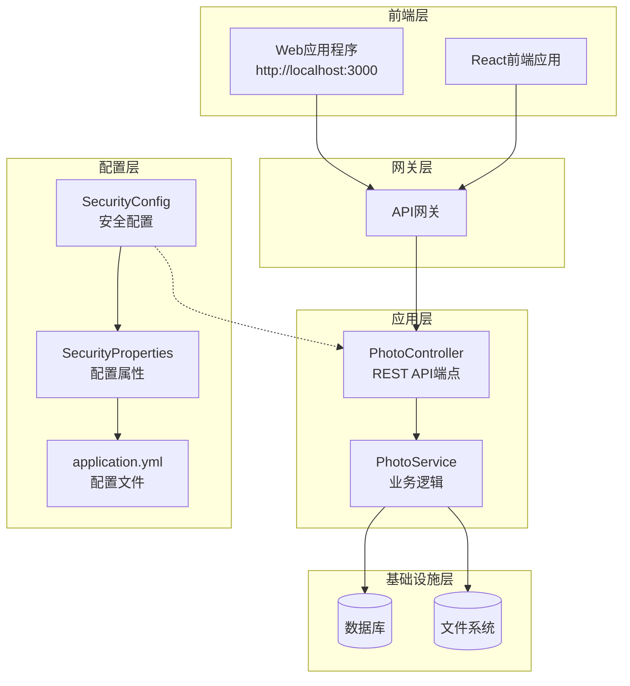
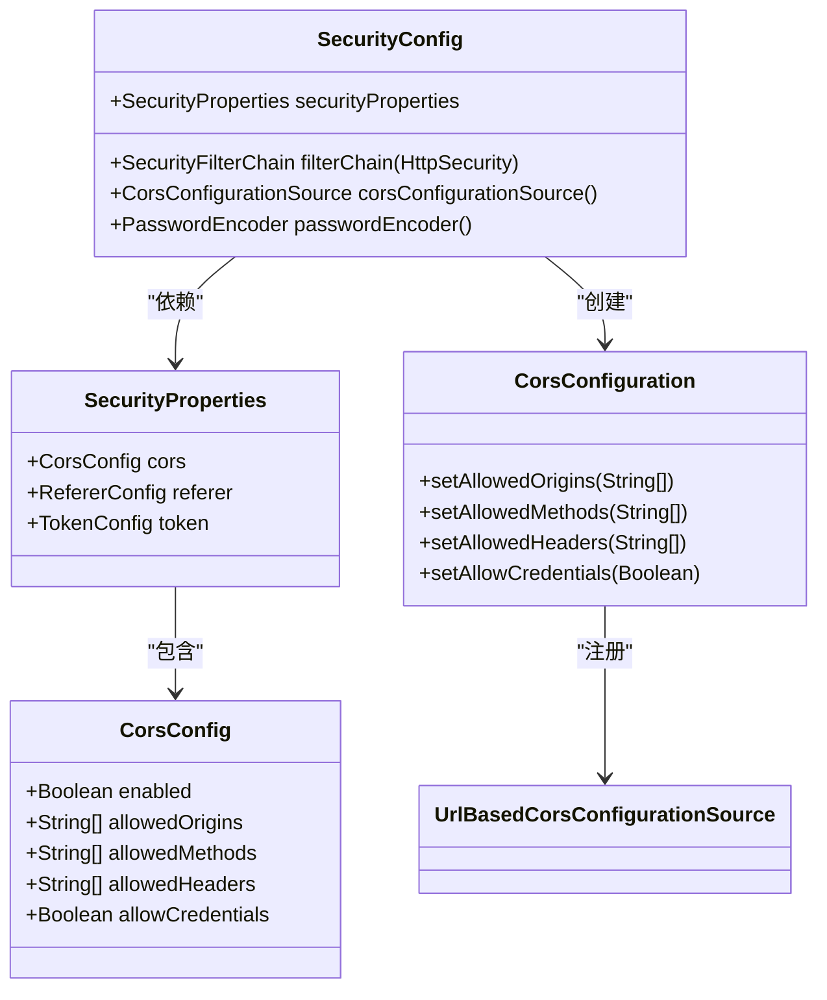
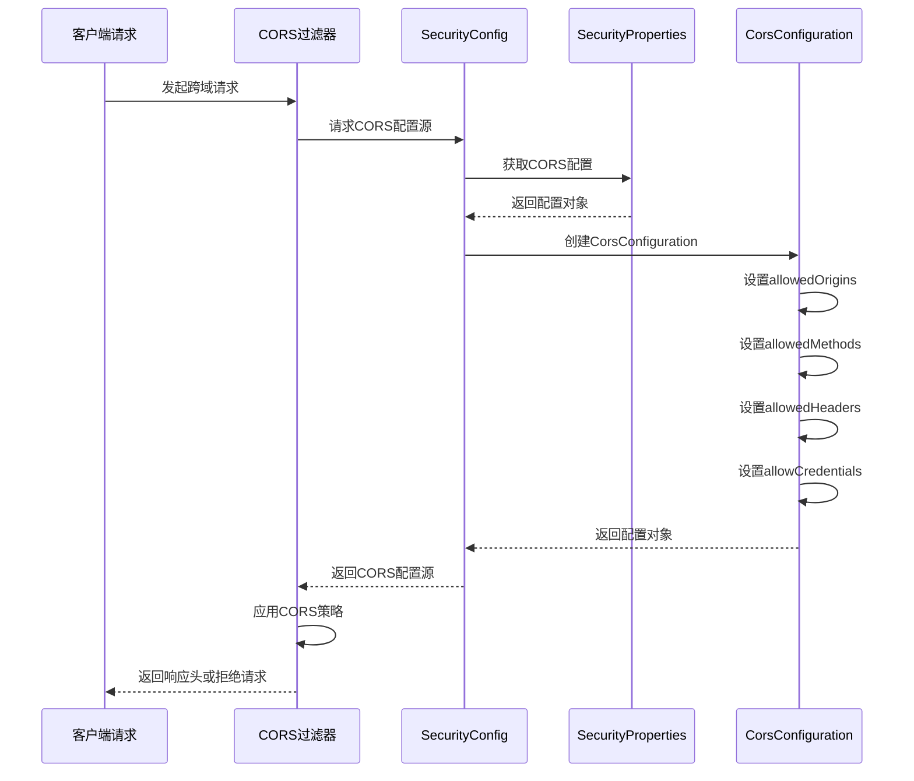

# CORS配置深度文档

<cite>
**本文档引用的文件**
- [SecurityProperties.java](file://src/main/java/com/photo/config/SecurityProperties.java)
- [SecurityConfig.java](file://src/main/java/com/photo/config/SecurityConfig.java)
- [application.yml](file://src/main/resources/application.yml)
- [application-test.yml](file://src/test/resources/application-test.yml)
- [PhotoController.java](file://src/main/java/com/photo/controller/PhotoController.java)
- [PhotoService.java](file://src/main/java/com/photo/service/PhotoService.java)
</cite>

## 目录
1. [简介](#简介)
2. [项目架构概览](#项目架构概览)
3. [CORS配置核心组件](#cors配置核心组件)
4. [SecurityProperties.CorsConfig详解](#securitypropertiescorsconfig详解)
5. [CORS配置实现机制](#cors配置实现机制)
6. [配置参数深度分析](#配置参数深度分析)
7. [环境差异与最佳实践](#环境差异与最佳实践)
8. [安全考虑与风险防范](#安全考虑与风险防范)
9. [故障排除指南](#故障排除指南)
10. [总结](#总结)

## 简介

跨域资源共享（CORS）是现代Web应用程序中不可或缺的安全机制，它控制着不同源之间的资源访问权限。本文档基于Photo Upload System项目的SecurityProperties.CorsConfig类，深入分析CORS配置的各个方面，包括enabled开关控制、allowedOrigins域名白名单、allowedMethods方法白名单、allowedHeaders头部配置以及allowCredentials凭据处理等核心功能。

该项目采用Spring Security框架实现CORS配置，通过集中化的配置管理方式，提供了灵活且安全的跨域资源共享解决方案。通过分析实际代码实现，我们将揭示CORS配置的最佳实践和潜在风险点。

## 项目架构概览

Photo Upload System项目采用了分层架构设计，其中CORS配置位于安全配置层，通过Spring Security框架进行统一管理。



**图表来源**
- [SecurityConfig.java](file://src/main/java/com/photo/config/SecurityConfig.java#L1-L71)
- [SecurityProperties.java](file://src/main/java/com/photo/config/SecurityProperties.java#L1-L53)

**章节来源**
- [SecurityConfig.java](file://src/main/java/com/photo/config/SecurityConfig.java#L1-L71)
- [SecurityProperties.java](file://src/main/java/com/photo/config/SecurityProperties.java#L1-L53)

## CORS配置核心组件

CORS配置的核心由两个主要组件构成：SecurityProperties.CorsConfig配置类和SecurityConfig配置类。这两个组件协同工作，实现了灵活且可维护的CORS策略管理。



**图表来源**
- [SecurityProperties.java](file://src/main/java/com/photo/config/SecurityProperties.java#L30-L53)
- [SecurityConfig.java](file://src/main/java/com/photo/config/SecurityConfig.java#L50-L62)

**章节来源**
- [SecurityProperties.java](file://src/main/java/com/photo/config/SecurityProperties.java#L30-L53)
- [SecurityConfig.java](file://src/main/java/com/photo/config/SecurityConfig.java#L50-L62)

## SecurityProperties.CorsConfig详解

SecurityProperties.CorsConfig类是CORS配置的核心数据结构，它封装了所有与跨域资源共享相关的配置参数。该类采用Lombok注解简化了getter/setter方法的编写，并通过@ConfigurationProperties注解实现了配置文件的自动绑定。

### 配置类结构分析

CorsConfig类包含了五个关键配置字段，每个字段都承担着特定的CORS控制职责：

| 配置字段 | 类型 | 默认值 | 作用描述 |
|---------|------|--------|----------|
| enabled | Boolean | true | 启用/禁用CORS功能的总开关 |
| allowedOrigins | List<String> | null | 允许访问的前端域名列表 |
| allowedMethods | List<String> | null | 允许的HTTP方法白名单 |
| allowedHeaders | List<String> | null | 允许的请求头字段列表 |
| allowCredentials | Boolean | true | 是否允许携带认证凭据 |

### 配置参数详解

#### enabled开关机制
enabled参数作为CORS功能的总开关，当设置为false时，整个CORS配置将被忽略，所有跨域请求都将被拒绝。这种设计提供了全局性的安全控制能力，可以在运行时动态调整CORS策略。

#### allowedOrigins域名白名单
allowedOrigins参数定义了允许访问本服务的前端域名列表。在开发环境中，通常包含本地开发服务器地址；在生产环境中，则应严格限制为实际部署的域名。

#### allowedMethods方法白名单
allowedMethods参数指定了允许的HTTP方法集合，常见的组合包括GET、POST、PUT、DELETE等标准RESTful方法。这种白名单机制确保了只有预期的请求方法能够访问API资源。

#### allowedHeaders头部配置
allowedHeaders参数控制了客户端可以发送的自定义请求头字段。使用"*"通配符虽然方便，但会带来安全风险，建议在生产环境中明确列出所需的头部字段。

#### allowCredentials凭据处理
allowCredentials参数决定了是否允许客户端携带认证信息（如Cookie、Authorization头等）。当设置为true时，需要与前端fetch API的credentials选项配合使用。

**章节来源**
- [SecurityProperties.java](file://src/main/java/com/photo/config/SecurityProperties.java#L30-L53)

## CORS配置实现机制

CORS配置的实现采用了Spring Security的声明式安全配置模式，通过SecurityConfig类中的corsConfigurationSource方法构建CORS配置源。



**图表来源**
- [SecurityConfig.java](file://src/main/java/com/photo/config/SecurityConfig.java#L50-L62)

### 配置加载流程

CORS配置的加载遵循以下流程：

1. **配置初始化阶段**：Spring Boot启动时，通过@ConfigurationProperties注解自动加载application.yml中的security.cors配置
2. **配置验证阶段**：SecurityConfig类在构造时注入SecurityProperties，确保配置的有效性
3. **动态配置阶段**：每次HTTP请求到达时，corsConfigurationSource方法根据当前配置动态生成CORS策略
4. **策略应用阶段**：Spring Security根据生成的CORS配置决定是否允许跨域请求

### 配置优先级机制

CORS配置采用了多层次的优先级机制：
- **全局开关优先级最高**：当security.cors.enabled为false时，跳过所有其他配置
- **具体路径配置优先级高于默认配置**：可以通过UrlBasedCorsConfigurationSource为特定路径设置不同的CORS策略
- **运行时配置优先级高于静态配置**：支持通过管理接口动态修改CORS配置

**章节来源**
- [SecurityConfig.java](file://src/main/java/com/photo/config/SecurityConfig.java#L50-L62)

## 配置参数深度分析

基于项目中的实际配置，我们可以深入分析各个CORS参数的具体含义和使用场景。

### allowedOrigins配置分析

项目在application.yml中配置了多个开发环境的allowedOrigins：

```yaml
security:
  cors:
    allowed-origins:
      - http://localhost:3000
      - http://localhost:8080
```

这些配置表明：
- **开发环境支持**：同时支持React开发服务器（3000端口）和后端API服务器（8080端口）
- **协议限制**：仅允许HTTP协议，不支持HTTPS（生产环境可能需要添加https://localhost）
- **端口灵活性**：允许不同端口的前端应用访问，便于开发调试

### allowedMethods配置策略

```yaml
security:
  cors:
    allowed-methods:
      - GET
      - POST
      - PUT
      - DELETE
```

这种配置体现了RESTful API的最佳实践：
- **读操作**：GET方法用于数据查询和资源获取
- **写操作**：POST用于资源创建，PUT用于资源更新
- **删除操作**：DELETE用于资源删除

### allowedHeaders通配符使用

```yaml
security:
  cors:
    allowed-headers:
      - "*"
```

**安全风险分析**：
- **优势**：简化了前端开发，无需手动管理请求头
- **风险**：可能暴露敏感信息，增加CSRF攻击风险
- **建议**：生产环境应改为明确列出的头部字段

### allowCredentials配置考量

```yaml
security:
  cors:
    allow-credentials: true
```

**配置要求**：
- **前端配合**：React应用需要设置`credentials: 'include'`
- **安全性**：必须配合严格的allowedOrigins限制
- **兼容性**：某些浏览器对credentials有特殊要求

**章节来源**
- [application.yml](file://src/main/resources/application.yml#L130-L140)
- [application-test.yml](file://src/test/resources/application-test.yml#L50-L60)

## 环境差异与最佳实践

项目通过不同的配置文件实现了开发环境和测试环境的CORS配置差异化管理。

### 开发环境配置特点

开发环境的CORS配置注重便利性和调试友好性：

| 配置项 | 开发环境值 | 生产环境建议值 | 说明 |
|--------|------------|----------------|------|
| enabled | true | true | 保持CORS功能开启 |
| allowedOrigins | 多个本地地址 | 实际域名列表 | 生产环境必须精确匹配 |
| allowedMethods | 完整REST方法集 | 最小化方法集 | 减少攻击面 |
| allowedHeaders | "*" | 明确字段列表 | 提高安全性 |
| allowCredentials | true | 根据需求 | 谨慎启用 |

### 测试环境配置优化

测试环境的CORS配置更加严格和精简：

```yaml
security:
  cors:
    enabled: true
    allowed-origins:
      - http://localhost:3000
    allowed-methods:
      - GET
      - POST
      - PUT
      - DELETE
    allowed-headers:
      - "*"
    allow-credentials: true
```

**测试环境特点**：
- **域名限制**：仅允许单一前端地址
- **方法精简**：保留基本的CRUD操作
- **头部宽松**：保持与开发环境一致
- **凭据支持**：维持完整的认证功能

### 生产环境配置指南

生产环境的CORS配置应该遵循最小权限原则：

```yaml
security:
  cors:
    enabled: true
    allowed-origins:
      - https://yourdomain.com
      - https://www.yourdomain.com
    allowed-methods:
      - GET
      - POST
    allowed-headers:
      - Content-Type
      - Authorization
    allow-credentials: false
```

**生产环境最佳实践**：
1. **域名精确匹配**：避免使用通配符，明确列出所有授权域名
2. **方法最小化**：仅开放必要的HTTP方法
3. **头部精细化**：避免使用"*"，列出必需的请求头
4. **凭据谨慎使用**：除非绝对必要，否则禁用allowCredentials
5. **HTTPS强制**：生产环境必须使用HTTPS协议

**章节来源**
- [application.yml](file://src/main/resources/application.yml#L130-L140)
- [application-test.yml](file://src/test/resources/application-test.yml#L50-L60)

## 安全考虑与风险防范

CORS配置不当可能导致严重的安全漏洞，包括跨站请求伪造（CSRF）、信息泄露等威胁。

### 主要安全风险

#### CSRF攻击风险
当allowCredentials为true且allowedOrigins过于宽松时，攻击者可能利用CSRF漏洞发起恶意请求。

**防护措施**：
- 使用严格的allowedOrigins白名单
- 实施双重提交Cookie模式
- 添加自定义CSRF令牌验证

#### 信息泄露风险
通配符配置可能导致敏感信息暴露给未授权的域。

**防护措施**：
- 避免使用"*"通配符
- 实施细粒度的头部控制
- 定期审计CORS配置

#### 中间人攻击风险
不安全的CORS配置可能被中间人攻击者利用。

**防护措施**：
- 强制使用HTTPS协议
- 实施HSTS策略
- 验证证书有效性

### 安全配置检查清单

| 检查项目 | 开发环境 | 测试环境 | 生产环境 |
|----------|----------|----------|----------|
| 协议限制 | HTTP | HTTP | HTTPS |
| 域名白名单 | 多个本地 | 单一前端 | 精确域名列表 |
| 方法范围 | 完整集 | 基本CRUD | 最小化集 |
| 头部控制 | 通配符 | 通配符 | 明确列表 |
| 凭据设置 | true | true | 根据需求 |
| 错误信息 | 详细 | 详细 | 模糊 |

### 监控与审计

建议实施以下监控措施：
- **日志记录**：记录所有CORS相关请求和拒绝事件
- **异常检测**：监控异常的CORS配置尝试
- **定期审查**：定期检查和更新CORS配置
- **渗透测试**：定期进行安全测试验证配置有效性

## 故障排除指南

CORS配置问题通常表现为跨域请求被浏览器阻止或服务器拒绝。以下是常见问题的诊断和解决方法。

### 常见错误类型

#### 1. Origin不在allowedOrigins列表中
**错误表现**：浏览器控制台显示"Access to XMLHttpRequest at '...' from origin '...' has been blocked by CORS policy"

**排查步骤**：
1. 检查前端请求的origin是否在allowedOrigins列表中
2. 验证协议（http/https）是否匹配
3. 确认端口号是否正确

**解决方案**：
```yaml
security:
  cors:
    allowed-origins:
      - http://localhost:3000  # 确保包含正确的域名
```

#### 2. 预检请求失败
**错误表现**：OPTIONS预检请求返回403或404错误

**排查步骤**：
1. 检查allowedMethods是否包含预检请求的方法
2. 验证allowedHeaders配置是否正确
3. 确认allowCredentials设置

**解决方案**：
```java
// 确保预检请求方法在allowedMethods中
configuration.setAllowedMethods(Arrays.asList("GET", "POST", "PUT", "DELETE", "OPTIONS"));
```

#### 3. 凭据传递问题
**错误表现**：authenticated requests fail with CORS errors

**排查步骤**：
1. 检查allowCredentials是否设置为true
2. 验证前端fetch配置是否包含credentials选项
3. 确认allowedOrigins是否精确匹配

**解决方案**：
```javascript
// 前端fetch配置
fetch(url, {
  method: 'POST',
  credentials: 'include',  // 必须设置
  headers: {
    'Content-Type': 'application/json'
  },
  body: JSON.stringify(data)
});
```

### 调试技巧

#### 1. 启用详细日志
```yaml
logging:
  level:
    org.springframework.web.cors: DEBUG
    org.springframework.security: DEBUG
```

#### 2. 使用浏览器开发者工具
- 检查Network面板中的CORS相关信息
- 查看Response Headers中的CORS相关字段
- 分析预检请求的详细信息

#### 3. 配置测试端点
```java
@GetMapping("/cors-test")
public ResponseEntity<String> corsTest() {
    return ResponseEntity.ok("CORS configuration is working");
}
```

**章节来源**
- [SecurityConfig.java](file://src/main/java/com/photo/config/SecurityConfig.java#L50-L62)

## 总结

CORS配置是现代Web应用安全架构的重要组成部分，通过深入分析Photo Upload System项目的SecurityProperties.CorsConfig实现，我们全面了解了CORS配置的各项参数和最佳实践。

### 关键要点回顾

1. **enabled开关控制**：提供了全局性的CORS功能管理能力
2. **allowedOrigins白名单**：必须严格限制，避免使用通配符
3. **allowedMethods方法白名单**：遵循最小权限原则
4. **allowedHeaders头部控制**：谨慎使用通配符，明确列出必需字段
5. **allowCredentials凭据处理**：根据实际需求谨慎启用

### 最佳实践总结

- **开发环境**：注重便利性，适当放宽限制
- **测试环境**：平衡安全性和功能性
- **生产环境**：严格遵循最小权限原则
- **安全监控**：持续监控和审计CORS配置

### 安全建议

1. **定期审查**：定期检查和更新CORS配置
2. **最小权限**：遵循最小权限原则
3. **HTTPS强制**：生产环境必须使用HTTPS
4. **监控告警**：建立CORS相关事件的监控机制

通过合理的CORS配置，我们能够在保证安全性的同时，为前端应用提供流畅的跨域访问体验。正确理解和实施CORS配置，是构建安全可靠的Web应用系统的基石。