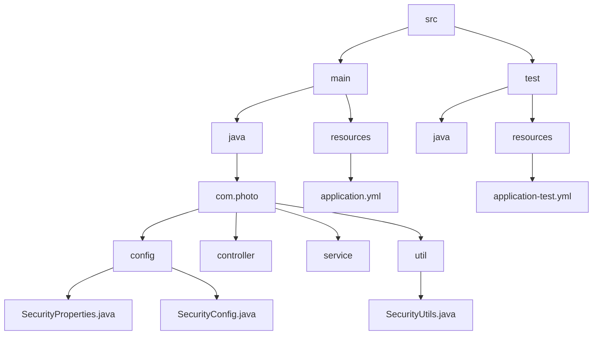
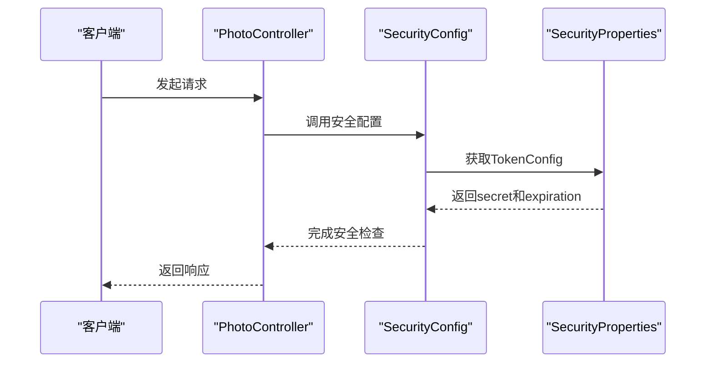
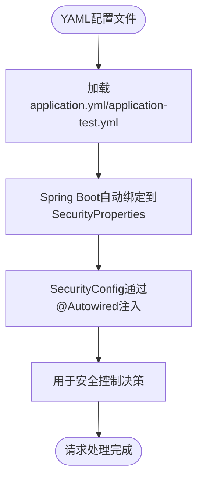
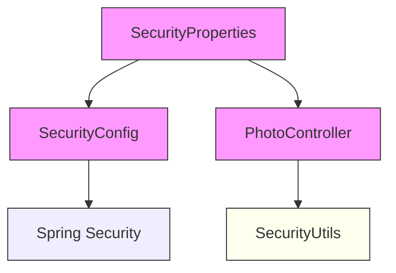

# Token配置

<cite>
**本文档引用的文件**  
- [SecurityProperties.java](file://src/main/java/com/photo/config/SecurityProperties.java)
- [application.yml](file://src/main/resources/application.yml)
- [application-test.yml](file://src/test/resources/application-test.yml)
- [SecurityConfig.java](file://src/main/java/com/photo/config/SecurityConfig.java)
- [SecurityUtils.java](file://src/main/java/com/photo/util/SecurityUtils.java)
</cite>

## 目录
1. [引言](#引言)
2. [项目结构](#项目结构)
3. [核心组件](#核心组件)
4. [架构概述](#架构概述)
5. [详细组件分析](#详细组件分析)
6. [依赖分析](#依赖分析)
7. [性能考虑](#性能考虑)
8. [故障排除指南](#故障排除指南)
9. [结论](#结论)

## 引言
本文档详细阐述了基于`SecurityProperties.TokenConfig`类的Token安全配置机制。重点解析了JWT或类似令牌生成中`secret`密钥字段的核心作用，强调在生产环境中必须替换默认值以防止安全漏洞。同时说明了`expiration`参数如何控制令牌有效期，并对比了多环境配置文件中的差异，提供密钥管理的最佳实践建议。

## 项目结构
本项目采用标准的Spring Boot多层架构设计，主要分为配置、控制器、服务、实体、工具等模块。安全相关配置集中于`config`包下，测试资源配置独立存放，确保开发、测试与生产环境隔离。



**图示来源**  
- [SecurityProperties.java](file://src/main/java/com/photo/config/SecurityProperties.java)
- [application.yml](file://src/main/resources/application.yml)
- [application-test.yml](file://src/test/resources/application-test.yml)

**本节来源**  
- [SecurityProperties.java](file://src/main/java/com/photo/config/SecurityProperties.java)
- [application.yml](file://src/main/resources/application.yml)

## 核心组件
`SecurityProperties.TokenConfig`是系统安全配置的核心部分，负责定义令牌的生成与验证规则。其`secret`字段用于签名加密，`expiration`字段控制令牌生命周期。该配置通过Spring Boot的`@ConfigurationProperties`机制自动绑定YAML文件中的值，实现灵活的外部化配置管理。

**本节来源**  
- [SecurityProperties.java](file://src/main/java/com/photo/config/SecurityProperties.java)

## 架构概述
系统采用无状态安全架构，依赖预共享密钥进行令牌签发与验证。配置属性由`SecurityProperties`统一管理，经由`SecurityConfig`注入到Spring Security过滤链中，确保请求级别的访问控制。工具类`SecurityUtils`提供辅助功能，但当前未实现完整的JWT逻辑。



**图示来源**  
- [SecurityProperties.java](file://src/main/java/com/photo/config/SecurityProperties.java)
- [SecurityConfig.java](file://src/main/java/com/photo/config/SecurityConfig.java)
- [PhotoController.java](file://src/main/java/com/photo/controller/PhotoController.java)

## 详细组件分析

### TokenConfig类分析
`TokenConfig`作为`SecurityProperties`的内部静态类，封装了令牌生成所需的关键参数。尽管当前项目中尚未集成JWT库，但此结构为后续扩展提供了清晰的配置接口。

#### 类结构图
```mermaid
classDiagram
class SecurityProperties$TokenConfig {
+String secret
+Long expiration
}
class SecurityProperties {
+TokenConfig token
}
SecurityProperties --> SecurityProperties$TokenConfig : "包含"
```

**图示来源**  
- [SecurityProperties.java](file://src/main/java/com/photo/config/SecurityProperties.java)

#### 配置绑定流程


**图示来源**  
- [SecurityProperties.java](file://src/main/java/com/photo/config/SecurityProperties.java)
- [SecurityConfig.java](file://src/main/java/com/photo/config/SecurityConfig.java)
- [application.yml](file://src/main/resources/application.yml)

**本节来源**  
- [SecurityProperties.java](file://src/main/java/com/photo/config/SecurityProperties.java)
- [SecurityConfig.java](file://src/main/java/com/photo/config/SecurityConfig.java)

### 多环境配置管理
系统通过`application.yml`和`application-test.yml`实现多环境差异化配置，体现了良好的配置管理实践。

#### 环境配置对比表
| 配置项 | 开发/生产环境 (application.yml) | 测试环境 (application-test.yml) | 说明 |
|-------|-------------------------------|-------------------------------|------|
| `security.token.secret` | your-secret-key-change-this-in-production | test-secret-key | 生产环境必须更换默认密钥 |
| `security.referer.enabled` | true | false | 测试时关闭防盗链便于调试 |
| `spring.datasource.url` | jdbc:h2:file:./data/photodb | jdbc:h2:mem:testdb | 持久化 vs 内存数据库 |
| `file.storage.base-path` | ./uploads | ./test-uploads | 隔离文件存储路径 |
| `logging.level.com.photo` | DEBUG | DEBUG | 统一调试日志级别 |

**本节来源**  
- [application.yml](file://src/main/resources/application.yml)
- [application-test.yml](file://src/test/resources/application-test.yml)

## 依赖分析
系统安全配置模块依赖清晰，无循环引用问题。`SecurityConfig`依赖`SecurityProperties`，而控制器层也直接使用该配置进行业务级安全判断，形成双重防护机制。



**图示来源**  
- [SecurityProperties.java](file://src/main/java/com/photo/config/SecurityProperties.java)
- [SecurityConfig.java](file://src/main/java/com/photo/config/SecurityConfig.java)
- [PhotoController.java](file://src/main/java/com/photo/controller/PhotoController.java)

**本节来源**  
- [SecurityProperties.java](file://src/main/java/com/photo/config/SecurityProperties.java)
- [SecurityConfig.java](file://src/main/java/com/photo/config/SecurityConfig.java)
- [PhotoController.java](file://src/main/java/com/photo/controller/PhotoController.java)

## 性能考虑
- **密钥长度影响**：较长的`secret`密钥会增加加密计算开销，但能提升安全性，建议使用至少256位强度的密钥。
- **过期时间权衡**：`expiration`设置为86400秒（24小时）在用户体验与安全间取得平衡，过长可能导致令牌滥用风险增加。
- **配置加载效率**：Spring Boot的外部化配置机制对性能影响极小，且支持热更新（需配合Spring Cloud Config等组件）。

## 故障排除指南
### 常见问题及解决方案
1. **令牌验证失败**
   - **原因**：`secret`密钥不匹配
   - **排查步骤**：
     - 检查`application.yml`中`security.token.secret`是否与客户端一致
     - 确认未遗漏`-change-this-in-production`后缀提示
     - 查看日志是否有`Invalid JWT signature`类错误

2. **生产环境安全漏洞**
   - **风险点**：未修改默认密钥`your-secret-key-change-this-in-production`
   - **修复方案**：
     - 立即生成高强度随机密钥（如使用`openssl rand -base64 32`）
     - 通过环境变量注入密钥，避免硬编码
     - 实施密钥轮换策略

3. **测试环境行为异常**
   - **现象**：防盗链功能在测试中失效
   - **原因**：`application-test.yml`中`security.referer.enabled`设为`false`
   - **说明**：这是预期行为，便于自动化测试绕过Referer检查

4. **配置未生效**
   - **检查项**：
     - 确保`SecurityProperties`类上有`@ConfigurationProperties(prefix = "security")`
     - 主应用类需启用组件扫描
     - Maven/Gradle引入`spring-boot-configuration-processor`

**本节来源**  
- [SecurityProperties.java](file://src/main/java/com/photo/config/SecurityProperties.java)
- [application.yml](file://src/main/resources/application.yml)
- [application-test.yml](file://src/test/resources/application-test.yml)
- [SecurityUtils.java](file://src/main/java/com/photo/util/SecurityUtils.java)

## 结论
`SecurityProperties.TokenConfig`作为系统安全配置的核心，其`secret`和`expiration`字段对系统安全性具有决定性影响。强烈建议在生产部署前替换默认密钥，并采用环境变量或密钥管理服务进行安全存储。当前配置结构支持良好的多环境管理，但需注意`SecurityUtils`中仅提供了占位性质的令牌生成方法，实际项目中应集成JWT等标准库完成完整认证流程。