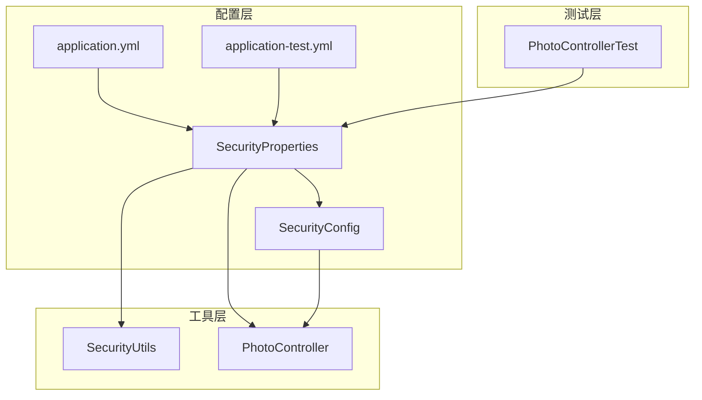
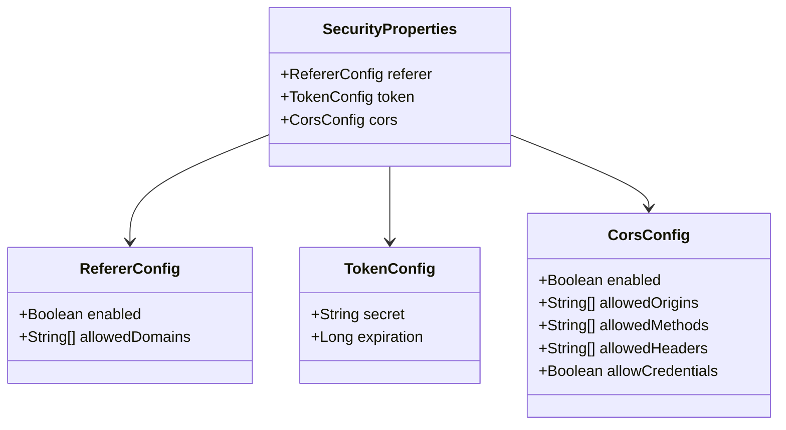
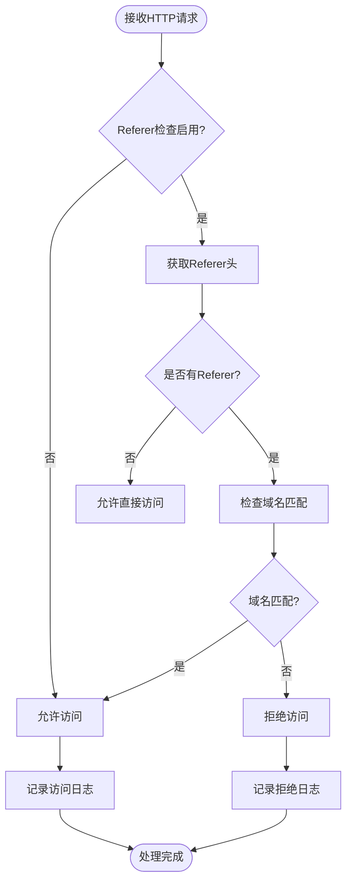
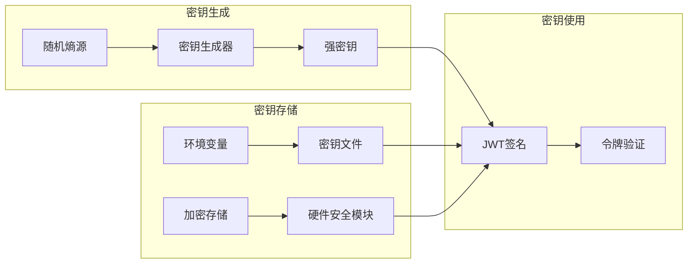
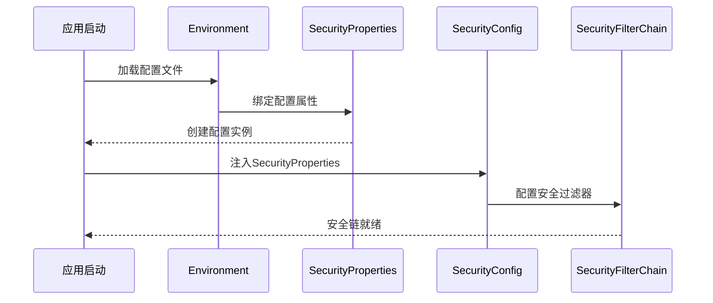
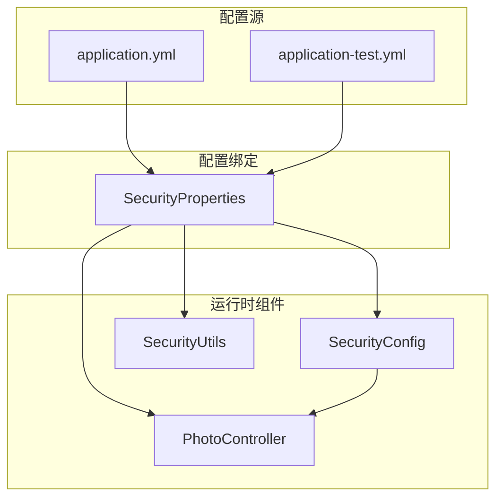

# 安全配置

<cite>
**本文档引用的文件**
- [SecurityProperties.java](file://src/main/java/com/photo/config/SecurityProperties.java)
- [SecurityConfig.java](file://src/main/java/com/photo/config/SecurityConfig.java)
- [SecurityUtils.java](file://src/main/java/com/photo/util/SecurityUtils.java)
- [PhotoController.java](file://src/main/java/com/photo/controller/PhotoController.java)
- [application.yml](file://src/main/resources/application.yml)
- [application-test.yml](file://src/test/resources/application-test.yml)
- [PhotoControllerTest.java](file://src/test/java/com/photo/controller/PhotoControllerTest.java)
</cite>

## 目录
1. [简介](#简介)
2. [项目结构](#项目结构)
3. [核心组件](#核心组件)
4. [架构概览](#架构概览)
5. [详细组件分析](#详细组件分析)
6. [依赖关系分析](#依赖关系分析)
7. [性能考虑](#性能考虑)
8. [故障排除指南](#故障排除指南)
9. [结论](#结论)

## 简介

本文档深入分析了基于Spring Boot的图片上传系统中的安全配置架构，重点围绕`SecurityProperties`类展开。该系统实现了三个核心安全模块：防盗链保护（Referer）、令牌认证（Token）和跨域资源共享（CORS）。通过系统化的配置管理和运行时动态加载机制，确保了系统的安全性、可维护性和可扩展性。

## 项目结构

该项目采用标准的Spring Boot项目结构，安全配置相关文件主要分布在以下位置：



**图表来源**
- [SecurityProperties.java](file://src/main/java/com/photo/config/SecurityProperties.java#L1-L53)
- [SecurityConfig.java](file://src/main/java/com/photo/config/SecurityConfig.java#L1-L71)

**章节来源**
- [SecurityProperties.java](file://src/main/java/com/photo/config/SecurityProperties.java#L1-L53)
- [SecurityConfig.java](file://src/main/java/com/photo/config/SecurityConfig.java#L1-L71)

## 核心组件

### SecurityProperties类设计

`SecurityProperties`是整个安全配置的核心类，采用了Spring Boot的配置属性绑定机制，提供了类型安全的配置管理：



**图表来源**
- [SecurityProperties.java](file://src/main/java/com/photo/config/SecurityProperties.java#L14-L53)

### 配置模块详解

#### 1. RefererConfig - 防盗链配置
- **enabled**: 控制防盗链功能的开关，默认启用
- **allowedDomains**: 允许的域名列表，用于验证请求来源

#### 2. TokenConfig - 令牌配置
- **secret**: JWT签名密钥，必须在生产环境中替换为强密钥
- **expiration**: 令牌过期时间（秒），默认24小时

#### 3. CorsConfig - 跨域配置
- **enabled**: CORS功能开关
- **allowedOrigins**: 允许的源域名列表
- **allowedMethods**: 允许的HTTP方法
- **allowedHeaders**: 允许的请求头
- **allowCredentials**: 是否允许携带凭据

**章节来源**
- [SecurityProperties.java](file://src/main/java/com/photo/config/SecurityProperties.java#L14-L53)

## 架构概览

系统安全架构采用分层设计，通过配置驱动的方式实现灵活的安全策略管理：

```mermaid
sequenceDiagram
participant Client as 客户端
participant Controller as PhotoController
participant Utils as SecurityUtils
participant Properties as SecurityProperties
participant Config as SecurityConfig
Client->>Controller : HTTP请求
Controller->>Properties : 获取配置
Properties-->>Controller : 返回配置对象
alt Referer检查启用
Controller->>Utils : validateReferer()
Utils->>Utils : 检查Referer头
Utils-->>Controller : 验证结果
end
Controller->>Controller : 处理业务逻辑
Note over Config : 运行时加载配置
Config->>Properties : 注入配置
Properties-->>Config : 提供配置数据
```

**图表来源**
- [PhotoController.java](file://src/main/java/com/photo/controller/PhotoController.java#L85-L95)
- [SecurityConfig.java](file://src/main/java/com/photo/config/SecurityConfig.java#L23-L71)

## 详细组件分析

### Referer防盗链机制

#### 实现原理
防盗链功能通过检查HTTP请求头中的`Referer`字段来验证请求来源的合法性：



**图表来源**
- [SecurityUtils.java](file://src/main/java/com/photo/util/SecurityUtils.java#L58-L75)

#### 生产环境最佳实践
- **HTTPS强制**: 生产环境必须启用HTTPS，防止Referer泄露
- **域名白名单**: 严格限制允许的域名范围
- **日志审计**: 记录所有非法Referer访问尝试

**章节来源**
- [SecurityUtils.java](file://src/main/java/com/photo/util/SecurityUtils.java#L58-L75)
- [PhotoController.java](file://src/main/java/com/photo/controller/PhotoController.java#L85-L95)

### Token认证机制

#### 密钥管理策略
令牌认证系统采用对称加密算法，密钥管理是安全性的关键：



#### 安全配置建议
- **密钥强度**: 使用至少32字节的随机密钥
- **定期轮换**: 建议每90天更换一次密钥
- **加密存储**: 生产环境不应明文存储密钥

**章节来源**
- [SecurityProperties.java](file://src/main/java/com/photo/config/SecurityProperties.java#L32-L35)

### CORS跨域配置

#### 配置参数详解
CORS配置直接影响前端应用的访问能力：

| 参数 | 类型 | 默认值 | 影响 |
|------|------|--------|------|
| enabled | Boolean | true | 启用/禁用CORS |
| allowedOrigins | List<String> | [] | 允许的源域名 |
| allowedMethods | List<String> | [] | 允许的HTTP方法 |
| allowedHeaders | List<String> | [] | 允许的请求头 |
| allowCredentials | Boolean | true | 是否允许凭据 |

#### 安全考虑
- **最小权限原则**: 只允许必要的域名和方法
- **凭据控制**: 生产环境谨慎启用凭据传递
- **预检缓存**: 合理设置预检请求的缓存时间

**章节来源**
- [SecurityConfig.java](file://src/main/java/com/photo/config/SecurityConfig.java#L48-L62)

### Spring Security集成

#### 配置加载流程
Spring Security通过依赖注入机制加载安全配置：



**图表来源**
- [SecurityConfig.java](file://src/main/java/com/photo/config/SecurityConfig.java#L23-L71)

**章节来源**
- [SecurityConfig.java](file://src/main/java/com/photo/config/SecurityConfig.java#L23-L71)

## 依赖关系分析

### 配置层次结构



**图表来源**
- [application.yml](file://src/main/resources/application.yml#L85-L105)
- [application-test.yml](file://src/test/resources/application-test.yml#L45-L60)

### 环境差异对比

| 配置项 | 开发环境 | 测试环境 | 生产环境建议 |
|--------|----------|----------|--------------|
| referer.enabled | true | false | true |
| token.secret | your-secret-key-change-this-in-production | test-secret-key | 强随机密钥 |
| token.expiration | 86400 | 86400 | 1800-3600 |
| cors.allowedOrigins | localhost:3000, localhost:8080 | localhost:3000 | 具体域名 |
| https | 可选 | 可选 | 必须 |

**章节来源**
- [application.yml](file://src/main/resources/application.yml#L85-L105)
- [application-test.yml](file://src/test/resources/application-test.yml#L45-L60)

## 性能考虑

### 配置缓存策略
- **静态配置**: 安全配置在应用启动时加载，运行时不重新解析
- **内存优化**: 配置对象占用内存小，适合频繁访问
- **懒加载**: 非关键配置采用延迟初始化

### 访问控制性能
- **早期拦截**: 在过滤器层面进行Referer验证
- **缓存友好**: 域名匹配采用高效的数据结构
- **异步日志**: 审计日志不影响主业务流程

## 故障排除指南

### 常见问题诊断

#### 1. Referer验证失败
**症状**: 用户无法访问受保护资源
**排查步骤**:
- 检查`referer.enabled`配置
- 验证`allowedDomains`是否包含当前域名
- 查看应用日志中的拒绝记录

#### 2. CORS跨域错误
**症状**: 前端请求被浏览器阻止
**排查步骤**:
- 验证`allowedOrigins`配置
- 检查浏览器开发者工具中的CORS错误
- 确认预检请求的响应头

#### 3. 令牌认证失败
**症状**: 用户登录后仍需重复认证
**排查步骤**:
- 检查`token.secret`配置
- 验证令牌过期时间设置
- 查看JWT令牌格式是否正确

### 监控指标

建议监控以下关键指标：
- Referer验证成功率
- CORS预检请求频率
- 令牌验证失败次数
- 安全事件日志量

**章节来源**
- [SecurityUtils.java](file://src/main/java/com/photo/util/SecurityUtils.java#L58-L75)
- [PhotoController.java](file://src/main/java/com/photo/controller/PhotoController.java#L85-L95)

## 结论

本安全配置架构通过模块化设计实现了全面的安全防护：

### 主要优势
1. **配置驱动**: 通过YAML文件实现灵活的安全策略管理
2. **模块分离**: Referer、Token、CORS各司其职，职责清晰
3. **运行时加载**: 支持动态配置更新，无需重启应用
4. **工具支持**: 提供丰富的安全工具类辅助实现

### 最佳实践总结
1. **生产环境强化**: 启用HTTPS，加强密钥管理，严格域名白名单
2. **环境隔离**: 开发、测试、生产环境采用不同的安全配置
3. **持续监控**: 建立完善的安全监控和审计机制
4. **定期评估**: 定期审查和更新安全配置策略

该架构为图片上传系统提供了坚实的安全基础，能够有效防范常见的Web安全威胁，同时保持良好的开发体验和运维便利性。