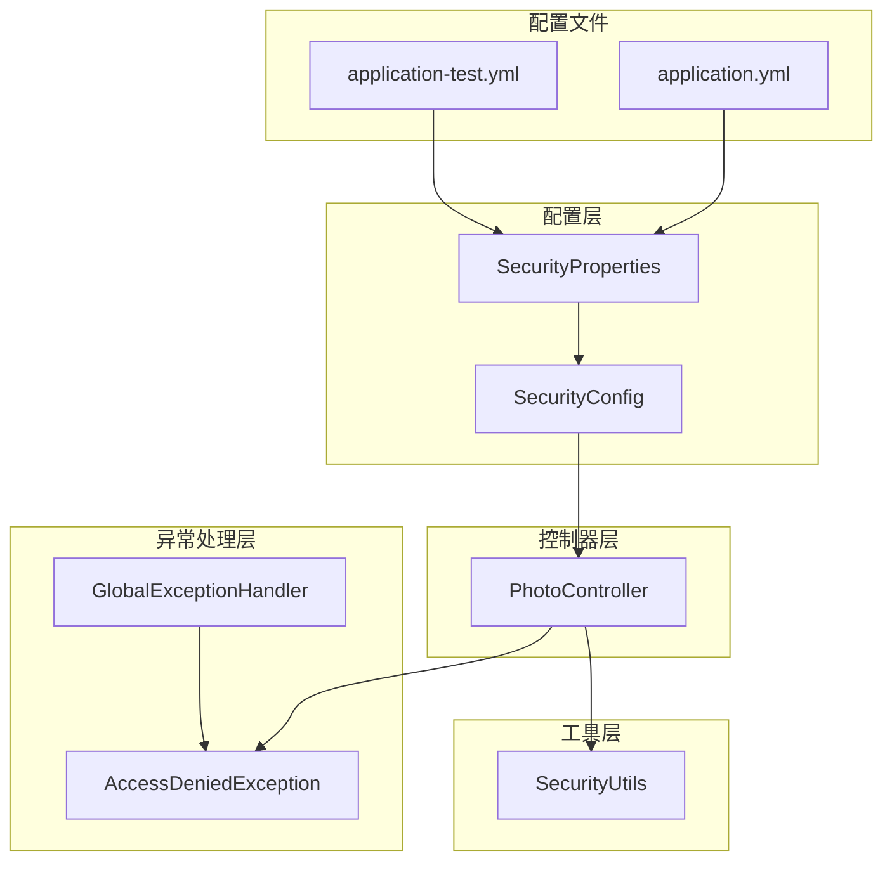
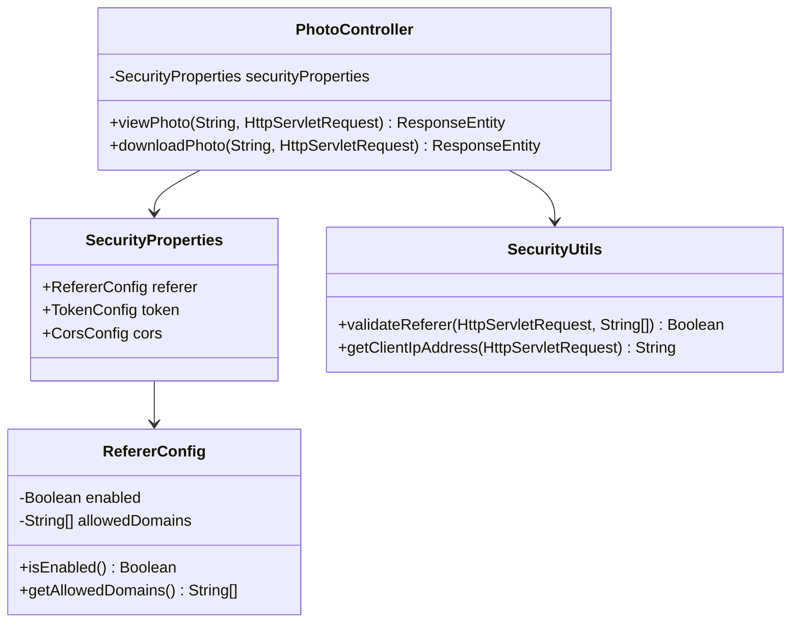
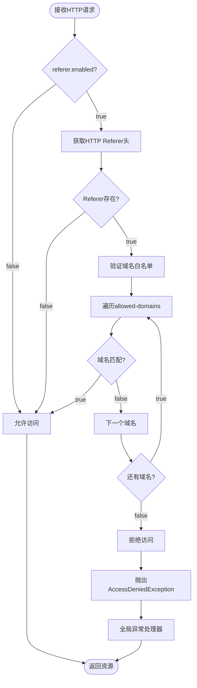
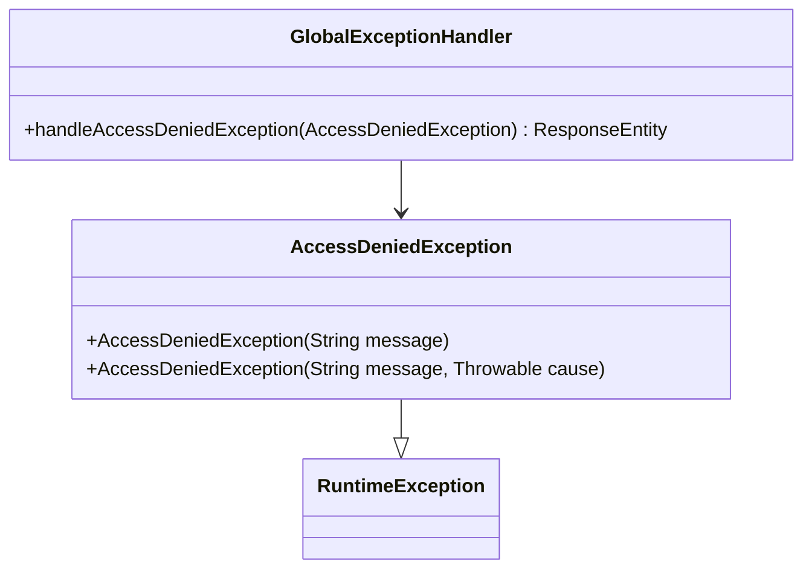

# 防盗链配置

<cite>
**本文档中引用的文件**
- [SecurityProperties.java](file://src/main/java/com/photo/config/SecurityProperties.java)
- [SecurityConfig.java](file://src/main/java/com/photo/config/SecurityConfig.java)
- [SecurityUtils.java](file://src/main/java/com/photo/util/SecurityUtils.java)
- [PhotoController.java](file://src/main/java/com/photo/controller/PhotoController.java)
- [GlobalExceptionHandler.java](file://src/main/java/com/photo/exception/GlobalExceptionHandler.java)
- [AccessDeniedException.java](file://src/main/java/com/photo/exception/AccessDeniedException.java)
- [application.yml](file://src/main/resources/application.yml)
- [application-test.yml](file://src/test/resources/application-test.yml)
- [SecurityUtilsTest.java](file://src/test/java/com/photo/util/SecurityUtilsTest.java)
</cite>

## 目录
1. [简介](#简介)
2. [项目结构概览](#项目结构概览)
3. [核心组件分析](#核心组件分析)
4. [架构设计](#架构设计)
5. [详细配置分析](#详细配置分析)
6. [防盗链工作机制](#防盗链工作机制)
7. [配置最佳实践](#配置最佳实践)
8. [故障排查指南](#故障排查指南)
9. [总结](#总结)

## 简介

本文档详细介绍了基于Spring Boot应用的防盗链配置系统，重点分析了`SecurityProperties`中的`RefererConfig`类及其在图片资源保护中的作用。该系统通过HTTP Referer头验证机制，有效防止外部站点非法嵌套引用受保护的图片资源，确保数字资产的安全性。

## 项目结构概览

该项目采用标准的Spring Boot分层架构，主要包含以下模块：



**图表来源**
- [SecurityProperties.java](file://src/main/java/com/photo/config/SecurityProperties.java#L1-L53)
- [SecurityConfig.java](file://src/main/java/com/photo/config/SecurityConfig.java#L1-L71)
- [PhotoController.java](file://src/main/java/com/photo/controller/PhotoController.java#L1-L316)

**章节来源**
- [SecurityProperties.java](file://src/main/java/com/photo/config/SecurityProperties.java#L1-L53)
- [SecurityConfig.java](file://src/main/java/com/photo/config/SecurityConfig.java#L1-L71)

## 核心组件分析

### SecurityProperties中的RefererConfig类

`RefererConfig`是防盗链配置的核心类，提供了灵活的域名白名单机制：



**图表来源**
- [SecurityProperties.java](file://src/main/java/com/photo/config/SecurityProperties.java#L20-L26)
- [SecurityUtils.java](file://src/main/java/com/photo/util/SecurityUtils.java#L54-L67)
- [PhotoController.java](file://src/main/java/com/photo/controller/PhotoController.java#L28-L32)

### 配置属性详解

| 属性 | 类型 | 默认值 | 描述 |
|------|------|--------|------|
| `security.referer.enabled` | Boolean | true | 启用/禁用防盗链检查 |
| `security.referer.allowed-domains` | List<String> | [] | 允许的域名白名单 |

**章节来源**
- [SecurityProperties.java](file://src/main/java/com/photo/config/SecurityProperties.java#L20-L26)

## 架构设计

防盗链系统采用多层次防护架构，确保资源访问的安全性：

```mermaid
sequenceDiagram
participant Client as 客户端浏览器
participant Controller as PhotoController
participant Utils as SecurityUtils
participant Properties as SecurityProperties
participant Handler as GlobalExceptionHandler
Client->>Controller : 请求图片资源(/photos/view/filename)
Controller->>Properties : 检查referer.enabled
Properties-->>Controller : 返回true(启用)
Controller->>Utils : validateReferer(request, domains)
Utils->>Utils : 获取HTTP Referer头
Utils->>Utils : 检查域名匹配
alt 域名匹配成功
Utils-->>Controller : 返回true
Controller->>Controller : 处理正常请求
Controller-->>Client : 返回图片内容
else 域名匹配失败
Utils-->>Controller : 返回false
Controller->>Handler : 抛出AccessDeniedException
Handler-->>Client : 返回403 Forbidden
end
```

**图表来源**
- [PhotoController.java](file://src/main/java/com/photo/controller/PhotoController.java#L84-L92)
- [SecurityUtils.java](file://src/main/java/com/photo/util/SecurityUtils.java#L54-L67)
- [GlobalExceptionHandler.java](file://src/main/java/com/photo/exception/GlobalExceptionHandler.java#L76-L82)

## 详细配置分析

### 生产环境配置

在`application.yml`中，防盗链配置如下：

```yaml
security:
  referer:
    enabled: true
    allowed-domains:
      - localhost
      - 127.0.0.1
```

这种配置适用于本地开发环境，允许来自本机的请求访问图片资源。

### 测试环境配置

在`application-test.yml`中，防盗链配置被完全禁用：

```yaml
security:
  referer:
    enabled: false
```

这种设计体现了测试环境与生产环境的不同需求：
- **测试环境**：便于前端开发人员直接访问图片资源进行调试
- **生产环境**：严格控制资源访问，防止被盗链

### 白名单机制工作原理

防盗链系统通过以下流程验证请求来源：



**图表来源**
- [SecurityUtils.java](file://src/main/java/com/photo/util/SecurityUtils.java#L54-L67)
- [PhotoController.java](file://src/main/java/com/photo/controller/PhotoController.java#L84-L92)

**章节来源**
- [application.yml](file://src/main/resources/application.yml#L84-L87)
- [application-test.yml](file://src/test/resources/application-test.yml#L44-L46)

## 防盗链工作机制

### HTTP Referer头验证

系统通过`SecurityUtils.validateReferer()`方法实现Referer头验证：

1. **Referer头获取**：从HTTP请求头中提取Referer字段
2. **空Referer处理**：允许没有Referer头的直接访问请求
3. **域名匹配**：逐个检查Referer中的域名是否在白名单中
4. **匹配结果**：只要有一个域名匹配就允许访问

### 异常处理机制

当防盗链检查失败时，系统会抛出`AccessDeniedException`，并通过全局异常处理器返回适当的HTTP状态码：



**图表来源**
- [AccessDeniedException.java](file://src/main/java/com/photo/exception/AccessDeniedException.java#L1-L16)
- [GlobalExceptionHandler.java](file://src/main/java/com/photo/exception/GlobalExceptionHandler.java#L76-L82)

**章节来源**
- [SecurityUtils.java](file://src/main/java/com/photo/util/SecurityUtils.java#L54-L67)
- [GlobalExceptionHandler.java](file://src/main/java/com/photo/exception/GlobalExceptionHandler.java#L76-L82)

## 配置最佳实践

### 生产环境多域名配置

在生产环境中，建议配置多个可信域名：

```yaml
security:
  referer:
    enabled: true
    allowed-domains:
      - https://www.yourdomain.com
      - https://app.yourdomain.com
      - https://cdn.yourdomain.com
      - https://static.yourdomain.com
```

### 动态域名配置

对于需要支持子域名的应用，可以配置通配符模式：

```yaml
security:
  referer:
    enabled: true
    allowed-domains:
      - yourdomain.com
      - *.yourdomain.com  # 支持子域名
```

### 开发环境配置

开发环境可以根据需要灵活配置：

```yaml
security:
  referer:
    enabled: true
    allowed-domains:
      - localhost
      - 127.0.0.1
      - 0.0.0.0
      - ::1  # IPv6 localhost
```

### 安全注意事项

1. **HTTPS协议**：建议在生产环境中使用HTTPS协议
2. **域名精确匹配**：避免过于宽泛的域名匹配
3. **定期审查**：定期检查和更新允许的域名列表
4. **日志记录**：启用相关日志以便监控异常访问

**章节来源**
- [application.yml](file://src/main/resources/application.yml#L84-L87)

## 故障排查指南

### 常见问题及解决方案

#### 1. 访问被拒绝（403 Forbidden）

**症状**：客户端收到403状态码，无法访问图片资源

**可能原因**：
- 防盗链配置未正确启用
- Referer头缺失或格式不正确
- 域名不在白名单中

**排查步骤**：
1. 检查配置文件中的`security.referer.enabled`设置
2. 使用浏览器开发者工具检查Referer头
3. 验证域名是否在`allowed-domains`列表中

**解决方法**：
```yaml
security:
  referer:
    enabled: true
    allowed-domains:
      - your-domain.com
      - www.your-domain.com
```

#### 2. 配置错误导致的访问问题

**症状**：配置修改后仍然无法访问或访问被拒绝

**排查步骤**：
1. 检查YAML配置的缩进和语法
2. 确认配置文件被正确加载
3. 查看应用启动日志中的配置信息

**解决方法**：
```bash
# 检查配置是否正确加载
curl -I http://localhost:8080/api/photos/view/test.jpg
# 检查Referer头是否正确传递
curl -H "Referer: https://your-domain.com" http://localhost:8080/api/photos/view/test.jpg
```

#### 3. 测试环境与生产环境差异

**症状**：测试环境正常，生产环境出现访问问题

**排查步骤**：
1. 对比测试环境和生产环境的配置文件
2. 检查网络环境和防火墙设置
3. 验证CDN或代理服务器的配置

**解决方法**：
```yaml
# 生产环境配置示例
security:
  referer:
    enabled: true
    allowed-domains:
      - https://yourdomain.com
      - https://www.yourdomain.com
      - https://cdn.yourdomain.com
```

### 调试技巧

#### 1. 启用详细日志

在`application.yml`中启用相关日志：

```yaml
logging:
  level:
    com.photo.util: DEBUG
    com.photo.controller: DEBUG
```

#### 2. 单元测试验证

利用现有的单元测试验证防盗链功能：

```java
@Test
void testValidateReferer_ValidDomain() {
    MockHttpServletRequest request = new MockHttpServletRequest();
    request.addHeader("Referer", "http://localhost:8080/page");
    List<String> allowedDomains = Arrays.asList("localhost", "example.com");
    
    boolean isValid = SecurityUtils.validateReferer(request, allowedDomains);
    assertTrue(isValid);
}
```

**章节来源**
- [SecurityUtilsTest.java](file://src/test/java/com/photo/util/SecurityUtilsTest.java#L58-L68)
- [SecurityUtils.java](file://src/main/java/com/photo/util/SecurityUtils.java#L54-L67)

## 总结

本文档详细分析了基于Spring Boot应用的防盗链配置系统，重点介绍了`SecurityProperties`中的`RefererConfig`类及其工作机制。该系统通过以下特性实现了有效的资源保护：

1. **灵活的配置机制**：支持启用/禁用防盗链检查，可配置多个允许的域名
2. **智能的验证算法**：通过HTTP Referer头验证请求来源，支持域名白名单机制
3. **完善的异常处理**：提供清晰的错误信息和适当的HTTP状态码
4. **环境适配性**：支持开发、测试、生产等不同环境的差异化配置

通过合理配置防盗链功能，可以有效防止外部站点非法嵌套引用受保护的图片资源，保护数字资产的安全性和完整性。在实际部署中，建议根据具体的业务需求和安全要求，制定合适的域名白名单策略，并建立完善的监控和告警机制。