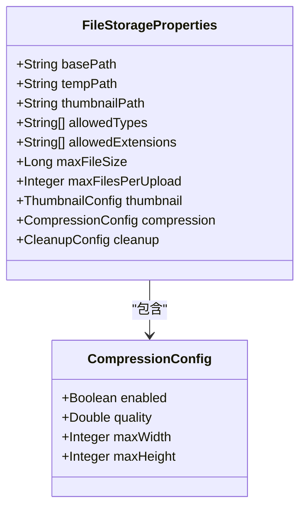
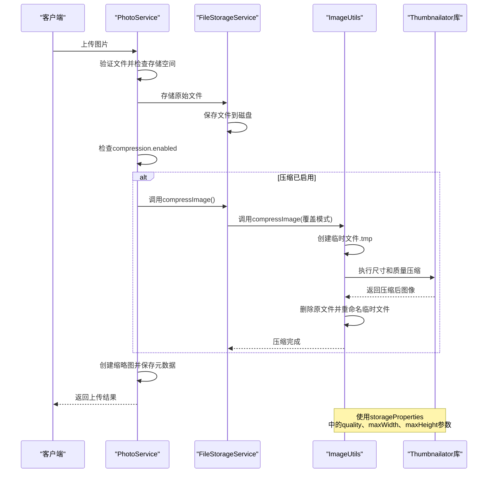

# 图片压缩配置

<cite>
**本文档引用文件**  
- [FileStorageProperties.java](file://src/main/java/com/photo/config/FileStorageProperties.java#L78-L84)
- [FileStorageService.java](file://src/main/java/com/photo/service/FileStorageService.java#L21-L298)
- [ImageUtils.java](file://src/main/java/com/photo/util/ImageUtils.java#L0-L181)
- [PhotoService.java](file://src/main/java/com/photo/service/PhotoService.java#L0-L384)
- [application.yml](file://src/main/resources/application.yml#L0-L176)
- [application-test.yml](file://src/test/resources/application-test.yml#L0-L74)
</cite>

## 目录
1. [引言](#引言)
2. [压缩配置参数详解](#压缩配置参数详解)
3. [压缩功能调用链分析](#压缩功能调用链分析)
4. [开发与测试环境对比](#开发与测试环境对比)
5. [生产部署建议](#生产部署建议)
6. [结论](#结论)

## 引言
本系统提供完整的图片上传与存储解决方案，其中图片压缩功能是优化存储空间和提升加载性能的关键环节。通过`CompressionConfig`类配置的参数，系统能够在图片存储前自动进行有损压缩处理，平衡图像质量与文件大小。本文档详细说明压缩机制的配置方式、实现原理及在不同环境下的应用策略。

## 压缩配置参数详解

`CompressionConfig`类定义了四个核心参数：`enabled`、`quality`、`maxWidth`和`maxHeight`，这些参数共同控制图片压缩的行为。

- **enabled**: 布尔值，控制是否启用图片压缩功能。默认为`true`，表示上传图片时将自动执行压缩流程。
- **quality**: 双精度浮点数，表示压缩算法的质量因子，取值范围为0.0（最低质量）到1.0（最高质量）。默认值为0.85，在保证视觉质量的同时显著减小文件体积。
- **maxWidth**: 整数，设定图片最大宽度（像素）。默认值为1920，适用于全高清显示需求。
- **maxHeight**: 整数，设定图片最大高度（像素）。默认值为1080，与`maxWidth`配合实现响应式设计适配。

这些配置通过Spring Boot的`@ConfigurationProperties`机制从`application.yml`文件中加载，并在运行时注入到相关服务组件中。

**图示来源**  
- [FileStorageProperties.java](file://src/main/java/com/photo/config/FileStorageProperties.java#L78-L84)

**本节来源**  
- [FileStorageProperties.java](file://src/main/java/com/photo/config/FileStorageProperties.java#L78-L84)
- [application.yml](file://src/main/resources/application.yml#L0-L176)

## 压缩功能调用链分析

图片压缩功能的执行流程始于用户上传操作，贯穿多个服务组件，最终由Thumbnailator库完成实际的图像处理任务。

**图示来源**  
- [PhotoService.java](file://src/main/java/com/photo/service/PhotoService.java#L0-L384)
- [FileStorageService.java](file://src/main/java/com/photo/service/FileStorageService.java#L21-L298)
- [ImageUtils.java](file://src/main/java/com/photo/util/ImageUtils.java#L0-L181)

**本节来源**  
- [PhotoService.java](file://src/main/java/com/photo/service/PhotoService.java#L0-L384)
- [FileStorageService.java](file://src/main/java/com/photo/service/FileStorageService.java#L21-L298)
- [ImageUtils.java](file://src/main/java/com/photo/util/ImageUtils.java#L0-L181)

### 压缩算法逻辑
`ImageUtils.compressImage()`方法根据图片原始尺寸与配置的最大尺寸进行比较，采用两种策略：
1. 若原始尺寸小于等于`maxWidth`和`maxHeight`，则仅进行质量压缩（`scale(1.0)`保持原尺寸）。
2. 若原始尺寸超出限制，则同时进行尺寸缩放和质量压缩，确保输出图片既符合尺寸要求又保持视觉质量。

该过程使用临时文件机制，先将压缩结果写入`.tmp`文件，成功后再替换原文件，确保数据一致性。

## 开发与测试环境对比

系统通过不同的YAML配置文件实现了开发与测试环境的差异化设置，特别是在图片压缩功能上的策略有所不同。

| 配置项 | 开发环境 (application.yml) | 测试环境 (application-test.yml) |
|--------|-----------------------------|----------------------------------|
| compression.enabled | true | false |
| compression.quality | 0.85 | 0.85 |
| compression.maxWidth | 1920 | 1920 |
| compression.maxHeight | 1080 | 1080 |

在开发环境中，压缩功能**启用**，以模拟真实用户场景，验证图片质量和加载性能。而在测试环境中，压缩功能被**禁用**，主要原因如下：

1. **提升执行效率**：图像压缩是CPU密集型操作，禁用后可显著加快单元测试和集成测试的执行速度。
2. **简化测试验证**：避免因有损压缩导致像素级差异，使图像内容比对更加可靠。
3. **降低资源消耗**：测试环境通常资源有限，跳过压缩可减少服务器负载。

这种配置差异通过Spring Profiles机制自动切换，无需修改代码即可适应不同部署场景。

**本节来源**  
- [application.yml](file://src/main/resources/application.yml#L0-L176)
- [application-test.yml](file://src/test/resources/application-test.yml#L0-L74)

## 生产部署建议

在生产环境中合理配置图片压缩功能，对于系统性能和用户体验至关重要。以下是基于实际运行经验的建议：

### 动态调整压缩级别
根据不同网络条件动态调整`quality`参数：
- **Wi-Fi环境**：可设置较高质量（0.8-0.9），提供更佳视觉体验。
- **移动网络**：适当降低质量（0.6-0.7），优先保证加载速度。
- **低端设备**：同时降低`maxWidth`和`maxHeight`，减少渲染压力。

可通过用户代理（User-Agent）或网络类型检测实现智能适配。

### 资源监控与保护
图片压缩为CPU密集型任务，需注意以下几点：
- **监控CPU使用率**：设置告警阈值（如持续超过70%），防止压缩任务耗尽系统资源。
- **异步处理**：考虑将压缩操作移至后台线程或消息队列，避免阻塞主线程影响响应时间。
- **批量限制**：控制单次上传的图片数量（通过`maxFilesPerUpload`），防止单一请求引发大量并发压缩。

### 有损压缩的影响评估
虽然有损压缩能显著减小文件体积（通常可减少60-80%），但需权衡以下因素：
- **视觉质量**：质量因子低于0.7时可能出现明显伪影，建议用户可接受范围保持在0.75以上。
- **文件类型差异**：JPEG格式对有损压缩更友好，而PNG格式建议优先使用无损优化工具。
- **内容类型敏感性**：对于包含文字或线条图的图片，高比例压缩可能导致可读性下降。

建议在正式上线前进行A/B测试，收集用户对不同压缩级别的主观评价，确定最优配置。

**本节来源**  
- [application.yml](file://src/main/resources/application.yml#L0-L176)
- [FileStorageProperties.java](file://src/main/java/com/photo/config/FileStorageProperties.java#L78-L84)
- [ImageUtils.java](file://src/main/java/com/photo/util/ImageUtils.java#L0-L181)

## 结论
图片压缩配置机制通过`CompressionConfig`类提供了灵活而强大的控制能力，结合Thumbnailator库实现了高效的图像重采样。系统在开发环境启用压缩以保证真实性，在测试环境禁用压缩以提升效率，体现了良好的工程实践。生产部署时应根据实际网络状况和硬件资源动态调整参数，并持续监控系统性能，确保在图像质量与系统负载之间取得最佳平衡。