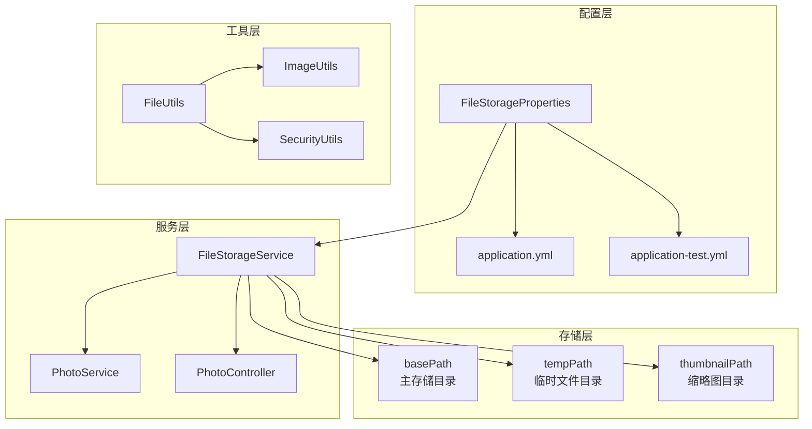
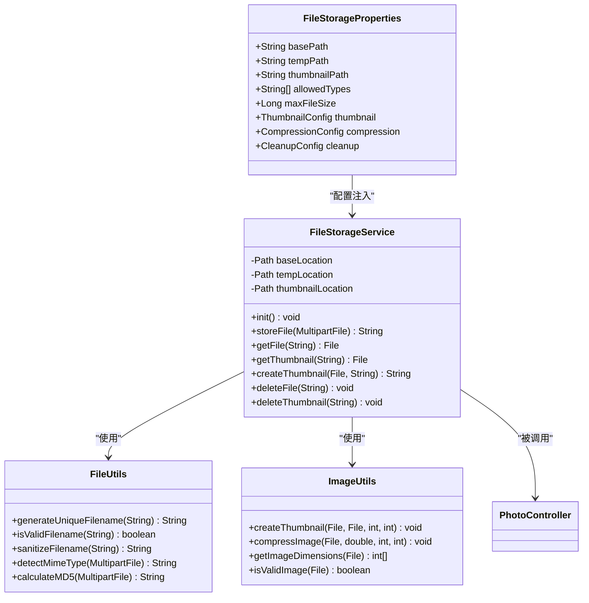
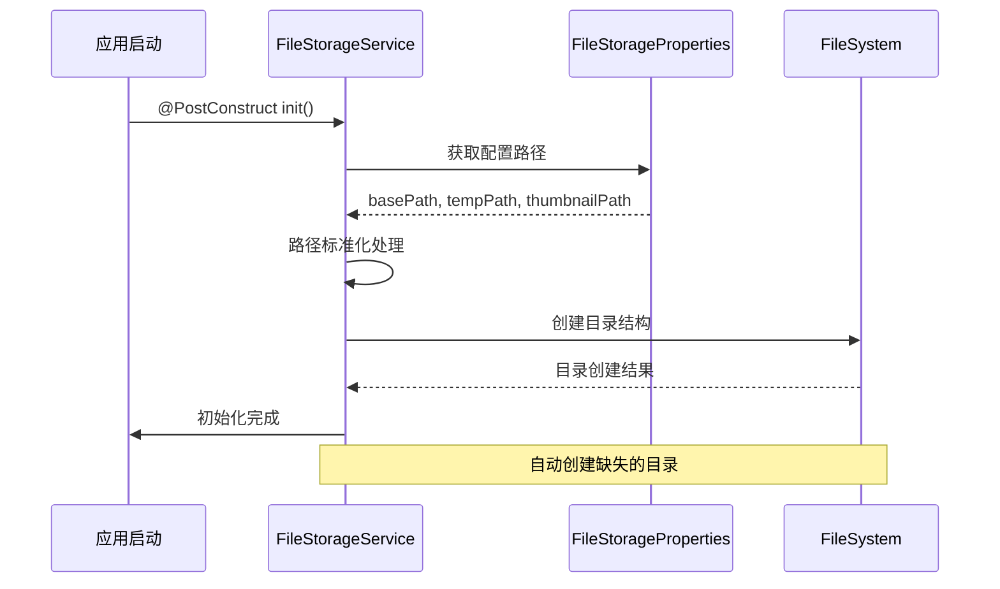
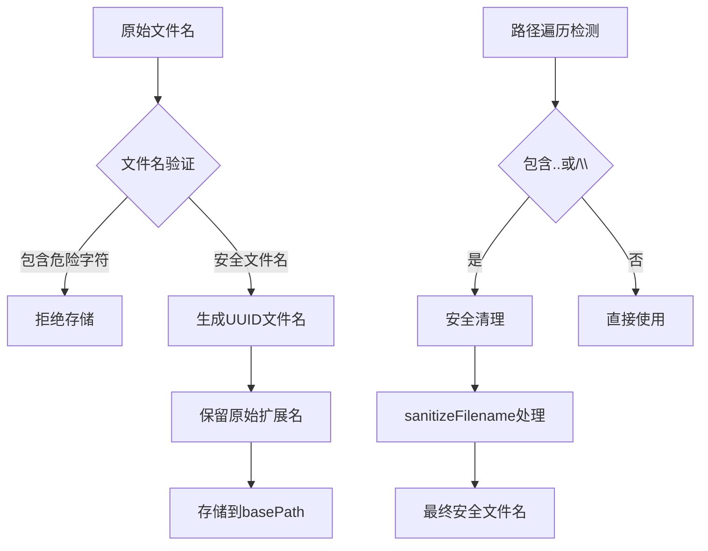
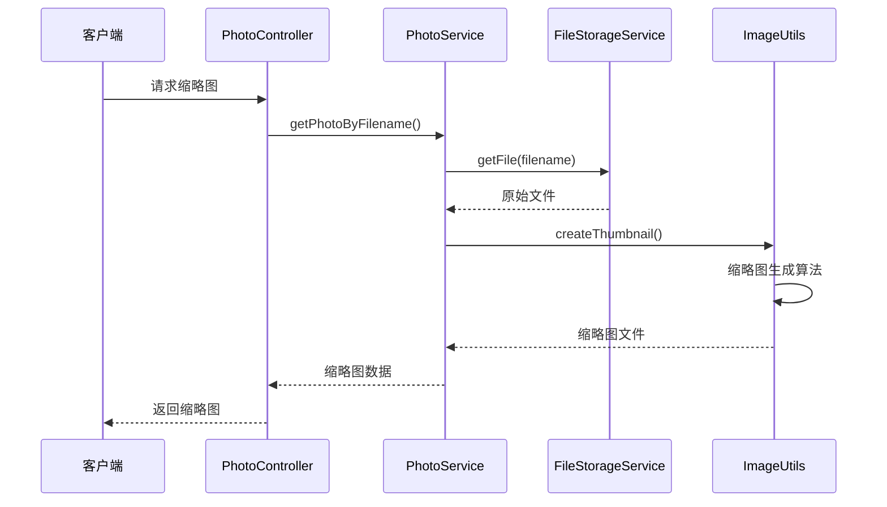

# 基础路径配置

<cite>
**本文档中引用的文件**
- [FileStorageProperties.java](file://src/main/java/com/photo/config/FileStorageProperties.java)
- [application.yml](file://src/main/resources/application.yml)
- [FileStorageService.java](file://src/main/java/com/photo/service/FileStorageService.java)
- [FileUtils.java](file://src/main/java/com/photo/util/FileUtils.java)
- [ImageUtils.java](file://src/main/java/com/photo/util/ImageUtils.java)
- [PhotoController.java](file://src/main/java/com/photo/controller/PhotoController.java)
- [application-test.yml](file://src/test/resources/application-test.yml)
- [FileStorageException.java](file://src/main/java/com/photo/exception/FileStorageException.java)
</cite>

## 目录
1. [简介](#简介)
2. [项目结构概览](#项目结构概览)
3. [核心路径配置项](#核心路径配置项)
4. [系统架构分析](#系统架构分析)
5. [详细组件分析](#详细组件分析)
6. [配置最佳实践](#配置最佳实践)
7. [跨平台兼容性](#跨平台兼容性)
8. [安全性和权限设置](#安全性和权限设置)
9. [常见问题与解决方案](#常见问题与解决方案)
10. [故障排除指南](#故障排除指南)
11. [总结](#总结)

## 简介

本文档深入分析了基于Spring Boot的文件上传系统中的基础路径配置机制。该系统通过三个核心路径配置项（basePath、tempPath和thumbnailPath）实现了完整的文件存储管理功能，包括文件上传、存储、缩略图生成、安全访问控制等特性。

系统采用模块化设计，通过配置驱动的方式实现了灵活的路径管理，支持开发、测试和生产环境的不同需求。每个路径都有明确的职责分工，确保了系统的可维护性和扩展性。

## 项目结构概览



**图表来源**
- [FileStorageProperties.java](file://src/main/java/com/photo/config/FileStorageProperties.java#L1-L94)
- [FileStorageService.java](file://src/main/java/com/photo/service/FileStorageService.java#L1-L300)

**章节来源**
- [FileStorageProperties.java](file://src/main/java/com/photo/config/FileStorageProperties.java#L1-L94)
- [application.yml](file://src/main/resources/application.yml#L1-L173)

## 核心路径配置项

### basePath - 主存储目录

**定义与作用**：
- 默认值：`./uploads`
- 功能：所有上传文件的根目录
- 职责：存储原始图片文件，是整个文件系统的核心存储点

**配置特点**：
- 绝对路径自动转换
- 目录规范化处理
- 自动创建机制

### tempPath - 临时文件目录

**定义与作用**：
- 默认值：`./uploads/temp`
- 功能：上传过程中的临时文件存储
- 职责：在文件上传过程中提供临时存储空间，支持断点续传和文件完整性验证

**配置特点**：
- 专用的临时存储区域
- 支持并发上传处理
- 自动清理机制

### thumbnailPath - 缩略图目录

**定义与作用**：
- 默认值：`./uploads/thumbnails`
- 功能：生成的缩略图存储目录
- 职责：存储经过处理的缩略图文件，优化前端加载性能

**配置特点**：
- 专门的图像处理输出目录
- 与主存储目录保持相对独立
- 支持多种缩略图规格

**章节来源**
- [FileStorageProperties.java](file://src/main/java/com/photo/config/FileStorageProperties.java#L12-L22)
- [application.yml](file://src/main/resources/application.yml#L40-L45)

## 系统架构分析



**图表来源**
- [FileStorageProperties.java](file://src/main/java/com/photo/config/FileStorageProperties.java#L10-L94)
- [FileStorageService.java](file://src/main/java/com/photo/service/FileStorageService.java#L18-L300)
- [FileUtils.java](file://src/main/java/com/photo/util/FileUtils.java#L18-L178)
- [ImageUtils.java](file://src/main/java/com/photo/util/ImageUtils.java#L15-L182)

**章节来源**
- [FileStorageService.java](file://src/main/java/com/photo/service/FileStorageService.java#L30-L50)

## 详细组件分析

### FileStorageService - 文件存储服务

FileStorageService是文件存储系统的核心组件，负责协调三个路径的使用和文件操作。

#### 初始化流程



**图表来源**
- [FileStorageService.java](file://src/main/java/com/photo/service/FileStorageService.java#L35-L50)

#### 文件存储操作

系统提供了完整的文件生命周期管理：

1. **文件上传**：通过`storeFile()`方法处理
2. **文件读取**：通过`getFile()`和`getFilePath()`方法提供
3. **文件删除**：通过`deleteFile()`和`deleteThumbnail()`方法清理
4. **缩略图管理**：通过`createThumbnail()`和`getThumbnail()`方法处理

**章节来源**
- [FileStorageService.java](file://src/main/java/com/photo/service/FileStorageService.java#L55-L120)

### FileUtils - 文件工具类

FileUtils提供了文件名处理和安全验证功能：

#### 文件名安全处理



**图表来源**
- [FileUtils.java](file://src/main/java/com/photo/util/FileUtils.java#L150-L178)

**章节来源**
- [FileUtils.java](file://src/main/java/com/photo/util/FileUtils.java#L30-L50)

### ImageUtils - 图像处理工具

ImageUtils专门处理缩略图生成和图片压缩：

#### 缩略图生成流程



**图表来源**
- [ImageUtils.java](file://src/main/java/com/photo/util/ImageUtils.java#L45-L60)
- [FileStorageService.java](file://src/main/java/com/photo/service/FileStorageService.java#L125-L145)

**章节来源**
- [ImageUtils.java](file://src/main/java/com/photo/util/ImageUtils.java#L45-L85)

## 配置最佳实践

### 开发环境配置

开发环境推荐使用本地文件系统，便于调试和测试：

```yaml
# 开发环境配置示例
file:
  storage:
    base-path: ./uploads/dev
    temp-path: ./uploads/dev/temp
    thumbnail-path: ./uploads/dev/thumbnails
    max-file-size: 52428800  # 50MB
    max-storage-size: 53687091200  # 50GB
```

### 测试环境配置

测试环境应使用隔离的存储空间：

```yaml
# 测试环境配置示例
file:
  storage:
    base-path: ./test-uploads
    temp-path: ./test-uploads/temp
    thumbnail-path: ./test-uploads/thumbnails
    max-file-size: 10485760  # 10MB
    cleanup:
      enabled: false  # 测试期间禁用清理
```

### 生产环境配置

生产环境需要考虑性能、安全性和可靠性：

```yaml
# 生产环境配置示例
file:
  storage:
    base-path: /var/www/uploads
    temp-path: /var/tmp/photo-uploads
    thumbnail-path: /var/www/thumbnails
    max-file-size: 10485760  # 10MB
    max-storage-size: 107374182400  # 100GB
    cleanup:
      enabled: true
      days-to-keep: 30
      cron: "0 0 2 * * ?"  # 每日凌晨2点清理
```

**章节来源**
- [application.yml](file://src/main/resources/application.yml#L40-L60)
- [application-test.yml](file://src/test/resources/application-test.yml#L15-L35)

## 跨平台兼容性

### Windows系统注意事项

1. **路径分隔符**：使用正斜杠`/`而非反斜杠`\`
2. **路径长度限制**：Windows有260字符的路径长度限制
3. **权限模型**：NTFS权限继承机制

### Linux系统注意事项

1. **权限设置**：使用适当的文件权限（建议644或755）
2. **符号链接**：注意符号链接的安全性
3. **磁盘配额**：合理设置磁盘空间限制

### 路径标准化处理

系统自动处理跨平台路径兼容性：

```java
// 路径标准化示例（来自FileStorageService.init()）
baseLocation = Paths.get(storageProperties.getBasePath())
    .toAbsolutePath()
    .normalize();
```

**章节来源**
- [FileStorageService.java](file://src/main/java/com/photo/service/FileStorageService.java#L35-L45)

## 安全性和权限设置

### 路径遍历攻击防护

系统通过多层防护机制防止路径遍历攻击：

1. **文件名验证**：使用`FileUtils.isValidFilename()`检查
2. **路径规范化**：使用`Paths.normalize()`处理
3. **访问控制**：严格的文件访问权限控制

### 权限设置建议

#### 开发环境
```bash
# 设置适当的权限
chmod 755 ./uploads
chmod 755 ./uploads/temp
chmod 755 ./uploads/thumbnails
```

#### 生产环境
```bash
# 生产环境权限设置
sudo chown www-data:www-data /var/www/uploads
sudo chmod 755 /var/www/uploads
sudo chmod 775 /var/www/uploads/temp
sudo chmod 775 /var/www/uploads/thumbnails
```

### 符号链接安全性

避免使用符号链接指向敏感目录，或实施严格的访问控制：

```bash
# 检查符号链接安全性
ls -la /var/www/uploads
# 确保没有指向系统关键目录的符号链接
```

**章节来源**
- [FileUtils.java](file://src/main/java/com/photo/util/FileUtils.java#L150-L178)

## 常见问题与解决方案

### 路径不存在异常

**问题描述**：当配置的路径不存在时，系统会抛出`FileStorageException`。

**解决方案**：
1. 确保配置的路径存在
2. 使用自动创建机制
3. 设置适当的权限

```java
// 自动创建路径的实现（来自FileStorageService.init()）
try {
    Files.createDirectories(baseLocation);
    Files.createDirectories(tempLocation);
    Files.createDirectories(thumbnailLocation);
} catch (IOException e) {
    throw new FileStorageException("无法创建存储目录", e);
}
```

### 权限不足问题

**问题描述**：应用程序没有足够的权限访问指定路径。

**解决方案**：
1. 检查文件系统权限
2. 修改文件所有者
3. 调整权限设置

### 磁盘空间不足

**问题描述**：存储空间达到上限。

**解决方案**：
1. 监控存储使用情况
2. 实施定期清理策略
3. 设置合理的存储限制

**章节来源**
- [FileStorageService.java](file://src/main/java/com/photo/service/FileStorageService.java#L35-L50)
- [FileStorageException.java](file://src/main/java/com/photo/exception/FileStorageException.java#L1-L16)

## 故障排除指南

### 诊断步骤

1. **检查配置文件**：确认路径配置正确
2. **验证目录权限**：确保应用程序有读写权限
3. **检查磁盘空间**：确认有足够的可用空间
4. **查看日志文件**：分析错误信息

### 常见错误代码

| 错误类型 | 可能原因 | 解决方案 |
|---------|---------|---------|
| `FileStorageException` | 路径不存在 | 自动创建或手动创建目录 |
| `AccessDeniedException` | 权限不足 | 修改文件权限或所有者 |
| `StorageFullException` | 磁盘空间不足 | 清理旧文件或扩容 |
| `FileNotFoundException` | 文件被删除 | 检查文件是否存在 |

### 性能优化建议

1. **缓存策略**：合理设置HTTP缓存头
2. **压缩处理**：启用图片压缩功能
3. **CDN集成**：将静态资源托管到CDN
4. **负载均衡**：分布式存储架构

**章节来源**
- [PhotoController.java](file://src/main/java/com/photo/controller/PhotoController.java#L100-L150)

## 总结

本文档详细分析了基于Spring Boot的文件上传系统中的基础路径配置机制。通过三个核心路径配置项（basePath、tempPath和thumbnailPath），系统实现了完整的文件存储管理功能。

### 关键特性

1. **模块化设计**：清晰的职责分离和依赖关系
2. **配置驱动**：灵活的环境适配能力
3. **安全性保障**：多层次的安全防护机制
4. **跨平台兼容**：自动处理不同操作系统的差异
5. **性能优化**：支持断点续传和缓存机制

### 最佳实践要点

1. **环境隔离**：开发、测试、生产环境使用不同的存储路径
2. **权限管理**：合理设置文件系统权限
3. **监控告警**：建立存储空间监控机制
4. **备份策略**：制定定期备份计划
5. **安全审计**：定期检查文件访问日志

通过遵循本文档的指导原则和最佳实践，可以构建一个稳定、安全、高性能的文件存储系统，满足各种应用场景的需求。