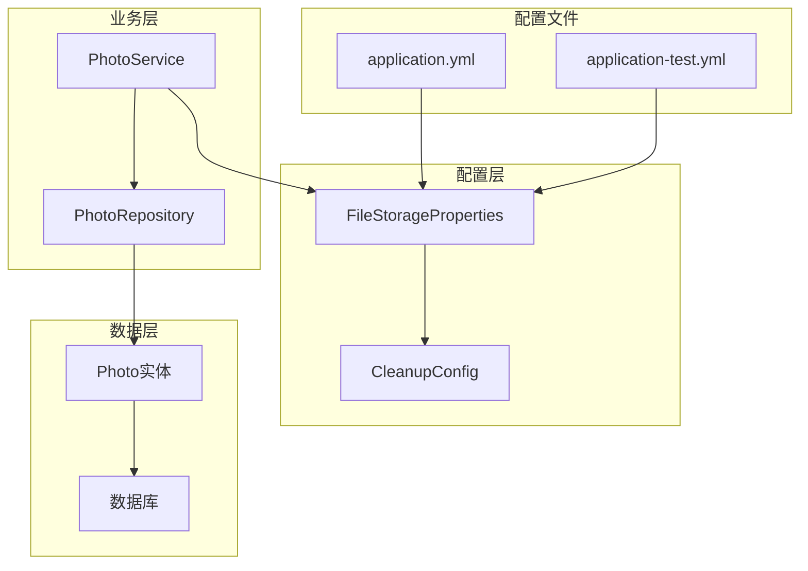
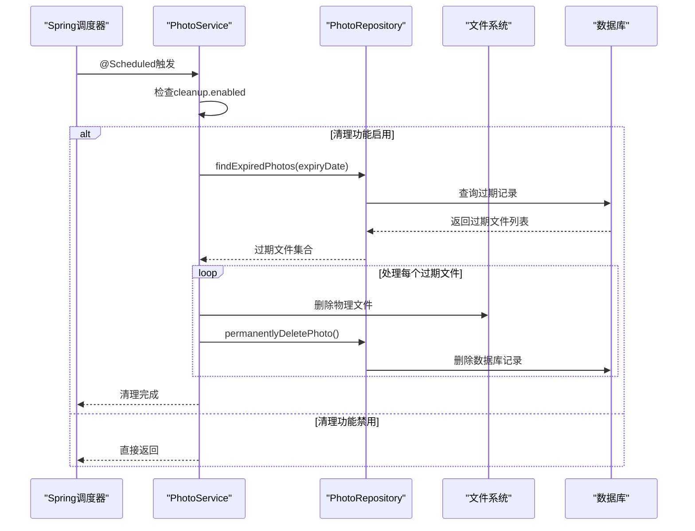
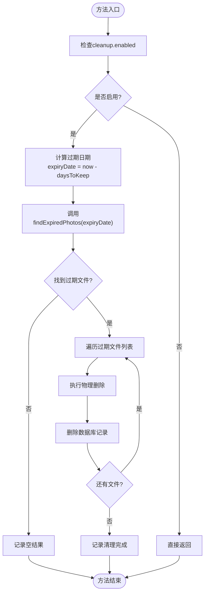
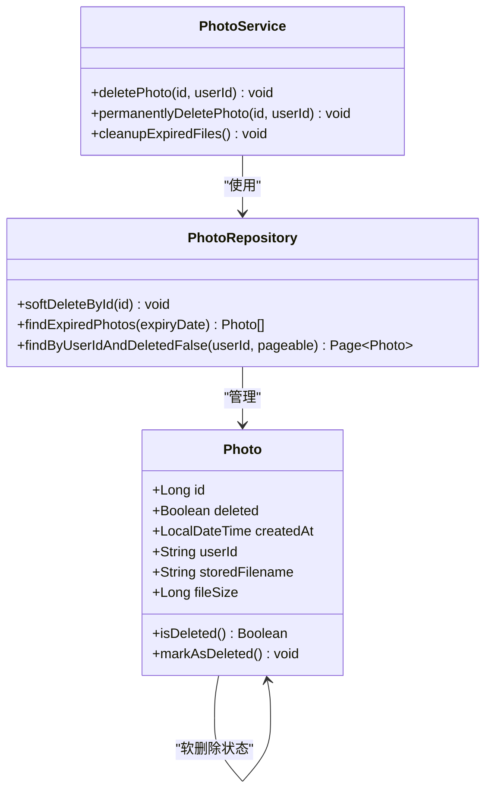
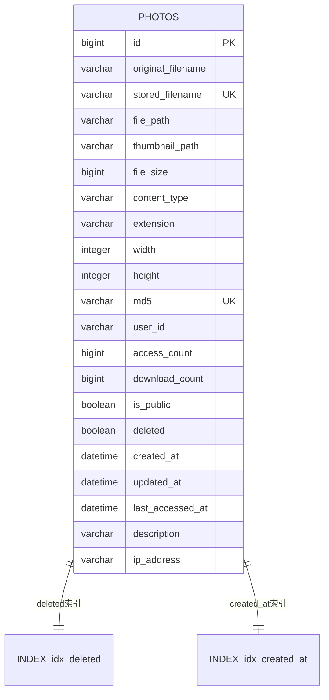
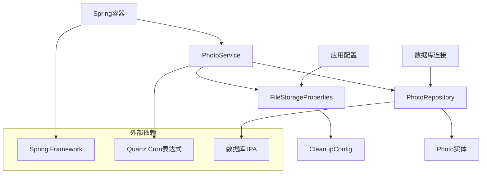

# 定期清理配置

<cite>
**本文档引用的文件**
- [FileStorageProperties.java](file://src/main/java/com/photo/config/FileStorageProperties.java)
- [PhotoService.java](file://src/main/java/com/photo/service/PhotoService.java)
- [PhotoRepository.java](file://src/main/java/com/photo/repository/PhotoRepository.java)
- [Photo.java](file://src/main/java/com/photo/entity/Photo.java)
- [application.yml](file://src/main/resources/application.yml)
- [application-test.yml](file://src/test/resources/application-test.yml)
- [PhotoServiceTest.java](file://src/test/java/com/photo/service/PhotoServiceTest.java)
</cite>

## 目录
1. [简介](#简介)
2. [项目结构概览](#项目结构概览)
3. [核心组件分析](#核心组件分析)
4. [架构概览](#架构概览)
5. [详细组件分析](#详细组件分析)
6. [依赖关系分析](#依赖关系分析)
7. [性能考虑](#性能考虑)
8. [故障排除指南](#故障排除指南)
9. [结论](#结论)

## 简介

本文档系统化地阐述了基于Spring框架的存储清理机制，重点分析CleanupConfig类的三个核心属性：enabled（启用状态）、daysToKeep（保留天数）和cron（执行时间表达式）。该机制通过Spring的@Scheduled注解实现定时任务，结合软删除状态管理，确保系统存储空间的有效利用和数据完整性。

## 项目结构概览

该项目采用标准的Spring Boot项目结构，存储清理功能分布在以下关键模块中：

**图表来源**
- [FileStorageProperties.java](file://src/main/java/com/photo/config/FileStorageProperties.java#L1-L94)
- [PhotoService.java](file://src/main/java/com/photo/service/PhotoService.java#L1-L385)
- [PhotoRepository.java](file://src/main/java/com/photo/repository/PhotoRepository.java#L1-L112)

**章节来源**
- [FileStorageProperties.java](file://src/main/java/com/photo/config/FileStorageProperties.java#L1-L94)
- [application.yml](file://src/main/resources/application.yml#L1-L177)

## 核心组件分析

### CleanupConfig类详解

CleanupConfig类是存储清理机制的核心配置类，包含三个关键属性：

#### enabled属性
- **类型**: Boolean
- **默认值**: true
- **作用**: 控制自动清理任务的启用状态
- **配置位置**: `file.storage.cleanup.enabled`
- **影响范围**: 启用时激活定时清理任务，禁用时跳过所有清理操作

#### daysToKeep属性  
- **类型**: Integer
- **默认值**: 30天
- **作用**: 定义文件在系统中保留的时间长度
- **计算方式**: 基于文件创建时间与当前时间的差值
- **阈值判断**: 保留期限到期的文件将被标记为过期

#### cron属性
- **类型**: String
- **默认值**: "0 0 2 * * ?"（每天凌晨2点）
- **格式**: Quartz Cron表达式
- **执行频率**: 支持精确到秒的调度控制
- **可扩展性**: 可配置为按周、月等更灵活的调度策略

**章节来源**
- [FileStorageProperties.java](file://src/main/java/com/photo/config/FileStorageProperties.java#L65-L71)

## 架构概览

存储清理机制采用分层架构设计，确保职责分离和可维护性：

**图表来源**
- [PhotoService.java](file://src/main/java/com/photo/service/PhotoService.java#L275-L295)
- [PhotoRepository.java](file://src/main/java/com/photo/repository/PhotoRepository.java#L58-L62)

## 详细组件分析

### PhotoService中的清理方法

#### cleanupExpiredFiles()方法分析

该方法是存储清理机制的核心实现，具有以下特征：

**图表来源**
- [PhotoService.java](file://src/main/java/com/photo/service/PhotoService.java#L275-L295)

#### 软删除与物理删除的判断逻辑

系统采用软删除机制来保护数据完整性：

**图表来源**
- [Photo.java](file://src/main/java/com/photo/entity/Photo.java#L85-L87)
- [PhotoService.java](file://src/main/java/com/photo/service/PhotoService.java#L180-L210)
- [PhotoRepository.java](file://src/main/java/com/photo/repository/PhotoRepository.java#L64-L68)

#### Spring @Scheduled注解机制

清理任务通过Spring的定时任务机制实现：

| 属性 | 值 | 说明 |
|------|-----|------|
| 注解位置 | @Scheduled(cron = "${file.storage.cleanup.cron}") | 方法级注解 |
| 配置来源 | application.yml中的cron表达式 | 动态配置支持 |
| 执行线程 | Spring TaskExecutor | 异步执行避免阻塞 |
| 事务管理 | @Transactional注解 | 确保数据一致性 |

**章节来源**
- [PhotoService.java](file://src/main/java/com/photo/service/PhotoService.java#L275-L295)

### 应用程序配置分析

#### 生产环境配置

生产环境采用严格的清理策略：

| 配置项 | 值 | 默认值 | 说明 |
|--------|-----|--------|------|
| cleanup.enabled | true | true | 启用清理功能 |
| daysToKeep | 30 | 30 | 保留30天后清理 |
| cron | "0 0 2 * * ?" | "0 0 2 * * ?" | 每天凌晨2点执行 |

#### 测试环境配置

测试环境禁用清理功能以确保数据完整性：

| 配置项 | 值 | 用途 |
|--------|-----|------|
| cleanup.enabled | false | 避免测试数据被意外清理 |
| 测试隔离 | 独立的存储路径 | 防止测试污染生产数据 |
| 快速迭代 | 无需等待清理周期 | 提高测试效率 |

**章节来源**
- [application.yml](file://src/main/resources/application.yml#L85-L90)
- [application-test.yml](file://src/test/resources/application-test.yml#L45-L47)

### 数据库查询优化

#### findExpiredPhotos()查询分析

该查询是清理机制的核心，采用高效的数据库查询：

**图表来源**
- [Photo.java](file://src/main/java/com/photo/entity/Photo.java#L15-L173)
- [PhotoRepository.java](file://src/main/java/com/photo/repository/PhotoRepository.java#L58-L62)

**章节来源**
- [PhotoRepository.java](file://src/main/java/com/photo/repository/PhotoRepository.java#L58-L62)

## 依赖关系分析

存储清理机制涉及多个组件的协作：

**图表来源**
- [FileStorageProperties.java](file://src/main/java/com/photo/config/FileStorageProperties.java#L1-L94)
- [PhotoService.java](file://src/main/java/com/photo/service/PhotoService.java#L1-L385)

**章节来源**
- [FileStorageProperties.java](file://src/main/java/com/photo/config/FileStorageProperties.java#L1-L94)
- [PhotoService.java](file://src/main/java/com/photo/service/PhotoService.java#L1-L385)

## 性能考虑

### 清理任务的性能优化

1. **批量处理**: 一次性查询所有过期文件，减少数据库交互次数
2. **异步执行**: 使用@Transactional注解确保事务边界，避免长时间锁定
3. **索引优化**: 在deleted和created_at字段上建立复合索引
4. **内存管理**: 及时释放文件句柄，避免内存泄漏

### 系统资源监控

建议监控以下指标：
- 磁盘I/O使用率
- 数据库查询响应时间
- 内存占用情况
- CPU使用率峰值

## 故障排除指南

### 常见问题及解决方案

#### 清理任务未执行

**症状**: 定期清理任务没有按预期执行
**排查步骤**:
1. 检查cleanup.enabled配置是否为true
2. 验证cron表达式语法正确性
3. 确认Spring调度器正常运行
4. 检查日志中是否有相关错误信息

#### 文件清理不完整

**症状**: 部分文件未被清理或出现异常
**排查步骤**:
1. 检查文件系统权限
2. 验证数据库连接状态
3. 确认事务配置正确性
4. 检查是否存在并发冲突

#### 性能问题

**症状**: 清理任务执行时间过长
**优化方案**:
1. 调整清理频率，避免高峰时段执行
2. 增加数据库索引
3. 优化文件系统访问模式
4. 考虑分批处理大量数据

**章节来源**
- [PhotoService.java](file://src/main/java/com/photo/service/PhotoService.java#L275-L295)

## 运维建议

### 生产环境部署建议

1. **选择低峰期执行**: 将清理任务安排在系统负载较低的时段
2. **监控磁盘IO影响**: 密切关注清理过程对系统性能的影响
3. **配置日志审计**: 启用详细的清理日志以便追踪删除记录
4. **结合备份策略**: 在生产环境中实施定期备份以防误删

### Cron表达式的可扩展性

当前支持的调度策略：
- **每日清理**: "0 0 2 * * ?"（每天凌晨2点）
- **每周清理**: "0 0 2 ? * SUN"（每周日凌晨2点）
- **每月清理**: "0 0 2 1 * ?"（每月1号凌晨2点）

### 备份策略建议

1. **定期备份**: 在执行大规模清理前进行完整备份
2. **增量备份**: 记录每次清理的删除文件清单
3. **版本控制**: 保留重要文件的历史版本
4. **恢复测试**: 定期测试备份恢复流程

## 结论

存储清理机制通过CleanConfig类的三个核心属性实现了灵活而可靠的文件管理策略。enabled属性提供了开关控制，daysToKeep定义了合理的保留期限，cron属性支持精确的调度控制。结合Spring的@Scheduled注解机制和软删除状态管理，该系统能够在保证数据完整性的同时有效管理存储空间。

测试环境中的特殊配置（cleanup.enabled: false）体现了对测试数据完整性的重视，这种设计决策展示了系统在不同环境下的适应性和灵活性。运维团队应当根据具体需求调整清理策略，并建立完善的监控和备份机制以确保系统的稳定运行。