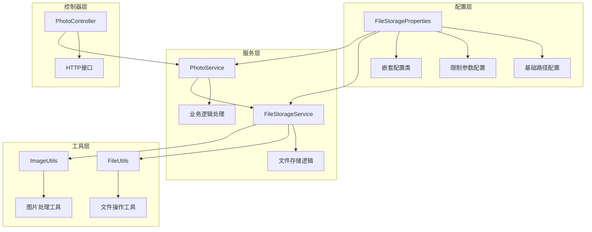
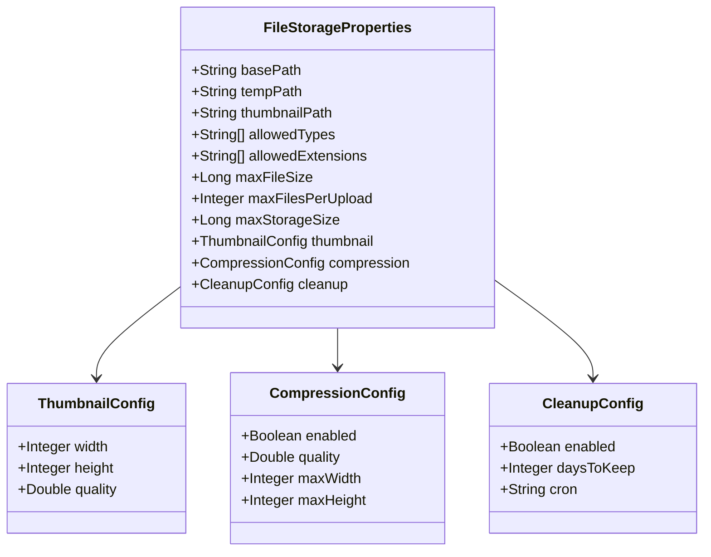
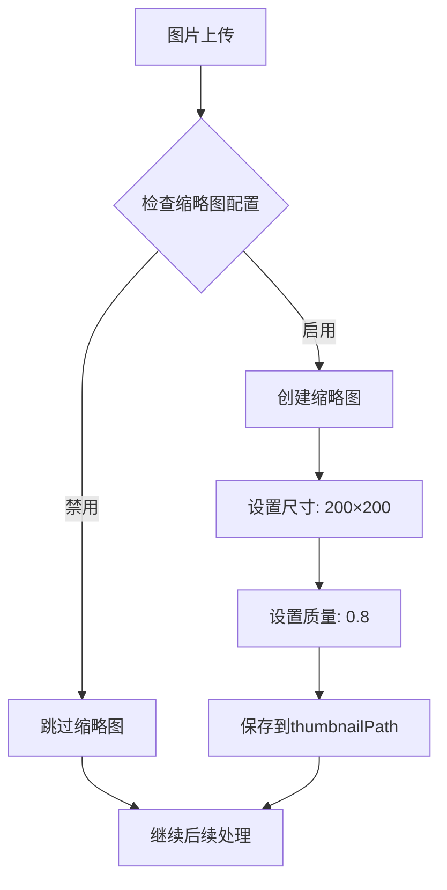
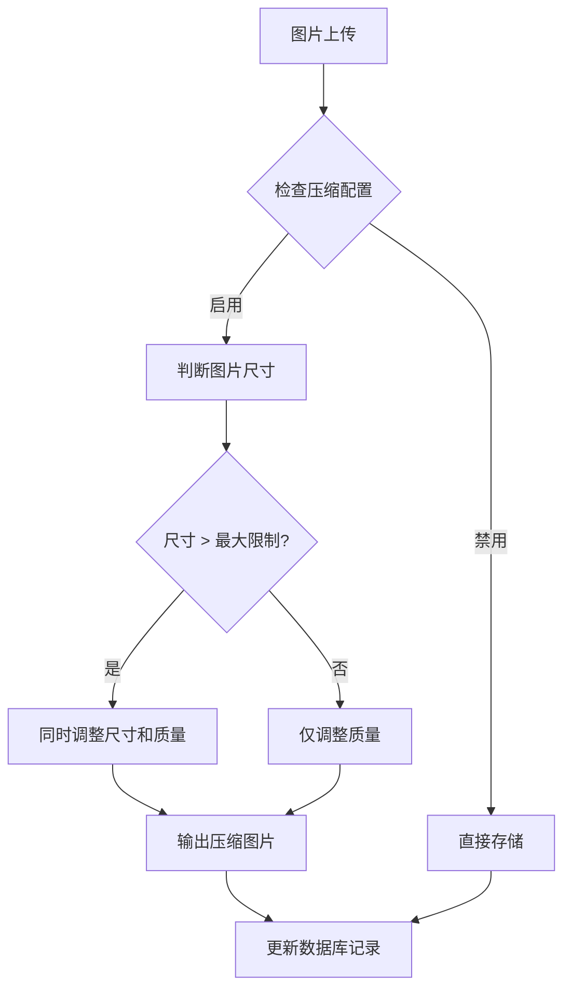
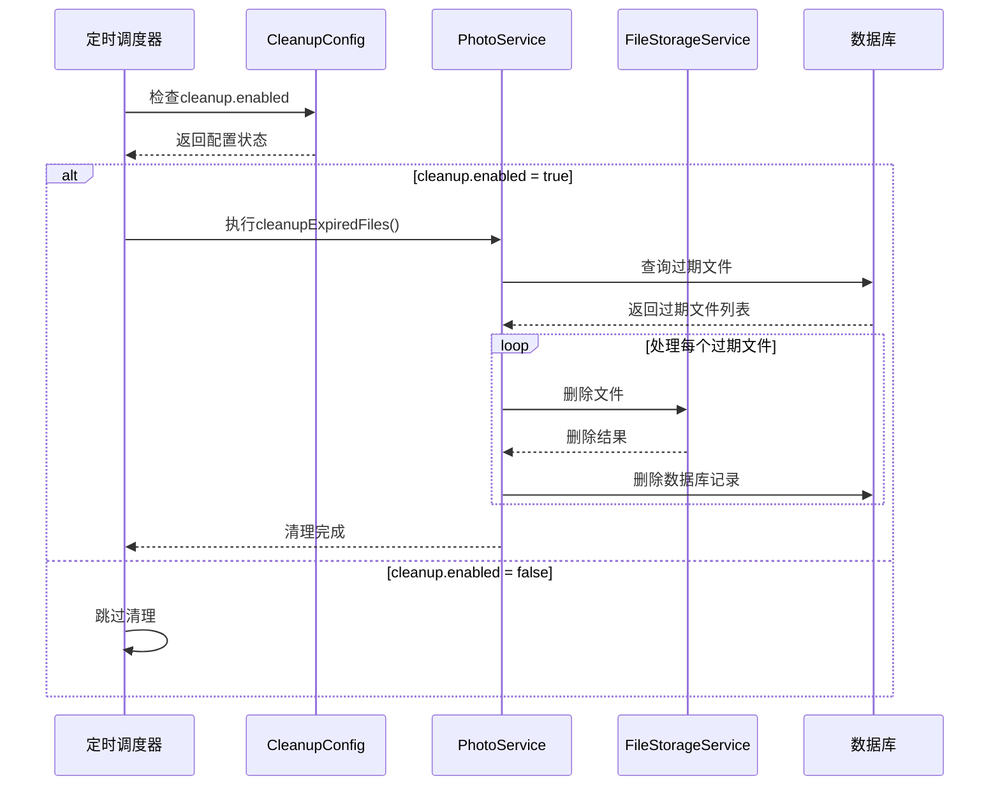

# 文件存储配置

<cite>
**本文档中引用的文件**
- [FileStorageProperties.java](file://src/main/java/com/photo/config/FileStorageProperties.java)
- [application.yml](file://src/main/resources/application.yml)
- [application-test.yml](file://src/test/resources/application-test.yml)
- [FileStorageService.java](file://src/main/java/com/photo/service/FileStorageService.java)
- [PhotoService.java](file://src/main/java/com/photo/service/PhotoService.java)
- [PhotoController.java](file://src/main/java/com/photo/controller/PhotoController.java)
- [FileUtils.java](file://src/main/java/com/photo/util/FileUtils.java)
- [ImageUtils.java](file://src/main/java/com/photo/util/ImageUtils.java)
</cite>

## 目录
1. [简介](#简介)
2. [项目结构概览](#项目结构概览)
3. [核心配置类分析](#核心配置类分析)
4. [配置属性详解](#配置属性详解)
5. [嵌套配置类详解](#嵌套配置类详解)
6. [配置绑定机制](#配置绑定机制)
7. [环境差异分析](#环境差异分析)
8. [最佳实践建议](#最佳实践建议)
9. [故障排除指南](#故障排除指南)
10. [总结](#总结)

## 简介

本文档详细介绍了基于Spring Boot的文件存储配置系统，重点分析FileStorageProperties类及其在application.yml中的绑定机制。该系统提供了完整的文件上传、存储、管理和清理功能，支持图片处理、缩略图生成、文件压缩等高级特性。

## 项目结构概览

文件存储配置系统采用模块化设计，主要组件包括：



**图表来源**
- [FileStorageProperties.java](file://src/main/java/com/photo/config/FileStorageProperties.java#L1-L94)
- [FileStorageService.java](file://src/main/java/com/photo/service/FileStorageService.java#L1-L300)
- [PhotoService.java](file://src/main/java/com/photo/service/PhotoService.java#L1-L385)

## 核心配置类分析

### FileStorageProperties类结构

FileStorageProperties是整个文件存储系统的配置中心，采用Spring Boot的@ConfigurationProperties注解实现类型安全的配置绑定。



**图表来源**
- [FileStorageProperties.java](file://src/main/java/com/photo/config/FileStorageProperties.java#L10-L94)

**章节来源**
- [FileStorageProperties.java](file://src/main/java/com/photo/config/FileStorageProperties.java#L1-L94)

## 配置属性详解

### 基础路径配置

#### basePath（文件存储根目录）
- **默认值**: `./uploads`
- **作用**: 定义文件存储的根目录位置
- **业务意义**: 所有文件存储操作的基础路径
- **最佳实践**: 
  - 生产环境建议使用绝对路径
  - 确保应用程序有写入权限
  - 考虑磁盘空间预留

#### tempPath（临时文件目录）
- **默认值**: `./uploads/temp`
- **作用**: 存储上传过程中的临时文件
- **业务意义**: 支持大文件分块上传和验证
- **最佳实践**:
  - 与basePath保持相对关系
  - 定期清理临时文件
  - 避免与其他应用冲突

#### thumbnailPath（缩略图目录）
- **默认值**: `./uploads/thumbnails`
- **作用**: 存储自动生成的缩略图文件
- **业务意义**: 提供快速访问的小尺寸图片
- **最佳实践**:
  - 与主文件目录分离
  - 使用专门的存储策略
  - 考虑CDN加速

### 文件类型限制配置

#### allowedTypes（允许的MIME类型）
- **默认值**: 包含多种图片格式
- **作用**: 严格限制可上传的文件类型
- **业务意义**: 防止恶意文件上传攻击
- **支持格式**: JPEG、PNG、GIF、BMP、WebP等

#### allowedExtensions（允许的文件扩展名）
- **默认值**: 对应的扩展名列表
- **作用**: 作为MIME类型的补充验证
- **业务意义**: 提供更细粒度的文件类型控制

### 文件大小限制配置

#### maxFileSize（单文件最大大小）
- **默认值**: `10485760L`（10MB）
- **业务意义**: 控制单个文件的存储成本和性能影响
- **影响因素**:
  - 服务器内存限制
  - 网络带宽考虑
  - 数据库存储效率

#### maxFilesPerUpload（单次上传最大文件数）
- **默认值**: `10`
- **业务意义**: 防止单次请求占用过多资源
- **系统稳定性**: 限制并发上传压力

#### maxStorageSize（总存储容量限制）
- **默认值**: `10737418240L`（10GB）
- **业务意义**: 整体存储空间的上限控制
- **监控指标**: 用于存储使用率计算

**章节来源**
- [FileStorageProperties.java](file://src/main/java/com/photo/config/FileStorageProperties.java#L15-L45)
- [application.yml](file://src/main/resources/application.yml#L40-L60)

## 嵌套配置类详解

### ThumbnailConfig（缩略图配置）

缩略图配置负责控制自动生成的缩略图参数。



**图表来源**
- [FileStorageService.java](file://src/main/java/com/photo/service/FileStorageService.java#L120-L135)
- [PhotoService.java](file://src/main/java/com/photo/service/PhotoService.java#L70-L85)

#### width & height（缩略图尺寸）
- **默认值**: `200×200`
- **业务意义**: 平衡显示质量和文件大小
- **优化建议**: 根据实际应用场景调整

#### quality（缩略图质量）
- **默认值**: `0.8`
- **业务意义**: 控制压缩质量和文件大小
- **权衡考虑**: 质量越高文件越大，加载越快

### CompressionConfig（图片压缩配置）

图片压缩配置提供智能的图片优化策略。



**图表来源**
- [ImageUtils.java](file://src/main/java/com/photo/util/ImageUtils.java#L50-L75)
- [PhotoService.java](file://src/main/java/com/photo/service/PhotoService.java#L75-L80)

#### enabled（压缩开关）
- **默认值**: `true`
- **业务意义**: 控制是否启用自动压缩
- **性能影响**: 显著减少存储空间和带宽消耗

#### quality（压缩质量）
- **默认值**: `0.85`
- **业务意义**: 压缩后图片的质量保留比例
- **优化策略**: 根据图片类型调整

#### maxWidth & maxHeight（最大尺寸）
- **默认值**: `1920×1080`
- **业务意义**: 防止超大图片占用过多资源
- **应用场景**: 移动端适配、网页显示优化

### CleanupConfig（定期清理配置）

定期清理配置确保系统长期稳定运行。



**图表来源**
- [PhotoService.java](file://src/main/java/com/photo/service/PhotoService.java#L320-L350)

#### enabled（清理开关）
- **默认值**: `true`
- **业务意义**: 控制是否启用自动清理功能
- **维护策略**: 生产环境建议启用

#### daysToKeep（保留天数）
- **默认值**: `30`
- **业务意义**: 定义文件的保留期限
- **合规考虑**: 根据数据保留政策调整

#### cron（定时任务表达式）
- **默认值**: `"0 0 2 * * ?"`
- **业务意义**: 定义清理任务的执行时间
- **执行频率**: 每天凌晨2点执行

**章节来源**
- [FileStorageProperties.java](file://src/main/java/com/photo/config/FileStorageProperties.java#L50-L94)

## 配置绑定机制

### @ConfigurationProperties注解

FileStorageProperties类使用Spring Boot的配置绑定机制：


**绑定规则**:
- `@ConfigurationProperties(prefix = "file.storage")`
- 自动将yml配置映射到对应字段
- 支持复杂对象嵌套绑定
- 提供类型安全的配置访问

### 类型安全的配置访问

配置系统通过以下方式确保类型安全：

1. **编译时检查**: Java类型系统保证配置访问的安全性
2. **默认值保护**: 避免null值导致的运行时异常
3. **验证机制**: 结合业务逻辑进行参数验证

**章节来源**
- [FileStorageProperties.java](file://src/main/java/com/photo/config/FileStorageProperties.java#L13-L15)

## 环境差异分析

### 开发环境vs测试环境配置对比

| 配置项 | 开发环境 | 测试环境 | 差异说明 |
|--------|----------|----------|----------|
| basePath | ./uploads | ./test-uploads | 测试环境使用独立目录 |
| compression.enabled | true | false | 测试环境禁用压缩以提高速度 |
| cleanup.enabled | true | false | 测试环境禁用自动清理 |
| allowed-types | 完整列表 | 简化列表 | 测试环境减少验证复杂度 |
| max-file-size | 10MB | 10MB | 保持一致 |
| max-storage-size | 10GB | 10GB | 保持一致 |

### 环境特定优化

#### 开发环境特点
- 启用完整功能集
- 较严格的文件验证
- 完整的日志记录
- 支持调试模式

#### 测试环境特点
- 性能优先的配置
- 简化的验证规则
- 减少资源消耗
- 快速清理机制

**章节来源**
- [application.yml](file://src/main/resources/application.yml#L40-L60)
- [application-test.yml](file://src/test/resources/application-test.yml#L15-L40)

## 最佳实践建议

### 生产环境配置调优

#### 存储路径配置
```yaml
file:
  storage:
    base-path: /var/www/uploads
    temp-path: /var/www/uploads/temp
    thumbnail-path: /var/www/uploads/thumbnails
```
**建议**:
- 使用绝对路径避免相对路径问题
- 确保目录权限正确
- 考虑使用网络存储或分布式文件系统

#### 性能优化配置
```yaml
file:
  storage:
    max-file-size: 52428800  # 50MB
    max-files-per-upload: 5
    max-storage-size: 107374182400  # 100GB
    compression:
      enabled: true
      quality: 0.9
      max-width: 2560
      max-height: 1440
```

#### 安全配置
```yaml
file:
  storage:
    allowed-types:
      - image/jpeg
      - image/png
      - image/gif
    allowed-extensions:
      - jpg
      - jpeg
      - png
      - gif
```

### 监控和告警配置

#### 存储使用率监控
```yaml
file:
  storage:
    max-storage-size: ${STORAGE_MAX_SIZE:10737418240}  # 10GB
```

#### 定期清理配置
```yaml
file:
  storage:
    cleanup:
      enabled: true
      days-to-keep: 30
      cron: "0 0 2 * * ?"  # 每天凌晨2点
```

### 故障恢复策略

#### 配置备份
```yaml
file:
  storage:
    backup:
      enabled: true
      retention-days: 7
```

#### 降级策略
```yaml
file:
  storage:
    fallback:
      enabled: true
      mode: "read-only"
```

## 故障排除指南

### 常见配置问题

#### 1. 目录权限问题
**症状**: 文件存储失败，抛出权限异常
**解决方案**:
- 检查目录是否存在且可写
- 确认应用程序用户权限
- 使用绝对路径避免权限混淆

#### 2. 存储空间不足
**症状**: 抛出StorageFullException
**解决方案**:
- 监控存储使用率
- 调整max-storage-size配置
- 实施定期清理策略

#### 3. 文件类型验证失败
**症状**: 抛出FileTypeException
**解决方案**:
- 检查allowed-types配置
- 验证文件MIME类型检测准确性
- 更新文件类型白名单

### 性能问题诊断

#### 1. 上传速度慢
**可能原因**:
- 网络带宽限制
- 压缩算法开销
- 存储I/O瓶颈

**优化方案**:
- 调整压缩质量参数
- 启用异步处理
- 使用CDN加速

#### 2. 内存占用过高
**可能原因**:
- 单次上传文件过多
- 大文件处理不当
- 缓存策略不合理

**优化方案**:
- 调整max-files-per-upload
- 实现流式处理
- 优化缓存配置

### 监控指标建议

#### 关键性能指标(KPI)
- 文件上传成功率
- 平均上传响应时间
- 存储空间使用率
- 清理任务执行时间

#### 告警阈值设置
- 存储使用率 > 80%
- 上传失败率 > 5%
- 清理任务执行超时
- 系统可用性 < 99%

**章节来源**
- [FileStorageService.java](file://src/main/java/com/photo/service/FileStorageService.java#L35-L50)
- [PhotoService.java](file://src/main/java/com/photo/service/PhotoService.java#L320-L350)

## 总结

文件存储配置系统通过FileStorageProperties类提供了全面而灵活的配置管理能力。该系统具有以下核心优势：

### 架构优势
- **模块化设计**: 清晰的职责分离和依赖关系
- **类型安全**: Spring Boot配置绑定提供编译时保障
- **扩展性强**: 支持各种图片处理和存储需求

### 功能特性
- **多层验证**: MIME类型、文件扩展名、文件大小的多重验证
- **智能压缩**: 基于尺寸和质量的自适应压缩策略
- **自动化管理**: 定期清理和存储监控机制
- **性能优化**: 缩略图生成和CDN友好的文件组织

### 运维价值
- **环境隔离**: 开发、测试、生产环境差异化配置
- **监控友好**: 完善的指标收集和告警机制
- **故障恢复**: 完善的错误处理和降级策略

通过合理配置和持续优化，该文件存储系统能够满足从小规模应用到大规模企业级部署的各种需求，为用户提供稳定、高效、安全的文件存储服务。