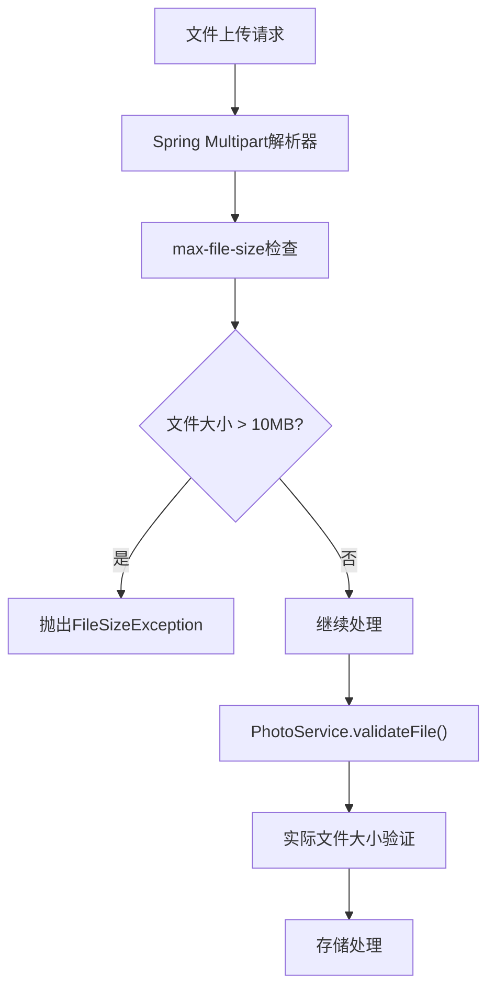
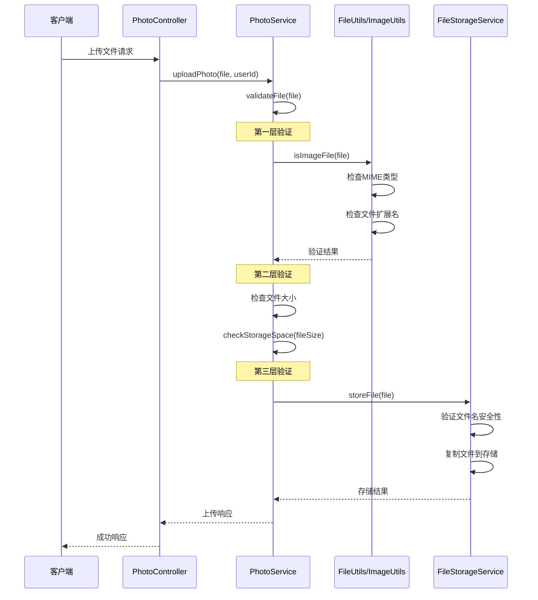
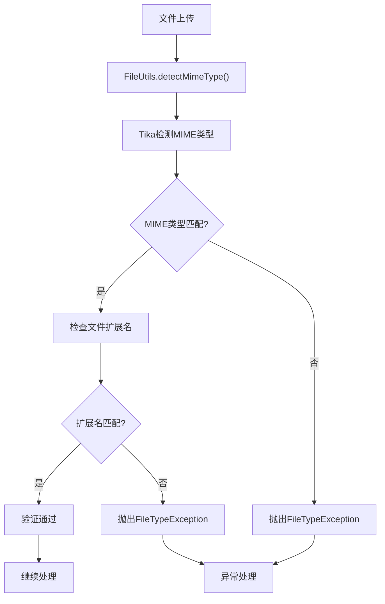
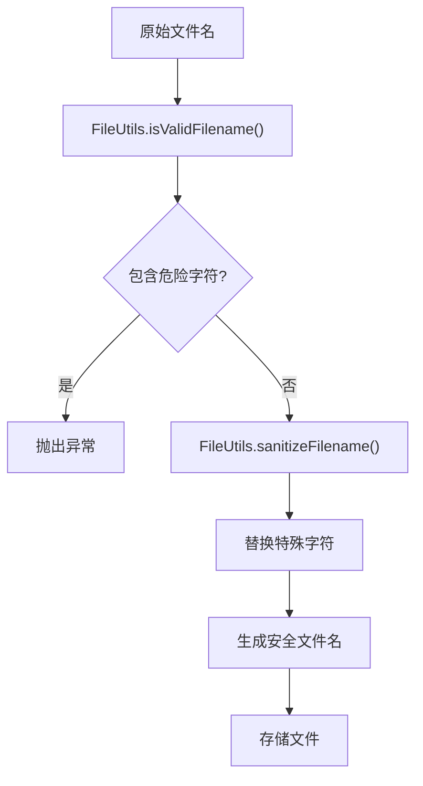

# 文件限制配置

<cite>
**本文档引用的文件**
- [application.yml](file://src/main/resources/application.yml)
- [application-test.yml](file://src/test/resources/application-test.yml)
- [FileStorageProperties.java](file://src/main/java/com/photo/config/FileStorageProperties.java)
- [PhotoController.java](file://src/main/java/com/photo/controller/PhotoController.java)
- [PhotoService.java](file://src/main/java/com/photo/service/PhotoService.java)
- [FileStorageService.java](file://src/main/java/com/photo/service/FileStorageService.java)
- [FileUtils.java](file://src/main/java/com/photo/util/FileUtils.java)
- [ImageUtils.java](file://src/main/java/com/photo/util/ImageUtils.java)
- [FileSizeException.java](file://src/main/java/com/photo/exception/FileSizeException.java)
- [FileTypeException.java](file://src/main/java/com/photo/exception/FileTypeException.java)
</cite>

## 目录
1. [概述](#概述)
2. [核心配置参数](#核心配置参数)
3. [配置文件对比分析](#配置文件对比分析)
4. [文件验证机制](#文件验证机制)
5. [运行时验证流程](#运行时验证流程)
6. [安全防护策略](#安全防护策略)
7. [性能优化建议](#性能优化建议)
8. [故障排除指南](#故障排除指南)
9. [最佳实践建议](#最佳实践建议)

## 概述

本系统采用多层次的文件限制配置机制，通过Spring Boot配置属性、运行时验证和服务层检查相结合的方式，确保文件上传的安全性和系统稳定性。主要包含三个核心限制维度：文件大小限制、文件数量限制和文件类型限制。

## 核心配置参数

### maxFileSize - 单文件大小限制

**配置位置**：`file.storage.max-file-size`  
**默认值**：10485760 字节（10MB）  
**作用范围**：单个上传文件的最大允许大小



**图表来源**
- [application.yml](file://src/main/resources/application.yml#L54-L56)
- [FileStorageProperties.java](file://src/main/java/com/photo/config/FileStorageProperties.java#L47-L49)
- [PhotoService.java](file://src/main/java/com/photo/service/PhotoService.java#L330-L335)

### maxFilesPerUpload - 单次上传文件数量限制

**配置位置**：`file.storage.max-files-per-upload`  
**默认值**：10 个文件  
**作用范围**：单次HTTP请求允许上传的最大文件数量

### allowedTypes & allowedExtensions - 文件类型白名单

**配置位置**：
- `file.storage.allowed-types` - MIME类型白名单
- `file.storage.allowed-extensions` - 文件扩展名白名单

**默认允许的图片格式**：
- MIME类型：`image/jpeg`, `image/jpg`, `image/png`, `image/gif`, `image/bmp`, `image/webp`
- 扩展名：`.jpg`, `.jpeg`, `.png`, `.gif`, `.bmp`, `.webp`

**图表来源**
- [application.yml](file://src/main/resources/application.yml#L40-L50)
- [FileStorageProperties.java](file://src/main/java/com/photo/config/FileStorageProperties.java#L34-L39)
- [FileUtils.java](file://src/main/java/com/photo/util/FileUtils.java#L20-L30)

## 配置文件对比分析

### 生产环境配置（application.yml）

生产环境采用严格的文件限制策略，确保系统稳定性和安全性：

| 配置项 | 生产环境值 | 说明 |
|--------|------------|------|
| max-file-size | 10485760 (10MB) | 单文件大小限制 |
| max-files-per-upload | 10 | 单次上传最大文件数 |
| allowed-types | 6种MIME类型 | 严格限制图片格式 |
| allowed-extensions | 6种扩展名 | 对应的文件扩展名 |
| compression.enabled | true | 启用图片压缩 |
| max-storage-size | 10737418240 (10GB) | 总存储空间限制 |

### 测试环境配置（application-test.yml）

测试环境配置相对宽松，便于开发和测试：

| 配置项 | 测试环境值 | 说明 |
|--------|------------|------|
| max-file-size | 10485760 (10MB) | 保持与生产一致 |
| max-files-per-upload | 10 | 保持与生产一致 |
| allowed-types | 3种MIME类型 | 简化测试场景 |
| allowed-extensions | 4种扩展名 | 简化测试场景 |
| compression.enabled | false | 禁用压缩便于调试 |
| cleanup.enabled | false | 禁用自动清理 |

**章节来源**
- [application.yml](file://src/main/resources/application.yml#L40-L50)
- [application-test.yml](file://src/test/resources/application-test.yml#L18-L30)

## 文件验证机制

### 多层次验证架构

系统采用三层验证机制，确保文件安全：



**图表来源**
- [PhotoController.java](file://src/main/java/com/photo/controller/PhotoController.java#L40-L55)
- [PhotoService.java](file://src/main/java/com/photo/service/PhotoService.java#L45-L50)
- [FileStorageService.java](file://src/main/java/com/photo/service/FileStorageService.java#L50-L80)

### MIME类型检测机制

系统使用Apache Tika进行精确的MIME类型检测：



**图表来源**
- [FileUtils.java](file://src/main/java/com/photo/util/FileUtils.java#L60-L75)
- [FileUtils.java](file://src/main/java/com/photo/util/FileUtils.java#L83-L95)

**章节来源**
- [FileUtils.java](file://src/main/java/com/photo/util/FileUtils.java#L60-L95)
- [PhotoService.java](file://src/main/java/com/photo/service/PhotoService.java#L330-L350)

## 运行时验证流程

### 单文件上传验证流程

当用户通过`/photos/upload`接口上传单个文件时，系统执行以下验证步骤：

1. **文件基本验证**：检查文件是否为空
2. **MIME类型验证**：使用Apache Tika检测文件类型
3. **扩展名验证**：检查文件扩展名是否在白名单中
4. **文件大小验证**：比较文件大小与配置限制
5. **存储空间验证**：检查剩余可用存储空间
6. **重复文件检查**：基于MD5哈希值检测重复文件

### 批量上传验证流程

批量上传接口(`/photos/upload/batch`)增加了额外的验证：

1. **文件数量验证**：检查上传文件数量是否超过`maxFilesPerUpload`
2. **逐个文件验证**：对每个文件执行完整的验证流程
3. **错误处理**：单个文件失败不影响其他文件处理

**章节来源**
- [PhotoService.java](file://src/main/java/com/photo/service/PhotoService.java#L45-L85)
- [PhotoService.java](file://src/main/java/com/photo/service/PhotoService.java#L90-L110)

## 安全防护策略

### 防止恶意文件上传

系统采用多种安全措施防止恶意文件上传：

| 安全措施 | 实现方式 | 防护目标 |
|----------|----------|----------|
| MIME类型检测 | Apache Tika | 防止文件类型伪装 |
| 扩展名验证 | 白名单机制 | 防止扩展名绕过 |
| 文件名清理 | 路径遍历检测 | 防止目录遍历攻击 |
| MD5去重 | 文件内容哈希 | 防止重复文件存储 |
| 存储空间限制 | 动态检查 | 防止存储耗尽攻击 |

### 文件名安全验证



**图表来源**
- [FileUtils.java](file://src/main/java/com/photo/util/FileUtils.java#L150-L170)
- [FileStorageService.java](file://src/main/java/com/photo/service/FileStorageService.java#L50-L65)

**章节来源**
- [FileUtils.java](file://src/main/java/com/photo/util/FileUtils.java#L150-L170)
- [FileStorageService.java](file://src/main/java/com/photo/service/FileStorageService.java#L50-L80)

## 性能优化建议

### 动态调整大小限制

根据业务需求动态调整文件大小限制：

```yaml
# 高流量场景：增加存储空间限制
file:
  storage:
    max-storage-size: 53687091200  # 50GB
    max-file-size: 20971520         # 20MB

# 低流量场景：降低资源占用
file:
  storage:
    max-storage-size: 5368709120   # 5GB
    max-file-size: 5242880          # 5MB
```

### 批量上传优化

对于大量文件上传场景，建议：

1. **客户端分批处理**：将大文件集拆分为多个小批次
2. **并发控制**：限制同时上传的文件数量
3. **进度反馈**：提供上传进度显示

### 缓存策略优化

```yaml
# 启用文件元数据缓存
spring:
  cache:
    type: caffeine
    caffeine:
      spec: maximumSize=1000,expireAfterWrite=3600s
```

## 故障排除指南

### 常见异常及解决方案

| 异常类型 | 错误信息 | 可能原因 | 解决方案 |
|----------|----------|----------|----------|
| FileSizeException | "文件大小不能超过 10MB" | 文件超过大小限制 | 减少文件大小或调整配置 |
| FileTypeException | "不支持的文件类型" | 文件类型不在白名单 | 使用允许的图片格式 |
| FileStorageException | "文件存储失败" | 存储空间不足 | 清理存储空间或扩容 |
| AccessDeniedException | "非法访问来源" | 防盗链检查失败 | 配置允许的域名 |

### 调试配置

启用详细日志记录以便问题诊断：

```yaml
logging:
  level:
    com.photo: DEBUG
    org.springframework.web: DEBUG
```

**章节来源**
- [FileSizeException.java](file://src/main/java/com/photo/exception/FileSizeException.java#L1-L16)
- [FileTypeException.java](file://src/main/java/com/photo/exception/FileTypeException.java#L1-L16)

## 最佳实践建议

### 生产环境配置建议

1. **合理设置文件大小限制**
   - 根据业务需求调整`max-file-size`
   - 考虑网络带宽和用户体验平衡

2. **实施渐进式文件类型扩展**
   ```yaml
   file:
     storage:
       allowed-types:
         - image/jpeg
         - image/png
         - image/gif
         - image/webp
         - image/tiff  # 新增支持
       allowed-extensions:
         - jpg
         - jpeg
         - png
         - gif
         - webp
         - tiff        # 新增支持
   ```

3. **建立监控告警机制**
   - 监控存储空间使用率
   - 设置文件上传频率告警
   - 跟踪异常上传模式

### 安全加固措施

1. **定期更新文件类型白名单**
   - 关注新出现的恶意文件格式
   - 及时移除不再使用的格式

2. **实施文件内容扫描**
   - 集成病毒扫描服务
   - 检测潜在的安全威胁

3. **建立备份恢复机制**
   - 定期备份重要文件
   - 制定灾难恢复计划

### 性能监控指标

```yaml
# Actuator监控配置
management:
  endpoints:
    web:
      exposure:
        include: health,info,metrics,file-storage
  endpoint:
    health:
      show-details: when-authorized
```

通过以上配置和最佳实践，可以构建一个安全、高效、可扩展的文件上传系统，有效防范各种安全威胁，同时提供良好的用户体验。