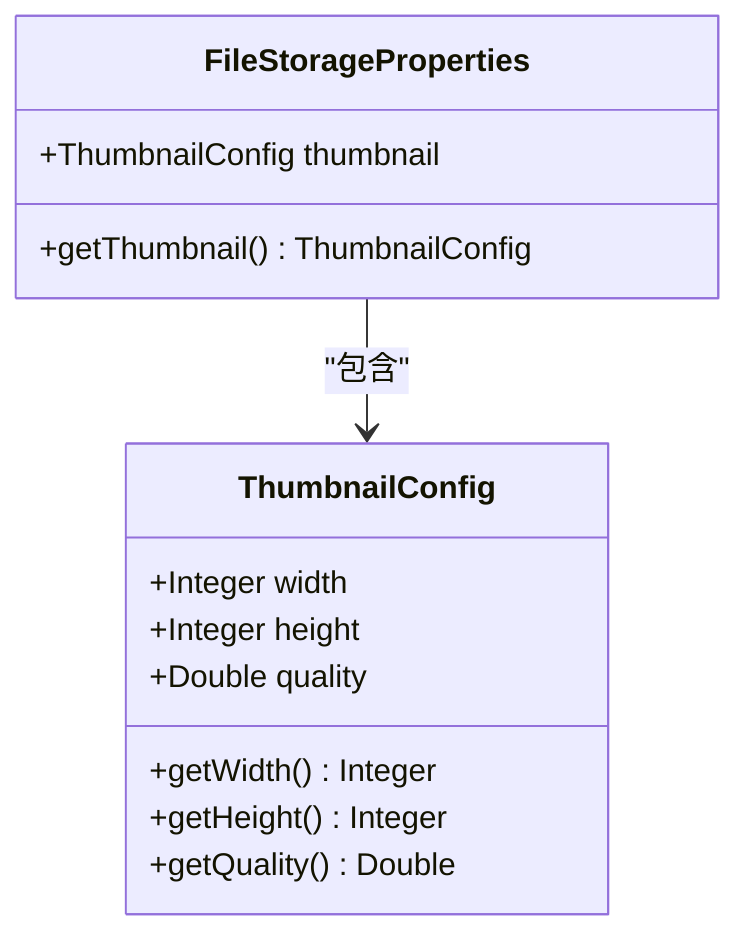
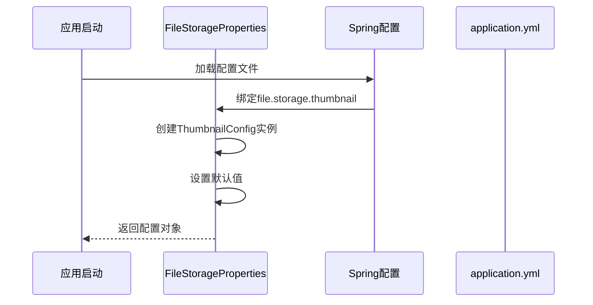
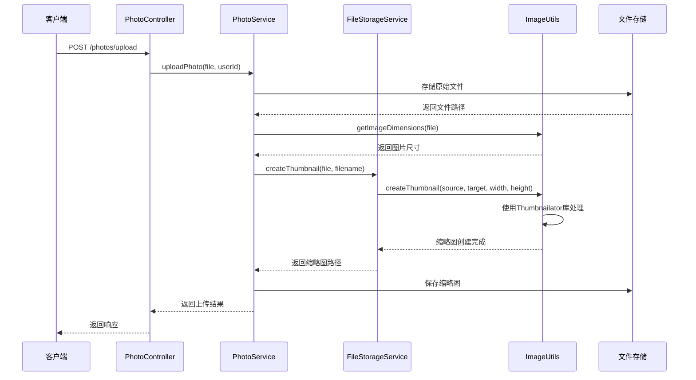
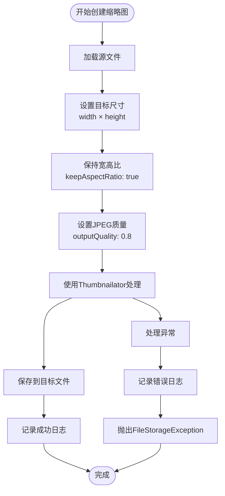
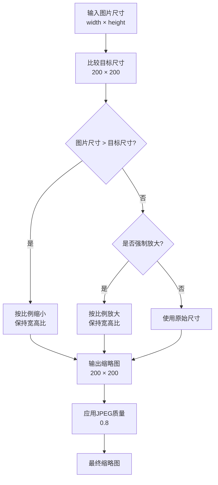
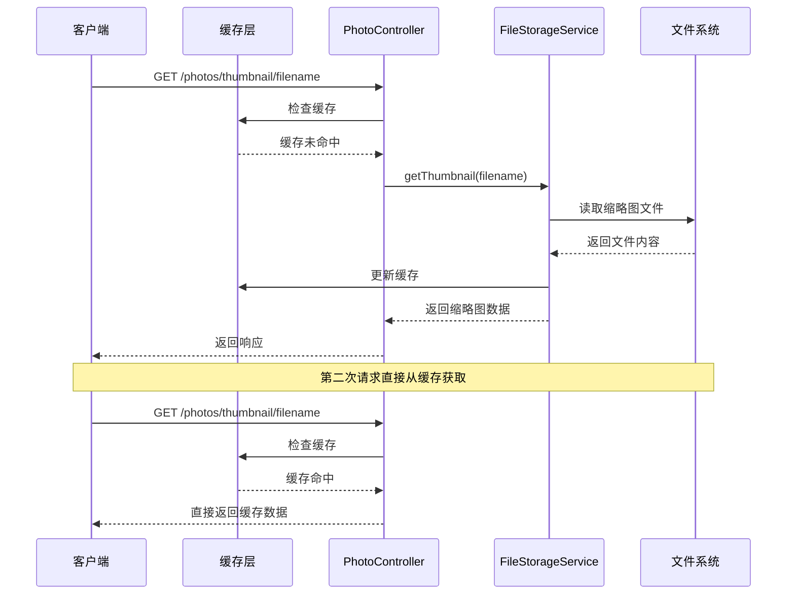
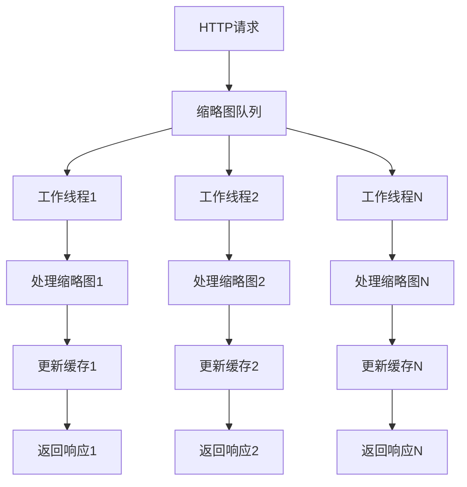

# 缩略图配置

<cite>
**本文档引用的文件**
- [FileStorageProperties.java](file://src/main/java/com/photo/config/FileStorageProperties.java)
- [ImageUtils.java](file://src/main/java/com/photo/util/ImageUtils.java)
- [PhotoController.java](file://src/main/java/com/photo/controller/PhotoController.java)
- [FileStorageService.java](file://src/main/java/com/photo/service/FileStorageService.java)
- [PhotoService.java](file://src/main/java/com/photo/service/PhotoService.java)
- [application.yml](file://src/main/resources/application.yml)
- [application-test.yml](file://src/test/resources/application-test.yml)
</cite>

## 目录
1. [简介](#简介)
2. [ThumbnailConfig配置详解](#thumbnailconfig配置详解)
3. [配置映射关系](#配置映射关系)
4. [缩略图生成流程](#缩略图生成流程)
5. [ImageUtils工具类应用](#imageutils工具类应用)
6. [尺寸处理逻辑](#尺寸处理逻辑)
7. [性能优化建议](#性能优化建议)
8. [缓存机制](#缓存机制)
9. [测试环境配置](#测试环境配置)
10. [高并发处理建议](#高并发处理建议)

## 简介

缩略图配置是照片管理系统中的重要组成部分，负责控制缩略图的生成参数、输出尺寸和质量控制。系统通过`FileStorageProperties.ThumbnailConfig`嵌套类提供灵活的配置选项，支持自定义宽度、高度和JPEG压缩质量参数。

## ThumbnailConfig配置详解

### 核心配置参数



**图表来源**
- [FileStorageProperties.java](file://src/main/java/com/photo/config/FileStorageProperties.java#L60-L65)

#### width字段
- **类型**: `Integer`
- **默认值**: `200`
- **作用**: 控制缩略图的输出宽度（像素）
- **取值范围**: 正整数，推荐范围：100-1000像素
- **影响**: 影响缩略图的显示效果和存储空间占用

#### height字段
- **类型**: `Integer`
- **默认值**: `200`
- **作用**: 控制缩略图的输出高度（像素）
- **取值范围**: 正整数，推荐范围：100-1000像素
- **影响**: 与width配合决定缩略图的最终尺寸比例

#### quality字段
- **类型**: `Double`
- **默认值**: `0.8`
- **作用**: 控制JPEG压缩质量，影响文件大小和图像质量
- **取值范围**: 0.0 ~ 1.0（浮点数）
- **推荐值**:
  - 0.6-0.7: 平衡质量和大小
  - 0.8-0.9: 高质量缩略图
  - 0.4-0.5: 极小文件大小

**章节来源**
- [FileStorageProperties.java](file://src/main/java/com/photo/config/FileStorageProperties.java#L60-L65)

## 配置映射关系

### application.yml配置结构

系统通过Spring Boot的配置绑定机制，将YAML配置映射到Java对象：

```yaml
file:
  storage:
    thumbnail:
      width: 200          # 输出宽度
      height: 200         # 输出高度  
      quality: 0.8        # JPEG质量
```

### 配置加载过程



**图表来源**
- [application.yml](file://src/main/resources/application.yml#L67-L71)
- [FileStorageProperties.java](file://src/main/java/com/photo/config/FileStorageProperties.java#L60-L65)

**章节来源**
- [application.yml](file://src/main/resources/application.yml#L67-L71)
- [FileStorageProperties.java](file://src/main/java/com/photo/config/FileStorageProperties.java#L60-L65)

## 缩略图生成流程

### 完整请求处理流程



**图表来源**
- [PhotoService.java](file://src/main/java/com/photo/service/PhotoService.java#L49-L110)
- [FileStorageService.java](file://src/main/java/com/photo/service/FileStorageService.java#L120-L135)
- [ImageUtils.java](file://src/main/java/com/photo/util/ImageUtils.java#L45-L56)

### 关键处理步骤

1. **文件验证**: 系统首先验证上传的文件是否为有效图片
2. **存储处理**: 将原始文件存储到指定目录
3. **尺寸获取**: 使用`ImageUtils.getImageDimensions()`获取图片原始尺寸
4. **缩略图创建**: 调用`FileStorageService.createThumbnail()`生成缩略图
5. **质量控制**: 应用配置的quality参数进行JPEG压缩

**章节来源**
- [PhotoService.java](file://src/main/java/com/photo/service/PhotoService.java#L49-L110)
- [FileStorageService.java](file://src/main/java/com/photo/service/FileStorageService.java#L120-L135)

## ImageUtils工具类应用

### createThumbnail方法详解

`ImageUtils.createThumbnail()`方法是缩略图生成的核心实现：



**图表来源**
- [ImageUtils.java](file://src/main/java/com/photo/util/ImageUtils.java#L45-L56)

### 参数传递机制

系统通过以下方式将配置参数传递给ImageUtils：

1. **直接参数传递**: 在`FileStorageService.createThumbnail()`中直接传入配置值
2. **配置对象访问**: 通过`storageProperties.getThumbnail()`获取配置对象
3. **动态参数**: 支持运行时动态调整缩略图参数

**章节来源**
- [ImageUtils.java](file://src/main/java/com/photo/util/ImageUtils.java#L45-L56)
- [FileStorageService.java](file://src/main/java/com/photo/service/FileStorageService.java#L120-L135)

## 尺寸处理逻辑

### 宽高比保持策略

系统采用智能的宽高比保持算法：



### 处理规则说明

1. **自动缩放**: 当原图大于目标尺寸时，系统会自动按比例缩小
2. **不强制放大**: 默认情况下，系统不会将小于目标尺寸的图片放大
3. **质量控制**: 统一应用配置的质量参数，确保一致性
4. **宽高比保持**: 始终保持原始图片的宽高比，避免变形

**章节来源**
- [ImageUtils.java](file://src/main/java/com/photo/util/ImageUtils.java#L45-L56)

## 性能优化建议

### 尺寸设置优化

| 场景 | 推荐尺寸 | 质量设置 | 存储节省 |
|------|----------|----------|----------|
| 社交媒体展示 | 300×300 | 0.7-0.8 | 60-70% |
| 移动端应用 | 200×200 | 0.6-0.7 | 50-60% |
| PC端浏览 | 400×400 | 0.8-0.9 | 70-80% |
| 高质量展示 | 600×600 | 0.9-1.0 | 80-90% |

### 存储优化策略

1. **合理设置尺寸**: 根据实际使用场景选择合适的缩略图尺寸
2. **质量平衡**: 在清晰度和文件大小之间找到最佳平衡点
3. **定期清理**: 实施定期清理机制，删除不再需要的缩略图
4. **压缩策略**: 结合原图压缩和缩略图质量控制

### 性能监控指标

- **生成时间**: 缩略图创建平均耗时
- **存储空间**: 缩略图占用的总存储空间
- **缓存命中率**: 缩略图缓存的有效性
- **并发处理能力**: 系统同时处理多个缩略图请求的能力

## 缓存机制

### 缩略图缓存策略



**图表来源**
- [PhotoController.java](file://src/main/java/com/photo/controller/PhotoController.java#L140-L160)

### 缓存配置优化

1. **缓存时间**: 缩略图缓存设置为2小时（7200秒）
2. **缓存类型**: 使用Caffeine本地缓存
3. **缓存键**: 基于文件名的唯一标识
4. **失效策略**: 基于时间的自动过期

**章节来源**
- [PhotoController.java](file://src/main/java/com/photo/controller/PhotoController.java#L140-L160)
- [application.yml](file://src/main/resources/application.yml#L45-L49)

## 测试环境配置

### 测试环境特点

测试环境采用与生产环境相同的默认配置，但进行了适当的简化：

```yaml
file:
  storage:
    thumbnail:
      width: 200
      height: 200
      quality: 0.8
```

### 测试环境优势

1. **一致性**: 测试环境配置与生产环境完全一致
2. **可预测性**: 默认配置确保测试结果的可重复性
3. **调试便利**: 标准化配置便于问题排查
4. **性能基准**: 提供稳定的性能测试基准

### 测试环境配置对比

| 配置项 | 生产环境 | 测试环境 | 差异说明 |
|--------|----------|----------|----------|
| width | 200 | 200 | 完全一致 |
| height | 200 | 200 | 完全一致 |
| quality | 0.8 | 0.8 | 完全一致 |
| cleanup.enabled | true | false | 测试环境禁用自动清理 |

**章节来源**
- [application.yml](file://src/main/resources/application.yml#L67-L71)
- [application-test.yml](file://src/test/resources/application-test.yml#L32-L36)

## 高并发处理建议

### 异步处理架构



### 队列处理建议

1. **消息队列**: 使用RabbitMQ或Kafka处理缩略图生成请求
2. **优先级队列**: 为不同类型的缩略图设置不同的处理优先级
3. **批量处理**: 将多个缩略图请求合并为批量处理任务
4. **资源监控**: 监控队列长度和处理延迟

### 性能调优参数

| 参数 | 推荐值 | 说明 |
|------|--------|------|
| 队列深度 | 1000 | 避免内存溢出 |
| 工作线程数 | CPU核心数×2 | 充分利用CPU资源 |
| 批处理大小 | 10-50 | 平衡吞吐量和延迟 |
| 超时时间 | 30秒 | 防止长时间阻塞 |

### 错误处理策略

1. **重试机制**: 对失败的缩略图生成请求实施指数退避重试
2. **降级处理**: 在高负载情况下提供低质量缩略图作为降级方案
3. **监控告警**: 设置关键指标的监控和告警机制
4. **故障转移**: 实现多节点的缩略图处理集群

## 总结

缩略图配置系统提供了灵活而强大的功能，通过合理的配置和优化策略，可以在保证图像质量的同时最大化系统性能。关键要点包括：

1. **配置灵活性**: 支持自定义尺寸和质量参数
2. **智能处理**: 自动保持宽高比，避免图片变形
3. **性能优化**: 通过缓存和异步处理提升系统响应速度
4. **质量控制**: 统一的质量参数确保用户体验一致性
5. **测试保障**: 标准化的测试环境配置确保系统稳定性

通过遵循本文档的建议和最佳实践，可以构建一个高效、稳定的照片缩略图处理系统。