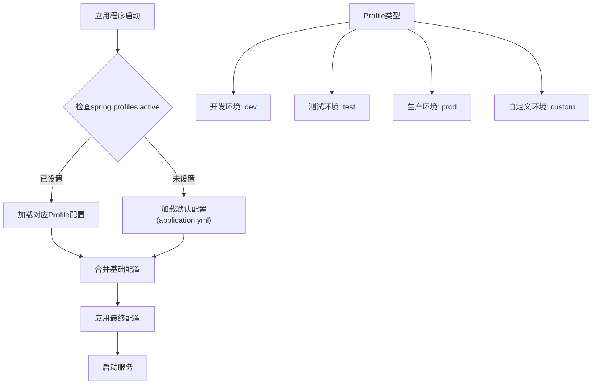
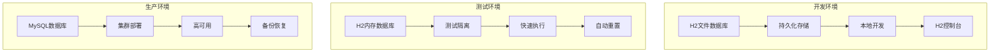
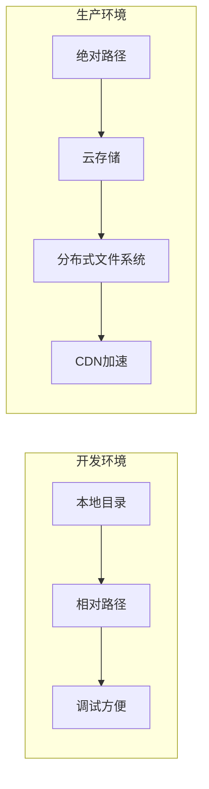

# 环境配置管理

<cite>
**本文档中引用的文件**
- [application.yml](file://src/main/resources/application.yml)
- [application-test.yml](file://src/test/resources/application-test.yml)
- [pom.xml](file://pom.xml)
- [SecurityConfig.java](file://src/main/java/com/photo/config/SecurityConfig.java)
- [FileStorageProperties.java](file://src/main/java/com/photo/config/FileStorageProperties.java)
- [SecurityProperties.java](file://src/main/java/com/photo/config/SecurityProperties.java)
- [PhotoUploadApplication.java](file://src/main/java/com/photo/PhotoUploadApplication.java)
</cite>

## 目录
1. [项目概述](#项目概述)
2. [Spring Profile机制](#spring-profile机制)
3. [开发环境配置](#开发环境配置)
4. [测试环境配置](#测试环境配置)
5. [生产环境配置](#生产环境配置)
6. [关键配置对比分析](#关键配置对比分析)
7. [生产环境部署指南](#生产环境部署指南)
8. [故障排除指南](#故障排除指南)
9. [最佳实践建议](#最佳实践建议)

## 项目概述

本项目是一个基于Spring Boot的照片上传下载系统，采用多环境配置管理策略，支持开发、测试和生产三种运行环境。系统通过Spring Profile机制实现环境间的无缝切换，确保不同环境下配置的正确性和安全性。

### 核心特性
- **多环境支持**：开发、测试、生产环境独立配置
- **灵活的数据源切换**：支持H2内存数据库和MySQL关系型数据库
- **安全配置管理**：包含防盗链、Token认证、CORS跨域等安全机制
- **文件存储优化**：支持图片压缩、缩略图生成、存储容量限制等功能
- **监控与日志**：集成Actuator监控和结构化日志记录

## Spring Profile机制

Spring Boot通过Profile机制实现多环境配置管理，允许应用程序在不同环境中使用不同的配置文件。

### Profile激活方式



**图表来源**
- [PhotoUploadApplication.java](file://src/main/java/com/photo/PhotoUploadApplication.java#L1-L20)

### Profile配置文件命名规则

| Profile名称 | 配置文件名 | 用途 |
|------------|-----------|------|
| 开发环境 | `application-dev.yml` | 本地开发调试 |
| 测试环境 | `application-test.yml` | 单元测试和集成测试 |
| 生产环境 | `application-prod.yml` | 生产环境部署 |
| 默认环境 | `application.yml` | 所有环境的基础配置 |

**章节来源**
- [application.yml](file://src/main/resources/application.yml#L1-L173)
- [application-test.yml](file://src/test/resources/application-test.yml#L1-L75)

## 开发环境配置

开发环境配置专注于开发效率和调试便利性，使用H2内存数据库和丰富的日志输出。

### 数据源配置

开发环境默认使用H2内存数据库，提供快速的开发和测试体验：

```yaml
# H2数据库配置(开发环境)
spring:
  datasource:
    url: jdbc:h2:file:./data/photodb
    driver-class-name: org.h2.Driver
    username: sa
    password: 
```

### 关键特性

| 配置项 | 开发环境值 | 说明 |
|-------|-----------|------|
| 数据库类型 | H2文件数据库 | 支持持久化存储到本地文件 |
| H2控制台 | 启用 | 可访问 `/h2-console` 进行数据库管理 |
| SQL显示 | 启用 | 显示执行的SQL语句便于调试 |
| 日志级别 | DEBUG | 详细的日志输出 |
| 文件大小限制 | 10MB | 单个文件最大10MB |
| 并发连接数 | 10000 | 支持高并发请求 |

### 安全配置特点

```yaml
security:
  referer:
    enabled: true
    allowed-domains:
      - localhost
      - 127.0.0.1
  token:
    secret: your-secret-key-change-this-in-production
    expiration: 86400
```

**章节来源**
- [application.yml](file://src/main/resources/application.yml#L5-L25)
- [application.yml](file://src/main/resources/application.yml#L100-L120)

## 测试环境配置

测试环境配置针对自动化测试和集成测试场景，使用内存数据库以提高测试速度和隔离性。

### 数据源配置

```yaml
# 内存数据库配置(测试环境)
spring:
  datasource:
    url: jdbc:h2:mem:testdb
    driver-class-name: org.h2.Driver
    username: sa
    password: 
```

### 测试环境优化

| 特性 | 开发环境 | 测试环境 | 说明 |
|------|---------|---------|------|
| 数据库模式 | update | create-drop | 测试环境每次重置数据库 |
| 文件压缩 | 启用 | 禁用 | 减少测试复杂度 |
| 定期清理 | 启用 | 禁用 | 避免测试数据干扰 |
| 日志级别 | DEBUG | INFO | 减少日志输出 |
| 防盗链 | 启用 | 禁用 | 方便测试跨域请求 |

### 测试专用配置

```yaml
file:
  storage:
    compression:
      enabled: false
    cleanup:
      enabled: false
```

**章节来源**
- [application-test.yml](file://src/test/resources/application-test.yml#L6-L12)
- [application-test.yml](file://src/test/resources/application-test.yml#L35-L45)

## 生产环境配置

生产环境配置强调性能、安全性和稳定性，需要特别注意安全配置和性能优化。

### MySQL数据库配置

```yaml
# MySQL数据库配置(生产环境)
spring:
  datasource:
    url: jdbc:mysql://localhost:3306/photo_db?useUnicode=true&characterEncoding=utf8&useSSL=false&serverTimezone=Asia/Shanghai
    driver-class-name: com.mysql.cj.jdbc.Driver
    username: root
    password: root
```

### 安全配置强化

```yaml
security:
  referer:
    enabled: true
    allowed-domains:
      - your-domain.com
      - www.your-domain.com
  token:
    secret: ${TOKEN_SECRET:your-secret-key-change-this-in-production}
    expiration: 86400
```

### 性能优化配置

| 配置项 | 推荐值 | 说明 |
|-------|-------|------|
| 最大连接数 | 200 | Tomcat线程池大小 |
| 压缩启用 | true | 启用Gzip压缩减少传输 |
| 缓存类型 | Caffeine | 内存缓存提升响应速度 |
| 日志级别 | WARN | 生产环境减少日志量 |
| 文件存储 | 绝对路径 | 使用云存储或分布式文件系统 |

### Nginx反向代理配置示例

```nginx
upstream photo_backend {
    server 127.0.0.1:8080;
}

server {
    listen 80;
    server_name your-domain.com;
    return 301 https://$server_name$request_uri;
}

server {
    listen 443 ssl http2;
    server_name your-domain.com;

    ssl_certificate /path/to/certificate.crt;
    ssl_certificate_key /path/to/private.key;
    ssl_protocols TLSv1.2 TLSv1.3;
    ssl_ciphers HIGH:!aNULL:!MD5;

    client_max_body_size 10M;
    
    location / {
        proxy_pass http://photo_backend;
        proxy_set_header Host $host;
        proxy_set_header X-Real-IP $remote_addr;
        proxy_set_header X-Forwarded-For $proxy_add_x_forwarded_for;
        proxy_set_header X-Forwarded-Proto $scheme;
        
        proxy_buffering off;
        proxy_cache off;
    }
}
```

**章节来源**
- [application.yml](file://src/main/resources/application.yml#L10-L15)
- [application.yml](file://src/main/resources/application.yml#L120-L140)

## 关键配置对比分析

### 数据源配置对比



**图表来源**
- [application.yml](file://src/main/resources/application.yml#L5-L25)
- [application-test.yml](file://src/test/resources/application-test.yml#L6-L12)

### 安全配置对比表

| 配置项 | 开发环境 | 测试环境 | 生产环境 | 说明 |
|-------|---------|---------|---------|------|
| 数据库密码 | 空 | 空 | 强密码 | 生产环境必须加密 |
| H2控制台 | 启用 | 禁用 | 禁用 | 生产环境关闭 |
| HTTPS | 禁用 | 禁用 | 启用 | 生产环境必须启用 |
| Token密钥 | 默认密钥 | 测试密钥 | 环境变量 | 生产环境加密 |
| 防盗链 | 启用 | 禁用 | 启用 | 生产环境保护资源 |
| 日志级别 | DEBUG | INFO | WARN | 生产环境减少敏感信息 |

### 文件存储配置对比



**图表来源**
- [application.yml](file://src/main/resources/application.yml#L30-L50)
- [application-test.yml](file://src/test/resources/application-test.yml#L15-L25)

**章节来源**
- [application.yml](file://src/main/resources/application.yml#L1-L173)
- [application-test.yml](file://src/test/resources/application-test.yml#L1-L75)

## 生产环境部署指南

### 必要的安全配置项

1. **数据库连接配置**
   ```yaml
   spring:
     datasource:
       url: jdbc:mysql://db-server:3306/photo_db?useUnicode=true&characterEncoding=utf8&useSSL=true&serverTimezone=Asia/Shanghai
       username: ${DB_USERNAME}
       password: ${DB_PASSWORD}
   ```

2. **安全Token配置**
   ```yaml
   security:
     token:
       secret: ${TOKEN_SECRET}
       expiration: 86400
   ```

3. **HTTPS配置**
   ```yaml
   server:
     ssl:
       enabled: true
       key-store-type: PKCS12
       key-store: classpath:keystore.p12
       key-store-password: ${SSL_KEYSTORE_PASSWORD}
       key-alias: photo-upload
   ```

### 完整的生产环境配置模板

以下是完整的`application-prod.yml`配置模板：

```yaml
# 生产环境配置模板
spring:
  application:
    name: photo-upload-system-prod
  
  # 数据源配置
  datasource:
    url: jdbc:mysql://localhost:3306/photo_db?useUnicode=true&characterEncoding=utf8&useSSL=true&serverTimezone=Asia/Shanghai
    driver-class-name: com.mysql.cj.jdbc.Driver
    username: ${DB_USERNAME}
    password: ${DB_PASSWORD}
    hikari:
      maximum-pool-size: 20
      minimum-idle: 5
      connection-timeout: 30000
      idle-timeout: 600000
      max-lifetime: 1800000
  
  # JPA配置
  jpa:
    hibernate:
      ddl-auto: update
    show-sql: false
    properties:
      hibernate:
        format_sql: false
        dialect: org.hibernate.dialect.MySQL8Dialect
  
  # H2控制台(生产环境必须禁用)
  h2:
    console:
      enabled: false
  
  # 文件上传配置
  servlet:
    multipart:
      enabled: true
      max-file-size: 10MB
      max-request-size: 50MB
      file-size-threshold: 2MB
  
  # 缓存配置
  cache:
    type: caffeine
    caffeine:
      spec: maximumSize=10000,expireAfterWrite=3600s,recordStats

# 文件存储配置
file:
  storage:
    base-path: /var/www/uploads
    temp-path: /var/www/uploads/temp
    thumbnail-path: /var/www/uploads/thumbnails
    allowed-types:
      - image/jpeg
      - image/jpg
      - image/png
      - image/gif
      - image/bmp
      - image/webp
    allowed-extensions:
      - jpg
      - jpeg
      - png
      - gif
      - bmp
      - webp
    max-file-size: 10485760
    max-files-per-upload: 10
    thumbnail:
      width: 200
      height: 200
      quality: 0.8
    compression:
      enabled: true
      quality: 0.85
      max-width: 1920
      max-height: 1080
    max-storage-size: 107374182400  # 100GB
    cleanup:
      enabled: true
      days-to-keep: 30
      cron: "0 0 2 * * ?"

# 安全配置
security:
  referer:
    enabled: true
    allowed-domains:
      - your-domain.com
      - www.your-domain.com
  token:
    secret: ${TOKEN_SECRET}
    expiration: 86400
  cors:
    enabled: true
    allowed-origins:
      - https://your-domain.com
      - https://www.your-domain.com
    allowed-methods:
      - GET
      - POST
      - PUT
      - DELETE
    allowed-headers:
      - Content-Type
      - Authorization
    allow-credentials: true

# 日志配置
logging:
  level:
    root: WARN
    com.photo: INFO
    org.springframework.web: WARN
    org.hibernate: ERROR
  pattern:
    console: "%d{yyyy-MM-dd HH:mm:ss} [%thread] %-5level %logger{36} - %msg%n"
    file: "%d{yyyy-MM-dd HH:mm:ss} [%thread] %-5level %logger{36} - %msg%n"
  file:
    name: /var/log/photo-upload/photo-upload-system.log
    max-size: 50MB
    max-history: 30

# 服务器配置
server:
  port: 8080
  servlet:
    context-path: /api
  compression:
    enabled: true
    mime-types: text/html,text/xml,text/plain,text/css,application/javascript,application/json,image/svg+xml
  ssl:
    enabled: true
    key-store-type: PKCS12
    key-store: classpath:keystore.p12
    key-store-password: ${SSL_KEYSTORE_PASSWORD}
    key-alias: photo-upload
  tomcat:
    max-connections: 200
    threads:
      max: 200
      min-spare: 10

# Actuator监控配置
management:
  endpoints:
    web:
      exposure:
        include: health,info,metrics,prometheus
  endpoint:
    health:
      show-details: when-authorized
  metrics:
    export:
      prometheus:
        enabled: true

# API文档配置
springdoc:
  api-docs:
    path: /api-docs
  swagger-ui:
    path: /swagger-ui.html
    enabled: true
```

### 部署前检查清单

| 检查项 | 状态 | 备注 |
|-------|------|------|
| [ ] 数据库连接测试 | ✗ | 确保数据库可连接 |
| [ ] 文件存储权限 | ✗ | 确保写入权限 |
| [ ] SSL证书配置 | ✗ | 确保证书有效 |
| [ ] 环境变量设置 | ✗ | TOKEN_SECRET, DB_USERNAME等 |
| [ ] 防火墙配置 | ✗ | 开放必要端口 |
| [ ] 监控告警 | ✗ | 设置健康检查 |
| [ ] 备份策略 | ✗ | 数据定期备份 |
| [ ] 日志轮转 | ✗ | 避免磁盘满 |

**章节来源**
- [application.yml](file://src/main/resources/application.yml#L1-L173)
- [SecurityProperties.java](file://src/main/java/com/photo/config/SecurityProperties.java#L1-L53)

## 故障排除指南

### 常见配置问题

1. **数据库连接失败**
   - 检查数据库URL格式是否正确
   - 验证用户名密码是否正确
   - 确认数据库服务是否启动
   - 检查网络连接和防火墙设置

2. **H2控制台无法访问**
   - 确认`spring.h2.console.enabled=true`
   - 检查路径配置是否正确
   - 确认开发环境配置

3. **文件上传失败**
   - 检查文件存储路径权限
   - 验证文件大小限制配置
   - 确认临时目录空间充足

4. **安全配置问题**
   - 验证Token密钥是否设置
   - 检查CORS配置是否正确
   - 确认防盗链设置

### 调试技巧

```bash
# 启动时启用调试日志
java -Dspring.profiles.active=prod -Dlogging.level.root=DEBUG -jar app.jar

# 检查配置加载情况
curl http://localhost:8080/actuator/env

# 查看健康状态
curl http://localhost:8080/actuator/health
```

**章节来源**
- [SecurityConfig.java](file://src/main/java/com/photo/config/SecurityConfig.java#L20-L45)

## 最佳实践建议

### 配置管理最佳实践

1. **敏感信息外部化**
   - 使用环境变量存储密码和密钥
   - 避免将敏感信息提交到版本控制
   - 使用加密工具保护配置文件

2. **配置验证**
   - 在CI/CD流程中验证配置有效性
   - 使用配置模板确保一致性
   - 定期审查和更新配置

3. **环境隔离**
   - 不同环境使用独立的数据库实例
   - 避免在测试环境使用生产数据
   - 使用不同的域名和证书

### 性能优化建议

1. **数据库优化**
   - 合理设置连接池大小
   - 定期清理无用数据
   - 使用索引优化查询性能

2. **文件存储优化**
   - 使用CDN加速文件访问
   - 实施文件压缩和缓存策略
   - 定期清理临时文件

3. **监控和告警**
   - 设置关键指标监控
   - 配置异常告警机制
   - 定期进行性能测试

### 安全加固措施

1. **网络安全**
   - 启用HTTPS强制加密传输
   - 配置防火墙规则
   - 使用WAF防护常见攻击

2. **应用安全**
   - 定期更新依赖包
   - 实施输入验证和过滤
   - 使用安全的会话管理

3. **数据保护**
   - 加密敏感数据存储
   - 实施数据备份策略
   - 制定数据泄露应急计划

通过遵循这些最佳实践，可以确保系统的稳定性、安全性和可维护性，为用户提供可靠的服务体验。