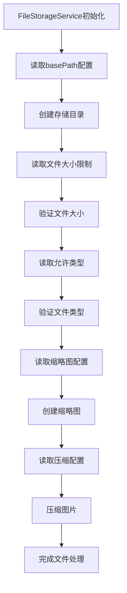

# 配置与属性

<cite>
**本文档引用的文件**
- [FileStorageProperties.java](file://src/main/java/com/photo/config/FileStorageProperties.java)
- [SecurityProperties.java](file://src/main/java/com/photo/config/SecurityProperties.java)
- [application.yml](file://src/main/resources/application.yml)
- [application-test.yml](file://src/test/resources/application-test.yml)
- [SecurityConfig.java](file://src/main/java/com/photo/config/SecurityConfig.java)
- [PhotoController.java](file://src/main/java/com/photo/controller/PhotoController.java)
- [FileStorageService.java](file://src/main/java/com/photo/service/FileStorageService.java)
- [PhotoUploadApplication.java](file://src/main/java/com/photo/PhotoUploadApplication.java)
</cite>

## 目录
1. [简介](#简介)
2. [配置架构概述](#配置架构概述)
3. [FileStorageProperties配置详解](#filestorageproperties配置详解)
4. [SecurityProperties配置详解](#securityproperties配置详解)
5. [配置文件对比分析](#配置文件对比分析)
6. [配置绑定机制](#配置绑定机制)
7. [实际应用场景](#实际应用场景)
8. [生产环境最佳实践](#生产环境最佳实践)
9. [故障排除指南](#故障排除指南)
10. [总结](#总结)

## 简介

本项目采用Spring Boot的配置属性绑定机制，通过`@ConfigurationProperties`注解将YAML配置文件中的设置自动映射到Java对象中。系统主要包含两个核心配置类：`FileStorageProperties`用于管理文件存储相关配置，`SecurityProperties`用于安全管理配置。这种设计模式提供了类型安全的配置管理，简化了配置维护工作。

## 配置架构概述

```mermaid
graph TB
subgraph "配置层次结构"
A[application.yml] --> B[application-test.yml]
C[FileStorageProperties] --> D[文件存储配置]
E[SecurityProperties] --> F[安全配置]
end
subgraph "配置绑定机制"
G[@ConfigurationProperties] --> H[属性映射]
I[Spring Boot自动配置] --> J[依赖注入]
end
subgraph "应用组件"
K[FileStorageService] --> L[文件操作]
M[SecurityConfig] --> N[安全过滤]
O[PhotoController] --> P[业务逻辑]
end
A --> C
A --> E
C --> K
E --> M
K --> O
M --> O
```

**图表来源**
- [FileStorageProperties.java](file://src/main/java/com/photo/config/FileStorageProperties.java#L13-L15)
- [SecurityProperties.java](file://src/main/java/com/photo/config/SecurityProperties.java#L13-L15)
- [application.yml](file://src/main/resources/application.yml#L1-L173)

## FileStorageProperties配置详解

### 核心配置项

FileStorageProperties类通过`@ConfigurationProperties(prefix = "file.storage")`注解绑定到`application.yml`中的`file.storage`命名空间。

#### 基础存储配置

| 配置项 | 类型 | 默认值 | 实际意义 |
|--------|------|--------|----------|
| `base-path` | String | `./uploads` | 文件存储根目录，所有文件将存储在此目录下 |
| `temp-path` | String | `./uploads/temp` | 临时文件存储目录，用于文件上传过程中的暂存 |
| `thumbnail-path` | String | `./uploads/thumbnails` | 缩略图存储目录，保存生成的缩略图文件 |

#### 文件类型与大小限制

| 配置项 | 类型 | 默认值 | 实际意义 |
|--------|------|--------|----------|
| `allowed-types` | List<String> | 包含多种图片格式 | 允许上传的MIME类型列表 |
| `allowed-extensions` | List<String> | 包含常见图片扩展名 | 允许上传的文件扩展名列表 |
| `max-file-size` | Long | `10485760` (10MB) | 单个文件的最大允许大小 |
| `max-files-per-upload` | Integer | `10` | 单次上传操作允许的最大文件数量 |

#### 高级配置选项

##### 缩略图配置 (thumbnail)

| 子配置项 | 类型 | 默认值 | 实际意义 |
|----------|------|--------|----------|
| `width` | Integer | `200` | 缩略图宽度像素 |
| `height` | Integer | `200` | 缩略图高度像素 |
| `quality` | Double | `0.8` | 缩略图质量，范围0.0-1.0 |

##### 图片压缩配置 (compression)

| 子配置项 | 类型 | 默认值 | 实际意义 |
|----------|------|--------|----------|
| `enabled` | Boolean | `true` | 是否启用图片压缩功能 |
| `quality` | Double | `0.85` | 压缩后图片的质量 |
| `max-width` | Integer | `1920` | 压缩后图片的最大宽度 |
| `max-height` | Integer | `1080` | 压缩后图片的最大高度 |

##### 存储清理配置 (cleanup)

| 子配置项 | 类型 | 默认值 | 实际意义 |
|----------|------|--------|----------|
| `enabled` | Boolean | `true` | 是否启用定期清理功能 |
| `days-to-keep` | Integer | `30` | 文件保留天数 |
| `cron` | String | `"0 0 2 * * ?"` | 定时任务执行时间表达式 |

**章节来源**
- [FileStorageProperties.java](file://src/main/java/com/photo/config/FileStorageProperties.java#L1-L94)

## SecurityProperties配置详解

### 安全配置架构

SecurityProperties类通过`@ConfigurationProperties(prefix = "security")`注解绑定到`application.yml`中的`security`命名空间。

#### 防盗链配置 (referer)

| 子配置项 | 类型 | 默认值 | 实际意义 |
|----------|------|--------|----------|
| `enabled` | Boolean | `true` | 是否启用防盗链检查 |
| `allowed-domains` | List<String> | `["localhost", "127.0.0.1"]` | 允许访问的域名列表 |

#### Token认证配置 (token)

| 子配置项 | 类型 | 默认值 | 实际意义 |
|----------|------|--------|----------|
| `secret` | String | `"your-secret-key"` | JWT令牌签名密钥 |
| `expiration` | Long | `86400` (24小时) | 令牌过期时间（秒） |

#### CORS跨域配置 (cors)

| 子配置项 | 类型 | 默认值 | 实际意义 |
|----------|------|--------|----------|
| `enabled` | Boolean | `true` | 是否启用CORS支持 |
| `allowed-origins` | List<String> | `["http://localhost:3000", "http://localhost:8080"]` | 允许的跨域来源 |
| `allowed-methods` | List<String> | 包含常用HTTP方法 | 允许的HTTP方法列表 |
| `allowed-headers` | List<String> | `["*"]` | 允许的请求头 |
| `allow-credentials` | Boolean | `true` | 是否允许携带凭据 |

**章节来源**
- [SecurityProperties.java](file://src/main/java/com/photo/config/SecurityProperties.java#L1-L53)

## 配置文件对比分析

### 开发环境与测试环境差异

#### 数据库配置对比

| 配置项 | 开发环境 (application.yml) | 测试环境 (application-test.yml) |
|--------|---------------------------|---------------------------------|
| 数据库类型 | H2内存数据库 | H2内存数据库 |
| 连接URL | `jdbc:h2:file:./data/photodb` | `jdbc:h2:mem:testdb` |
| DDL模式 | `update` | `create-drop` |
| JDBC驱动 | `org.h2.Driver` | `org.h2.Driver` |

#### 文件存储配置对比

| 配置项 | 开发环境 | 测试环境 | 差异说明 |
|--------|----------|----------|----------|
| `base-path` | `./uploads` | `./test-uploads` | 测试环境使用独立目录 |
| `compression.enabled` | `true` | `false` | 测试环境禁用压缩以提高性能 |
| `cleanup.enabled` | `true` | `false` | 测试环境禁用自动清理 |
| `allowed-types` | 支持多种图片格式 | 仅支持基础图片格式 | 测试环境简化验证 |

#### 安全配置对比

| 配置项 | 开发环境 | 测试环境 | 差异说明 |
|--------|----------|----------|----------|
| `referer.enabled` | `true` | `false` | 测试环境禁用防盗链 |
| `token.secret` | `your-secret-key-change-this-in-production` | `test-secret-key` | 测试环境使用简单密钥 |
| `cors.allowed-origins` | 多个开发端口 | 仅3000端口 | 测试环境简化跨域配置 |

**章节来源**
- [application.yml](file://src/main/resources/application.yml#L1-L173)
- [application-test.yml](file://src/test/resources/application-test.yml#L1-L75)

## 配置绑定机制

### 自动配置启用

项目通过以下方式启用配置属性绑定：

```mermaid
sequenceDiagram
participant App as PhotoUploadApplication
participant Spring as Spring Boot
participant Config as 配置类
participant Properties as 属性对象
App->>Spring : 启动应用
Spring->>Config : 扫描@ConfigurationProperties
Config->>Properties : 创建属性对象
Spring->>Properties : 绑定YAML配置
Properties-->>Spring : 返回配置对象
Spring->>App : 注入配置到组件
```

**图表来源**
- [PhotoUploadApplication.java](file://src/main/java/com/photo/PhotoUploadApplication.java#L1-L20)
- [FileStorageProperties.java](file://src/main/java/com/photo/config/FileStorageProperties.java#L13-L15)
- [SecurityProperties.java](file://src/main/java/com/photo/config/SecurityProperties.java#L13-L15)

### 配置注入流程

1. **类级别注解**：配置类使用`@Configuration`和`@ConfigurationProperties`注解
2. **前缀绑定**：通过`prefix`属性指定配置前缀
3. **自动装配**：Spring Boot自动发现并注入配置对象
4. **类型转换**：支持复杂类型的自动转换和验证

**章节来源**
- [FileStorageProperties.java](file://src/main/java/com/photo/config/FileStorageProperties.java#L13-L15)
- [SecurityProperties.java](file://src/main/java/com/photo/config/SecurityProperties.java#L13-L15)

## 实际应用场景

### FileStorageService中的配置使用

FileStorageService通过依赖注入使用FileStorageProperties的各项配置：



**图表来源**
- [FileStorageService.java](file://src/main/java/com/photo/service/FileStorageService.java#L30-L50)
- [FileStorageService.java](file://src/main/java/com/photo/service/FileStorageService.java#L100-L150)

### PhotoController中的安全配置使用

PhotoController在处理请求时使用SecurityProperties进行安全验证：

```mermaid
sequenceDiagram
participant Client as 客户端
participant Controller as PhotoController
participant Security as SecurityUtils
participant Properties as SecurityProperties
Client->>Controller : 发送请求
Controller->>Properties : 检查referer配置
Properties-->>Controller : 返回配置状态
alt 防盗链启用
Controller->>Security : 验证Referer头
Security-->>Controller : 验证结果
alt 验证失败
Controller-->>Client : 返回AccessDeniedException
end
end
Controller->>Controller : 处理业务逻辑
Controller-->>Client : 返回响应
```

**图表来源**
- [PhotoController.java](file://src/main/java/com/photo/controller/PhotoController.java#L95-L105)
- [SecurityConfig.java](file://src/main/java/com/photo/config/SecurityConfig.java#L50-L65)

**章节来源**
- [FileStorageService.java](file://src/main/java/com/photo/service/FileStorageService.java#L30-L50)
- [PhotoController.java](file://src/main/java/com/photo/controller/PhotoController.java#L95-L105)

## 生产环境最佳实践

### 数据库配置优化

#### 切换至MySQL数据库

```yaml
spring:
  datasource:
    url: jdbc:mysql://localhost:3306/photo_db?useUnicode=true&characterEncoding=utf8&useSSL=false&serverTimezone=Asia/Shanghai
    driver-class-name: com.mysql.cj.jdbc.Driver
    username: your_production_user
    password: your_secure_password
  jpa:
    hibernate:
      ddl-auto: update
    properties:
      hibernate:
        dialect: org.hibernate.dialect.MySQLDialect
```

#### 生产环境配置要点

| 配置项 | 推荐值 | 说明 |
|--------|--------|------|
| `max-file-size` | `50MB` | 提高文件上传限制 |
| `max-request-size` | `100MB` | 对应请求总大小限制 |
| `max-storage-size` | `100GB` | 增加存储容量限制 |
| `cleanup.days-to-keep` | `90` | 延长文件保留时间 |
| `token.secret` | 长度≥32位随机字符串 | 提高安全性 |
| `referer.enabled` | `true` | 启用防盗链保护 |

### HTTPS配置

```yaml
server:
  ssl:
    enabled: true
    key-store-type: PKCS12
    key-store: classpath:keystore.p12
    key-store-password: your_keystore_password
    key-alias: photo-upload
  port: 443
  forward-headers-strategy: framework
```

### 性能优化配置

```yaml
spring:
  cache:
    type: redis
    redis:
      host: localhost
      port: 6379
      timeout: 5000ms
      lettuce:
        pool:
          max-active: 20
          max-idle: 10
          min-idle: 5

management:
  endpoints:
    web:
      exposure:
        include: health,info,metrics,prometheus
```

### 监控与日志配置

```yaml
logging:
  level:
    root: WARN
    com.photo: INFO
    org.springframework: WARN
    org.hibernate: ERROR
  file:
    name: /var/log/photo-upload/application.log
    max-size: 50MB
    max-history: 30
    total-size-cap: 1GB

management:
  metrics:
    export:
      prometheus:
        enabled: true
```

## 故障排除指南

### 常见配置问题

#### 文件存储相关问题

| 问题症状 | 可能原因 | 解决方案 |
|----------|----------|----------|
| 文件存储失败 | 目录权限不足 | 检查`base-path`目录权限，确保应用有写入权限 |
| 缩略图生成失败 | 图片处理库缺失 | 确保系统安装了必要的图像处理库 |
| 存储空间不足异常 | `max-storage-size`设置过小 | 根据实际需求调整存储限制 |
| 定期清理不生效 | Cron表达式错误 | 验证`cleanup.cron`表达式的正确性 |

#### 安全配置相关问题

| 问题症状 | 可能原因 | 解决方案 |
|----------|----------|----------|
| CORS错误 | 跨域配置不正确 | 检查`cors.allowed-origins`配置 |
| 防盗链拦截正常请求 | 域名配置错误 | 添加正确的`referer.allowed-domains` |
| Token验证失败 | 密钥不匹配 | 确保前后端使用相同的`token.secret` |
| 认证失效频繁 | 令牌过期时间过短 | 调整`token.expiration`参数 |

### 配置验证工具

#### YAML语法验证

```bash
# 使用Spring Boot CLI验证配置
spring config --validate

# 或使用JSON Schema验证
yamllint application.yml
```

#### 配置加载调试

```yaml
# 启用配置属性调试
logging:
  level:
    org.springframework.boot.context.properties: DEBUG
```

**章节来源**
- [application.yml](file://src/main/resources/application.yml#L1-L173)

## 总结

本项目通过Spring Boot的配置属性绑定机制，实现了类型安全且易于维护的配置管理。FileStorageProperties和SecurityProperties两个核心配置类分别负责文件存储和安全管理，通过YAML配置文件进行统一管理。

### 关键优势

1. **类型安全**：编译时类型检查，避免运行时配置错误
2. **集中管理**：所有配置集中在YAML文件中，便于维护
3. **环境隔离**：支持不同环境的配置分离
4. **自动验证**：Spring Boot自动验证配置的有效性
5. **灵活扩展**：支持复杂的嵌套配置结构

### 最佳实践建议

1. **生产环境配置**：始终使用强密码和安全密钥
2. **监控配置**：启用适当的日志级别和监控指标
3. **备份配置**：定期备份重要的配置文件
4. **版本控制**：将配置文件纳入版本控制系统
5. **文档维护**：保持配置文档的及时更新

通过合理配置和有效管理，本系统的配置架构为应用程序的稳定运行和安全防护提供了坚实的基础。