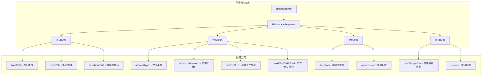
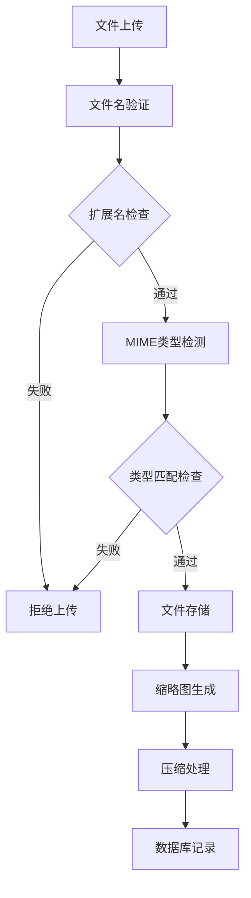
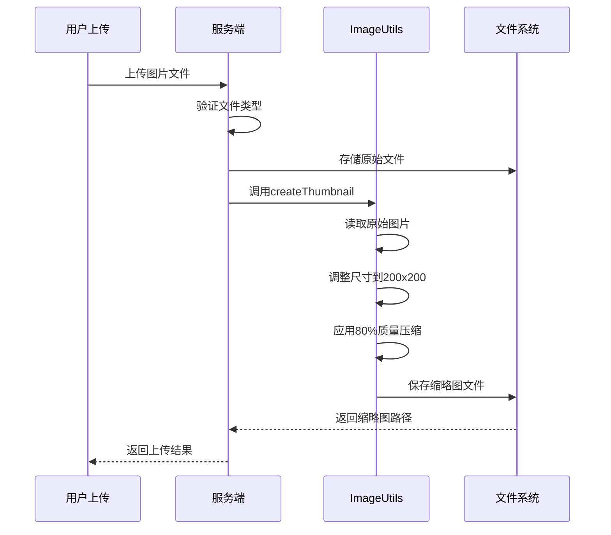
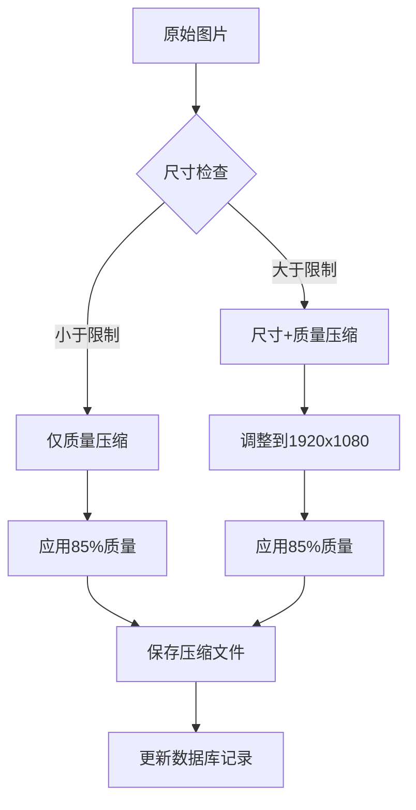
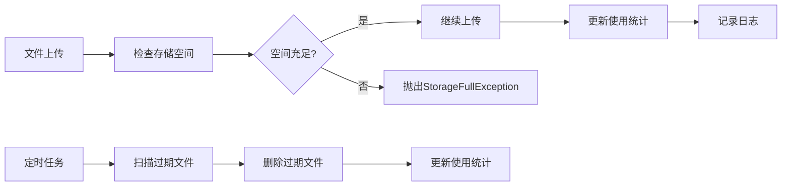

# 存储配置

<cite>
**本文档引用的文件**
- [FileStorageProperties.java](file://src/main/java/com/photo/config/FileStorageProperties.java)
- [application.yml](file://src/main/resources/application.yml)
- [FileStorageService.java](file://src/main/java/com/photo/service/FileStorageService.java)
- [ImageUtils.java](file://src/main/java/com/photo/util/ImageUtils.java)
- [FileUtils.java](file://src/main/java/com/photo/util/FileUtils.java)
- [PhotoService.java](file://src/main/java/com/photo/service/PhotoService.java)
- [PhotoController.java](file://src/main/java/com/photo/controller/PhotoController.java)
- [application-test.yml](file://src/test/resources/application-test.yml)
</cite>

## 目录
1. [简介](#简介)
2. [配置架构概览](#配置架构概览)
3. [核心配置项详解](#核心配置项详解)
4. [文件类型安全控制](#文件类型安全控制)
5. [上传行为控制](#上传行为控制)
6. [缩略图配置](#缩略图配置)
7. [图片压缩配置](#图片压缩配置)
8. [存储管理配置](#存储管理配置)
9. [实际配置示例](#实际配置示例)
10. [最佳实践](#最佳实践)
11. [故障排除指南](#故障排除指南)

## 简介

本文档详细介绍了基于Spring Boot的文件存储系统配置，重点关注`file.storage`命名空间下的所有配置选项。该系统提供了完整的文件上传、存储、管理和优化功能，包括文件类型安全控制、大小限制、缩略图生成和图片压缩等特性。

## 配置架构概览

系统采用分层配置架构，主要通过`FileStorageProperties`类和YAML配置文件实现配置管理：



**图表来源**
- [FileStorageProperties.java](file://src/main/java/com/photo/config/FileStorageProperties.java#L12-L94)
- [application.yml](file://src/main/resources/application.yml#L50-L99)

**章节来源**
- [FileStorageProperties.java](file://src/main/java/com/photo/config/FileStorageProperties.java#L1-L94)
- [application.yml](file://src/main/resources/application.yml#L50-L99)

## 核心配置项详解

### basePath（存储根目录）

`basePath`是文件存储系统的根目录，所有文件都将存储在这个目录下。

| 属性 | 默认值 | 说明 | 示例 |
|------|--------|------|------|
| 配置键 | `file.storage.base-path` | 基础存储路径 | `./uploads` |
| 类型 | String | 相对或绝对路径 | `/var/www/uploads` |
| 作用 | 文件存储根目录 | 所有文件的基础存储位置 | 包含原始文件、临时文件、缩略图 |

**配置示例：**
```yaml
file:
  storage:
    base-path: ./uploads
```

**最佳实践：**
- 使用相对路径时，确保应用程序有写入权限
- 生产环境中建议使用绝对路径
- 考虑使用专门的存储卷或网络文件系统

### tempPath（临时文件目录）

`tempPath`用于存储上传过程中的临时文件，特别是在多步骤处理过程中。

| 属性 | 默认值 | 说明 | 用途 |
|------|--------|------|------|
| 配置键 | `file.storage.temp-path` | 临时文件存储路径 | 上传过程中的中间文件 |
| 类型 | String | 目录路径 | 临时文件、缓存文件 |
| 作用域 | 上传期间 | 文件上传过程中的临时存储 | 防止并发上传冲突 |

**配置示例：**
```yaml
file:
  storage:
    temp-path: ./uploads/temp
```

**设计原理：**
- 与`basePath`保持相对独立，便于管理
- 上传完成后自动清理临时文件
- 支持高并发场景下的文件隔离

### thumbnailPath（缩略图目录）

`thumbnailPath`专门用于存储自动生成的缩略图文件。

| 属性 | 默认值 | 说明 | 特性 |
|------|--------|------|------|
| 配置键 | `file.storage.thumbnail-path` | 缩略图存储路径 | 自动生成的缩略图 |
| 类型 | String | 目录路径 | 缩略图专用存储 |
| 命名规则 | `thumb_{filename}` | 缩略图文件命名 | 与原文件关联 |

**配置示例：**
```yaml
file:
  storage:
    thumbnail-path: ./uploads/thumbnails
```

**技术实现：**
- 自动为每个上传的图片生成缩略图
- 缩略图文件名前缀为`thumb_`
- 支持多种图片格式的缩略图生成

**章节来源**
- [FileStorageProperties.java](file://src/main/java/com/photo/config/FileStorageProperties.java#L20-L30)
- [FileStorageService.java](file://src/main/java/com/photo/service/FileStorageService.java#L38-L46)

## 文件类型安全控制

系统通过`allowedTypes`和`allowedExtensions`两个维度实现双重文件类型安全控制。

### allowedTypes（允许的文件类型）

`allowedTypes`定义了允许上传的MIME类型列表。

| 配置项 | 默认值 | 支持格式 | 安全级别 |
|--------|--------|----------|----------|
| 配置键 | `file.storage.allowed-types` | MIME类型列表 | 高级安全控制 |
| 默认格式 | `image/jpeg, image/jpg, image/png, image/gif, image/bmp, image/webp` | 图片格式 | 基于文件内容检测 |
| 检测机制 | Apache Tika | 内容类型检测 | 防止文件类型伪装 |

**配置示例：**
```yaml
file:
  storage:
    allowed-types:
      - image/jpeg
      - image/jpg
      - image/png
      - image/gif
      - image/bmp
      - image/webp
```

### allowedExtensions（允许的文件扩展名）

`allowedExtensions`定义了允许上传的文件扩展名列表。

| 配置项 | 默认值 | 支持格式 | 安全级别 |
|--------|--------|----------|----------|
| 配置键 | `file.storage.allowed-extensions` | 文件扩展名列表 | 中级安全控制 |
| 默认格式 | `jpg, jpeg, png, gif, bmp, webp` | 图片扩展名 | 基于文件名检测 |
| 检测机制 | 文件名后缀匹配 | 扩展名验证 | 辅助安全措施 |

**配置示例：**
```yaml
file:
  storage:
    allowed-extensions:
      - jpg
      - jpeg
      - png
      - gif
      - bmp
      - webp
```

### 双重验证机制

系统实现了双重文件类型验证，确保文件的安全性：



**图表来源**
- [FileUtils.java](file://src/main/java/com/photo/util/FileUtils.java#L56-L67)
- [FileUtils.java](file://src/main/java/com/photo/util/FileUtils.java#L84-L98)

**安全特性：**
- 基于Apache Tika的内容类型检测
- 文件名扩展名验证
- 防止文件类型伪装攻击
- 支持多种图片格式

**章节来源**
- [FileUtils.java](file://src/main/java/com/photo/util/FileUtils.java#L26-L36)
- [FileUtils.java](file://src/main/java/com/photo/util/FileUtils.java#L84-L98)
- [application.yml](file://src/main/resources/application.yml#L59-L74)

## 上传行为控制

### maxFileSize（最大文件大小）

`maxFileSize`控制单个文件的最大上传大小，以字节为单位。

| 配置项 | 默认值 | 单位 | 说明 |
|--------|--------|------|------|
| 配置键 | `file.storage.max-file-size` | 字节 | 单个文件最大大小 |
| 默认值 | `10485760` | 字节 | 10MB |
| 推荐值 | 10MB-50MB | 字节 | 根据业务需求调整 |
| 验证时机 | 上传前 | 服务端验证 | 防止大文件占用带宽 |

**配置示例：**
```yaml
file:
  storage:
    max-file-size: 10485760  # 10MB
```

**技术实现：**
- Spring Boot内置的文件大小限制
- 服务端强制验证
- 上传前预检查

### maxFilesPerUpload（最大单次上传文件数）

`maxFilesPerUpload`限制单次上传请求中允许的最大文件数量。

| 配置项 | 默认值 | 说明 | 限制范围 |
|--------|--------|------|----------|
| 配置键 | `file.storage.max-files-per-upload` | 单次上传最大文件数 | 批量上传限制 |
| 默认值 | `10` | 最大文件数量 | 1-50个文件 |
| 验证逻辑 | 数量检查 | 批量上传验证 | 防止单次请求过大 |

**配置示例：**
```yaml
file:
  storage:
    max-files-per-upload: 10
```

**业务影响：**
- 影响用户体验：用户需要分批上传大量文件
- 性能考虑：避免单次请求处理过多文件
- 安全考虑：防止恶意批量上传攻击

**章节来源**
- [FileStorageProperties.java](file://src/main/java/com/photo/config/FileStorageProperties.java#L45-L50)
- [PhotoService.java](file://src/main/java/com/photo/service/PhotoService.java#L120-L122)

## 缩略图配置

### thumbnail配置项详解

缩略图配置通过`thumbnail`子配置项实现，控制缩略图的生成参数。

| 配置项 | 默认值 | 类型 | 说明 | 影响 |
|--------|--------|------|------|------|
| `width` | `200` | Integer | 缩略图宽度 | 图片显示尺寸 |
| `height` | `200` | Integer | 缩略图高度 | 图片显示尺寸 |
| `quality` | `0.8` | Double | 图片质量 | 文件大小和清晰度 |

**配置示例：**
```yaml
file:
  storage:
    thumbnail:
      width: 200
      height: 200
      quality: 0.8
```

### 缩略图生成流程



**图表来源**
- [FileStorageService.java](file://src/main/java/com/photo/service/FileStorageService.java#L146-L164)
- [ImageUtils.java](file://src/main/java/com/photo/util/ImageUtils.java#L53-L64)

### 缩略图质量控制

**质量参数说明：**
- `quality: 0.8` - 80%的质量保留率
- 文件大小：约原始文件的20%
- 清晰度：适合Web显示的清晰度
- 性能平衡：质量和文件大小的最佳平衡

**技术细节：**
- 使用Thumbnailator库进行缩略图生成
- 保持原始图片的宽高比
- 自动调整到指定尺寸
- 应用JPEG质量压缩

**章节来源**
- [FileStorageProperties.java](file://src/main/java/com/photo/config/FileStorageProperties.java#L73-L76)
- [FileStorageService.java](file://src/main/java/com/photo/service/FileStorageService.java#L146-L164)
- [ImageUtils.java](file://src/main/java/com/photo/util/ImageUtils.java#L53-L64)

## 图片压缩配置

### compression配置项详解

图片压缩配置通过`compression`子配置项实现，控制图片的自动压缩行为。

| 配置项 | 默认值 | 类型 | 说明 | 性能影响 |
|--------|--------|------|------|----------|
| `enabled` | `true` | Boolean | 是否启用压缩 | 性能开销 |
| `quality` | `0.85` | Double | 压缩质量 | 文件大小 |
| `maxWidth` | `1920` | Integer | 最大宽度 | 尺寸限制 |
| `maxHeight` | `1080` | Integer | 最大高度 | 尺寸限制 |

**配置示例：**
```yaml
file:
  storage:
    compression:
      enabled: true
      quality: 0.85
      max-width: 1920
      max-height: 1080
```

### 压缩算法流程



**图表来源**
- [ImageUtils.java](file://src/main/java/com/photo/util/ImageUtils.java#L70-L93)
- [FileStorageService.java](file://src/main/java/com/photo/service/FileStorageService.java#L170-L182)

### 压缩策略说明

**智能压缩算法：**
1. **尺寸优先**：当图片尺寸超过限制时，先调整尺寸
2. **质量保留**：无论是否调整尺寸，都应用质量压缩
3. **文件覆盖**：压缩后的文件直接替换原文件
4. **异常处理**：压缩失败不影响整体上传流程

**性能优化：**
- 异步处理：压缩过程不影响上传响应时间
- 错误容忍：压缩失败不会导致上传失败
- 内存管理：使用临时文件避免内存溢出

**章节来源**
- [FileStorageProperties.java](file://src/main/java/com/photo/config/FileStorageProperties.java#L80-L84)
- [ImageUtils.java](file://src/main/java/com/photo/util/ImageUtils.java#L70-L122)
- [FileStorageService.java](file://src/main/java/com/photo/service/FileStorageService.java#L170-L182)

## 存储管理配置

### maxStorageSize（存储容量限制）

`maxStorageSize`设置整个存储系统的最大容量限制。

| 配置项 | 默认值 | 单位 | 说明 | 监控 |
|--------|--------|------|------|------|
| 配置键 | `file.storage.max-storage-size` | 字节 | 存储容量上限 | 实时监控 |
| 默认值 | `10737418240` | 字节 | 10GB | 容量告警 |
| 验证时机 | 上传前 | 服务端检查 | 防止存储溢出 |

**配置示例：**
```yaml
file:
  storage:
    max-storage-size: 10737418240  # 10GB
```

### 定期清理配置

系统提供自动清理功能，定期删除过期文件。

| 配置项 | 默认值 | 说明 | 触发条件 |
|--------|--------|------|----------|
| `cleanup.enabled` | `true` | 是否启用清理 | 定时任务 |
| `cleanup.daysToKeep` | `30` | 保留天数 | 文件年龄 |
| `cleanup.cron` | `"0 0 2 * * ?"` | 清理计划 | 每日凌晨2点 |

**配置示例：**
```yaml
file:
  storage:
    cleanup:
      enabled: true
      days-to-keep: 30
      cron: "0 0 2 * * ?"
```

### 存储监控机制



**图表来源**
- [PhotoService.java](file://src/main/java/com/photo/service/PhotoService.java#L329-L335)
- [FileStorageService.java](file://src/main/java/com/photo/service/FileStorageService.java#L283-L297)

**章节来源**
- [FileStorageProperties.java](file://src/main/java/com/photo/config/FileStorageProperties.java#L65-L92)
- [PhotoService.java](file://src/main/java/com/photo/service/PhotoService.java#L329-L335)

## 实际配置示例

### 开发环境配置

适用于本地开发和测试环境的配置：

```yaml
# 开发环境存储配置
file:
  storage:
    # 基础路径
    base-path: ./uploads
    temp-path: ./uploads/temp
    thumbnail-path: ./uploads/thumbnails
    
    # 文件类型限制
    allowed-types:
      - image/jpeg
      - image/jpg
      - image/png
      - image/gif
      - image/bmp
      - image/webp
    allowed-extensions:
      - jpg
      - jpeg
      - png
      - gif
      - bmp
      - webp
    
    # 上传限制
    max-file-size: 10485760  # 10MB
    max-files-per-upload: 10
    
    # 缩略图配置
    thumbnail:
      width: 200
      height: 200
      quality: 0.8
    
    # 压缩配置
    compression:
      enabled: true
      quality: 0.85
      max-width: 1920
      max-height: 1080
    
    # 存储管理
    max-storage-size: 10737418240  # 10GB
    cleanup:
      enabled: true
      days-to-keep: 30
      cron: "0 0 2 * * ?"
```

### 生产环境配置

适用于生产环境的高性能配置：

```yaml
# 生产环境存储配置
file:
  storage:
    # 使用绝对路径
    base-path: /data/uploads
    temp-path: /data/uploads/temp
    thumbnail-path: /data/uploads/thumbnails
    
    # 严格的安全控制
    allowed-types:
      - image/jpeg
      - image/png
      - image/gif
    allowed-extensions:
      - jpg
      - jpeg
      - png
      - gif
    
    # 适中的上传限制
    max-file-size: 52428800  # 50MB
    max-files-per-upload: 5
    
    # 高质量缩略图
    thumbnail:
      width: 300
      height: 300
      quality: 0.9
    
    # 激进的压缩策略
    compression:
      enabled: true
      quality: 0.9
      max-width: 2560
      max-height: 1440
    
    # 大容量存储
    max-storage-size: 107374182400  # 100GB
    cleanup:
      enabled: true
      days-to-keep: 7
      cron: "0 0 3 * * ?"  # 每日凌晨3点清理
```

### 高性能配置

针对高并发场景优化的配置：

```yaml
# 高性能存储配置
file:
  storage:
    # 分布式存储路径
    base-path: /mnt/storage/uploads
    temp-path: /mnt/storage/temp
    thumbnail-path: /mnt/storage/thumbnails
    
    # 广泛的格式支持
    allowed-types:
      - image/jpeg
      - image/png
      - image/gif
      - image/webp
      - image/tiff
    allowed-extensions:
      - jpg
      - jpeg
      - png
      - gif
      - webp
      - tiff
    
    # 大文件支持
    max-file-size: 104857600  # 100MB
    max-files-per-upload: 20
    
    # 快速缩略图
    thumbnail:
      width: 150
      height: 150
      quality: 0.7
    
    # 轻量级压缩
    compression:
      enabled: true
      quality: 0.75
      max-width: 1280
      max-height: 720
    
    # 大容量存储
    max-storage-size: 1073741824000  # 1TB
    cleanup:
      enabled: true
      days-to-keep: 14
      cron: "0 0 1 * * ?"  # 每日凌晨1点清理
```

## 最佳实践

### 路径规划建议

**开发环境：**
```yaml
file:
  storage:
    base-path: ./uploads-dev
    temp-path: ./uploads-dev/temp
    thumbnail-path: ./uploads-dev/thumbnails
```

**生产环境：**
```yaml
file:
  storage:
    base-path: /var/lib/photo-service/uploads
    temp-path: /var/lib/photo-service/tmp
    thumbnail-path: /var/lib/photo-service/thumbs
```

### 性能优化建议

**1. 存储路径优化**
- 使用SSD存储提高I/O性能
- 考虑使用分布式文件系统
- 设置适当的文件权限

**2. 缓存策略**
- 启用缩略图缓存
- 使用CDN加速静态资源
- 实现智能缓存失效

**3. 并发处理**
- 合理设置`max-files-per-upload`
- 实现异步处理机制
- 监控系统资源使用

### 安全配置建议

**1. 文件类型控制**
```yaml
file:
  storage:
    allowed-types:
      - image/jpeg
      - image/png
    allowed-extensions:
      - jpg
      - jpeg
      - png
```

**2. 大小限制**
```yaml
file:
  storage:
    max-file-size: 5242880  # 5MB
    max-files-per-upload: 3
```

**3. 定期清理**
```yaml
file:
  storage:
    cleanup:
      enabled: true
      days-to-keep: 7
      cron: "0 0 4 * * ?"  # 每日凌晨4点清理
```

### 监控和告警

**关键指标监控：**
- 存储使用率
- 上传成功率
- 缩略图生成时间
- 压缩处理效率

**告警阈值：**
- 存储使用率 > 80%
- 上传失败率 > 5%
- 缩略图生成超时
- 压缩处理异常

## 故障排除指南

### 常见问题及解决方案

**1. 文件上传失败**

**症状：** 文件上传返回错误
**可能原因：**
- 文件大小超过限制
- 文件类型不被允许
- 存储空间不足

**解决方案：**
```yaml
# 检查配置
file:
  storage:
    max-file-size: 10485760  # 确认大小限制
    allowed-types:           # 确认类型列表
      - image/jpeg
      - image/png
```

**2. 缩略图生成失败**

**症状：** 缩略图无法生成
**可能原因：**
- 图片格式不支持
- 存储权限问题
- 内存不足

**解决方案：**
```yaml
# 检查权限
chmod 755 /path/to/thumbnails

# 增加内存限制
java -Xmx2g -jar app.jar
```

**3. 存储空间不足**

**症状：** 抛出StorageFullException
**解决方案：**
```yaml
# 增加存储限制
file:
  storage:
    max-storage-size: 21474836480  # 20GB

# 或者启用自动清理
file:
  storage:
    cleanup:
      enabled: true
      days-to-keep: 7
```

### 性能调优

**1. 上传性能优化**
```yaml
# 减少并发文件数
file:
  storage:
    max-files-per-upload: 5

# 增加临时文件空间
file:
  storage:
    temp-path: /fast-ssd/temp
```

**2. 缩略图性能优化**
```yaml
# 降低质量以提高速度
file:
  storage:
    thumbnail:
      quality: 0.6
      width: 100
      height: 100
```

**3. 压缩性能优化**
```yaml
# 减少压缩质量
file:
  storage:
    compression:
      quality: 0.7
      max-width: 1024
      max-height: 768
```

### 日志分析

**关键日志模式：**
```bash
# 存储空间检查
grep "checkStorageSpace" application.log

# 文件类型验证
grep "validateFileType" application.log

# 缩略图生成
grep "createThumbnail" application.log

# 压缩处理
grep "compressImage" application.log
```

**监控脚本示例：**
```bash
#!/bin/bash
# 存储使用情况监控
df -h /path/to/uploads | tail -n 1 | awk '{print $5}' | sed 's/%//'
```

**章节来源**
- [FileStorageService.java](file://src/main/java/com/photo/service/FileStorageService.java#L38-L53)
- [PhotoService.java](file://src/main/java/com/photo/service/PhotoService.java#L329-L335)
- [application.yml](file://src/main/resources/application.yml#L50-L99)