# 安全配置

<cite>
**本文档引用的文件**
- [SecurityConfig.java](file://src/main/java/com/photo/config/SecurityConfig.java)
- [SecurityProperties.java](file://src/main/java/com/photo/config/SecurityProperties.java)
- [application.yml](file://src/main/resources/application.yml)
- [SecurityUtils.java](file://src/main/java/com/photo/util/SecurityUtils.java)
- [PhotoController.java](file://src/main/java/com/photo/controller/PhotoController.java)
- [SecurityUtilsTest.java](file://src/test/java/com/photo/util/SecurityUtilsTest.java)
- [application-test.yml](file://src/test/resources/application-test.yml)
</cite>

## 目录
1. [简介](#简介)
2. [项目结构](#项目结构)
3. [核心组件](#核心组件)
4. [架构概览](#架构概览)
5. [详细组件分析](#详细组件分析)
6. [依赖关系分析](#依赖关系分析)
7. [性能考虑](#性能考虑)
8. [故障排除指南](#故障排除指南)
9. [结论](#结论)

## 简介

本文档详细介绍了基于Spring Boot的图片上传系统中的安全配置机制。该系统采用多层次的安全防护策略，包括防盗链机制、Token认证、CORS跨域控制以及各种输入验证和防护措施。通过`security`命名空间下的配置，系统实现了全面的安全保护，确保应用程序免受常见的Web攻击威胁。

## 项目结构

该安全配置模块位于`src/main/java/com/photo/config/`目录下，主要包含以下关键文件：

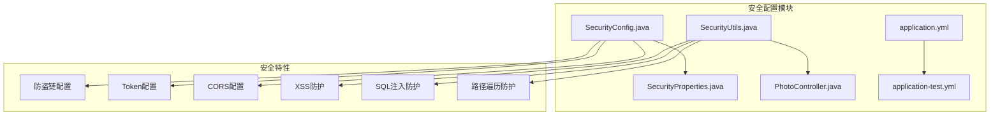

**图表来源**
- [SecurityConfig.java](file://src/main/java/com/photo/config/SecurityConfig.java#L1-L71)
- [SecurityProperties.java](file://src/main/java/com/photo/config/SecurityProperties.java#L1-L53)

**章节来源**
- [SecurityConfig.java](file://src/main/java/com/photo/config/SecurityConfig.java#L1-L71)
- [SecurityProperties.java](file://src/main/java/com/photo/config/SecurityProperties.java#L1-L53)

## 核心组件

### 安全配置属性类

系统通过`SecurityProperties`类统一管理所有安全相关的配置参数，采用Spring Boot的`@ConfigurationProperties`注解实现配置绑定。

### 安全配置类

`SecurityConfig`类负责Spring Security的核心配置，包括CSRF禁用、CORS配置、会话管理策略等。

### 安全工具类

`SecurityUtils`提供了多种安全验证功能，包括Referer验证、IP地址获取、XSS防护、SQL注入防护等。

**章节来源**
- [SecurityProperties.java](file://src/main/java/com/photo/config/SecurityProperties.java#L12-L53)
- [SecurityConfig.java](file://src/main/java/com/photo/config/SecurityConfig.java#L21-L71)
- [SecurityUtils.java](file://src/main/java/com/photo/util/SecurityUtils.java#L1-L167)

## 架构概览

系统安全架构采用分层防护模式，从网络层到应用层提供全方位的安全保护：

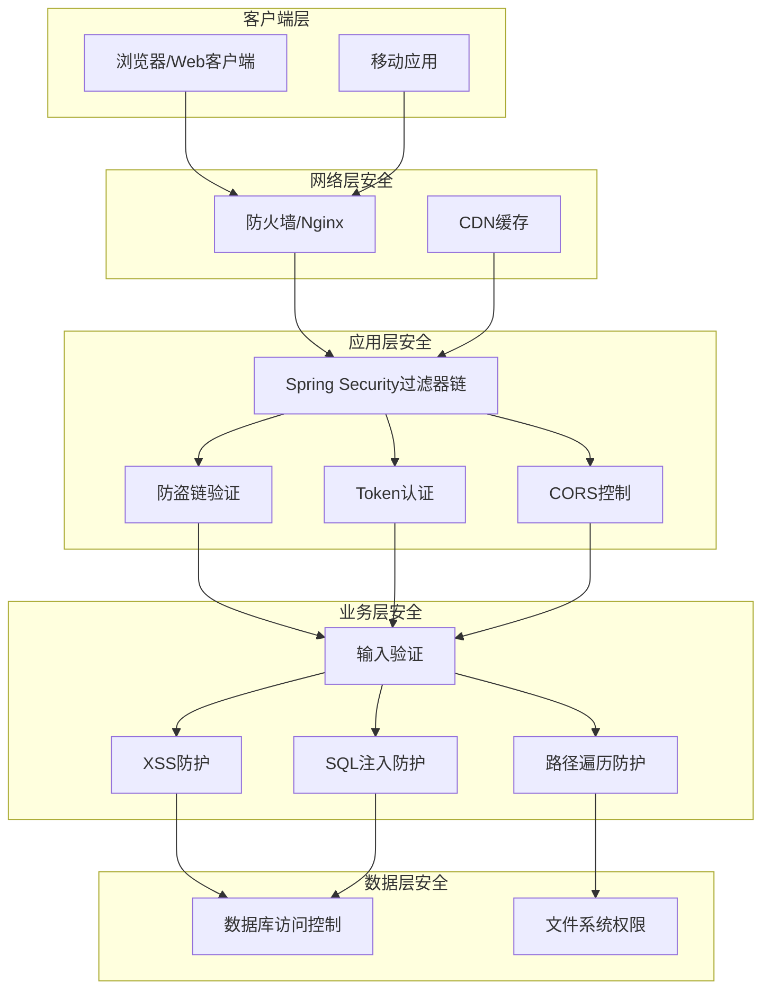

**图表来源**
- [SecurityConfig.java](file://src/main/java/com/photo/config/SecurityConfig.java#L26-L46)
- [SecurityUtils.java](file://src/main/java/com/photo/util/SecurityUtils.java#L59-L95)

## 详细组件分析

### Referer配置 - 防盗链机制

防盗链机制是防止资源被其他网站非法引用的重要安全措施。

#### 配置结构

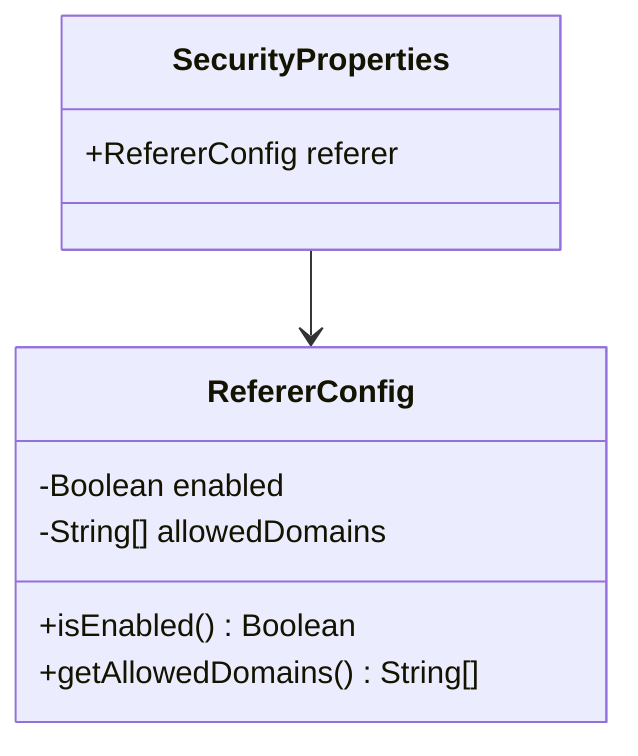

**图表来源**
- [SecurityProperties.java](file://src/main/java/com/photo/config/SecurityProperties.java#L32-L36)

#### 配置参数详解

| 参数 | 类型 | 默认值 | 描述 | 安全意义 |
|------|------|--------|------|----------|
| `enabled` | Boolean | true | 启用/禁用防盗链功能 | 提供灵活的安全控制开关 |
| `allowedDomains` | List<String> | [] | 允许的域名白名单 | 限制资源只能被指定域名访问 |

#### 实现机制

防盗链验证通过`SecurityUtils.validateReferer()`方法实现：

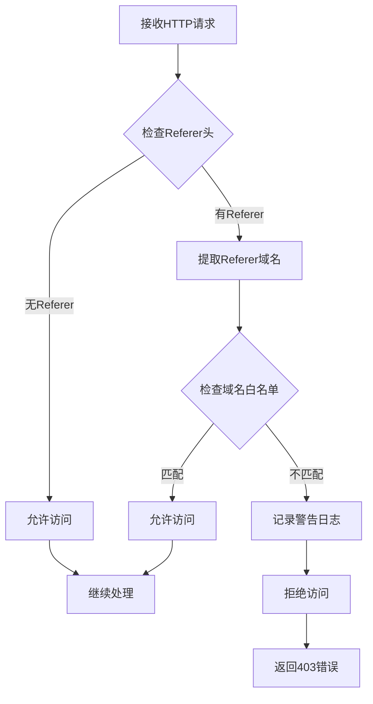

**图表来源**
- [SecurityUtils.java](file://src/main/java/com/photo/util/SecurityUtils.java#L62-L78)

#### 生产环境配置建议

```yaml
security:
  referer:
    enabled: true
    allowed-domains:
      - "https://yourdomain.com"
      - "https://www.yourdomain.com"
      - "https://app.yourdomain.com"
```

**章节来源**
- [SecurityProperties.java](file://src/main/java/com/photo/config/SecurityProperties.java#L32-L36)
- [SecurityUtils.java](file://src/main/java/com/photo/util/SecurityUtils.java#L62-L78)
- [PhotoController.java](file://src/main/java/com/photo/controller/PhotoController.java#L93-L96)

### Token配置 - 密钥管理

Token配置负责管理系统的身份认证密钥和过期时间设置。

#### 配置结构

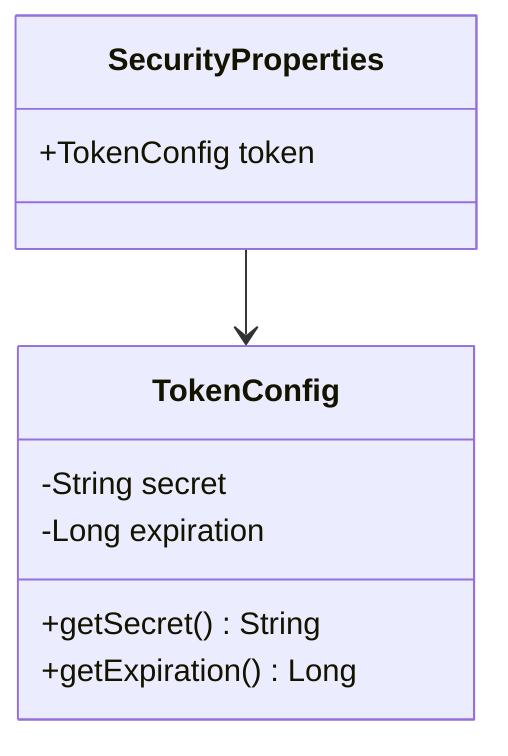

**图表来源**
- [SecurityProperties.java](file://src/main/java/com/photo/config/SecurityProperties.java#L38-L42)

#### 配置参数详解

| 参数 | 类型 | 默认值 | 描述 | 安全影响 |
|------|------|--------|------|----------|
| `secret` | String | "your-secret-key" | JWT签名密钥 | 密钥泄露导致认证失效 |
| `expiration` | Long | 86400L (24小时) | Token过期时间(秒) | 过短影响用户体验，过长增加风险 |

#### 密钥安全管理要求

1. **密钥强度要求**：
   - 长度至少32字符
   - 包含字母、数字和特殊字符
   - 使用强随机算法生成

2. **密钥存储要求**：
   - 不要硬编码在配置文件中
   - 使用环境变量或密钥管理服务
   - 定期轮换密钥

3. **过期时间设置原则**：
   - 开发环境：1小时
   - 测试环境：6小时  
   - 生产环境：24小时
   - 敏感操作：1小时

#### Token生成与验证流程

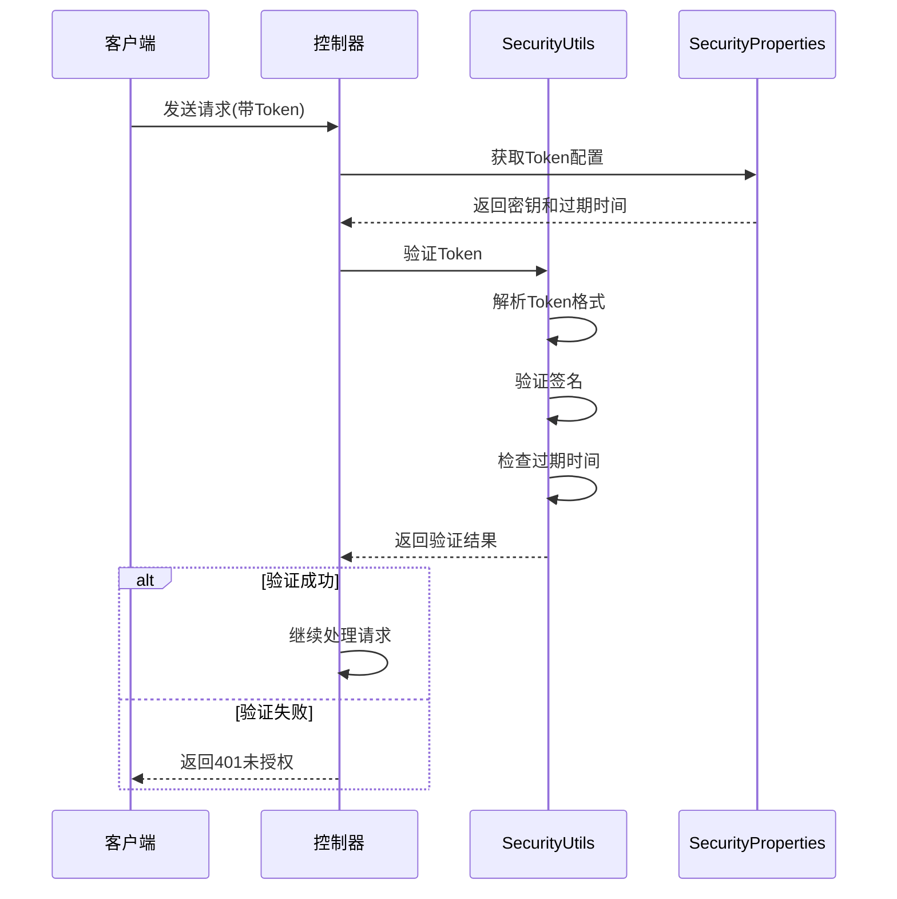

**图表来源**
- [SecurityUtils.java](file://src/main/java/com/photo/util/SecurityUtils.java#L100-L111)

**章节来源**
- [SecurityProperties.java](file://src/main/java/com/photo/config/SecurityProperties.java#L38-L42)
- [SecurityUtils.java](file://src/main/java/com/photo/util/SecurityUtils.java#L100-L111)

### CORS配置 - 跨域控制

CORS（跨域资源共享）配置严格控制哪些外部域可以访问API资源。

#### 配置结构

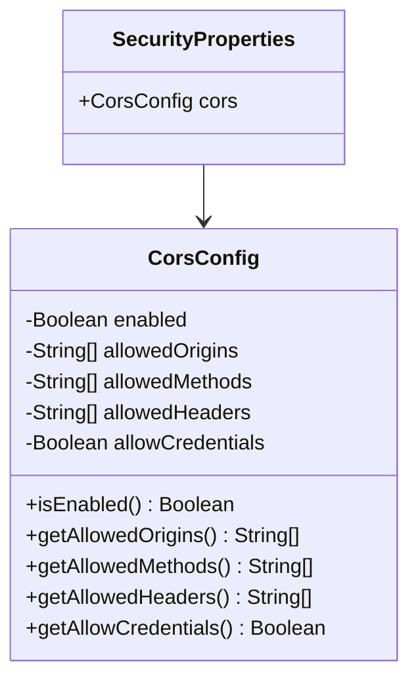

**图表来源**
- [SecurityProperties.java](file://src/main/java/com/photo/config/SecurityProperties.java#L44-L51)

#### 配置参数详解

| 参数 | 类型 | 默认值 | 描述 | 安全考虑 |
|------|------|--------|------|----------|
| `enabled` | Boolean | true | 启用CORS功能 | 生产环境建议启用 |
| `allowedOrigins` | List<String> | [] | 允许的源域名列表 | 必须精确指定，避免通配符 |
| `allowedMethods` | List<String> | [] | 允许的HTTP方法 | 仅开放必需的方法 |
| `allowedHeaders` | List<String> | [] | 允许的请求头 | 限制不必要的敏感头 |
| `allowCredentials` | Boolean | true | 是否支持凭据传输 | 谨慎启用，可能带来CSRF风险 |

#### CORS安全配置最佳实践

```yaml
security:
  cors:
    enabled: true
    allowed-origins:
      - "https://yourdomain.com"
      - "https://app.yourdomain.com"
    allowed-methods:
      - "GET"
      - "POST"
      - "PUT"
      - "DELETE"
    allowed-headers:
      - "Content-Type"
      - "Authorization"
      - "X-Requested-With"
    allow-credentials: false  # 生产环境建议禁用
```

#### CORS验证流程

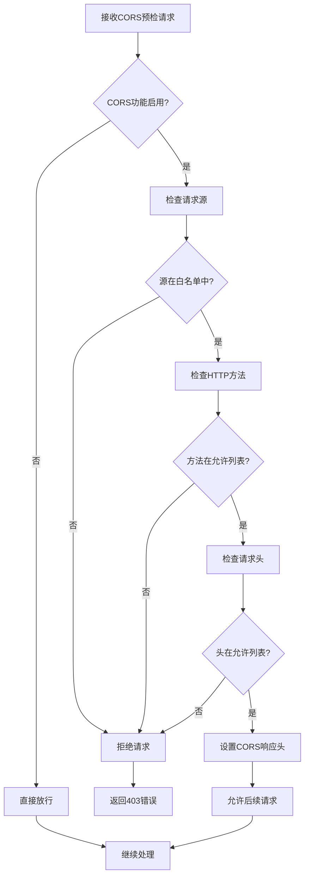

**图表来源**
- [SecurityConfig.java](file://src/main/java/com/photo/config/SecurityConfig.java#L50-L64)

**章节来源**
- [SecurityProperties.java](file://src/main/java/com/photo/config/SecurityProperties.java#L44-L51)
- [SecurityConfig.java](file://src/main/java/com/photo/config/SecurityConfig.java#L50-L64)

### 输入验证与防护机制

系统提供了多层次的输入验证和安全防护机制。

#### XSS防护

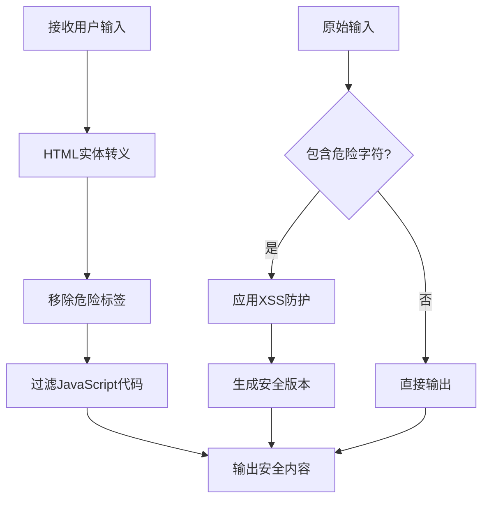

**图表来源**
- [SecurityUtils.java](file://src/main/java/com/photo/util/SecurityUtils.java#L20-L25)

#### SQL注入防护

系统实现了简单的SQL注入防护机制：

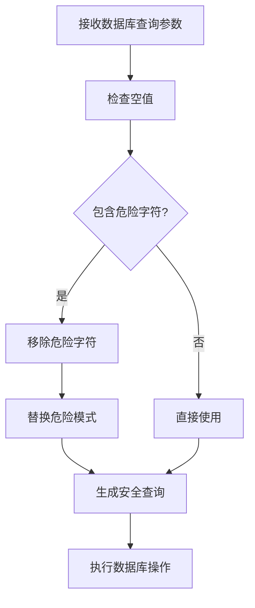

**图表来源**
- [SecurityUtils.java](file://src/main/java/com/photo/util/SecurityUtils.java#L116-L128)

#### 路径遍历防护

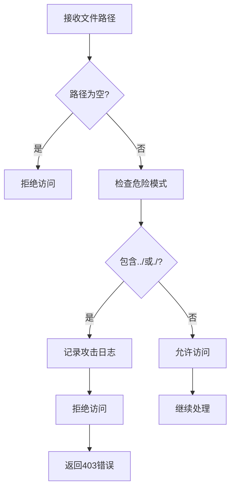

**图表来源**
- [SecurityUtils.java](file://src/main/java/com/photo/util/SecurityUtils.java#L133-L146)

**章节来源**
- [SecurityUtils.java](file://src/main/java/com/photo/util/SecurityUtils.java#L20-L167)

## 依赖关系分析

系统安全配置各组件之间的依赖关系如下：

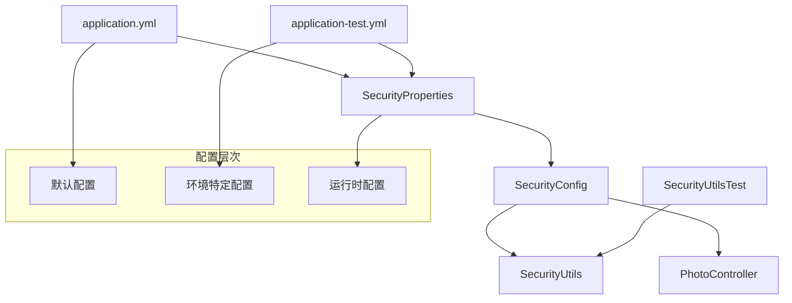

**图表来源**
- [SecurityProperties.java](file://src/main/java/com/photo/config/SecurityProperties.java#L14-L15)
- [SecurityConfig.java](file://src/main/java/com/photo/config/SecurityConfig.java#L23-L24)

**章节来源**
- [SecurityProperties.java](file://src/main/java/com/photo/config/SecurityProperties.java#L14-L15)
- [SecurityConfig.java](file://src/main/java/com/photo/config/SecurityConfig.java#L23-L24)

## 性能考虑

### 防盗链性能优化

1. **缓存Referer验证结果**：对于相同域名的请求，可以缓存验证结果
2. **简化域名匹配逻辑**：使用字符串包含而非复杂的正则表达式
3. **批量域名验证**：一次性验证多个域名，减少循环次数

### Token验证性能

1. **本地验证**：避免远程密钥服务器验证
2. **过期时间预检查**：在解析JWT之前先检查过期时间
3. **内存缓存**：缓存频繁使用的Token信息

### CORS性能优化

1. **最小化预检请求**：合理配置允许的源和方法
2. **静态CORS配置**：避免动态生成CORS配置
3. **浏览器缓存**：利用浏览器的CORS缓存机制

## 故障排除指南

### 常见问题及解决方案

#### 1. 防盗链误报

**症状**：合法域名的请求被拒绝
**原因**：域名匹配逻辑过于严格
**解决方案**：
- 检查allowedDomains配置
- 验证Referer头格式
- 查看日志中的具体拒绝原因

#### 2. CORS跨域失败

**症状**：浏览器显示CORS错误
**原因**：CORS配置不正确
**解决方案**：
- 检查allowedOrigins配置
- 验证HTTP方法和头是否在允许列表中
- 确认allowCredentials设置

#### 3. Token验证失败

**症状**：认证请求返回401错误
**原因**：Token格式或签名问题
**解决方案**：
- 验证Token格式
- 检查密钥配置
- 确认过期时间设置

#### 4. 安全工具类异常

**症状**：安全验证方法抛出异常
**原因**：输入参数格式不正确
**解决方案**：
- 验证输入参数的有效性
- 检查空值和边界情况
- 查看详细的异常堆栈信息

**章节来源**
- [SecurityUtilsTest.java](file://src/test/java/com/photo/util/SecurityUtilsTest.java#L1-L157)

## 结论

该安全配置系统提供了全面而灵活的安全防护机制，涵盖了从网络层到应用层的多维度安全保护。通过合理的配置和最佳实践的应用，可以有效防范常见的Web攻击威胁，同时保持良好的性能和可用性。

### 关键安全特性总结

1. **防盗链机制**：通过Referer验证防止资源被非法引用
2. **Token认证**：基于JWT的无状态认证机制
3. **CORS控制**：严格的跨域访问控制
4. **输入验证**：多层次的输入过滤和验证
5. **防护机制**：XSS、SQL注入、路径遍历等攻击防护

### 生产环境部署建议

1. **密钥管理**：使用专业的密钥管理服务
2. **配置隔离**：开发、测试、生产环境配置分离
3. **监控告警**：建立安全事件监控和告警机制
4. **定期审计**：定期审查和更新安全配置
5. **应急响应**：制定完善的安全事件应急响应预案

通过持续的安全加固和监控，可以确保系统的长期安全稳定运行。