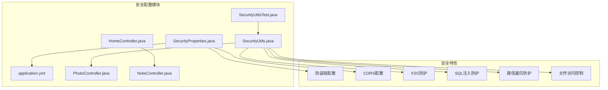
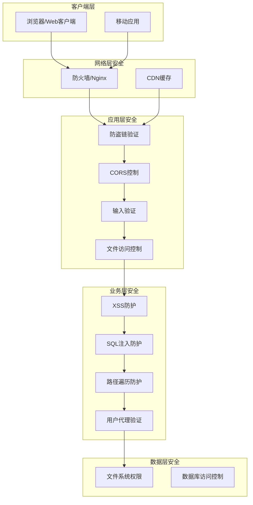
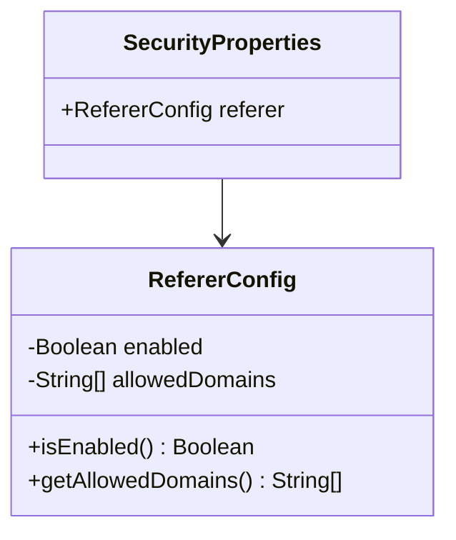
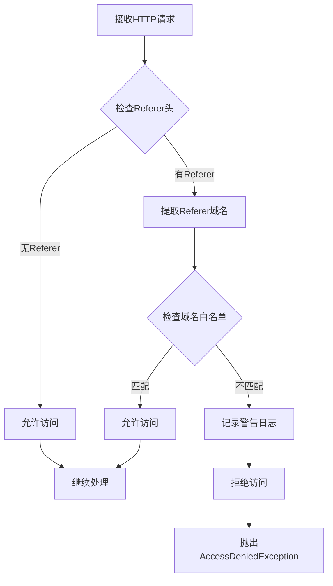
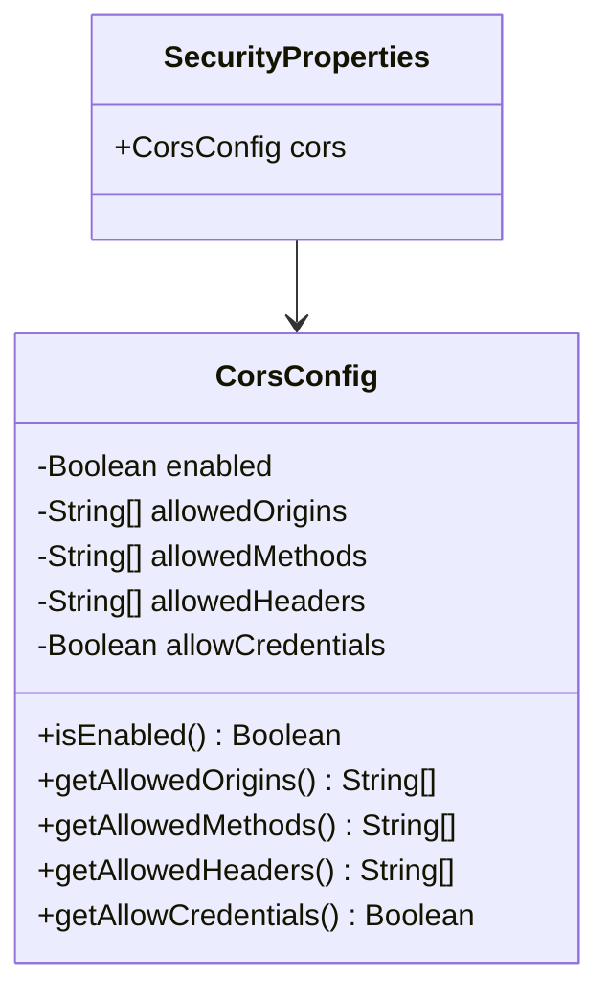
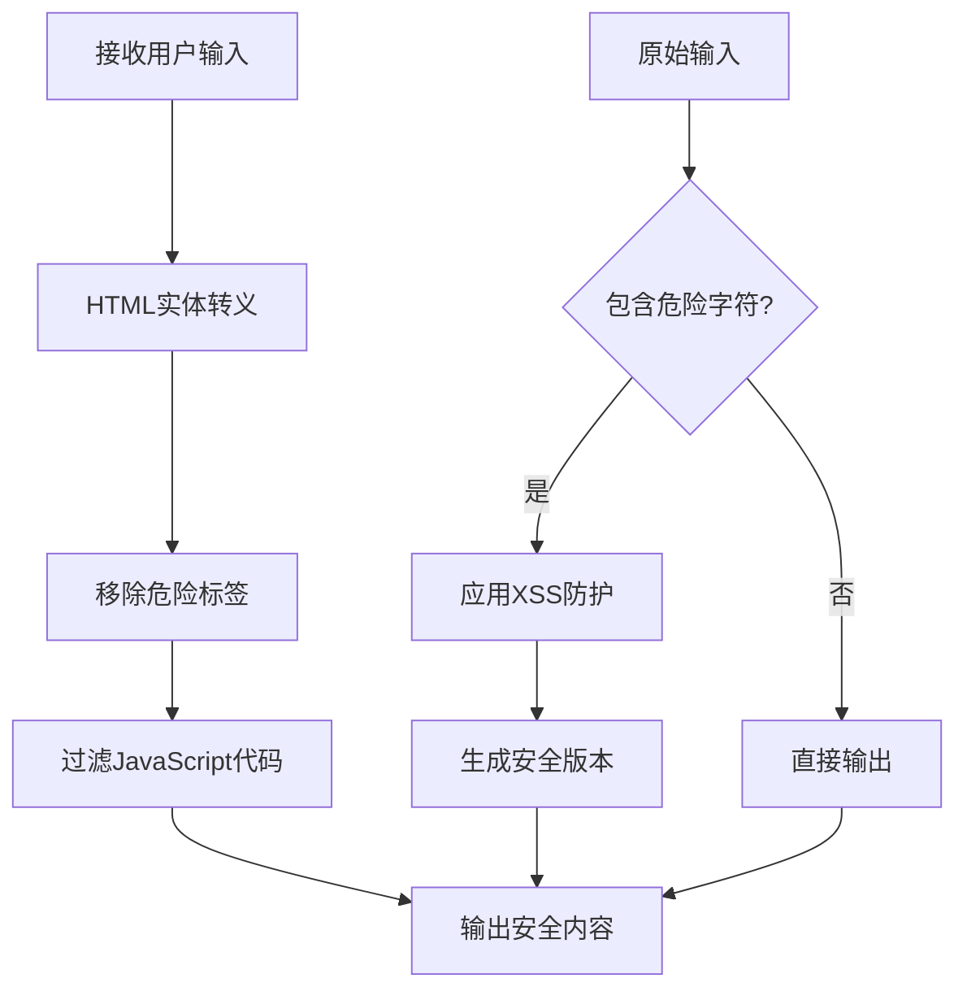
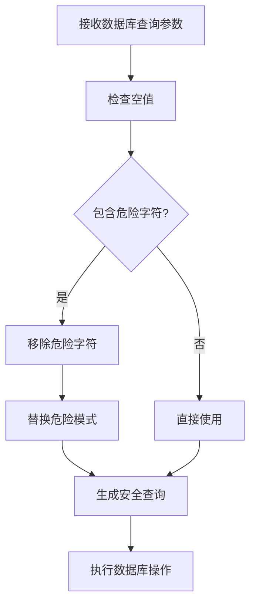
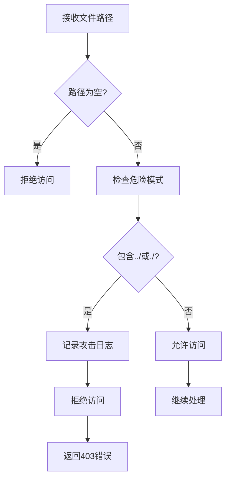
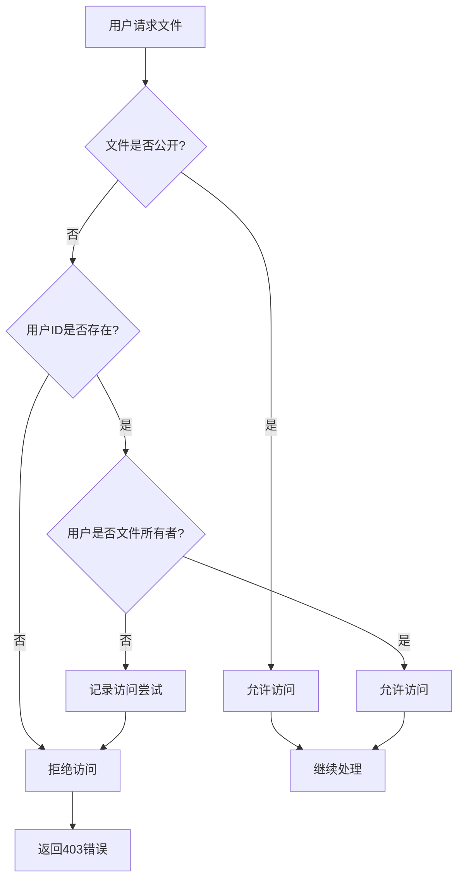
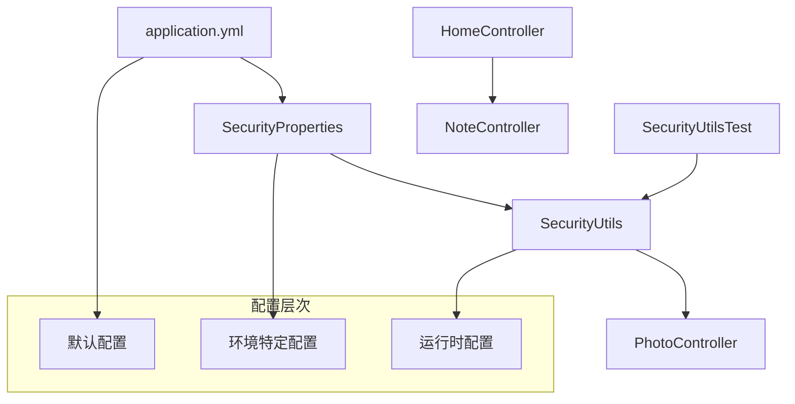

# 安全配置

<cite>
**本文档引用的文件**
- [SecurityProperties.java](file://src/main/java/com/photo/config/SecurityProperties.java)
- [SecurityUtils.java](file://src/main/java/com/photo/util/SecurityUtils.java)
- [application.yml](file://src/main/resources/application.yml)
- [PhotoController.java](file://src/main/java/com/photo/controller/PhotoController.java)
- [SecurityUtilsTest.java](file://src/test/java/com/photo/util/SecurityUtilsTest.java)
- [HomeController.java](file://src/main/java/com/photo/controller/HomeController.java)
- [NoteController.java](file://src/main/java/com/photo/controller/NoteController.java)
- [pom.xml](file://pom.xml)
</cite>

## 更新摘要
**所做更改**
- 更新了Spring Security框架已完全移除的现状
- 重新设计了安全架构以反映无认证架构
- 更新了防盗链、CORS和输入验证机制的实现方式
- 移除了Spring Security相关的配置和组件
- 更新了最佳实践建议以适应新的安全模型

## 目录
1. [简介](#简介)
2. [项目结构](#项目结构)
3. [核心组件](#核心组件)
4. [架构概览](#架构概览)
5. [详细组件分析](#详细组件分析)
6. [依赖关系分析](#依赖关系分析)
7. [性能考虑](#性能考虑)
8. [故障排除指南](#故障排除指南)
9. [结论](#结论)

## 简介

本文档详细介绍了基于Spring Boot的图片上传系统中的安全配置机制。该系统采用无认证的轻量级安全防护策略，包括防盗链机制、CORS跨域控制以及各种输入验证和防护措施。通过`security`命名空间下的配置，系统实现了基础的安全保护，确保应用程序免受常见的Web攻击威胁。

**重要更新**：Spring Security框架已被完全移除，系统现已采用无认证架构，所有安全验证均通过自定义工具类和配置实现。

## 项目结构

该安全配置模块位于`src/main/java/com/photo/config/`和`src/main/java/com/photo/util/`目录下，主要包含以下关键文件：


```mermaid
graph TB
subgraph "安全配置模块"
A[SecurityProperties.java] --> B[application.yml]
C[SecurityUtils.java] --> D[PhotoController.java]
E[HomeController.java] --> F[NoteController.java]
G[SecurityUtilsTest.java] --> C
end
subgraph "安全特性"
H[防盗链配置]
I[CORS配置]
J[XSS防护]
K[SQL注入防护]
L[路径遍历防护]
M[文件访问控制]
end
A --> H
A --> I
C --> J
C --> K
C --> L
C --> M
```

**图表来源**
- [SecurityProperties.java:1-68](file://src/main/java/com/photo/config/SecurityProperties.java#L1-L68)
- [SecurityUtils.java:1-167](file://src/main/java/com/photo/util/SecurityUtils.java#L1-L167)

**章节来源**
- [SecurityProperties.java:1-68](file://src/main/java/com/photo/config/SecurityProperties.java#L1-L68)
- [SecurityUtils.java:1-167](file://src/main/java/com/photo/util/SecurityUtils.java#L1-L167)

## 核心组件

### 安全配置属性类

系统通过`SecurityProperties`类统一管理所有安全相关的配置参数，采用Spring Boot的`@ConfigurationProperties`注解实现配置绑定。

### 安全工具类

`SecurityUtils`提供了多种安全验证功能，包括Referer验证、IP地址获取、XSS防护、SQL注入防护、路径遍历防护和文件访问控制等。

### 控制器集成

`PhotoController`集成了安全验证逻辑，在关键操作前进行安全检查。

**章节来源**
- [SecurityProperties.java:14-68](file://src/main/java/com/photo/config/SecurityProperties.java#L14-L68)
- [SecurityUtils.java:14-167](file://src/main/java/com/photo/util/SecurityUtils.java#L14-L167)
- [PhotoController.java:34-316](file://src/main/java/com/photo/controller/PhotoController.java#L34-L316)

## 架构概览

系统安全架构采用简化的无认证防护模式，从网络层到应用层提供基础的安全保护：


```mermaid
graph TD
subgraph "客户端层"
A[浏览器/Web客户端]
B[移动应用]
end
subgraph "网络层安全"
C[防火墙/Nginx]
D[CDN缓存]
end
subgraph "应用层安全"
E[防盗链验证]
F[CORS控制]
G[输入验证]
H[文件访问控制]
end
subgraph "业务层安全"
I[XSS防护]
J[SQL注入防护]
K[路径遍历防护]
L[用户代理验证]
end
subgraph "数据层安全"
M[文件系统权限]
N[数据库访问控制]
end
A --> C
B --> C
C --> E
D --> E
E --> F
F --> G
G --> H
H --> I
I --> J
J --> K
K --> L
L --> M
```

**图表来源**
- [SecurityUtils.java:62-95](file://src/main/java/com/photo/util/SecurityUtils.java#L62-L95)
- [PhotoController.java:93-97](file://src/main/java/com/photo/controller/PhotoController.java#L93-L97)

## 详细组件分析

### Referer配置 - 防盗链机制

防盗链机制是防止资源被其他网站非法引用的重要安全措施。

#### 配置结构


```mermaid
classDiagram
class SecurityProperties {
+RefererConfig referer
}
class RefererConfig {
-Boolean enabled
-String[] allowedDomains
+isEnabled() Boolean
+getAllowedDomains() String[]
}
SecurityProperties --> RefererConfig
```

**图表来源**
- [SecurityProperties.java:32-51](file://src/main/java/com/photo/config/SecurityProperties.java#L32-L51)

#### 配置参数详解

| 参数 | 类型 | 默认值 | 描述 | 安全意义 |
|------|------|--------|------|----------|
| `enabled` | Boolean | true | 启用/禁用防盗链功能 | 提供灵活的安全控制开关 |
| `allowedDomains` | List<String> | [] | 允许的域名白名单 | 限制资源只能被指定域名访问 |

#### 实现机制

防盗链验证通过`SecurityUtils.validateReferer()`方法实现：


```mermaid
flowchart TD
A[接收HTTP请求] --> B{检查Referer头}
B --> |无Referer| C[允许访问]
B --> |有Referer| D[提取Referer域名]
D --> E{检查域名白名单}
E --> |匹配| F[允许访问]
E --> |不匹配| G[记录警告日志]
G --> H[拒绝访问]
C --> I[继续处理]
F --> I
H --> J[抛出AccessDeniedException]
```

**图表来源**
- [SecurityUtils.java:62-79](file://src/main/java/com/photo/util/SecurityUtils.java#L62-L79)

#### 生产环境配置建议

```yaml
security:
  referer:
    enabled: true
    allowed-domains:
      - "https://yourdomain.com"
      - "https://www.yourdomain.com"
      - "https://app.yourdomain.com"
```

**章节来源**
- [SecurityProperties.java:32-51](file://src/main/java/com/photo/config/SecurityProperties.java#L32-L51)
- [SecurityUtils.java:62-79](file://src/main/java/com/photo/util/SecurityUtils.java#L62-L79)
- [PhotoController.java:93-97](file://src/main/java/com/photo/controller/PhotoController.java#L93-L97)

### CORS配置 - 跨域控制

CORS（跨域资源共享）配置严格控制哪些外部域可以访问API资源。

#### 配置结构


```mermaid
classDiagram
class SecurityProperties {
+CorsConfig cors
}
class CorsConfig {
-Boolean enabled
-String[] allowedOrigins
-String[] allowedMethods
-String[] allowedHeaders
-Boolean allowCredentials
+isEnabled() Boolean
+getAllowedOrigins() String[]
+getAllowedMethods() String[]
+getAllowedHeaders() String[]
+getAllowCredentials() Boolean
}
SecurityProperties --> CorsConfig
```

**图表来源**
- [SecurityProperties.java:59-66](file://src/main/java/com/photo/config/SecurityProperties.java#L59-L66)

#### 配置参数详解

| 参数 | 类型 | 默认值 | 描述 | 安全考虑 |
|------|------|--------|------|----------|
| `enabled` | Boolean | true | 启用CORS功能 | 生产环境建议启用 |
| `allowedOrigins` | List<String> | [] | 允许的源域名列表 | 必须精确指定，避免通配符 |
| `allowedMethods` | List<String> | [] | 允许的HTTP方法 | 仅开放必需的方法 |
| `allowedHeaders` | List<String> | [] | 允许的请求头 | 限制不必要的敏感头 |
| `allowCredentials` | Boolean | true | 是否支持凭据传输 | 谨慎启用，可能带来CSRF风险 |

#### CORS安全配置最佳实践

```yaml
security:
  cors:
    enabled: true
    allowed-origins:
      - "https://yourdomain.com"
      - "https://app.yourdomain.com"
    allowed-methods:
      - "GET"
      - "POST"
      - "PUT"
      - "DELETE"
    allowed-headers:
      - "Content-Type"
      - "Authorization"
      - "X-Requested-With"
    allow-credentials: false  # 生产环境建议禁用
```

**章节来源**
- [SecurityProperties.java:59-66](file://src/main/java/com/photo/config/SecurityProperties.java#L59-L66)
- [application.yml:131-144](file://src/main/resources/application.yml#L131-L144)

### 输入验证与防护机制

系统提供了多层次的输入验证和安全防护机制。

#### XSS防护


```mermaid
flowchart TD
A[接收用户输入] --> B[HTML实体转义]
B --> C[移除危险标签]
C --> D[过滤JavaScript代码]
D --> E[输出安全内容]
F[原始输入] --> G{包含危险字符?}
G --> |是| H[应用XSS防护]
G --> |否| I[直接输出]
H --> J[生成安全版本]
J --> E
I --> E
```

**图表来源**
- [SecurityUtils.java:18-25](file://src/main/java/com/photo/util/SecurityUtils.java#L18-L25)

#### SQL注入防护

系统实现了简单的SQL注入防护机制：


```mermaid
flowchart TD
A[接收数据库查询参数] --> B[检查空值]
B --> C{包含危险字符?}
C --> |是| D[移除危险字符]
C --> |否| E[直接使用]
D --> F[替换危险模式]
F --> G[生成安全查询]
E --> G
G --> H[执行数据库操作]
```

**图表来源**
- [SecurityUtils.java:115-128](file://src/main/java/com/photo/util/SecurityUtils.java#L115-L128)

#### 路径遍历防护


```mermaid
flowchart TD
A[接收文件路径] --> B{路径为空?}
B --> |是| C[拒绝访问]
B --> |否| D[检查危险模式]
D --> E{包含../或./?}
E --> |是| F[记录攻击日志]
E --> |否| G[允许访问]
F --> H[拒绝访问]
G --> I[继续处理]
H --> J[返回403错误]
```

**图表来源**
- [SecurityUtils.java:133-147](file://src/main/java/com/photo/util/SecurityUtils.java#L133-L147)

#### 文件访问控制


```mermaid
flowchart TD
A[用户请求文件] --> B{文件是否公开?}
B --> |是| C[允许访问]
B --> |否| D{用户ID是否存在?}
D --> |否| E[拒绝访问]
D --> |是| F{用户是否文件所有者?}
F --> |是| G[允许访问]
F --> |否| H[记录访问尝试]
H --> E
C --> I[继续处理]
G --> I
E --> J[返回403错误]
```

**图表来源**
- [SecurityUtils.java:152-165](file://src/main/java/com/photo/util/SecurityUtils.java#L152-L165)

**章节来源**
- [SecurityUtils.java:18-167](file://src/main/java/com/photo/util/SecurityUtils.java#L18-L167)

## 依赖关系分析

系统安全配置各组件之间的依赖关系如下：


```mermaid
graph TD
A[application.yml] --> B[SecurityProperties]
B --> C[SecurityUtils]
C --> D[PhotoController]
E[SecurityUtilsTest] --> C
F[HomeController] --> G[NoteController]
subgraph "配置层次"
H[默认配置]
I[环境特定配置]
J[运行时配置]
end
A --> H
B --> I
C --> J
```

**图表来源**
- [SecurityProperties.java:14-15](file://src/main/java/com/photo/config/SecurityProperties.java#L14-L15)
- [PhotoController.java:43-44](file://src/main/java/com/photo/controller/PhotoController.java#L43-L44)

**章节来源**
- [SecurityProperties.java:14-15](file://src/main/java/com/photo/config/SecurityProperties.java#L14-L15)
- [PhotoController.java:43-44](file://src/main/java/com/photo/controller/PhotoController.java#L43-L44)

## 性能考虑

### 防盗链性能优化

1. **缓存Referer验证结果**：对于相同域名的请求，可以缓存验证结果
2. **简化域名匹配逻辑**：使用字符串包含而非复杂的正则表达式
3. **批量域名验证**：一次性验证多个域名，减少循环次数

### CORS性能优化

1. **最小化预检请求**：合理配置允许的源和方法
2. **静态CORS配置**：避免动态生成CORS配置
3. **浏览器缓存**：利用浏览器的CORS缓存机制

### 输入验证性能

1. **延迟验证**：只在必要时进行深度验证
2. **缓存安全检查结果**：避免重复计算
3. **批量处理**：对多个参数进行统一验证

## 故障排除指南

### 常见问题及解决方案

#### 1. 防盗链误报

**症状**：合法域名的请求被拒绝
**原因**：域名匹配逻辑过于严格
**解决方案**：
- 检查allowedDomains配置
- 验证Referer头格式
- 查看日志中的具体拒绝原因

#### 2. CORS跨域失败

**症状**：浏览器显示CORS错误
**原因**：CORS配置不正确
**解决方案**：
- 检查allowedOrigins配置
- 验证HTTP方法和头是否在允许列表中
- 确认allowCredentials设置

#### 3. 文件访问权限问题

**症状**：用户无法访问私有文件
**原因**：文件访问控制逻辑
**解决方案**：
- 验证用户ID和文件所有者关系
- 检查文件的公开状态
- 查看访问日志

#### 4. 安全工具类异常

**症状**：安全验证方法抛出异常
**原因**：输入参数格式不正确
**解决方案**：
- 验证输入参数的有效性
- 检查空值和边界情况
- 查看详细的异常堆栈信息

**章节来源**
- [SecurityUtilsTest.java:1-162](file://src/test/java/com/photo/util/SecurityUtilsTest.java#L1-L162)

## 结论

该安全配置系统提供了简化的无认证安全防护机制，通过合理的配置和最佳实践的应用，可以有效防范常见的Web攻击威胁，同时保持良好的性能和可用性。

### 关键安全特性总结

1. **防盗链机制**：通过Referer验证防止资源被非法引用
2. **CORS控制**：严格的跨域访问控制
3. **输入验证**：多层次的输入过滤和验证
4. **防护机制**：XSS、SQL注入、路径遍历等攻击防护
5. **文件访问控制**：基于用户身份的文件权限管理

### 生产环境部署建议

1. **配置管理**：使用环境变量管理敏感配置
2. **监控告警**：建立安全事件监控和告警机制
3. **定期审计**：定期审查和更新安全配置
4. **应急响应**：制定完善的安全事件应急响应预案
5. **安全加固**：根据实际需求添加额外的安全层

通过持续的安全加固和监控，可以确保系统的长期安全稳定运行。