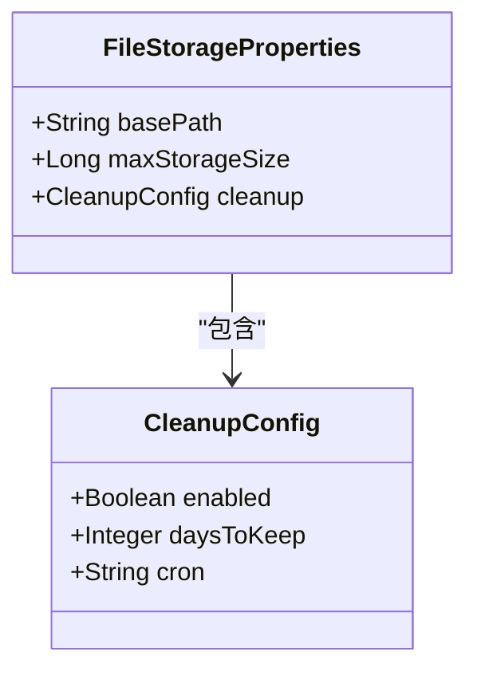
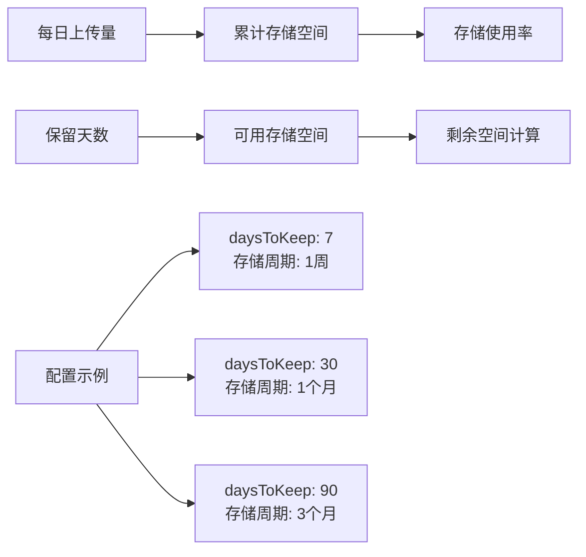
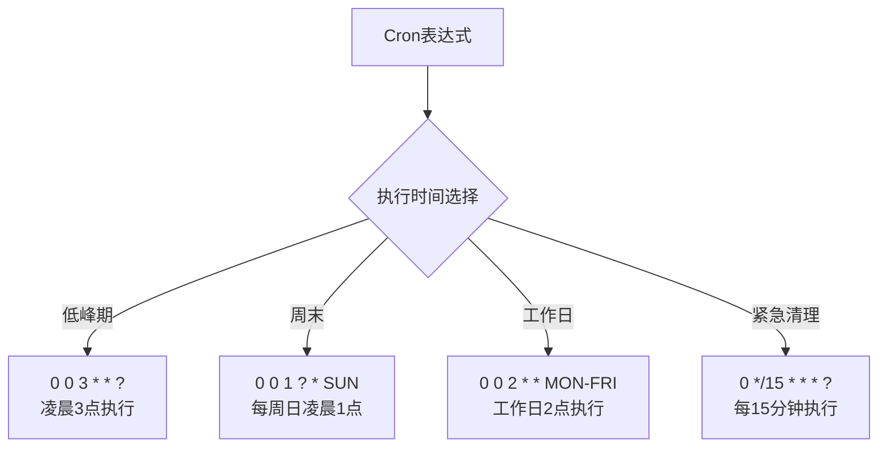
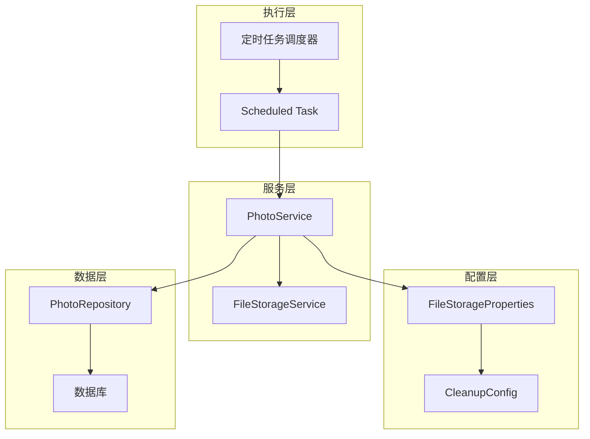
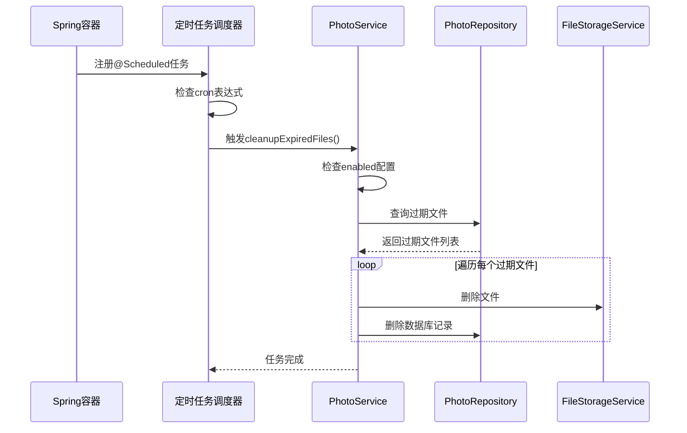
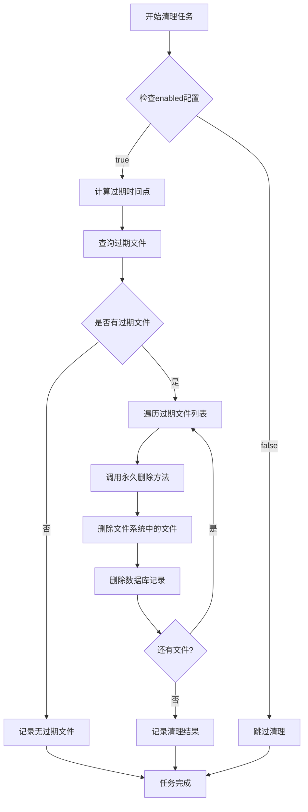
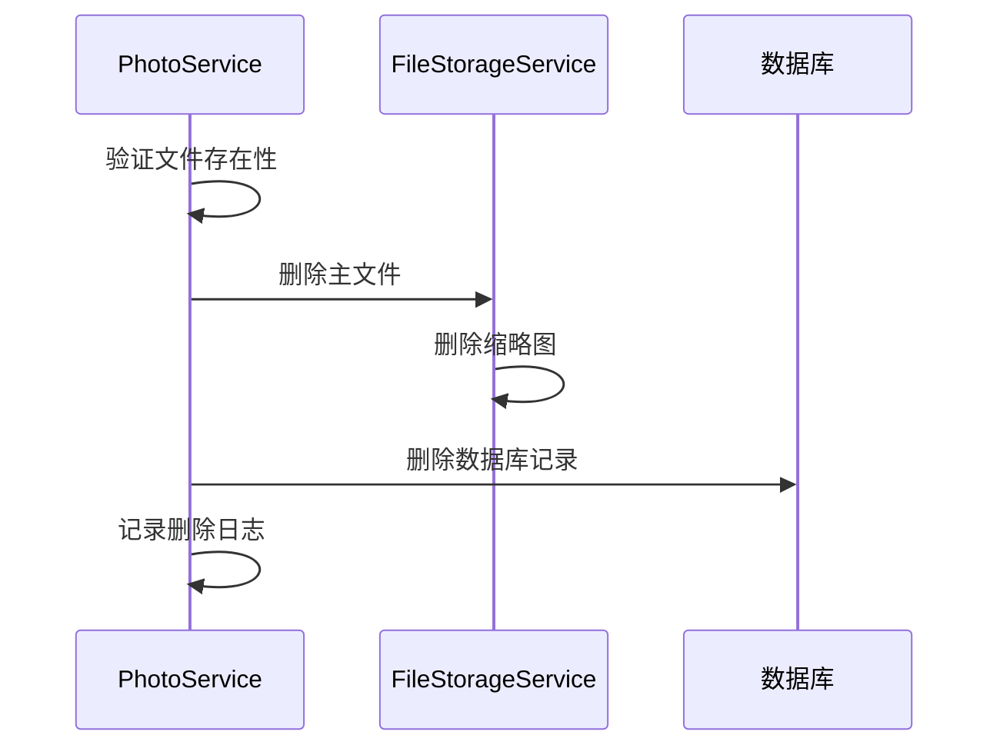

# 清理策略配置

<cite>
**本文档中引用的文件**
- [FileStorageProperties.java](file://src/main/java/com/photo/config/FileStorageProperties.java)
- [application.yml](file://src/main/resources/application.yml)
- [PhotoService.java](file://src/main/java/com/photo/service/PhotoService.java)
- [PhotoRepository.java](file://src/main/java/com/photo/repository/PhotoRepository.java)
- [FileStorageService.java](file://src/main/java/com/photo/service/FileStorageService.java)
- [FileUtils.java](file://src/main/java/com/photo/util/FileUtils.java)
- [README.md](file://README.md)
</cite>

## 目录
1. [简介](#简介)
2. [配置结构概述](#配置结构概述)
3. [核心配置参数详解](#核心配置参数详解)
4. [清理策略架构](#清理策略架构)
5. [定时任务调度机制](#定时任务调度机制)
6. [清理逻辑实现](#清理逻辑实现)
7. [配置示例与最佳实践](#配置示例与最佳实践)
8. [故障排除指南](#故障排除指南)
9. [总结](#总结)

## 简介

文件存储系统的定期清理策略是确保系统长期稳定运行的重要机制。本文档详细介绍了基于Spring Boot应用的文件存储清理配置，重点解析`file.storage.cleanup`配置项的工作原理、调度机制以及实际应用场景。

清理策略通过智能的时间窗口管理和自动化任务调度，实现了对过期文件的有效管理，同时避免了手动维护带来的复杂性和错误风险。

## 配置结构概述

清理策略配置位于`FileStorageProperties`类中，采用嵌套配置结构设计，提供了灵活且可扩展的配置选项。



**图表来源**
- [FileStorageProperties.java](file://src/main/java/com/photo/config/FileStorageProperties.java#L88-L92)

**章节来源**
- [FileStorageProperties.java](file://src/main/java/com/photo/config/FileStorageProperties.java#L68-L92)
- [application.yml](file://src/main/resources/application.yml#L92-L98)

## 核心配置参数详解

### enabled参数：控制清理任务启停

`enabled`参数是一个布尔值配置项，用于全局控制定期清理功能的启用状态。

| 配置项 | 类型 | 默认值 | 说明 |
|--------|------|--------|------|
| enabled | Boolean | true | 控制定期清理任务的启停状态 |

**工作原理**：
- 当设置为`true`时，系统会在应用启动后注册并激活清理定时任务
- 当设置为`false`时，系统会跳过清理任务的执行，但保留配置结构
- 此参数提供了灵活的运维控制能力，可在需要时临时禁用清理功能

**实际效果**：
- 启用状态下：系统每分钟检查一次是否需要执行清理任务
- 禁用状态下：所有清理相关的日志输出和任务调度都被跳过

### daysToKeep参数：文件保留期限配置

`daysToKeep`参数定义了文件在系统中保留的天数，直接影响存储空间的管理和清理频率。

| 配置项 | 类型 | 默认值 | 有效范围 | 说明 |
|--------|------|--------|----------|------|
| daysToKeep | Integer | 30 | 1-365 | 文件保留天数 |

**存储空间影响分析**：



**图表来源**
- [PhotoService.java](file://src/main/java/com/photo/service/PhotoService.java#L284-L285)

**配置建议**：
- **短期存储场景**：7-14天（如临时文件处理）
- **标准存储场景**：30天（如个人照片备份）
- **长期存储场景**：90-365天（如重要文档归档）

### cron表达式：调度机制详解

默认的Cron表达式`"0 0 2 * * ?"`定义了清理任务的执行时间表，采用标准的Unix Cron语法。

| 字段 | 取值范围 | 说明 | 示例值 |
|------|----------|------|--------|
| 秒 | 0-59 | 秒数 | 0 |
| 分 | 0-59 | 分钟数 | 0 |
| 时 | 0-23 | 小时数 | 2 |
| 日 | 1-31 | 日期 | * |
| 月 | 1-12 | 月份 | * |
| 星期 | 1-7 | 星期几 | ? |

**调度时间分析**：
- **执行时间**：每天凌晨2:00:00
- **执行频率**：每日一次
- **执行条件**：仅在`enabled=true`时执行
- **执行逻辑**：基于数据库记录而非文件系统直接扫描

**自定义调度示例**：



**章节来源**
- [PhotoService.java](file://src/main/java/com/photo/service/PhotoService.java#L276-L276)
- [application.yml](file://src/main/resources/application.yml#L98-L98)

## 清理策略架构

清理策略采用分层架构设计，确保功能的模块化和可维护性。



**图表来源**
- [PhotoService.java](file://src/main/java/com/photo/service/PhotoService.java#L276-L299)
- [FileStorageProperties.java](file://src/main/java/com/photo/config/FileStorageProperties.java#L88-L92)

**架构特点**：
- **配置驱动**：所有清理行为由配置参数控制
- **事务安全**：清理操作在事务边界内执行
- **资源隔离**：文件系统操作与数据库操作分离
- **日志追踪**：完整的清理过程日志记录

**章节来源**
- [PhotoService.java](file://src/main/java/com/photo/service/PhotoService.java#L276-L299)
- [FileStorageService.java](file://src/main/java/com/photo/service/FileStorageService.java#L280-L299)

## 定时任务调度机制

### Spring Scheduled注解机制

清理任务通过Spring的`@Scheduled`注解实现，支持多种调度模式。



**图表来源**
- [PhotoService.java](file://src/main/java/com/photo/service/PhotoService.java#L276-L299)

### 调度特性分析

| 特性 | 实现方式 | 说明 |
|------|----------|------|
| 异步执行 | Spring Task Scheduler | 任务在独立线程中执行 |
| 错过执行处理 | 默认忽略 | 不会累积错过的任务 |
| 并发控制 | 单实例执行 | 确保任务不会重复执行 |
| 异常处理 | 日志记录 | 任务失败不影响其他功能 |

**章节来源**
- [PhotoService.java](file://src/main/java/com/photo/service/PhotoService.java#L276-L299)

## 清理逻辑实现

### 过期文件识别算法

清理逻辑基于数据库记录的时间戳进行文件过期判断，而非直接扫描文件系统。



**图表来源**
- [PhotoService.java](file://src/main/java/com/photo/service/PhotoService.java#L278-L298)
- [PhotoRepository.java](file://src/main/java/com/photo/repository/PhotoRepository.java#L69-L70)

### 永久删除流程

永久删除操作确保文件在文件系统和数据库中都被彻底移除。



**图表来源**
- [PhotoService.java](file://src/main/java/com/photo/service/PhotoService.java#L210-L234)

### 错误处理机制

清理过程中遇到的错误采用渐进式处理策略：

| 错误类型 | 处理策略 | 影响范围 |
|----------|----------|----------|
| 文件不存在 | 跳过处理 | 单个文件 |
| 权限不足 | 记录错误日志 | 单个文件 |
| 数据库连接失败 | 抛出异常中断 | 整个清理批次 |
| 磁盘空间不足 | 记录警告 | 单个文件 |

**章节来源**
- [PhotoService.java](file://src/main/java/com/photo/service/PhotoService.java#L210-L234)
- [PhotoRepository.java](file://src/main/java/com/photo/repository/PhotoRepository.java#L69-L70)

## 配置示例与最佳实践

### 基础配置示例

```yaml
file:
  storage:
    cleanup:
      enabled: true              # 启用定期清理
      days-to-keep: 30           # 保留30天
      cron: "0 0 2 * * ?"       # 每天凌晨2点执行
```

### 场景化配置方案

#### 1. 开发环境配置
```yaml
file:
  storage:
    cleanup:
      enabled: true
      days-to-keep: 7           # 开发期间快速清理
      cron: "0 */15 * * * ?"   # 每15分钟测试
```

#### 2. 生产环境配置
```yaml
file:
  storage:
    cleanup:
      enabled: true
      days-to-keep: 90          # 长期保存重要文件
      cron: "0 0 3 * * ?"      # 避开业务高峰期
```

#### 3. 高频访问场景配置
```yaml
file:
  storage:
    cleanup:
      enabled: true
      days-to-keep: 14          # 热点文件短期保存
      cron: "0 0 1 * * ?"      # 更频繁的清理
```

### 性能优化配置

#### 避免高峰期执行
```yaml
# 避开业务高峰期的清理时间
file:
  storage:
    cleanup:
      cron: "0 0 4 * * ?"      # 凌晨4点执行
```

#### 资源敏感配置
```yaml
# 资源受限环境下的优化
file:
  storage:
    cleanup:
      days-to-keep: 15          # 减少保留时间
      cron: "0 0 5 * * ?"      # 更晚的执行时间
```

### 监控与告警配置

```yaml
# 结合日志级别进行监控
logging:
  level:
    com.photo.service.PhotoService: INFO
  pattern:
    console: "%d{yyyy-MM-dd HH:mm:ss} [%thread] %-5level %logger{36} - %msg%n"
```

**最佳实践总结**：

1. **配置验证**：部署前验证cron表达式的正确性
2. **测试环境**：在测试环境中充分验证清理逻辑
3. **监控告警**：建立清理任务执行状态的监控机制
4. **回滚准备**：保留清理前的数据备份
5. **性能评估**：定期评估清理任务对系统性能的影响

**章节来源**
- [application.yml](file://src/main/resources/application.yml#L92-L98)
- [README.md](file://README.md#L192-L200)

## 故障排除指南

### 常见问题诊断

#### 1. 清理任务未执行

**症状**：清理任务配置了但没有执行任何清理操作

**排查步骤**：
1. 检查`enabled`参数是否为`true`
2. 验证cron表达式语法是否正确
3. 确认应用是否正常启动定时任务
4. 检查数据库中是否存在过期记录

**解决方案**：
```yaml
# 确保配置正确
file:
  storage:
    cleanup:
      enabled: true
      cron: "0 0 2 * * ?"
```

#### 2. 清理速度过慢

**症状**：清理任务执行时间过长，影响系统性能

**优化措施**：
- 增加`daysToKeep`值减少清理频率
- 调整cron执行时间为系统低峰期
- 优化数据库索引提升查询性能

#### 3. 文件删除不完整

**症状**：数据库记录被删除但文件系统中仍有残留

**排查方法**：
1. 检查文件权限设置
2. 验证文件路径配置
3. 确认磁盘空间充足

### 日志分析技巧

清理任务的日志输出提供了重要的调试信息：

```text
INFO  c.p.s.PhotoService - 开始执行定期清理任务
INFO  c.p.s.PhotoService - 找到 15 个过期文件
ERROR c.p.s.PhotoService - 清理文件失败: 12345
INFO  c.p.s.PhotoService - 定期清理任务完成
```

**关键指标解读**：
- **找到的过期文件数量**：反映清理效果
- **清理失败的数量**：指示潜在问题
- **任务执行时间**：评估性能影响

**章节来源**
- [PhotoService.java](file://src/main/java/com/photo/service/PhotoService.java#L278-L298)

## 总结

文件存储系统的清理策略配置是一个多层次、多维度的管理系统。通过合理配置`file.storage.cleanup`参数，可以实现：

### 核心价值

1. **自动化管理**：减少人工干预，降低运维成本
2. **存储优化**：动态调整存储空间使用效率
3. **业务连续性**：确保系统长期稳定运行
4. **性能保障**：避免存储空间耗尽导致的服务中断

### 配置要点回顾

- **enabled参数**：控制清理功能的启停，提供灵活的运维控制
- **daysToKeep参数**：定义文件保留期限，平衡存储成本和业务需求
- **cron表达式**：精确控制清理任务的执行时机，避开业务高峰期

### 实施建议

1. **渐进式部署**：从保守配置开始，逐步调整到最优值
2. **监控先行**：建立完善的监控体系，及时发现和解决问题
3. **文档维护**：保持配置文档的更新，便于团队协作
4. **定期评估**：根据业务发展调整清理策略配置

通过深入理解和正确实施清理策略配置，可以构建一个高效、可靠、自动化的文件存储管理系统，为业务发展提供坚实的基础设施支撑。