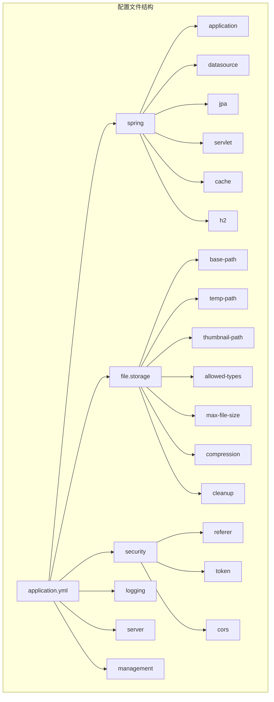
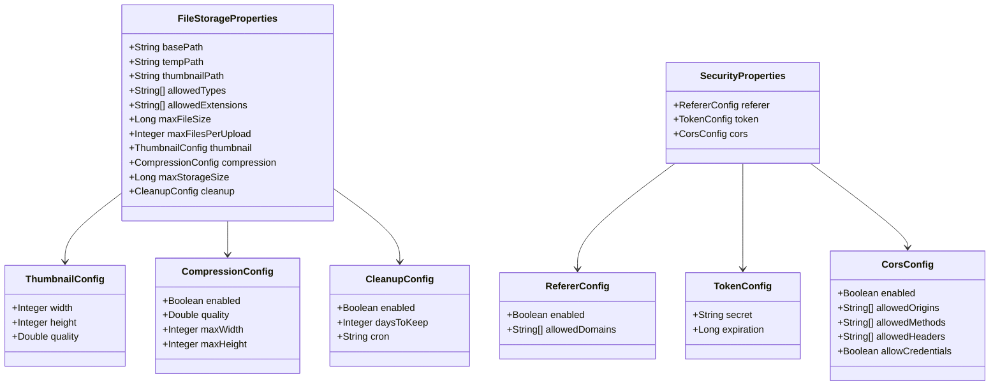
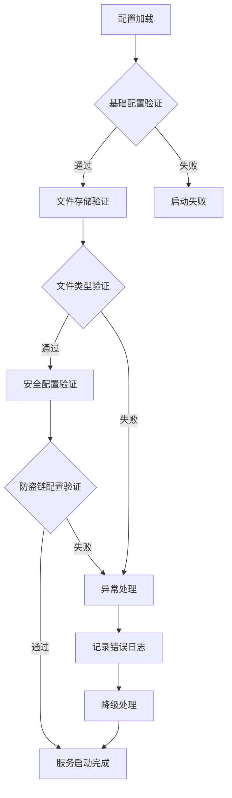
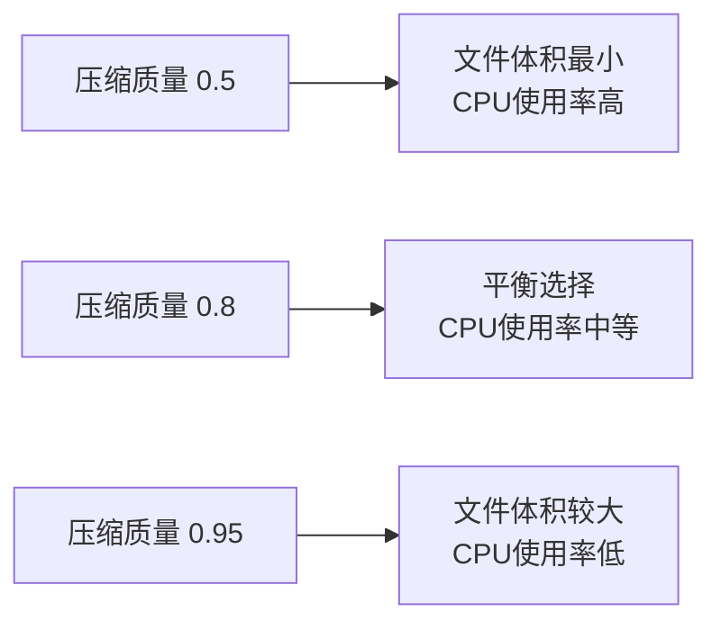
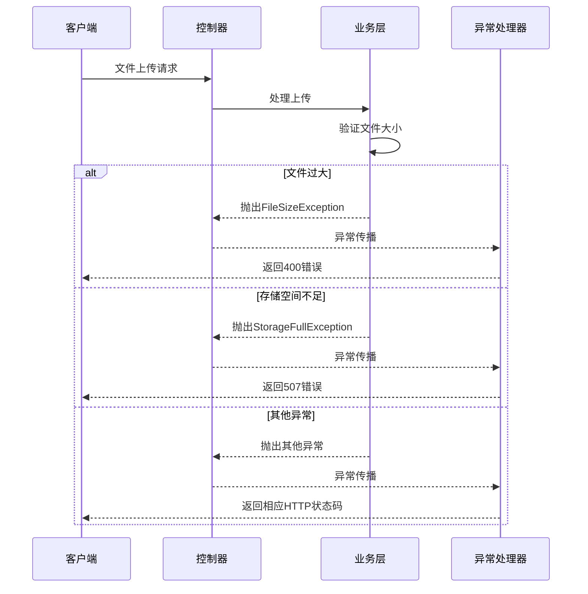

# 配置指南

<cite>
**本文档中引用的文件**
- [application.yml](file://src/main/resources/application.yml)
- [FileStorageProperties.java](file://src/main/java/com/photo/config/FileStorageProperties.java)
- [SecurityProperties.java](file://src/main/java/com/photo/config/SecurityProperties.java)
- [FileStorageService.java](file://src/main/java/com/photo/service/FileStorageService.java)
- [ImageUtils.java](file://src/main/java/com/photo/util/ImageUtils.java)
- [FileUtils.java](file://src/main/java/com/photo/util/FileUtils.java)
- [PhotoService.java](file://src/main/java/com/photo/service/PhotoService.java)
- [GlobalExceptionHandler.java](file://src/main/java/com/photo/exception/GlobalExceptionHandler.java)
- [application-test.yml](file://src/test/resources/application-test.yml)
</cite>

## 目录
1. [简介](#简介)
2. [配置文件结构](#配置文件结构)
3. [文件存储配置详解](#文件存储配置详解)
4. [安全配置详解](#安全配置详解)
5. [配置类实现原理](#配置类实现原理)
6. [配置变更影响分析](#配置变更影响分析)
7. [最佳实践建议](#最佳实践建议)
8. [故障排除指南](#故障排除指南)
9. [总结](#总结)

## 简介

本配置指南详细介绍了基于Spring Boot的图片上传系统中application.yml文件的各项配置选项。该系统提供了完整的文件存储管理功能，包括文件类型验证、大小限制、压缩优化、防盗链保护等核心特性。通过合理的配置，可以确保系统的稳定运行和良好的用户体验。

## 配置文件结构

系统使用标准的Spring Boot配置文件格式，主要分为以下几个配置命名空间：



**图表来源**
- [application.yml](file://src/main/resources/application.yml#L1-L173)

**章节来源**
- [application.yml](file://src/main/resources/application.yml#L1-L173)

## 文件存储配置详解

### 基础存储配置

#### base-path（存储根目录）
- **默认值**: `./uploads`
- **作用**: 定义文件存储的根目录路径
- **配置示例**: 
  ```yaml
  file:
    storage:
      base-path: /var/www/uploads
  ```
- **影响**: 所有文件存储操作的基础路径

#### temp-path（临时文件目录）
- **默认值**: `./uploads/temp`
- **作用**: 存放上传过程中的临时文件
- **配置示例**: 
  ```yaml
  file:
    storage:
      temp-path: /tmp/photo-temp
  ```

#### thumbnail-path（缩略图目录）
- **默认值**: `./uploads/thumbnails`
- **作用**: 存放生成的缩略图文件
- **配置示例**: 
  ```yaml
  file:
    storage:
      thumbnail-path: /var/www/thumbnails
  ```

### 文件类型与扩展名配置

#### allowed-types（允许的文件类型）
- **默认值**: 
  ```yaml
  - image/jpeg
  - image/jpg
  - image/png
  - image/gif
  - image/bmp
  - image/webp
  ```
- **作用**: 限制可上传的文件MIME类型
- **影响**: 影响文件类型验证逻辑

#### allowed-extensions（允许的文件扩展名）
- **默认值**: 
  ```yaml
  - jpg
  - jpeg
  - png
  - gif
  - bmp
  - webp
  ```
- **作用**: 限制可上传的文件扩展名
- **影响**: 影响文件扩展名验证逻辑

### 大小限制配置

#### max-file-size（最大文件大小）
- **默认值**: `10485760` (10MB)
- **单位**: 字节
- **配置示例**: 
  ```yaml
  file:
    storage:
      max-file-size: 52428800  # 50MB
  ```
- **影响**: 控制单个文件的最大上传大小
- **验证机制**: 在PhotoService中通过`checkStorageSpace()`方法验证

#### max-files-per-upload（最大单次上传文件数）
- **默认值**: `10`
- **作用**: 限制单次请求中最多可上传的文件数量
- **配置示例**: 
  ```yaml
  file:
    storage:
      max-files-per-upload: 5
  ```

### 压缩设置配置

#### 压缩启用状态
- **默认值**: `true`
- **配置示例**: 
  ```yaml
  file:
    storage:
      compression:
        enabled: true
```

#### 压缩质量
- **默认值**: `0.85`
- **取值范围**: `0.0 - 1.0`
- **配置示例**: 
  ```yaml
  file:
    storage:
      compression:
        quality: 0.9
```

#### 最大宽度和高度
- **默认值**: `1920x1080`
- **配置示例**: 
  ```yaml
  file:
    storage:
      compression:
        max-width: 1280
        max-height: 720
```

### 缩略图配置

#### 缩略图尺寸
- **默认值**: `200x200`
- **配置示例**: 
  ```yaml
  file:
    storage:
      thumbnail:
        width: 300
        height: 300
        quality: 0.7
```

#### 缩略图质量
- **默认值**: `0.8`
- **取值范围**: `0.0 - 1.0`

### 存储容量限制

#### max-storage-size（最大存储容量）
- **默认值**: `10737418240` (10GB)
- **配置示例**: 
  ```yaml
  file:
    storage:
      max-storage-size: 53687091200  # 50GB
```

### 清理策略配置

#### 清理启用状态
- **默认值**: `true`
- **配置示例**: 
  ```yaml
  file:
    storage:
      cleanup:
        enabled: true
```

#### 保留天数
- **默认值**: `30`
- **配置示例**: 
  ```yaml
  file:
    storage:
      cleanup:
        days-to-keep: 7
```

#### 定时任务cron表达式
- **默认值**: `"0 0 2 * * ?"` (每天凌晨2点执行)
- **配置示例**: 
  ```yaml
  file:
    storage:
      cleanup:
        cron: "0 0 3 * * ?"  # 每天凌晨3点执行
```

**章节来源**
- [application.yml](file://src/main/resources/application.yml#L50-L99)
- [FileStorageProperties.java](file://src/main/java/com/photo/config/FileStorageProperties.java#L1-L94)

## 安全配置详解

### 防盗链配置（Referer检查）

#### 启用状态
- **默认值**: `true`
- **配置示例**: 
  ```yaml
  security:
    referer:
      enabled: true
```

#### 允许的域名列表
- **默认值**: 
  ```yaml
  - localhost
  - 127.0.0.1
  ```
- **配置示例**: 
  ```yaml
  security:
    referer:
      enabled: true
      allowed-domains:
        - photos.example.com
        - admin.example.com
        - 192.168.1.100
```

### Token配置

#### 密钥设置
- **默认值**: `your-secret-key-change-this-in-production`
- **重要性**: 生产环境必须修改此密钥
- **配置示例**: 
  ```yaml
  security:
    token:
      secret: your-secure-secret-key-here
```

#### 过期时间
- **默认值**: `86400` (24小时)
- **单位**: 秒
- **配置示例**: 
  ```yaml
  security:
    token:
      expiration: 172800  # 48小时
```

### CORS配置

#### 启用状态
- **默认值**: `true`
- **配置示例**: 
  ```yaml
  security:
    cors:
      enabled: true
```

#### 允许的源
- **默认值**: 
  ```yaml
  - http://localhost:3000
  - http://localhost:8080
  ```
- **配置示例**: 
  ```yaml
  security:
    cors:
      allowed-origins:
        - https://photos.example.com
        - https://admin.example.com
```

#### 允许的方法
- **默认值**: 
  ```yaml
  - GET
  - POST
  - PUT
  - DELETE
  ```

#### 允许的头部
- **默认值**: `*`
- **配置示例**: 
  ```yaml
  security:
    cors:
      allowed-headers:
        - Content-Type
        - Authorization
        - X-Requested-With
```

#### 凭据支持
- **默认值**: `true`
- **配置示例**: 
  ```yaml
  security:
    cors:
      allow-credentials: true
```

**章节来源**
- [application.yml](file://src/main/resources/application.yml#L100-L126)
- [SecurityProperties.java](file://src/main/java/com/photo/config/SecurityProperties.java#L1-L53)

## 配置类实现原理

### 类型安全的配置注入

系统通过Spring Boot的`@ConfigurationProperties`注解实现了类型安全的配置注入：



**图表来源**
- [FileStorageProperties.java](file://src/main/java/com/photo/config/FileStorageProperties.java#L12-L94)
- [SecurityProperties.java](file://src/main/java/com/photo/config/SecurityProperties.java#L12-L53)

### 配置验证机制

系统在多个层面实现了配置验证：



**图表来源**
- [FileStorageService.java](file://src/main/java/com/photo/service/FileStorageService.java#L36-L54)
- [PhotoService.java](file://src/main/java/com/photo/service/PhotoService.java#L54-L60)

**章节来源**
- [FileStorageProperties.java](file://src/main/java/com/photo/config/FileStorageProperties.java#L12-L94)
- [SecurityProperties.java](file://src/main/java/com/photo/config/SecurityProperties.java#L12-L53)

## 配置变更影响分析

### 文件大小限制变更的影响

#### 修改max-file-size的影响

| 配置值 | 影响范围 | 用户体验 | 系统资源 |
|--------|----------|----------|----------|
| 5MB | 小文件用户友好 | 更快上传速度 | 减少磁盘占用 |
| 10MB | 默认推荐值 | 平衡体验 | 标准资源消耗 |
| 50MB | 大文件用户需求 | 较慢上传速度 | 显著增加磁盘占用 |
| 100MB+ | 极大文件需求 | 很慢上传速度 | 大量磁盘和内存占用 |

#### 修改max-storage-size的影响

| 配置值 | 存储压力 | 清理频率 | 维护成本 |
|--------|----------|----------|----------|
| 1GB | 高风险 | 频繁 | 高 |
| 10GB | 中等风险 | 适中 | 中等 |
| 50GB | 低风险 | 较少 | 低 |
| 100GB+ | 很低风险 | 很少 | 很低 |

### 压缩设置变更的影响

#### 压缩质量对性能的影响



#### 压缩尺寸对用户体验的影响

| 尺寸设置 | 加载速度 | 图片质量 | CPU负载 |
|----------|----------|----------|---------|
| 1920x1080 | 慢 | 极佳 | 高 |
| 1280x720 | 中等 | 良好 | 中等 |
| 800x600 | 快 | 一般 | 低 |

### 安全配置变更的影响

#### 防盗链配置的安全等级

| 配置级别 | 安全性 | 性能影响 | 使用场景 |
|----------|--------|----------|----------|
| 严格模式 | 最高 | 无 | 内网应用 |
| 标准模式 | 高 | 轻微 | 大多数应用 |
| 松散模式 | 中等 | 无 | 开发测试 |
| 关闭模式 | 最低 | 无 | 内部系统 |

**章节来源**
- [PhotoService.java](file://src/main/java/com/photo/service/PhotoService.java#L326-L336)
- [ImageUtils.java](file://src/main/java/com/photo/util/ImageUtils.java#L70-L98)
- [FileUtils.java](file://src/main/java/com/photo/util/FileUtils.java#L80-L102)

## 最佳实践建议

### 生产环境配置建议

#### 存储路径配置
```yaml
file:
  storage:
    # 使用绝对路径
    base-path: /data/photo-uploads
    temp-path: /tmp/photo-temp
    thumbnail-path: /data/photo-thumbnails
```

#### 大小限制配置
```yaml
file:
  storage:
    # 根据业务需求调整
    max-file-size: 52428800  # 50MB
    max-storage-size: 53687091200  # 50GB
    max-files-per-upload: 5
```

#### 压缩配置优化
```yaml
file:
  storage:
    compression:
      enabled: true
      quality: 0.8
      max-width: 1920
      max-height: 1080
    thumbnail:
      width: 300
      height: 300
      quality: 0.7
```

#### 清理策略配置
```yaml
file:
  storage:
    cleanup:
      enabled: true
      days-to-keep: 30
      cron: "0 0 2 * * ?"  # 每天凌晨2点
```

#### 安全配置强化
```yaml
security:
  referer:
    enabled: true
    allowed-domains:
      - photos.yourdomain.com
      - admin.yourdomain.com
  token:
    secret: your-very-secure-secret-key-here-with-minimum-32-characters
    expiration: 172800  # 48小时
  cors:
    enabled: true
    allowed-origins:
      - https://photos.yourdomain.com
      - https://admin.yourdomain.com
    allow-credentials: true
```

### 性能优化建议

#### Spring Boot多部分配置
```yaml
spring:
  servlet:
    multipart:
      enabled: true
      max-file-size: 50MB
      max-request-size: 100MB
      file-size-threshold: 2MB
```

#### 缓存配置
```yaml
spring:
  cache:
    type: caffeine
    caffeine:
      spec: maximumSize=1000,expireAfterWrite=3600s
```

### 监控和日志配置
```yaml
logging:
  level:
    com.photo: INFO
    org.springframework.web: WARN
  file:
    name: /var/log/photo-upload/photo-upload.log
    max-size: 50MB
    max-history: 30

management:
  endpoints:
    web:
      exposure:
        include: health,info,metrics,prometheus
```

### 数据库配置（生产环境）
```yaml
spring:
  datasource:
    url: jdbc:mysql://db-server:3306/photo_db?useUnicode=true&characterEncoding=utf8&useSSL=false&serverTimezone=Asia/Shanghai
    driver-class-name: com.mysql.cj.jdbc.Driver
    username: photo_user
    password: secure_password_here
    hikari:
      maximum-pool-size: 20
      minimum-idle: 5
      idle-timeout: 30000
      pool-name: PhotoPool
```

## 故障排除指南

### 常见配置问题及解决方案

#### 1. 文件上传失败

**症状**: 上传文件时出现"文件大小超过限制"错误

**可能原因**:
- `max-file-size`配置过小
- Spring Boot的`servlet.multipart.max-file-size`配置过小

**解决方案**:
```yaml
# 修改application.yml
file:
  storage:
    max-file-size: 104857600  # 100MB

spring:
  servlet:
    multipart:
      max-file-size: 100MB
      max-request-size: 200MB
```

#### 2. 存储空间不足

**症状**: 上传时出现"存储空间不足"错误

**诊断步骤**:
1. 检查当前存储使用情况
2. 查看`max-storage-size`配置
3. 检查清理任务是否正常运行

**解决方案**:
```yaml
# 增加存储限制或优化清理策略
file:
  storage:
    max-storage-size: 107374182400  # 100GB
    cleanup:
      days-to-keep: 7  # 减少保留时间
```

#### 3. 防盗链配置问题

**症状**: 正常域名访问被拒绝

**诊断**:
```yaml
security:
  referer:
    enabled: true
    allowed-domains:
      - localhost  # 确保包含正确的域名
      - 127.0.0.1
      - your-domain.com  # 添加你的域名
```

#### 4. CORS跨域问题

**症状**: 浏览器报跨域错误

**解决方案**:
```yaml
security:
  cors:
    enabled: true
    allowed-origins:
      - https://your-frontend-domain.com
    allowed-methods:
      - GET
      - POST
      - PUT
      - DELETE
    allowed-headers: "*"  # 或指定具体头部
    allow-credentials: true
```

### 异常处理机制

系统提供了完善的异常处理机制：



**图表来源**
- [GlobalExceptionHandler.java](file://src/main/java/com/photo/exception/GlobalExceptionHandler.java#L1-L106)

**章节来源**
- [GlobalExceptionHandler.java](file://src/main/java/com/photo/exception/GlobalExceptionHandler.java#L1-L106)

## 总结

本配置指南详细介绍了基于Spring Boot的图片上传系统的完整配置方案。通过合理配置`application.yml`文件中的各项参数，可以实现：

1. **灵活的文件存储管理**: 支持自定义存储路径、大小限制、压缩设置等
2. **完善的安全防护**: 包括防盗链、CORS、Token认证等安全机制
3. **高效的性能优化**: 通过合理的配置提升系统性能和用户体验
4. **可靠的监控维护**: 提供完善的日志记录和异常处理机制

在实际部署过程中，建议根据具体的业务需求和硬件环境，参考本指南的最佳实践建议进行配置调整，并定期监控系统运行状态，及时优化配置参数以获得最佳的系统性能和用户体验。