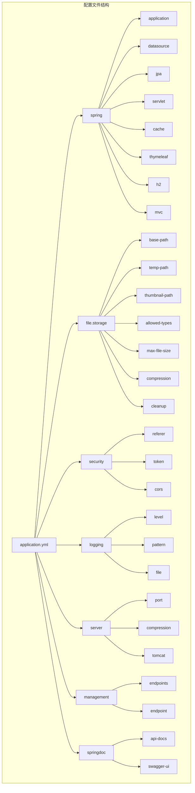
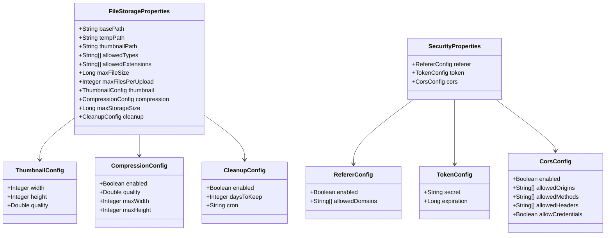
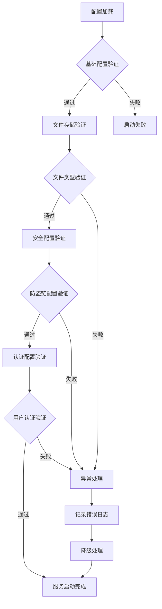
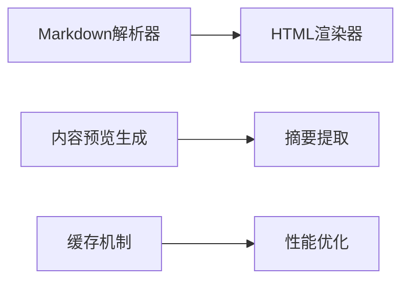
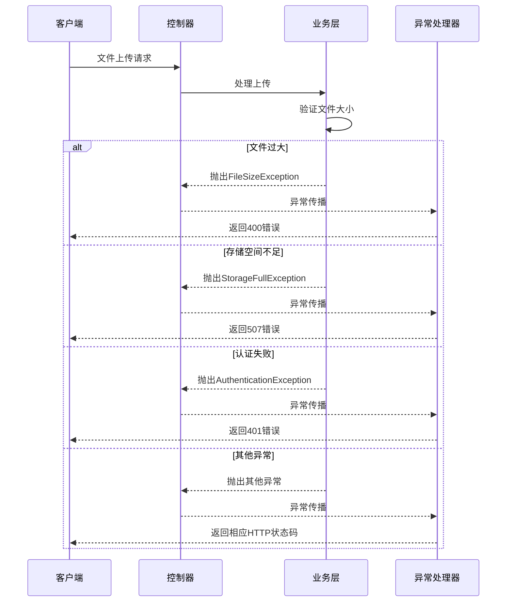

# 配置指南

<cite>
**本文档中引用的文件**
- [application.yml](file://src/main/resources/application.yml)
- [FileStorageProperties.java](file://src/main/java/com/photo/config/FileStorageProperties.java)
- [SecurityProperties.java](file://src/main/java/com/photo/config/SecurityProperties.java)
- [SecurityConfig.java](file://src/main/java/com/photo/config/SecurityConfig.java)
- [DataInitializer.java](file://src/main/java/com/photo/config/DataInitializer.java)
- [AuthController.java](file://src/main/java/com/photo/controller/AuthController.java)
- [NoteController.java](file://src/main/java/com/photo/controller/NoteController.java)
- [BlogController.java](file://src/main/java/com/photo/controller/BlogController.java)
- [CustomUserDetailsService.java](file://src/main/java/com/photo/service/CustomUserDetailsService.java)
- [User.java](file://src/main/java/com/photo/entity/User.java)
- [UserRepository.java](file://src/main/java/com/photo/repository/UserRepository.java)
- [NoteService.java](file://src/main/java/com/photo/service/NoteService.java)
- [BlogService.java](file://src/main/java/com/photo/service/BlogService.java)
- [NoteDTO.java](file://src/main/java/com/photo/dto/NoteDTO.java)
- [BlogDTO.java](file://src/main/java/com/photo/dto/BlogDTO.java)
- [FileStorageService.java](file://src/main/java/com/photo/service/FileStorageService.java)
- [ImageUtils.java](file://src/main/java/com/photo/util/ImageUtils.java)
- [FileUtils.java](file://src/main/java/com/photo/util/FileUtils.java)
- [PhotoService.java](file://src/main/java/com/photo/service/PhotoService.java)
- [GlobalExceptionHandler.java](file://src/main/java/com/photo/exception/GlobalExceptionHandler.java)
- [application-test.yml](file://src/test/resources/application-test.yml)
</cite>

## 更新摘要
**所做更改**
- 新增认证系统配置章节，涵盖用户管理、登录注册功能
- 新增笔记管理系统配置，包括Markdown渲染、内容管理
- 新增博客管理系统配置，支持分类、标签、作者管理
- 更新安全配置章节，增强Spring Security集成
- 新增数据初始化配置说明
- 扩展配置类实现原理，包含新的业务配置

## 目录
1. [简介](#简介)
2. [配置文件结构](#配置文件结构)
3. [文件存储配置详解](#文件存储配置详解)
4. [安全配置详解](#安全配置详解)
5. [认证系统配置](#认证系统配置)
6. [笔记管理系统配置](#笔记管理系统配置)
7. [博客管理系统配置](#博客管理系统配置)
8. [数据初始化配置](#数据初始化配置)
9. [配置类实现原理](#配置类实现原理)
10. [配置变更影响分析](#配置变更影响分析)
11. [最佳实践建议](#最佳实践建议)
12. [故障排除指南](#故障排除指南)
13. [总结](#总结)

## 简介

本配置指南详细介绍了基于Spring Boot的多功能内容管理系统中application.yml文件的各项配置选项。该系统集成了图片上传、文件存储管理、用户认证、笔记管理和博客发布等功能模块。系统提供了完整的文件存储管理功能，包括文件类型验证、大小限制、压缩优化、防盗链保护等核心特性，同时支持用户认证、权限管理和内容创作功能。

## 配置文件结构

系统使用标准的Spring Boot配置文件格式，主要分为以下几个配置命名空间：


```mermaid
graph TB
subgraph "配置文件结构"
A[application.yml] --> B[spring]
A --> C[file.storage]
A --> D[security]
A --> E[logging]
A --> F[server]
A --> G[management]
A --> H[springdoc]
B --> B1[application]
B --> B2[datasource]
B --> B3[jpa]
B --> B4[servlet]
B --> B5[cache]
B --> B6[thymeleaf]
B --> B7[h2]
B --> B8[mvc]
C --> C1[base-path]
C --> C2[temp-path]
C --> C3[thumbnail-path]
C --> C4[allowed-types]
C --> C5[max-file-size]
C --> C6[compression]
C --> C7[cleanup]
D --> D1[referer]
D --> D2[token]
D --> D3[cors]
E --> E1[level]
E --> E2[pattern]
E --> E3[file]
F --> F1[port]
F --> F2[compression]
F --> F3[tomcat]
G --> G1[endpoints]
G --> G2[endpoint]
H --> H1[api-docs]
H --> H2[swagger-ui]
end
```

**图表来源**
- [application.yml](file://src/main/resources/application.yml#L1-L190)

**章节来源**
- [application.yml](file://src/main/resources/application.yml#L1-L190)

## 文件存储配置详解

### 基础存储配置

#### base-path（存储根目录）
- **默认值**: `./uploads`
- **作用**: 定义文件存储的根目录路径
- **配置示例**: 
  ```yaml
  file:
    storage:
      base-path: /var/www/uploads
  ```
- **影响**: 所有文件存储操作的基础路径

#### temp-path（临时文件目录）
- **默认值**: `./uploads/temp`
- **作用**: 存放上传过程中的临时文件
- **配置示例**: 
  ```yaml
  file:
    storage:
      temp-path: /tmp/photo-temp
  ```

#### thumbnail-path（缩略图目录）
- **默认值**: `./uploads/thumbnails`
- **作用**: 存放生成的缩略图文件
- **配置示例**: 
  ```yaml
  file:
    storage:
      thumbnail-path: /var/www/thumbnails
  ```

### 文件类型与扩展名配置

#### allowed-types（允许的文件类型）
- **默认值**: 
  ```yaml
  - image/jpeg
  - image/jpg
  - image/png
  - image/gif
  - image/bmp
  - image/webp
  ```
- **作用**: 限制可上传的文件MIME类型
- **影响**: 影响文件类型验证逻辑

#### allowed-extensions（允许的文件扩展名）
- **默认值**: 
  ```yaml
  - jpg
  - jpeg
  - png
  - gif
  - bmp
  - webp
  ```
- **作用**: 限制可上传的文件扩展名
- **影响**: 影响文件扩展名验证逻辑

### 大小限制配置

#### max-file-size（最大文件大小）
- **默认值**: `10485760` (10MB)
- **单位**: 字节
- **配置示例**: 
  ```yaml
  file:
    storage:
      max-file-size: 52428800  # 50MB
  ```
- **影响**: 控制单个文件的最大上传大小
- **验证机制**: 在PhotoService中通过`checkStorageSpace()`方法验证

#### max-files-per-upload（最大单次上传文件数）
- **默认值**: `10`
- **作用**: 限制单次请求中最多可上传的文件数量
- **配置示例**: 
  ```yaml
  file:
    storage:
      max-files-per-upload: 5
  ```

### 压缩设置配置

#### 压缩启用状态
- **默认值**: `true`
- **配置示例**: 
  ```yaml
  file:
    storage:
      compression:
        enabled: true
```

#### 压缩质量
- **默认值**: `0.85`
- **取值范围**: `0.0 - 1.0`
- **配置示例**: 
  ```yaml
  file:
    storage:
      compression:
        quality: 0.9
```

#### 最大宽度和高度
- **默认值**: `1920x1080`
- **配置示例**: 
  ```yaml
  file:
    storage:
      compression:
        max-width: 1280
        max-height: 720
```

### 缩略图配置

#### 缩略图尺寸
- **默认值**: `200x200`
- **配置示例**: 
  ```yaml
  file:
    storage:
      thumbnail:
        width: 300
        height: 300
        quality: 0.7
```

#### 缩略图质量
- **默认值**: `0.8`
- **取值范围**: `0.0 - 1.0`

### 存储容量限制

#### max-storage-size（最大存储容量）
- **默认值**: `10737418240` (10GB)
- **配置示例**: 
  ```yaml
  file:
    storage:
      max-storage-size: 53687091200  # 50GB
```

### 清理策略配置

#### 清理启用状态
- **默认值**: `true`
- **配置示例**: 
  ```yaml
  file:
    storage:
      cleanup:
        enabled: true
```

#### 保留天数
- **默认值**: `30`
- **配置示例**: 
  ```yaml
  file:
    storage:
      cleanup:
        days-to-keep: 7
```

#### 定时任务cron表达式
- **默认值**: `"0 0 2 * * ?"` (每天凌晨2点执行)
- **配置示例**: 
  ```yaml
  file:
    storage:
      cleanup:
        cron: "0 0 3 * * ?"  # 每天凌晨3点执行
```

**章节来源**
- [application.yml](file://src/main/resources/application.yml#L69-L118)
- [FileStorageProperties.java](file://src/main/java/com/photo/config/FileStorageProperties.java#L1-L94)

## 安全配置详解

### 防盗链配置（Referer检查）

#### 启用状态
- **默认值**: `true`
- **配置示例**: 
  ```yaml
  security:
    referer:
      enabled: true
```

#### 允许的域名列表
- **默认值**: 
  ```yaml
  - localhost
  - 127.0.0.1
  ```
- **配置示例**: 
  ```yaml
  security:
    referer:
      enabled: true
      allowed-domains:
        - photos.example.com
        - admin.example.com
        - 192.168.1.100
```

### Token配置

#### 密钥设置
- **默认值**: `your-secret-key-change-this-in-production`
- **重要性**: 生产环境必须修改此密钥
- **配置示例**: 
  ```yaml
  security:
    token:
      secret: your-secure-secret-key-here
```

#### 过期时间
- **默认值**: `86400` (24小时)
- **单位**: 秒
- **配置示例**: 
  ```yaml
  security:
    token:
      expiration: 172800  # 48小时
```

### CORS配置

#### 启用状态
- **默认值**: `true`
- **配置示例**: 
  ```yaml
  security:
    cors:
      enabled: true
```

#### 允许的源
- **默认值**: 
  ```yaml
  - http://localhost:3000
  - http://localhost:8080
  ```
- **配置示例**: 
  ```yaml
  security:
    cors:
      allowed-origins:
        - https://photos.example.com
        - https://admin.example.com
```

#### 允许的方法
- **默认值**: 
  ```yaml
  - GET
  - POST
  - PUT
  - DELETE
  ```

#### 允许的头部
- **默认值**: `*`
- **配置示例**: 
  ```yaml
  security:
    cors:
      allowed-headers:
        - Content-Type
        - Authorization
        - X-Requested-With
```

#### 凭据支持
- **默认值**: `true`
- **配置示例**: 
  ```yaml
  security:
    cors:
      allow-credentials: true
```

**章节来源**
- [application.yml](file://src/main/resources/application.yml#L119-L145)
- [SecurityProperties.java](file://src/main/java/com/photo/config/SecurityProperties.java#L1-L53)

## 认证系统配置

### 用户认证配置

#### 用户详情服务
- **作用**: 实现Spring Security的UserDetailsService接口
- **配置示例**: 
  ```yaml
  spring:
    security:
      user:
        name: admin
        password: password
        roles: USER
  ```

#### 自定义用户详情服务
- **作用**: 支持从数据库加载用户信息
- **配置示例**: 
  ```java
  @Service
  public class CustomUserDetailsService implements UserDetailsService {
      @Override
      public UserDetails loadUserByUsername(String username) throws UsernameNotFoundException {
          User user = userRepository.findByUsername(username)
                  .orElseThrow(() -> new UsernameNotFoundException("用户不存在: " + username));
          
          return org.springframework.security.core.userdetails.User
                  .withUsername(user.getUsername())
                  .password(user.getPassword())
                  .authorities(new ArrayList<>())
                  .build();
      }
  }
  ```

### Spring Security配置

#### 安全过滤链
- **作用**: 配置HTTP安全规则和认证机制
- **配置示例**: 
  ```java
  @Configuration
  @EnableWebSecurity
  public class SecurityConfig {
      @Bean
      public SecurityFilterChain filterChain(HttpSecurity http) throws Exception {
          http
              .csrf(csrf -> csrf.disable())
              .cors(cors -> cors.configurationSource(corsConfigurationSource()))
              .authorizeHttpRequests(auth -> auth
                  .requestMatchers("/auth/**", "/css/**", "/js/**", "/images/**", "/blog/public/**", "/", "/dashboard").permitAll()
                  .anyRequest().authenticated()
              )
              .formLogin(form -> form
                  .loginPage("/auth/login")
                  .defaultSuccessUrl("/dashboard", true)
                  .permitAll()
              )
              .logout(logout -> logout
                  .logoutUrl("/auth/logout")
                  .logoutSuccessUrl("/auth/login?logout")
                  .permitAll()
              );
          
          return http.build();
      }
  }
  ```

### 认证控制器

#### 登录功能
- **作用**: 处理用户登录请求
- **配置示例**: 
  ```java
  @PostMapping("/auth/login")
  @ResponseBody
  public ApiResponse<Map<String, String>> login(
          @RequestParam String username, 
          @RequestParam String password) {
      try {
          UsernamePasswordAuthenticationToken authToken = 
              new UsernamePasswordAuthenticationToken(username, password);
          
          Authentication authentication = authenticationManager.authenticate(authToken);
          
          SecurityContext context = SecurityContextHolder.createEmptyContext();
          context.setAuthentication(authentication);
          SecurityContextHolder.setContext(context);
          
          Map<String, String> result = new HashMap<>();
          result.put("message", "登录成功");
          result.put("username", username);
          result.put("redirectUrl", "/");
          
          return ApiResponse.success(result);
      } catch (Exception e) {
          return ApiResponse.error(401, "用户名或密码错误");
      }
  }
  ```

#### 注册功能
- **作用**: 创建新用户账户
- **配置示例**: 
  ```java
  @PostMapping("/auth/register")
  @ResponseBody
  public ApiResponse<String> register(
          @RequestParam String username,
          @RequestParam String password,
          @RequestParam(required = false) String email) {
      try {
          userDetailsService.createUser(username, password, email);
          return ApiResponse.success("注册成功");
      } catch (IllegalArgumentException e) {
          return ApiResponse.error(400, e.getMessage());
      } catch (Exception e) {
          return ApiResponse.error(500, "注册失败: " + e.getMessage());
      }
  }
  ```

### 用户实体配置

#### 用户实体模型
- **作用**: 定义用户数据结构和字段
- **配置示例**: 
  ```java
  @Entity
  @Table(name = "users")
  public class User {
      @Id
      @GeneratedValue(strategy = GenerationType.IDENTITY)
      private Long id;
      
      @Column(unique = true, nullable = false, length = 50)
      private String username;
      
      @Column(nullable = false)
      private String password;
      
      @Column(length = 100)
      private String email;
      
      @Column(name = "enabled")
      private Boolean enabled = true;
      
      @Column(name = "last_login")
      private LocalDateTime lastLogin;
  }
  ```

**章节来源**
- [SecurityConfig.java](file://src/main/java/com/photo/config/SecurityConfig.java#L1-L99)
- [AuthController.java](file://src/main/java/com/photo/controller/AuthController.java#L1-L111)
- [CustomUserDetailsService.java](file://src/main/java/com/photo/service/CustomUserDetailsService.java#L1-L70)
- [User.java](file://src/main/java/com/photo/entity/User.java#L1-L100)
- [UserRepository.java](file://src/main/java/com/photo/repository/UserRepository.java#L1-L25)

## 笔记管理系统配置

### 笔记控制器配置

#### 笔记列表页面
- **作用**: 显示所有笔记的列表
- **配置示例**: 
  ```java
  @GetMapping("/")
  public String listNotes(Model model) {
      List<NoteDTO> notes = noteService.getAllNotes();
      model.addAttribute("notes", notes);
      return "notes/list";
  }
  ```

#### 新建笔记表单
- **作用**: 显示创建新笔记的表单
- **配置示例**: 
  ```java
  @GetMapping("/notes/new")
  public String showCreateForm(Model model) {
      model.addAttribute("note", new NoteDTO());
      model.addAttribute("isNew", true);
      return "notes/edit";
  }
  ```

#### 笔记详情页面
- **作用**: 显示单个笔记的详细内容
- **配置示例**: 
  ```java
  @GetMapping("/notes/{id}")
  public String showNote(@PathVariable Long id, Model model) {
      return noteService.getNoteById(id)
              .map(note -> {
                  model.addAttribute("note", note);
                  return "notes/detail";
              })
              .orElseGet(() -> {
                  redirectAttributes.addFlashAttribute("error", "便签不存在");
                  return "redirect:/";
              });
  }
  ```

### Markdown渲染配置

#### Markdown解析器
- **作用**: 将Markdown内容渲染为HTML
- **配置示例**: 
  ```java
  @Service
  public class NoteService {
      private final Parser markdownParser = Parser.builder().build();
      private final HtmlRenderer htmlRenderer = HtmlRenderer.builder().build();
      
      public String renderMarkdown(String markdown) {
          if (markdown == null || markdown.isEmpty()) {
              return "";
          }
          
          try {
              org.commonmark.node.Node document = markdownParser.parse(markdown);
              return htmlRenderer.render(document);
          } catch (Exception e) {
              log.error("Markdown渲染失败", e);
              return markdown;
          }
      }
  }
  ```

#### 内容预览配置
- **作用**: 生成笔记内容的预览摘要
- **配置示例**: 
  ```java
  private String generatePreview(String content) {
      if (content == null || content.isEmpty()) {
          return "";
      }
      
      String plainText = content.replaceAll("[#*`\\[\\]()\\-_>]", "").trim();
      
      if (plainText.length() <= 100) {
          return plainText;
      }
      
      return plainText.substring(0, 100) + "...";
  }
  ```

### 笔记DTO配置

#### 笔记数据传输对象
- **作用**: 在控制器和视图之间传输笔记数据
- **配置示例**: 
  ```java
  @Data
  @Builder
  @NoArgsConstructor
  @AllArgsConstructor
  public class NoteDTO {
      private Long id;
      private String title;
      private String content;
      private String htmlContent;
      private String contentPreview;
      private String createdTime;
      private String updatedTime;
  }
  ```

**章节来源**
- [NoteController.java](file://src/main/java/com/photo/controller/NoteController.java#L1-L162)
- [NoteService.java](file://src/main/java/com/photo/service/NoteService.java#L1-L171)
- [NoteDTO.java](file://src/main/java/com/photo/dto/NoteDTO.java#L1-L53)

## 博客管理系统配置

### 博客控制器配置

#### 博客列表页面
- **作用**: 显示博客列表并支持分类和作者筛选
- **配置示例**: 
  ```java
  @GetMapping
  public String listBlogs(Model model,
                         @RequestParam(required = false) String category,
                         @RequestParam(required = false) String author) {
      List<BlogDTO> blogs;
      if (category != null && !category.isEmpty()) {
          blogs = blogService.getBlogsByCategory(category);
          model.addAttribute("filterType", "分类");
          model.addAttribute("filterValue", category);
      } else if (author != null && !author.isEmpty()) {
          blogs = blogService.getBlogsByAuthor(author);
          model.addAttribute("filterType", "作者");
          model.addAttribute("filterValue", author);
      } else {
          blogs = blogService.getAllBlogs();
      }
      
      model.addAttribute("blogs", blogs);
      return "blog/list";
  }
  ```

#### 新建博客表单
- **作用**: 显示创建新博客的表单
- **配置示例**: 
  ```java
  @GetMapping("/blogs/new")
  public String showCreateForm(Model model) {
      model.addAttribute("blog", new BlogDTO());
      model.addAttribute("isNew", true);
      return "blog/edit";
  }
  ```

#### 博客详情页面
- **作用**: 显示单个博客的详细内容
- **配置示例**: 
  ```java
  @GetMapping("/{id}")
  public String showBlog(@PathVariable Long id, Model model) {
      return blogService.getBlogById(id)
              .map(blog -> {
                  model.addAttribute("blog", blog);
                  return "blog/detail";
              })
              .orElseGet(() -> {
                  redirectAttributes.addFlashAttribute("error", "博客不存在");
                  return "redirect:/blogs";
              });
  }
  ```

### 博客业务逻辑配置

#### 博客服务实现
- **作用**: 提供博客的增删改查业务逻辑
- **配置示例**: 
  ```java
  @Service
  public class BlogService {
      @Transactional
      public BlogDTO createBlog(String title, String author, String content, String category, String tags) {
          Blog blog = new Blog();
          blog.setTitle(title);
          blog.setAuthor(author);
          blog.setContent(content);
          blog.setCategory(category);
          blog.setTags(tags);
          
          Blog savedBlog = blogRepository.save(blog);
          return convertToDTO(savedBlog);
      }
  }
  ```

### 博客DTO配置

#### 博客数据传输对象
- **作用**: 在控制器和视图之间传输博客数据
- **配置示例**: 
  ```java
  @Data
  @Builder
  @NoArgsConstructor
  @AllArgsConstructor
  public class BlogDTO {
      private Long id;
      private String title;
      private String author;
      private String content;
      private String htmlContent;
      private String contentPreview;
      private String category;
      private String tags;
      private String createdTime;
      private String updatedTime;
  }
  ```

**章节来源**
- [BlogController.java](file://src/main/java/com/photo/controller/BlogController.java#L1-L173)
- [BlogService.java](file://src/main/java/com/photo/service/BlogService.java#L1-L212)
- [BlogDTO.java](file://src/main/java/com/photo/dto/BlogDTO.java#L1-L68)

## 数据初始化配置

### 应用启动初始化

#### CommandLineRunner配置
- **作用**: 应用启动时自动初始化用户数据
- **配置示例**: 
  ```java
  @Configuration
  public class DataInitializer {
      @Bean
      public CommandLineRunner initData() {
          return args -> {
              if (userRepository.count() == 0) {
                  User admin = new User();
                  admin.setUsername("admin");
                  admin.setPassword(passwordEncoder.encode("123456"));
                  admin.setEmail("admin@example.com");
                  admin.setEnabled(true);
                  
                  userRepository.save(admin);
                  
                  User testUser = new User();
                  testUser.setUsername("test");
                  testUser.setPassword(passwordEncoder.encode("123456"));
                  testUser.setEmail("test@example.com");
                  testUser.setEnabled(true);
                  
                  userRepository.save(testUser);
              }
          };
      }
  }
  ```

### 默认用户配置

#### 管理员用户
- **用户名**: admin
- **密码**: 123456
- **邮箱**: admin@example.com
- **角色**: 默认USER权限

#### 测试用户
- **用户名**: test
- **密码**: 123456
- **邮箱**: test@example.com
- **角色**: 默认USER权限

**章节来源**
- [DataInitializer.java](file://src/main/java/com/photo/config/DataInitializer.java#L1-L57)

## 配置类实现原理

### 类型安全的配置注入

系统通过Spring Boot的`@ConfigurationProperties`注解实现了类型安全的配置注入：


```mermaid
classDiagram
class FileStorageProperties {
+String basePath
+String tempPath
+String thumbnailPath
+String[] allowedTypes
+String[] allowedExtensions
+Long maxFileSize
+Integer maxFilesPerUpload
+ThumbnailConfig thumbnail
+CompressionConfig compression
+Long maxStorageSize
+CleanupConfig cleanup
}
class SecurityProperties {
+RefererConfig referer
+TokenConfig token
+CorsConfig cors
}
class ThumbnailConfig {
+Integer width
+Integer height
+Double quality
}
class CompressionConfig {
+Boolean enabled
+Double quality
+Integer maxWidth
+Integer maxHeight
}
class CleanupConfig {
+Boolean enabled
+Integer daysToKeep
+String cron
}
class RefererConfig {
+Boolean enabled
+String[] allowedDomains
}
class TokenConfig {
+String secret
+Long expiration
}
class CorsConfig {
+Boolean enabled
+String[] allowedOrigins
+String[] allowedMethods
+String[] allowedHeaders
+Boolean allowCredentials
}
FileStorageProperties --> ThumbnailConfig
FileStorageProperties --> CompressionConfig
FileStorageProperties --> CleanupConfig
SecurityProperties --> RefererConfig
SecurityProperties --> TokenConfig
SecurityProperties --> CorsConfig
```

**图表来源**
- [FileStorageProperties.java](file://src/main/java/com/photo/config/FileStorageProperties.java#L12-L94)
- [SecurityProperties.java](file://src/main/java/com/photo/config/SecurityProperties.java#L12-L53)

### 安全配置验证机制

系统在多个层面实现了安全配置验证：


```mermaid
flowchart TD
A[配置加载] --> B{基础配置验证}
B --> |通过| C[文件存储验证]
B --> |失败| D[启动失败]
C --> E{文件类型验证}
E --> |通过| F[安全配置验证]
E --> |失败| G[异常处理]
F --> H{防盗链配置验证}
H --> |通过| I[认证配置验证]
H --> |失败| G
I --> J{用户认证验证}
J --> |通过| K[服务启动完成]
J --> |失败| G
G --> L[记录错误日志]
L --> M[降级处理]
M --> K
```

**图表来源**
- [SecurityConfig.java](file://src/main/java/com/photo/config/SecurityConfig.java#L37-L58)
- [CustomUserDetailsService.java](file://src/main/java/com/photo/service/CustomUserDetailsService.java#L27-L41)

**章节来源**
- [FileStorageProperties.java](file://src/main/java/com/photo/config/FileStorageProperties.java#L12-L94)
- [SecurityProperties.java](file://src/main/java/com/photo/config/SecurityProperties.java#L12-L53)
- [SecurityConfig.java](file://src/main/java/com/photo/config/SecurityConfig.java#L12-L99)

## 配置变更影响分析

### 文件大小限制变更的影响

#### 修改max-file-size的影响

| 配置值 | 影响范围 | 用户体验 | 系统资源 |
|--------|----------|----------|----------|
| 5MB | 小文件用户友好 | 更快上传速度 | 减少磁盘占用 |
| 10MB | 默认推荐值 | 平衡体验 | 标准资源消耗 |
| 50MB | 大文件用户需求 | 较慢上传速度 | 显著增加磁盘占用 |
| 100MB+ | 极大文件需求 | 很慢上传速度 | 大量磁盘和内存占用 |

#### 修改max-storage-size的影响

| 配置值 | 存储压力 | 清理频率 | 维护成本 |
|--------|----------|----------|----------|
| 1GB | 高风险 | 频繁 | 高 |
| 10GB | 中等风险 | 适中 | 中等 |
| 50GB | 低风险 | 较少 | 低 |
| 100GB+ | 很低风险 | 很少 | 很低 |

### 安全配置变更的影响

#### 防盗链配置的安全等级

| 配置级别 | 安全性 | 性能影响 | 使用场景 |
|----------|--------|----------|----------|
| 严格模式 | 最高 | 无 | 内网应用 |
| 标准模式 | 高 | 轻微 | 大多数应用 |
| 松散模式 | 中等 | 无 | 开发测试 |
| 关闭模式 | 最低 | 无 | 内部系统 |

#### 认证配置的安全等级

| 配置级别 | 安全性 | 用户体验 | 管理复杂度 |
|----------|--------|----------|------------|
| 严格模式 | 最高 | 较差 | 高 |
| 标准模式 | 高 | 良好 | 中等 |
| 松散模式 | 中等 | 很好 | 低 |

### 内容管理系统配置的影响

#### Markdown渲染性能影响


```mermaid
graph LR
A[Markdown解析器] --> B[HTML渲染器]
C[内容预览生成] --> D[摘要提取]
E[缓存机制] --> F[性能优化]
```

#### 笔记和博客管理的影响

| 配置选项 | 影响范围 | 性能影响 | 功能特性 |
|----------|----------|----------|----------|
| Markdown渲染 | 内容展示 | 中等 | 实时预览 |
| 分类管理 | 博客组织 | 低 | 搜索优化 |
| 标签系统 | 内容分类 | 低 | 精确检索 |
| 用户权限 | 访问控制 | 低 | 安全保障 |

**章节来源**
- [NoteService.java](file://src/main/java/com/photo/service/NoteService.java#L120-L132)
- [BlogService.java](file://src/main/java/com/photo/service/BlogService.java#L158-L170)
- [SecurityConfig.java](file://src/main/java/com/photo/config/SecurityConfig.java#L37-L58)

## 最佳实践建议

### 生产环境配置建议

#### 存储路径配置
```yaml
file:
  storage:
    # 使用绝对路径
    base-path: /data/photo-uploads
    temp-path: /tmp/photo-temp
    thumbnail-path: /data/photo-thumbnails
```

#### 大小限制配置
```yaml
file:
  storage:
    # 根据业务需求调整
    max-file-size: 52428800  # 50MB
    max-storage-size: 53687091200  # 50GB
    max-files-per-upload: 5
```

#### 压缩配置优化
```yaml
file:
  storage:
    compression:
      enabled: true
      quality: 0.8
      max-width: 1920
      max-height: 1080
    thumbnail:
      width: 300
      height: 300
      quality: 0.7
```

#### 清理策略配置
```yaml
file:
  storage:
    cleanup:
      enabled: true
      days-to-keep: 30
      cron: "0 0 2 * * ?"  # 每天凌晨2点
```

#### 安全配置强化
```yaml
security:
  referer:
    enabled: true
    allowed-domains:
      - photos.yourdomain.com
      - admin.yourdomain.com
  token:
    secret: your-very-secure-secret-key-here-with-minimum-32-characters
    expiration: 172800  # 48小时
  cors:
    enabled: true
    allowed-origins:
      - https://photos.yourdomain.com
      - https://admin.yourdomain.com
    allow-credentials: true
```

### 认证系统配置建议

#### 用户管理配置
```yaml
spring:
  security:
    user:
      name: admin
      password: secure-password-here
      roles: ADMIN
```

#### 自定义用户服务配置
```java
@Service
public class CustomUserDetailsService implements UserDetailsService {
    @Autowired
    private UserRepository userRepository;
    
    @Override
    public UserDetails loadUserByUsername(String username) throws UsernameNotFoundException {
        User user = userRepository.findByUsername(username)
                .orElseThrow(() -> new UsernameNotFoundException("用户不存在: " + username));
        
        if (!user.getEnabled()) {
            throw new UsernameNotFoundException("用户已被禁用: " + username);
        }
        
        return org.springframework.security.core.userdetails.User
                .withUsername(user.getUsername())
                .password(user.getPassword())
                .authorities(new ArrayList<>())
                .build();
    }
}
```

#### Spring Security配置
```java
@Configuration
@EnableWebSecurity
public class SecurityConfig {
    @Bean
    public SecurityFilterChain filterChain(HttpSecurity http) throws Exception {
        http
            .csrf(csrf -> csrf.disable())
            .cors(cors -> cors.configurationSource(corsConfigurationSource()))
            .authorizeHttpRequests(auth -> auth
                .requestMatchers("/auth/**", "/css/**", "/js/**", "/images/**", "/blog/public/**", "/", "/dashboard").permitAll()
                .anyRequest().authenticated()
            )
            .formLogin(form -> form
                .loginPage("/auth/login")
                .defaultSuccessUrl("/dashboard", true)
                .permitAll()
            )
            .logout(logout -> logout
                .logoutUrl("/auth/logout")
                .logoutSuccessUrl("/auth/login?logout")
                .permitAll()
            );
        
        return http.build();
    }
}
```

### 内容管理系统配置建议

#### Markdown渲染优化
```java
@Service
public class NoteService {
    private final Parser markdownParser = Parser.builder().build();
    private final HtmlRenderer htmlRenderer = HtmlRenderer.builder().build();
    
    @PostConstruct
    public void init() {
        // 预热解析器
        markdownParser.parse("# Test");
    }
}
```

#### 笔记管理配置
```java
@RestController
@RequestMapping("/notes")
public class NoteController {
    @GetMapping("/api/preview")
    @ResponseBody
    public String previewMarkdown(@RequestBody String markdown) {
        return noteService.renderMarkdown(markdown);
    }
}
```

#### 博客管理配置
```java
@RestController
@RequestMapping("/blogs")
public class BlogController {
    @GetMapping
    public String listBlogs(@RequestParam(required = false) String category,
                          @RequestParam(required = false) String author) {
        List<BlogDTO> blogs;
        if (category != null && !category.isEmpty()) {
            blogs = blogService.getBlogsByCategory(category);
        } else if (author != null && !author.isEmpty()) {
            blogs = blogService.getBlogsByAuthor(author);
        } else {
            blogs = blogService.getAllBlogs();
        }
        
        return "blog/list";
    }
}
```

### 性能优化建议

#### Spring Boot多部分配置
```yaml
spring:
  servlet:
    multipart:
      enabled: true
      max-file-size: 50MB
      max-request-size: 100MB
      file-size-threshold: 2MB
```

#### 缓存配置
```yaml
spring:
  cache:
    type: caffeine
    caffeine:
      spec: maximumSize=1000,expireAfterWrite=3600s
```

#### 数据库连接池配置
```yaml
spring:
  datasource:
    hikari:
      maximum-pool-size: 20
      minimum-idle: 5
      idle-timeout: 30000
      pool-name: PhotoPool
```

### 监控和日志配置
```yaml
logging:
  level:
    com.photo: INFO
    org.springframework.web: WARN
  file:
    name: /var/log/photo-upload/photo-upload.log
    max-size: 50MB
    max-history: 30

management:
  endpoints:
    web:
      exposure:
        include: health,info,metrics
```

## 故障排除指南

### 常见配置问题及解决方案

#### 1. 文件上传失败

**症状**: 上传文件时出现"文件大小超过限制"错误

**可能原因**:
- `max-file-size`配置过小
- Spring Boot的`servlet.multipart.max-file-size`配置过小

**解决方案**:
```yaml
# 修改application.yml
file:
  storage:
    max-file-size: 104857600  # 100MB

spring:
  servlet:
    multipart:
      max-file-size: 100MB
      max-request-size: 200MB
```

#### 2. 存储空间不足

**症状**: 上传时出现"存储空间不足"错误

**诊断步骤**:
1. 检查当前存储使用情况
2. 查看`max-storage-size`配置
3. 检查清理任务是否正常运行

**解决方案**:
```yaml
# 增加存储限制或优化清理策略
file:
  storage:
    max-storage-size: 107374182400  # 100GB
    cleanup:
      days-to-keep: 7  # 减少保留时间
```

#### 3. 防盗链配置问题

**症状**: 正常域名访问被拒绝

**诊断**:
```yaml
security:
  referer:
    enabled: true
    allowed-domains:
      - localhost  # 确保包含正确的域名
      - 127.0.0.1
      - your-domain.com  # 添加你的域名
```

#### 4. CORS跨域问题

**症状**: 浏览器报跨域错误

**解决方案**:
```yaml
security:
  cors:
    enabled: true
    allowed-origins:
      - https://your-frontend-domain.com
    allowed-methods:
      - GET
      - POST
      - PUT
      - DELETE
    allowed-headers: "*"  # 或指定具体头部
    allow-credentials: true
```

#### 5. 认证失败问题

**症状**: 用户登录失败

**诊断步骤**:
1. 检查用户是否存在
2. 验证密码是否正确
3. 确认用户是否被启用

**解决方案**:
```yaml
# 确保用户数据正确
spring:
  datasource:
    initialization-mode: always
    schema: classpath:schema.sql
```

#### 6. 内容渲染问题

**症状**: Markdown内容无法正确渲染

**诊断步骤**:
1. 检查Markdown语法
2. 验证渲染器配置
3. 确认内容长度限制

**解决方案**:
```yaml
# 增加内容长度限制
spring:
  thymeleaf:
    mode: HTML
    cache: false
```

### 异常处理机制

系统提供了完善的异常处理机制：


```mermaid
sequenceDiagram
participant Client as 客户端
participant Controller as 控制器
participant Service as 业务层
participant ExceptionHandler as 异常处理器
Client->>Controller : 文件上传请求
Controller->>Service : 处理上传
Service->>Service : 验证文件大小
alt 文件过大
Service-->>Controller : 抛出FileSizeException
Controller-->>ExceptionHandler : 异常传播
ExceptionHandler-->>Client : 返回400错误
else 存储空间不足
Service-->>Controller : 抛出StorageFullException
Controller-->>ExceptionHandler : 异常传播
ExceptionHandler-->>Client : 返回507错误
else 认证失败
Service-->>Controller : 抛出AuthenticationException
Controller-->>ExceptionHandler : 异常传播
ExceptionHandler-->>Client : 返回401错误
else 其他异常
Service-->>Controller : 抛出其他异常
Controller-->>ExceptionHandler : 异常传播
ExceptionHandler-->>Client : 返回相应HTTP状态码
end
```

**图表来源**
- [GlobalExceptionHandler.java](file://src/main/java/com/photo/exception/GlobalExceptionHandler.java#L1-L106)

**章节来源**
- [GlobalExceptionHandler.java](file://src/main/java/com/photo/exception/GlobalExceptionHandler.java#L1-L106)

## 总结

本配置指南详细介绍了基于Spring Boot的多功能内容管理系统的完整配置方案。通过合理配置`application.yml`文件中的各项参数，可以实现：

1. **灵活的文件存储管理**: 支持自定义存储路径、大小限制、压缩设置等
2. **完善的安全防护**: 包括防盗链、CORS、Token认证等安全机制
3. **强大的用户认证系统**: 支持用户注册、登录、权限管理
4. **高效的内容管理系统**: 提供笔记和博客的完整管理功能
5. **可靠的监控维护**: 提供完善的日志记录和异常处理机制

在实际部署过程中，建议根据具体的业务需求和硬件环境，参考本指南的最佳实践建议进行配置调整，并定期监控系统运行状态，及时优化配置参数以获得最佳的系统性能和用户体验。

系统现已支持以下核心功能：
- 图片上传和存储管理
- 用户认证和权限控制
- 笔记的Markdown编辑和管理
- 博客的分类、标签和作者管理
- 完善的安全配置和异常处理
- 可扩展的配置体系和类型安全的配置注入