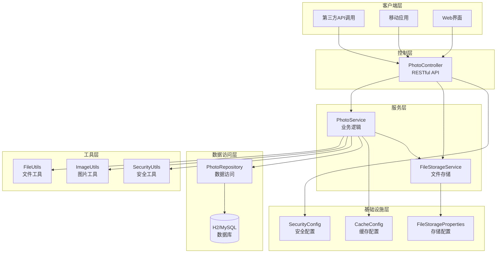
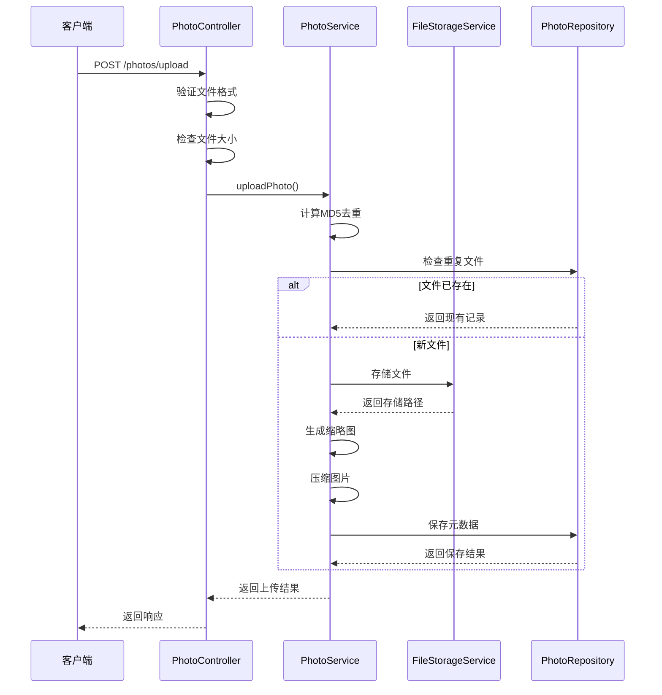
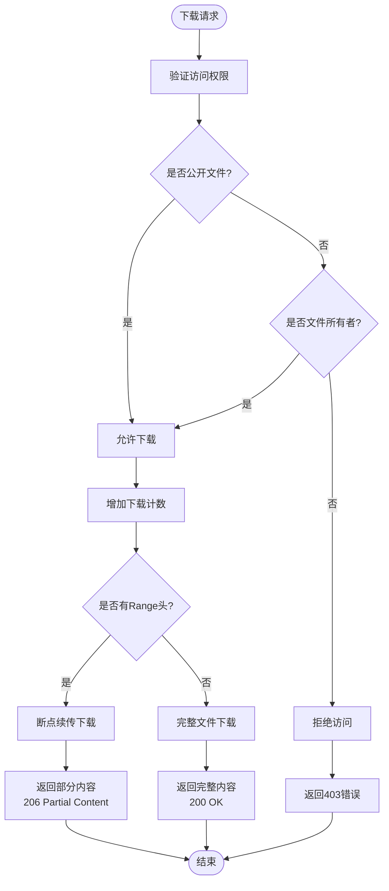
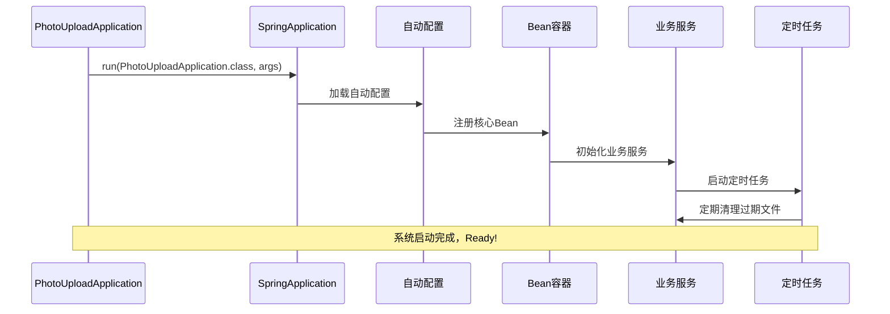
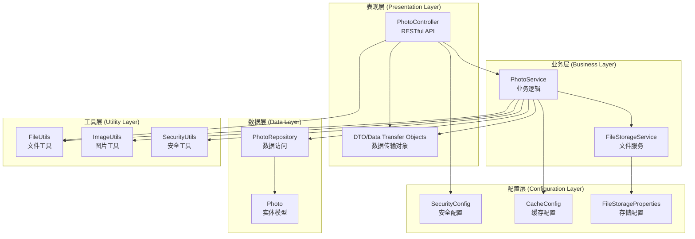

# zcyTest2项目概述

<cite>
**本文档引用的文件**
- [pom.xml](file://pom.xml)
- [PhotoUploadApplication.java](file://src/main/java/com/photo/PhotoUploadApplication.java)
- [README.md](file://README.md)
- [PROJECT_SUMMARY.md](file://PROJECT_SUMMARY.md)
- [application.yml](file://src/main/resources/application.yml)
- [PhotoController.java](file://src/main/java/com/photo/controller/PhotoController.java)
- [PhotoService.java](file://src/main/java/com/photo/service/PhotoService.java)
- [Photo.java](file://src/main/java/com/photo/entity/Photo.java)
- [SecurityConfig.java](file://src/main/java/com/photo/config/SecurityConfig.java)
- [CacheConfig.java](file://src/main/java/com/photo/config/CacheConfig.java)
- [PhotoRepository.java](file://src/main/java/com/photo/repository/PhotoRepository.java)
- [PhotoDTO.java](file://src/main/java/com/photo/dto/PhotoDTO.java)
- [FileUtils.java](file://src/main/java/com/photo/util/FileUtils.java)
- [API_DOCUMENTATION.md](file://API_DOCUMENTATION.md)
</cite>

## 目录
1. [项目简介](#项目简介)
2. [技术架构](#技术架构)
3. [核心功能模块](#核心功能模块)
4. [系统启动流程](#系统启动流程)
5. [核心注解分析](#核心注解分析)
6. [项目结构详解](#项目结构详解)
7. [性能与安全特性](#性能与安全特性)
8. [部署与配置](#部署与配置)
9. [总结](#总结)

## 项目简介

zcyTest2是一个基于Spring Boot 3.2.0构建的企业级照片上传下载系统，专为现代Web应用提供完整的文件管理解决方案。该项目实现了从基础的文件上传下载到高级的缓存优化、安全防护等全方位功能，是学习Spring Boot企业级应用开发的优秀范例。

### 主要用途
- **企业级文件管理**: 提供专业的照片上传、下载、存储管理功能
- **开发学习**: 展示Spring Boot 3.2.0的最佳实践和企业级架构设计
- **原型验证**: 快速验证照片管理系统的核心功能和技术方案

### 核心价值
- **技术先进性**: 基于最新的Spring Boot 3.2.0版本，采用现代化技术栈
- **功能完整性**: 涵盖文件管理的所有核心场景，包括上传、下载、预览、搜索等
- **安全可靠性**: 内置多层安全防护机制，确保系统稳定运行
- **性能优化**: 通过缓存、压缩、断点续传等技术提升用户体验

**章节来源**
- [README.md](file://README.md#L1-L50)
- [PROJECT_SUMMARY.md](file://PROJECT_SUMMARY.md#L1-L100)

## 技术架构

### 整体架构设计



**图表来源**
- [PhotoController.java](file://src/main/java/com/photo/controller/PhotoController.java#L1-L50)
- [PhotoService.java](file://src/main/java/com/photo/service/PhotoService.java#L1-L50)
- [SecurityConfig.java](file://src/main/java/com/photo/config/SecurityConfig.java#L1-L30)

### 技术栈组成

| 技术组件 | 版本 | 用途 | 架构层次 |
|---------|------|------|----------|
| Spring Boot | 3.2.0 | 核心框架 | 应用层 |
| Spring Data JPA | 3.2.0 | ORM框架 | 数据访问层 |
| Spring Security | 6.2.0 | 安全框架 | 基础设施层 |
| Caffeine | 3.1.8 | 高性能缓存 | 基础设施层 |
| H2 Database | 2.2.224 | 开发数据库 | 数据持久化 |
| MySQL | 8.0+ | 生产数据库 | 数据持久化 |
| Apache Tika | 2.9.1 | 文件类型检测 | 工具层 |
| Thumbnailator | 0.4.19 | 图片处理 | 工具层 |
| SpringDoc OpenAPI | 2.3.0 | API文档 | 基础设施层 |

**章节来源**
- [pom.xml](file://pom.xml#L20-L100)
- [application.yml](file://src/main/resources/application.yml#L1-L50)

## 核心功能模块

### 文件上传模块

文件上传模块是系统的核心功能之一，支持多种上传方式和严格的安全验证。



**图表来源**
- [PhotoController.java](file://src/main/java/com/photo/controller/PhotoController.java#L40-L60)
- [PhotoService.java](file://src/main/java/com/photo/service/PhotoService.java#L40-L120)

#### 功能特性
- **单文件上传**: 支持标准的multipart/form-data上传
- **批量上传**: 单次最多上传10个文件，提高效率
- **文件验证**: 多层验证确保文件安全性
- **MD5去重**: 自动检测重复文件，节省存储空间
- **智能压缩**: 根据配置自动压缩大图片

### 文件下载模块

文件下载模块提供了完整的下载功能，包括普通下载和断点续传。



**图表来源**
- [PhotoController.java](file://src/main/java/com/photo/controller/PhotoController.java#L150-L200)

### 缓存优化模块

系统采用多级缓存策略提升性能：

| 缓存类型 | 缓存时间 | 缓存大小 | 适用场景 |
|---------|----------|----------|----------|
| 照片元数据缓存 | 30分钟 | 500条 | 照片基本信息查询 |
| 文件元数据缓存 | 60分钟 | 1000条 | 文件统计和信息 |
| 缩略图缓存 | 2小时 | 1000条 | 图片预览加速 |
| 存储信息缓存 | 1小时 | 100条 | 存储空间监控 |

**章节来源**
- [CacheConfig.java](file://src/main/java/com/photo/config/CacheConfig.java#L15-L50)
- [PhotoService.java](file://src/main/java/com/photo/service/PhotoService.java#L100-L120)

## 系统启动流程

### 启动序列图



**图表来源**
- [PhotoUploadApplication.java](file://src/main/java/com/photo/PhotoUploadApplication.java#L15-L20)

### 启动过程详解

1. **应用入口**: `PhotoUploadApplication.main()` 方法启动Spring Boot应用
2. **自动配置**: Spring Boot根据依赖自动配置各种组件
3. **Bean初始化**: 包括控制器、服务、配置类等核心组件
4. **定时任务启动**: `@EnableScheduling` 启用定期清理任务
5. **缓存初始化**: `@EnableCaching` 配置Caffeine缓存
6. **安全配置**: Spring Security配置生效
7. **应用就绪**: 系统开始监听HTTP请求

**章节来源**
- [PhotoUploadApplication.java](file://src/main/java/com/photo/PhotoUploadApplication.java#L1-L20)

## 核心注解分析

### @SpringBootApplication

这是Spring Boot应用的核心注解，集成了三个重要注解的功能：

```java
@SpringBootApplication
@EnableCaching
@EnableScheduling
public class PhotoUploadApplication {
    // 应用启动入口
}
```

#### 功能分解：
- **@Configuration**: 将类标记为配置类，允许在其中定义@Bean
- **@EnableAutoConfiguration**: 启用Spring Boot的自动配置机制
- **@ComponentScan**: 扫描当前包及其子包下的组件

### @EnableCaching

启用Spring的缓存抽象功能，支持多种缓存实现：

```java
@EnableCaching
@Configuration
public class CacheConfig {
    // 缓存配置实现
}
```

#### 缓存特性：
- **声明式缓存**: 使用`@Cacheable`、`@CacheEvict`等注解
- **多级缓存**: 支持内存缓存和分布式缓存
- **性能优化**: 显著提升查询性能

### @EnableScheduling

启用Spring的定时任务功能：

```java
@Transactional
@Scheduled(cron = "${file.storage.cleanup.cron}")
public void cleanupExpiredFiles() {
    // 定期清理过期文件
}
```

#### 定时任务特性：
- **Cron表达式**: 灵活的时间调度配置
- **事务支持**: 确保数据一致性
- **异步执行**: 不影响主线程性能

**章节来源**
- [PhotoUploadApplication.java](file://src/main/java/com/photo/PhotoUploadApplication.java#L8-L12)
- [PhotoService.java](file://src/main/java/com/photo/service/PhotoService.java#L350-L380)

## 项目结构详解

### 分层架构设计



**图表来源**
- [PhotoController.java](file://src/main/java/com/photo/controller/PhotoController.java#L1-L30)
- [PhotoService.java](file://src/main/java/com/photo/service/PhotoService.java#L1-L30)
- [PhotoRepository.java](file://src/main/java/com/photo/repository/PhotoRepository.java#L1-L30)

### 核心组件说明

#### 实体层 (Entity Layer)
- **Photo实体**: 包含17个字段，涵盖照片的所有元数据信息
- **数据库索引**: 为常用查询字段建立索引，提升查询性能

#### 服务层 (Service Layer)
- **PhotoService**: 核心业务逻辑，处理上传、下载、搜索等功能
- **FileStorageService**: 文件存储和管理服务
- **缓存策略**: 使用Caffeine缓存热点数据

#### 控制层 (Controller Layer)
- **RESTful API**: 13个接口，遵循REST设计原则
- **参数验证**: 使用Spring Validation进行参数校验
- **异常处理**: 全局异常处理器统一处理错误

**章节来源**
- [Photo.java](file://src/main/java/com/photo/entity/Photo.java#L1-L50)
- [PhotoDTO.java](file://src/main/java/com/photo/dto/PhotoDTO.java#L1-L30)

## 性能与安全特性

### 性能优化策略

#### 1. 缓存机制
- **Caffeine缓存**: 内存级缓存，响应时间小于1ms
- **多级缓存**: 根据数据特征选择合适的缓存策略
- **缓存失效**: 自动清除过期数据，避免内存泄漏

#### 2. 图片处理优化
- **智能压缩**: 大于1920x1080的图片自动压缩
- **缩略图生成**: 自动生成200x200像素缩略图
- **质量控制**: 可配置的压缩质量参数

#### 3. 文件处理优化
- **断点续传**: 支持Range请求，提高大文件下载体验
- **流式处理**: 避免大文件加载到内存
- **并发处理**: 支持多文件并发上传

### 安全防护体系

#### 1. 文件安全
- **类型验证**: 使用Apache Tika进行深度文件类型检测
- **扩展名检查**: 严格限制允许的文件扩展名
- **路径遍历防护**: 防止目录遍历攻击
- **恶意文件检测**: 检测潜在的恶意文件

#### 2. 访问控制
- **权限验证**: 基于用户ID的访问控制
- **防盗链**: 可配置的Referer验证
- **XSS防护**: 输入输出的HTML转义
- **CSRF防护**: 禁用CSRF保护（API场景）

#### 3. 数据安全
- **SQL注入防护**: 使用JPA防止SQL注入
- **敏感信息加密**: 关键信息的加密存储
- **审计日志**: 详细的操作日志记录

**章节来源**
- [SecurityConfig.java](file://src/main/java/com/photo/config/SecurityConfig.java#L20-L50)
- [FileUtils.java](file://src/main/java/com/photo/util/FileUtils.java#L40-L80)

## 部署与配置

### 环境配置

#### 开发环境配置
```yaml
# application.yml
spring:
  datasource:
    url: jdbc:h2:file:./data/photodb
    driver-class-name: org.h2.Driver
    username: sa
    password: 
  
  jpa:
    hibernate:
      ddl-auto: update
    show-sql: true
    properties:
      hibernate:
        format_sql: true
        dialect: org.hibernate.dialect.H2Dialect
  
  h2:
    console:
      enabled: true
      path: /h2-console
```

#### 生产环境配置
```yaml
# application.yml
spring:
  datasource:
    url: jdbc:mysql://localhost:3306/photo_db?useUnicode=true&characterEncoding=utf8&useSSL=false&serverTimezone=Asia/Shanghai
    driver-class-name: com.mysql.cj.jdbc.Driver
    username: root
    password: your_password
  
  jpa:
    hibernate:
      ddl-auto: update
    show-sql: false
    properties:
      hibernate:
        format_sql: false
        dialect: org.hibernate.dialect.MySQLDialect
```

### 配置要点

#### 文件存储配置
```yaml
file:
  storage:
    base-path: ./uploads              # 存储路径
    max-file-size: 10485760           # 10MB
    max-storage-size: 10737418240     # 10GB
    compression:
      enabled: true                   # 启用压缩
      quality: 0.85                   # 压缩质量
      max-width: 1920                 # 最大宽度
      max-height: 1080                # 最大高度
```

#### 安全配置
```yaml
security:
  referer:
    enabled: true                     # 启用防盗链
    allowed-domains:
      - localhost
      - 127.0.0.1
  cors:
    enabled: true
    allowed-origins:
      - http://localhost:3000
      - http://localhost:8080
```

### 部署建议

#### 1. 生产环境部署
- **数据库**: 使用MySQL或PostgreSQL替代H2
- **存储**: 使用云存储服务（OSS、S3）替代本地存储
- **负载均衡**: 部署多个实例，使用负载均衡器
- **监控**: 集成APM监控工具

#### 2. 性能调优
- **JVM参数**: 根据内存需求调整堆大小
- **连接池**: 配置合适的数据库连接池参数
- **缓存**: 根据访问模式调整缓存策略

**章节来源**
- [application.yml](file://src/main/resources/application.yml#L1-L173)

## 总结

zcyTest2项目作为基于Spring Boot 3.2.0的企业级照片上传下载系统，展现了现代Java Web应用开发的最佳实践。项目不仅功能完整、架构清晰，而且在性能优化、安全防护等方面都达到了企业级应用的标准。

### 技术亮点
- **现代化技术栈**: 基于Spring Boot 3.2.0，充分利用最新特性
- **分层架构**: 清晰的分层设计，便于维护和扩展
- **性能优化**: 多级缓存、图片压缩、断点续传等优化策略
- **安全防护**: 全方位的安全机制，保障系统稳定运行

### 学习价值
- **最佳实践**: 展示了Spring Boot应用开发的标准模式
- **实用功能**: 涵盖了企业级应用的核心功能需求
- **扩展性强**: 良好的架构设计便于功能扩展
- **文档完善**: 完整的API文档和项目说明

### 应用场景
- **企业内部系统**: 作为内部文件管理系统的基础
- **学习参考**: 为Spring Boot开发者提供实战案例
- **原型验证**: 快速验证照片管理系统的可行性
- **二次开发**: 作为企业级应用的开发起点

该项目的成功实施证明了Spring Boot在构建现代Web应用方面的强大能力，为后续的大型项目开发奠定了坚实的基础。无论是对于初学者还是经验丰富的开发者，都能从中获得宝贵的经验和启发。