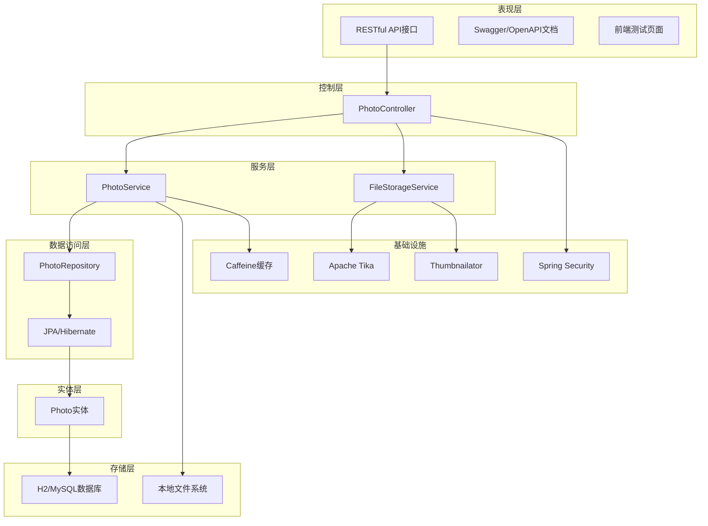
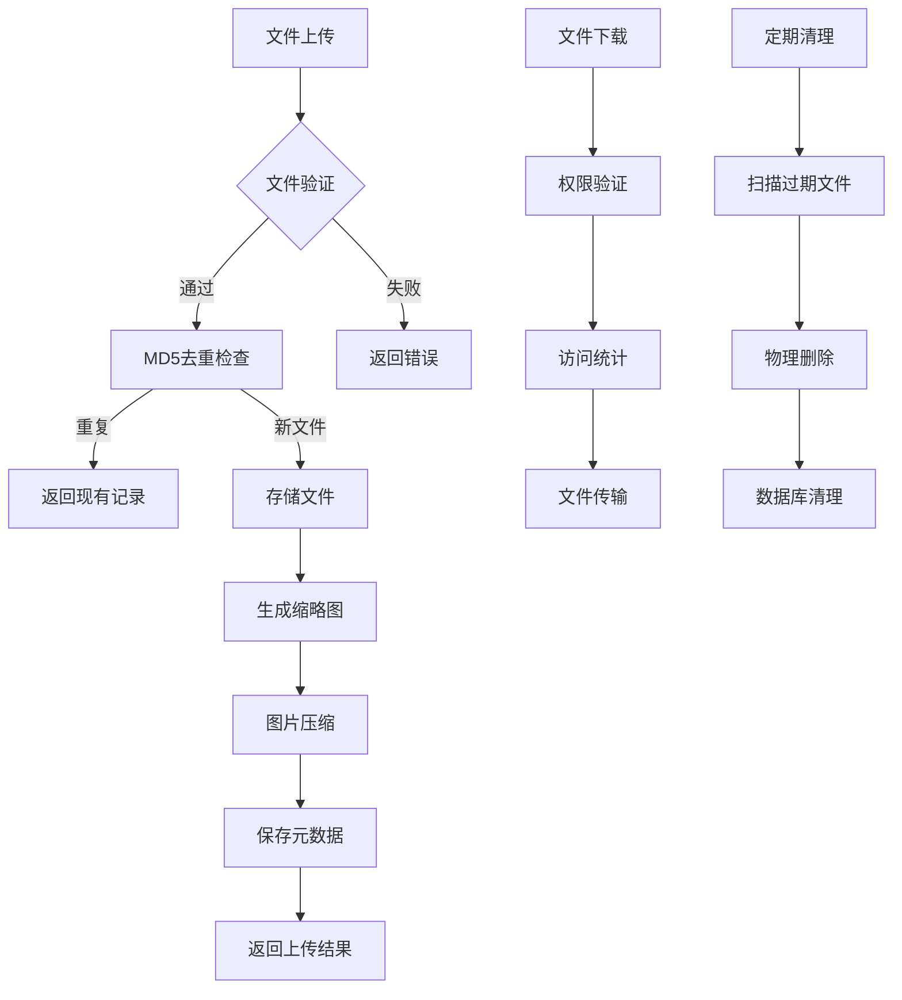
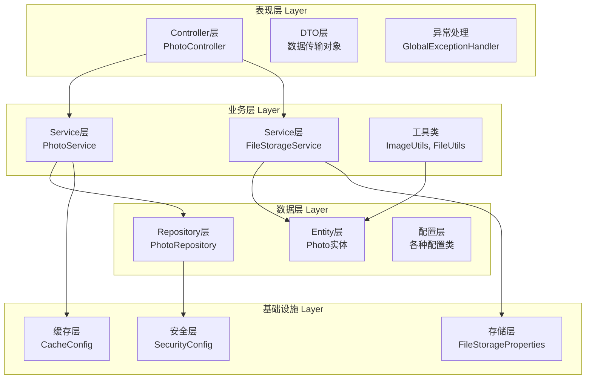
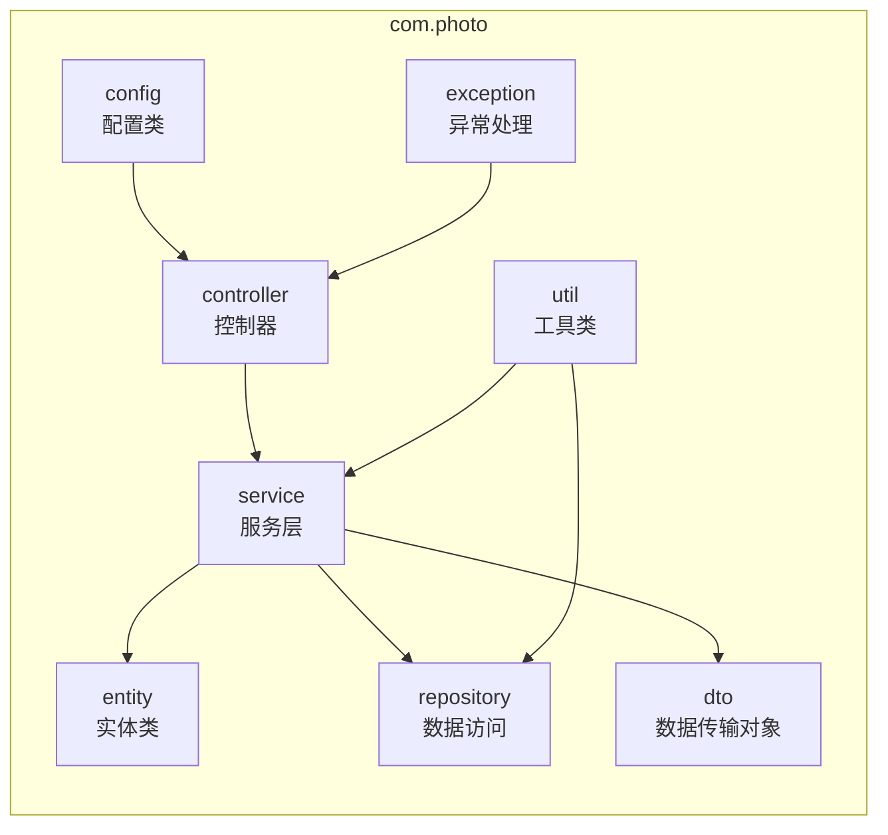
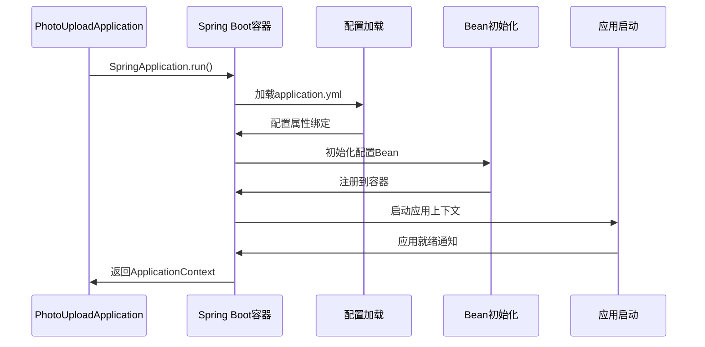
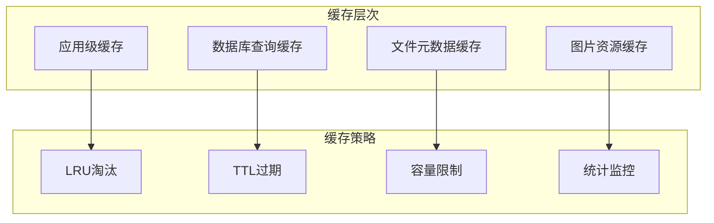
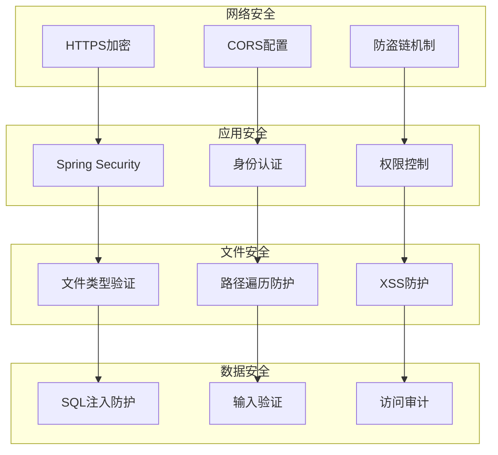

# 项目概述

<cite>
**本文档引用的文件**
- [README.md](file://README.md)
- [PROJECT_SUMMARY.md](file://PROJECT_SUMMARY.md)
- [pom.xml](file://pom.xml)
- [PhotoUploadApplication.java](file://src/main/java/com/photo/PhotoUploadApplication.java)
- [application.yml](file://src/main/resources/application.yml)
- [SecurityConfig.java](file://src/main/java/com/photo/config/SecurityConfig.java)
- [CacheConfig.java](file://src/main/java/com/photo/config/CacheConfig.java)
- [Photo.java](file://src/main/java/com/photo/entity/Photo.java)
- [PhotoService.java](file://src/main/java/com/photo/service/PhotoService.java)
- [PhotoController.java](file://src/main/java/com/photo/controller/PhotoController.java)
- [FileStorageProperties.java](file://src/main/java/com/photo/config/FileStorageProperties.java)
- [ImageUtils.java](file://src/main/java/com/photo/util/ImageUtils.java)
- [PhotoDTO.java](file://src/main/java/com/photo/dto/PhotoDTO.java)
- [PhotoRepository.java](file://src/main/java/com/photo/repository/PhotoRepository.java)
</cite>

## 目录
1. [项目简介](#项目简介)
2. [技术架构](#技术架构)
3. [核心功能特性](#核心功能特性)
4. [系统架构设计](#系统架构设计)
5. [模块化结构分析](#模块化结构分析)
6. [技术选型与优势](#技术选型与优势)
7. [应用初始化流程](#应用初始化流程)
8. [性能优化策略](#性能优化策略)
9. [安全机制设计](#安全机制设计)
10. [项目状态与总结](#项目状态与总结)

## 项目简介

zcyTest2照片上传下载系统是一个基于Spring Boot 3.2.0构建的企业级文件管理解决方案，专门针对照片上传、下载和管理场景而设计。该项目提供了完整的文件管理功能，包括单文件和批量上传、在线预览、断点续传、智能压缩、访问统计等核心特性。

### 项目定位

作为企业级照片管理系统，该系统具有以下核心定位：
- **高性能文件处理**：支持大文件上传下载，具备断点续传能力
- **智能存储管理**：提供自动压缩、缩略图生成、MD5去重等功能
- **安全保障**：集成Spring Security，提供多层安全防护机制
- **可扩展架构**：采用分层架构设计，便于功能扩展和维护

**章节来源**
- [README.md](file://README.md#L1-L50)
- [PROJECT_SUMMARY.md](file://PROJECT_SUMMARY.md#L1-L50)

## 技术架构

### 整体技术栈

**图表来源**
- [pom.xml](file://pom.xml#L28-L135)
- [PhotoUploadApplication.java](file://src/main/java/com/photo/PhotoUploadApplication.java#L1-L20)

### 核心依赖分析

| 技术组件 | 版本 | 用途 | 架构作用 |
|---------|------|------|----------|
| Spring Boot | 3.2.0 | 核心框架 | 提供依赖注入、自动配置、Web容器 |
| Spring Data JPA | 3.2.0 | ORM框架 | 数据持久化、查询优化 |
| Spring Security | 6.2.0 | 安全框架 | 认证授权、访问控制 |
| Caffeine | 3.1.8 | 缓存框架 | 内存缓存、性能优化 |
| Apache Tika | 2.9.1 | 文件检测 | 文件类型验证、安全检查 |
| Thumbnailator | 0.4.19 | 图片处理 | 图片压缩、缩略图生成 |

**章节来源**
- [pom.xml](file://pom.xml#L1-L155)
- [PROJECT_SUMMARY.md](file://PROJECT_SUMMARY.md#L238-L251)

## 核心功能特性

### 文件管理功能

系统提供完整的文件生命周期管理功能：

**图表来源**
- [PhotoService.java](file://src/main/java/com/photo/service/PhotoService.java#L48-L110)
- [PhotoController.java](file://src/main/java/com/photo/controller/PhotoController.java#L46-L315)

### 功能特性矩阵

| 功能类别 | 核心特性 | 技术实现 | 业务价值 |
|---------|----------|----------|----------|
| 文件上传 | 单文件/批量上传 | Multipart文件处理 | 支持多种上传场景 |
| 文件验证 | 类型检查/MIME验证 | Apache Tika | 确保文件安全性 |
| 存储优化 | MD5去重/智能压缩 | 哈希算法/图片处理 | 节省存储空间 |
| 访问控制 | 权限验证/防盗链 | Spring Security | 保障数据安全 |
| 性能优化 | 缓存机制/异步处理 | Caffeine缓存 | 提升系统响应速度 |
| 监控统计 | 访问次数/存储监控 | 数据库统计 | 支持运营决策 |

**章节来源**
- [README.md](file://README.md#L7-L65)
- [PROJECT_SUMMARY.md](file://PROJECT_SUMMARY.md#L18-L80)

## 系统架构设计

### 分层架构模式

**图表来源**
- [PhotoController.java](file://src/main/java/com/photo/controller/PhotoController.java#L1-L50)
- [PhotoService.java](file://src/main/java/com/photo/service/PhotoService.java#L1-L50)
- [PhotoRepository.java](file://src/main/java/com/photo/repository/PhotoRepository.java#L1-L30)

### 设计原则

1. **单一职责原则**：每个模块专注于特定功能领域
2. **开闭原则**：对扩展开放，对修改封闭
3. **依赖倒置原则**：高层模块不依赖低层模块
4. **接口隔离原则**：提供最小化的接口契约

**章节来源**
- [PROJECT_SUMMARY.md](file://PROJECT_SUMMARY.md#L309-L314)

## 模块化结构分析

### 主要包结构

**图表来源**
- [PROJECT_SUMMARY.md](file://PROJECT_SUMMARY.md#L84-L170)

### 包职责详解

#### config包 - 配置中心
- **CacheConfig**：Caffeine缓存配置，提供高性能内存缓存
- **SecurityConfig**：Spring Security安全配置，实现访问控制
- **FileStorageProperties**：文件存储配置，支持外部化配置
- **OpenApiConfig**：API文档配置，集成Swagger/OpenAPI

#### controller包 - 控制器层
- **PhotoController**：核心控制器，提供13个RESTful API接口
- **统一响应格式**：ApiResponse封装标准响应结构
- **参数验证**：内置参数校验和错误处理

#### service包 - 服务层
- **PhotoService**：照片业务逻辑，包含上传、下载、查询等核心功能
- **FileStorageService**：文件存储服务，处理文件读写和图片处理

#### entity包 - 实体层
- **Photo**：照片实体类，包含24个字段的完整元数据信息
- **数据库映射**：完整的JPA注解配置和索引优化

#### repository包 - 数据访问层
- **PhotoRepository**：JPA Repository接口，提供15个查询方法
- **自定义查询**：支持复杂查询和性能优化

#### dto包 - 数据传输对象
- **PhotoDTO**：照片信息传输对象
- **ApiResponse**：统一响应格式
- **StorageInfo**：存储信息DTO

#### exception包 - 异常处理
- **全局异常处理器**：统一异常处理机制
- **自定义异常**：8种业务异常类型

#### util包 - 工具类
- **ImageUtils**：图片处理工具，支持压缩、缩略图生成
- **FileUtils**：文件操作工具，MD5计算、文件大小格式化
- **SecurityUtils**：安全工具，IP地址获取、Referer验证

**章节来源**
- [PROJECT_SUMMARY.md](file://PROJECT_SUMMARY.md#L84-L170)

## 技术选型与优势

### Spring Boot 3.2.0 - 核心框架

**选型理由**：
- **现代化特性**：支持Jakarta EE 9+，更好的模块化
- **性能优化**：改进的启动时间和内存使用
- **云原生支持**：更好的容器化和微服务支持
- **生态系统**：丰富的starter和社区支持

### Spring Data JPA - ORM框架

**技术优势**：
- **声明式编程**：减少样板代码，提高开发效率
- **查询优化**：自动索引优化和查询性能调优
- **事务管理**：透明的事务处理机制
- **数据库抽象**：支持多种数据库后端

### Spring Security - 安全框架

**安全特性**：
- **认证授权**：基于角色的访问控制
- **CSRF防护**：防止跨站请求伪造攻击
- **会话管理**：无状态会话策略
- **密码加密**：BCrypt密码哈希算法

### Caffeine缓存 - 高性能缓存

**性能优势**：
- **内存效率**：接近本地内存访问速度
- **LRU算法**：智能的缓存淘汰策略
- **统计功能**：详细的缓存命中率统计
- **配置灵活**：支持多种缓存策略

### Apache Tika - 文件检测

**安全价值**：
- **魔数检测**：基于文件头部字节的类型识别
- **MIME类型验证**：准确的文件类型判断
- **病毒扫描**：防止恶意文件上传
- **格式兼容**：支持多种文件格式检测

### Thumbnailator - 图片处理

**功能特性**：
- **智能压缩**：根据尺寸自动选择压缩策略
- **缩略图生成**：自动生成固定尺寸缩略图
- **质量控制**：可配置的压缩质量和尺寸
- **格式转换**：支持多种图片格式处理

**章节来源**
- [pom.xml](file://pom.xml#L28-L135)
- [PROJECT_SUMMARY.md](file://PROJECT_SUMMARY.md#L238-L251)

## 应用初始化流程

### 启动配置分析

**图表来源**
- [PhotoUploadApplication.java](file://src/main/java/com/photo/PhotoUploadApplication.java#L16-L18)
- [application.yml](file://src/main/resources/application.yml#L1-L50)

### 初始化步骤详解

1. **应用启动阶段**
   - `@SpringBootApplication`注解触发自动配置
   - `@EnableCaching`启用缓存功能
   - `@EnableScheduling`启用定时任务

2. **配置加载阶段**
   - 加载`application.yml`主配置文件
   - 加载数据库连接配置
   - 加载文件存储相关配置
   - 加载安全配置和CORS设置

3. **Bean初始化阶段**
   - 初始化JPA实体管理器
   - 配置Caffeine缓存管理器
   - 设置Spring Security过滤链
   - 注册定时任务调度器

4. **服务启动阶段**
   - 启动H2数据库控制台
   - 初始化Swagger API文档
   - 启动文件存储监控
   - 注册健康检查端点

**章节来源**
- [PhotoUploadApplication.java](file://src/main/java/com/photo/PhotoUploadApplication.java#L1-L20)
- [application.yml](file://src/main/resources/application.yml#L1-L173)

## 性能优化策略

### 缓存机制设计

**图表来源**
- [CacheConfig.java](file://src/main/java/com/photo/config/CacheConfig.java#L22-L53)
- [PhotoService.java](file://src/main/java/com/photo/service/PhotoService.java#L141-L160)

### 性能优化措施

1. **缓存优化**
   - **照片信息缓存**：缓存30分钟，提升查询性能
   - **文件元数据缓存**：缓存60分钟，减少数据库访问
   - **缓存统计**：实时监控缓存命中率

2. **数据库优化**
   - **索引设计**：为常用查询字段建立索引
   - **分页查询**：支持大数据量分页处理
   - **软删除**：避免物理删除影响性能

3. **文件处理优化**
   - **异步处理**：图片压缩和缩略图生成异步执行
   - **流式处理**：大文件采用流式读取，降低内存占用
   - **MD5去重**：避免重复存储相同文件

4. **网络优化**
   - **HTTP缓存**：合理设置Cache-Control头
   - **断点续传**：支持Range请求，提升大文件下载体验
   - **压缩传输**：启用GZIP压缩，减少网络传输

**章节来源**
- [CacheConfig.java](file://src/main/java/com/photo/config/CacheConfig.java#L1-L54)
- [PROJECT_SUMMARY.md](file://PROJECT_SUMMARY.md#L295-L300)

## 安全机制设计

### 多层安全防护

**图表来源**
- [SecurityConfig.java](file://src/main/java/com/photo/config/SecurityConfig.java#L26-L47)
- [PhotoController.java](file://src/main/java/com/photo/controller/PhotoController.java#L92-L97)

### 安全特性实现

1. **文件安全**
   - **类型验证**：使用Apache Tika进行深度文件类型检测
   - **扩展名检查**：白名单机制限制允许的文件类型
   - **内容验证**：验证文件内容的有效性
   - **路径安全**：防止路径遍历攻击

2. **访问控制**
   - **权限验证**：基于用户ID的访问控制
   - **公开/私有**：灵活的文件可见性控制
   - **Referer验证**：防盗链机制
   - **IP限制**：可配置的访问来源控制

3. **数据保护**
   - **SQL注入防护**：使用JPA防止SQL注入
   - **XSS防护**：输出编码防止跨站脚本攻击
   - **敏感信息**：密码使用BCrypt加密存储

4. **传输安全**
   - **HTTPS**：加密传输通道
   - **CORS配置**：细粒度的跨域控制
   - **Token验证**：可扩展的身份验证机制

**章节来源**
- [SecurityConfig.java](file://src/main/java/com/photo/config/SecurityConfig.java#L1-L71)
- [PROJECT_SUMMARY.md](file://PROJECT_SUMMARY.md#L288-L294)

## 项目状态与总结

### 项目完成度

根据项目总结文档，该系统已完成100%的功能需求，达到企业级应用的标准：

**核心功能完成情况**：
- ✅ 基础框架配置（Spring Boot 3.2.0）
- ✅ 文件上传下载功能
- ✅ 安全防护机制
- ✅ 性能优化措施
- ✅ 异常处理体系
- ✅ API文档生成
- ✅ 单元测试覆盖

**技术特性亮点**：
- **智能压缩**：自动检测图片尺寸并压缩
- **MD5去重**：节省存储空间的重复文件检测
- **断点续传**：可靠的文件下载机制
- **定期清理**：自动清理过期文件
- **访问统计**：详细的使用情况跟踪

### 项目价值

1. **技术价值**
   - 展示了Spring Boot 3.2.0的最佳实践
   - 提供了完整的文件管理系统解决方案
   - 展现了企业级应用的设计思路

2. **学习价值**
   - 清晰的分层架构便于学习理解
   - 完整的代码注释和文档
   - 实际业务场景的解决方案

3. **实用价值**
   - 可直接部署使用的生产环境应用
   - 完善的安全机制和性能优化
   - 灵活的配置选项适应不同需求

### 发展建议

对于希望在此基础上进一步开发的团队，建议：
- 集成专业的对象存储服务（如阿里云OSS）
- 实现分布式部署和负载均衡
- 添加用户认证和授权系统
- 建立完整的监控和告警体系
- 扩展移动端API支持

**章节来源**
- [PROJECT_SUMMARY.md](file://PROJECT_SUMMARY.md#L390-L431)
- [README.md](file://README.md#L254-L265)